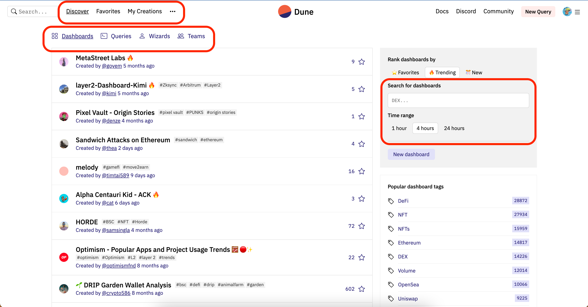

# 01 Введение в платформу Dune #
Как упоминалось ранее, с точки зрения стека данных, 
продукты блокчейн-данных можно разделить на три категории: 
`источники данных`, `инструменты разработки данных` и `приложения для работы с данными`. 
Прямой доступ к источникам данных является дорогостоящим и более сложным, 
в то время как приложения для работы с данными являются фиксированными. Если мы хотим анализировать данные, 
нам нужна платформа, которая не требует больших затрат на разработку 
и может получать доступ к различным данным. Среди этих инструментов разработки данных, 
наиболее удобной является платформа Dune.

[Dune](https://dune.com/) — это платформа для анализа данных в блокчейне. 
Пользователи могут писать SQL-запросы на платформе, фильтровать необходимые данные 
из базы данных блокчейна, проанализированной Dune, и генерировать соответствующие графики для создания панели мониторинга.

Все примеры запросов и связанные запросы в этом руководстве — за исключением полных панелей мониторинга данных и запросов сторонних аккаунтов — были протестированы и успешно выполнены с использованием движка запросов Dune SQL. Dune объявила о полном переходе на движок Dune SQL в течение 2023 года, чтобы каждый мог напрямую изучить синтаксис Dune SQL.

## Введение в веб-страницу

После регистрации на платформе Dune главная страница выглядит следующим образом:
с указанием конкретных функций:

- **Discover**: показывает различные тренды на платформе
  - Dashboard: отображает наиболее популярные панели мониторинга. 
    На этой странице вы можете искать ключевые слова, представляющие интерес, в поле поиска 
    в верхнем левом/правом углу. Это наиболее важная часть.
    Вы можете нажать на панель мониторинга, чтобы просмотреть панели мониторинга других людей.
  - **Queries**: отображает наиболее популярные запросы. На этой странице 
    вы можете искать ключевые слова, представляющие интерес, в поле поиска 
    в верхнем левом/правом углу.
  - Wizards: рейтинг пользователей с самым высоким объемом сбора на платформе.
  - Teams: рейтинг команд с самым высоким объемом сбора на платформе.
- **Favorites**:
  - Dashboard: ваши любимые панели мониторинга, которые можно искать в поле поиска 
    справа.
  - Queries: ваши любимые запросы, которые можно искать в поле поиска справа.
- **My Creations**:
  - Dashboard: панели мониторинга, которые вы создали, которые можно искать в поле поиска 
    справа. Если у вас есть команда, панель мониторинга может быть среди разных команд.
  - Queries: запросы, которые вы создали, которые можно искать в поле поиска справа.
  - Contracts: контракты, которые вы предоставили для анализа, которые можно искать 
    в поле поиска справа.
- **New Query**: создать новый запрос.
- **Others**:
  - Docs: ссылка на справочную документацию.
  - Discord: ссылка на группу для обсуждения в сообществе.

# 01 Введение в платформу Dune #
Как упоминалось ранее, с точки зрения стека данных, продукты данных блокчейна можно разделить на три категории: `источники данных`, `инструменты разработки данных` и `приложения для данных`. Прямой доступ к источникам данных является дорогостоящим и более сложным, в то время как приложения для данных фиксированы. Если мы хотим анализировать данные, нам нужна платформа, которая не требует больших затрат на разработку и может получать доступ к различным данным. Среди этих инструментов разработки данных наиболее удобной является платформа Dune.

[Dune](https://dune.com/) – это платформа для анализа данных на блокчейне. Пользователи могут писать SQL-запросы на платформе, фильтровать необходимые данные из базы данных блокчейна, проанализированной Dune, и генерировать соответствующие графики для формирования панели мониторинга.

Все примеры запросов и связанные запросы в этом руководстве - за исключением полных панелей мониторинга данных и запросов к сторонним аккаунтам - были протестированы и прошли с использованием движка SQL-запросов Dune. Dune объявила о полном переходе на движок SQL-запросов Dune в 2023 году, чтобы все могли напрямую изучить синтаксис Dune SQL.

## Введение в веб-страницу

После регистрации на платформе Dune основная страница платформы выглядит следующим образом, с указанием конкретных функций:

- **Discover**: отображение различных тенденций на платформе
  - Dashboard: отображение наиболее популярных панелей мониторинга. На этой странице вы можете искать ключевые слова, представляющие интерес, в поле поиска в верхнем левом/правом углу. Это самая важная часть. Вы можете нажать на панель мониторинга, чтобы просмотреть панели мониторинга других людей.
  - **Queries**: отображение наиболее популярных запросов. На этой странице вы можете искать ключевые слова, представляющие интерес, в поле поиска в верхнем левом/правом углу.
  - Wizards: рейтинг пользователей с наибольшим объемом сбора на платформе.
  - Teams: рейтинг команд с наибольшим объемом сбора на платформе.
- **Favorites**:
  - Dashboard: ваши любимые панели мониторинга, которые можно найти в поле поиска справа.
  - Queries: ваши любимые запросы, которые можно найти в поле поиска справа.
- **My Creations**:
  - Dashboard: панели мониторинга, которые вы создали, которые можно найти в поле поиска справа. Если у вас есть команда, панель мониторинга может быть среди различных команд.
  - Queries: запросы, которые вы создали, которые можно найти в поле поиска справа.
  - Contracts: контракты, которые вы предоставили для разбора, которые можно найти в поле поиска справа.
- **New Query**: создать новый запрос.
- **Others**:
  - Docs: ссылка на справочную документацию.
  - Discord: ссылка на группу обсуждения сообщества.

