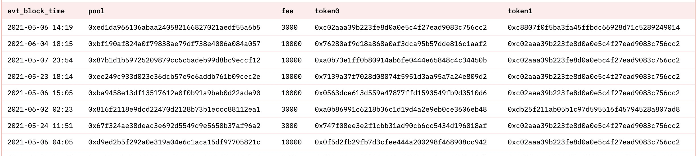

# 03 Создание вашей первой панели мониторинга

В предыдущем учебном пособии "**Быстрый старт**" мы узнали о предварительных требованиях для создания панели мониторинга данных и освоили основы написания SQL-запросов. Теперь давайте вместе напишем запросы и создадим панель мониторинга данных Dune. Чтобы помочь вам быстрее начать, мы создадим панель мониторинга данных, используя конкретный проект в качестве примера. Пример готовой панели мониторинга данных можно найти здесь: [https://dune.com/sixdegree/uniswap-v3-pool-tutorial](https://dune.com/sixdegree/uniswap-v3-pool-tutorial).

Мы не будем вдаваться в подробности каждого шага процесса. Вы можете узнать, как использовать Редактор запросов и панель мониторинга данных Dune в официальной [документации платформы Dune](https://dune.com/docs/).

## Дополнительные знания

Прежде чем приступить к созданию панели мониторинга, нам необходимо понять некоторые дополнительные знания. Uniswap является одним из самых популярных протоколов децентрализованных финансов (DeFi). Это набор неизменяемых и обновляемых смарт-контрактов, которые вместе составляют протокол автоматического маркет-мейкера (AMM). Протокол Uniswap в основном предоставляет обмен ERC20 токенов между сторонами на блокчейне Ethereum. Контракт фабрики Uniswap развертывает новые смарт-контракты для создания пулов ликвидности, которые объединяют два актива ERC20 токена и устанавливают различные комиссии. Ликвидность относится к цифровым активам, хранящимся в контрактах пулов ликвидности Uniswap, доступных для торговли трейдерам. Поставщики ликвидности (LP) — это люди, которые вносят свои ERC20 токены в определенный пул ликвидности. LP получают компенсацию в виде торговых комиссий в качестве награды, а также несут риск колебаний цен. Обычные пользователи (обменники) могут обменять один ERC20 токен, которым они владеют, на другой в пуле ликвидности, например, обменять USDC на WETH или наоборот, оплачивая небольшую комиссию за обслуживание. Протокол Uniswap V3 работает следующим образом: контракт фабрики создает пулы ликвидности (включая два ERC20 токена) -> пользователи LP добавляют соответствующие активы в пулы ликвидности -> другие пользователи используют пулы ликвидности для обмена своими активами токенов и оплачивают комиссию за обслуживание -> LP получают вознаграждения в виде комиссии.

Некоторые из представленных здесь концепций могут быть незнакомы новичкам, но не стоит беспокоиться. Вам не нужно знать больше о DeFi, чтобы успешно завершить это учебное пособие. Мы используем пулы ликвидности Uniswap V3 в качестве тематического исследования для панели мониторинга данных, которую мы собираемся создать. Соответствующая таблица — `uniswap_v3_ethereum.Factory_evt_PoolCreated`. Кроме того, некоторые запросы будут использовать таблицу `tokens.erc20`, упомянутую в предыдущем учебном пособии. Прежде чем мы начнем, вам нужно знать только то, что можно создавать множество различных пулов ликвидности, каждый из которых содержит два разных ERC20 токена (называемых торговой парой), с заданной комиссией. Одна и та же торговая пара (например, USDC-WETH) может иметь несколько пулов ликвидности с разными комиссиями.
## Таблица пула ликвидности Uniswap

Структура таблицы пула ликвидности `uniswap_v3_ethereum.Factory_evt_PoolCreated` выглядит следующим образом:

| **Имя столбца**     | **Тип данных** | **Описание**                           |
| ------------------- | ------------- | ----------------------------------------- |
| contract_address    | string        | Адрес контракта                          |
| evt_block_number    | long          | Номер блока                              |
| evt_block_time      | timestamp     | Время майнинга блока                   |
| evt_index           | integer       | Номер события                  |
| evt_tx_hash         | string        | Уникальный хеш транзакции события     |
| fee                 | integer       | Процент комиссии пула ликвидности (выраженный как "1/1 000 000") |
| pool                | string        | Адрес пула ликвидности              |
| tickSpacing         | integer       | Интервал тиков                              |
| token0              | string        | Адрес первого токена ERC20 в пуле  |
| token1              | string        | Адрес второго токена ERC20 в пуле |

Ниже представлен частичный вид таблицы пула ликвидности (отображаются только подмножество столбцов):

