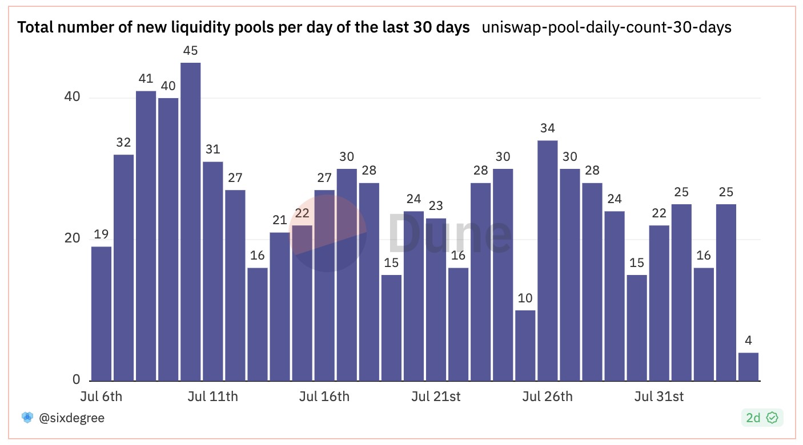
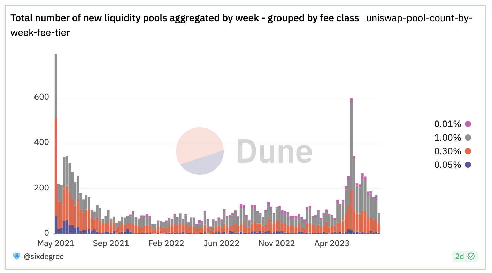
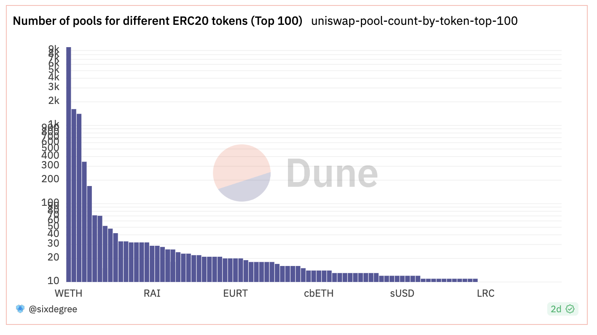
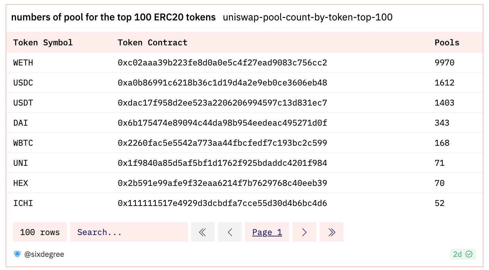

# 03 Создание вашей первой панели мониторинга

В предыдущем учебном пособии "**Быстрый старт**" мы узнали о предварительных требованиях для создания панели мониторинга данных и освоили основы написания SQL-запросов. Теперь давайте вместе напишем запросы и создадим панель мониторинга данных Dune. Чтобы помочь вам быстрее начать, мы создадим панель мониторинга данных, используя конкретный проект в качестве примера. Пример готовой панели мониторинга данных можно найти здесь: [https://dune.com/sixdegree/uniswap-v3-pool-tutorial](https://dune.com/sixdegree/uniswap-v3-pool-tutorial).

Мы не будем вдаваться в подробности каждого шага процесса. Вы можете узнать, как использовать Редактор запросов и панель мониторинга данных Dune в официальной [документации платформы Dune](https://dune.com/docs/).

## Дополнительные знания

Прежде чем приступить к созданию панели мониторинга, нам необходимо понять некоторые дополнительные знания. Uniswap является одним из самых популярных протоколов децентрализованных финансов (DeFi). Это набор неизменяемых и обновляемых смарт-контрактов, которые вместе составляют протокол автоматического маркет-мейкера (AMM). Протокол Uniswap в основном предоставляет обмен ERC20 токенов между сторонами на блокчейне Ethereum. Контракт фабрики Uniswap развертывает новые смарт-контракты для создания пулов ликвидности, которые объединяют два актива ERC20 токена и устанавливают различные комиссии. Ликвидность относится к цифровым активам, хранящимся в контрактах пулов ликвидности Uniswap, доступных для торговли трейдерам. Поставщики ликвидности (LP) — это люди, которые вносят свои ERC20 токены в определенный пул ликвидности. LP получают компенсацию в виде торговых комиссий в качестве награды, а также несут риск колебаний цен. Обычные пользователи (обменники) могут обменять один ERC20 токен, которым они владеют, на другой в пуле ликвидности, например, обменять USDC на WETH или наоборот, оплачивая небольшую комиссию за обслуживание. Протокол Uniswap V3 работает следующим образом: контракт фабрики создает пулы ликвидности (включая два ERC20 токена) -> пользователи LP добавляют соответствующие активы в пулы ликвидности -> другие пользователи используют пулы ликвидности для обмена своими активами токенов и оплачивают комиссию за обслуживание -> LP получают вознаграждения в виде комиссии.

Некоторые из представленных здесь концепций могут быть незнакомы новичкам, но не стоит беспокоиться. Вам не нужно знать больше о DeFi, чтобы успешно завершить это учебное пособие. Мы используем пулы ликвидности Uniswap V3 в качестве тематического исследования для панели мониторинга данных, которую мы собираемся создать. Соответствующая таблица — `uniswap_v3_ethereum.Factory_evt_PoolCreated`. Кроме того, некоторые запросы будут использовать таблицу `tokens.erc20`, упомянутую в предыдущем учебном пособии. Прежде чем мы начнем, вам нужно знать только то, что можно создавать множество различных пулов ликвидности, каждый из которых содержит два разных ERC20 токена (называемых торговой парой), с заданной комиссией. Одна и та же торговая пара (например, USDC-WETH) может иметь несколько пулов ликвидности с разными комиссиями.
## Таблица пула ликвидности Uniswap

Структура таблицы пула ликвидности `uniswap_v3_ethereum.Factory_evt_PoolCreated` выглядит следующим образом:

| **Имя столбца**     | **Тип данных** | **Описание**                           |
| ------------------- | ------------- | ----------------------------------------- |
| contract_address    | string        | Адрес контракта                          |
| evt_block_number    | long          | Номер блока                              |
| evt_block_time      | timestamp     | Время майнинга блока                   |
| evt_index           | integer       | Номер события                  |
| evt_tx_hash         | string        | Уникальный хеш транзакции события     |
| fee                 | integer       | Процент комиссии пула ликвидности (выраженный как "1/1 000 000") |
| pool                | string        | Адрес пула ликвидности              |
| tickSpacing         | integer       | Интервал тиков                              |
| token0              | string        | Адрес первого токена ERC20 в пуле  |
| token1              | string        | Адрес второго токена ERC20 в пуле |

Ниже представлен частичный вид таблицы пула ликвидности (отображаются только подмножество столбцов):


## Основное содержимое панели данных

Наша первая панель данных Dune будет включать следующие запросы, каждый из которых будет создавать один или несколько визуальных графиков:
- Запрос 1: Общее количество пулов ликвидности
- Запрос 2: Количество пулов ликвидности с различными тарифными ставками
- Запрос 3: Еженедельный обзор недавно созданных пулов ликвидности
- Запрос 4: Ежедневное количество недавно созданных пулов ликвидности за последние 30 дней
- Запрос 5: Еженедельный обзор недавно созданных пулов ликвидности, сгруппированных по тарифной ставке
- Запрос 6: Статистика по токену с наибольшим количеством пулов ликвидности
- Запрос 7: Последние 100 записей пулов ликвидности
## Запрос 1: Общее количество пулов ликвидности

Мы можем использовать агрегатную функцию COUNT() для подсчета общего количества существующих пулов.

``` sql
SELECT COUNT(*) AS pool_count
FROM uniswap_v3_ethereum.Factory_evt_PoolCreated
```

Мы предлагаем скопировать код выше, создать и сохранить запрос. При сохранении запроса дайте ему узнаваемое имя, например, "uniswap-pool-count". Конечно, вы также можете напрямую создать ответвление от приведенного ниже эталонного запроса. Преимущество создания ответвления от запроса заключается в том, что вы можете узнать больше о деталях визуальных графиков.

Эталонная ссылка на этот запрос в Dune: [https://dune.com/queries/1454941](https://dune.com/queries/1454941)

## Создание панели данных и добавление графиков

### Создание панели управления

Сначала войдите на [сайт Dune](https://dune.com/). Затем нажмите "Мои творения" в верхней панели навигации, и нажмите "Панели управления" в нижней секции, чтобы перейти на страницу созданных панелей данных: [https://dune.com/browse/dashboards/authored]. Чтобы создать новую панель данных, нажмите кнопку "Новая панель управления" в правой боковой панели. В появившемся диалоговом окне введите имя для панели управления и нажмите кнопку "Сохранить и открыть", чтобы создать новую панель данных и перейти на страницу предварительного просмотра. Здесь я использую "Uniswap V3 Pool Tutorial" в качестве имени для этой панели данных.

### Добавление графиков запросов

Новосозданная панель управления не содержит контента, и страница предварительного просмотра отобразит "Эта панель управления пуста". Мы можем преобразовать результат общего количества пулов из предыдущего шага в визуальный график и добавить его на панель данных. Откройте страницу "Мои творения" во вкладке браузера: [https://dune.com/browse/queries/authored] и найдите сохраненный "Query 1" запрос. Нажмите на его имя, чтобы перейти на страницу редактирования. Поскольку запрос уже сохранен и выполнен, вы можете нажать кнопку "Новая визуализация", чтобы создать новый график визуализации. Для единичного числового результата запроса обычно используется тип визуализации "Counter". Из выпадающего списка "Выберите тип визуализации" выберите "Counter" и нажмите кнопку "Добавить визуализацию". Затем вы можете дать графику имя и изменить значение Заголовка со значения по умолчанию "Counter" на "Общее количество пулов ликвидности". Наконец, нажмите "Добавить на панель управления" в диалоговом окне, а затем нажмите кнопку "Добавить" рядом с соответствующей панелью данных, чтобы добавить этот график счетчика на панель данных.

Теперь мы можем вернуться на страницу панели данных. После обновления страницы вы увидите недавно добавленный график визуализации. Нажмите кнопку "Редактировать" в правом верхнем углу страницы, чтобы отредактировать панель данных, включая изменение размера и положения каждого графика, добавление текстовых компонентов и т.д. Ниже приведен скриншот графика счетчика для "Общее количество пулов ликвидности" после изменения высоты.


### Добавление текстовых компонентов

На странице редактирования панели данных вы можете добавлять текстовые компоненты на панель данных, нажав кнопку "Добавить текстовый виджет". Текстовые компоненты могут использоваться для предоставления объяснений для основного контента панели данных или добавления информации об авторе. Текстовые компоненты поддерживают синтаксис Markdown для форматирования. Нажатие на "Поддерживается некоторая разметка Markdown" в диалоговом окне позволит просмотреть поддерживаемую разметку. Добавьте необходимые текстовые компоненты в соответствии с вашими потребностями. Здесь мы не будем вдаваться в подробности этой части.

## Запрос 2: Количество пулов ликвидности с разными тарифными ставками

Чтобы подсчитать количество пулов ликвидности с разными тарифными ставками, мы можем использовать предложение FILTER. Это позволяет подсчитать пулы с конкретными тарифными ставками отдельно и отобразить результаты в одной строке.

``` sql
SELECT COUNT(*) FILTER (WHERE fee = 100) AS pool_count_100,
    COUNT(*) FILTER (WHERE fee = 500) AS pool_count_500,
    COUNT(*) FILTER (WHERE fee = 3000) AS pool_count_3000,
    COUNT(*) FILTER (WHERE fee = 10000) AS pool_count_10000
FROM uniswap_v3_ethereum.Factory_evt_PoolCreated
```

Ссылка на этот запрос в Dune: [https://dune.com/queries/1454947](https://dune.com/queries/1454947)

Этот запрос возвращает четыре выходных значения. Мы можем добавить их как отдельные компоненты счетчиков и назвать их "Количество пулов с 0.01% комиссией", "Количество пулов с 0.05% комиссией" и т. д. Затем мы добавим их на информационную панель данных и настроим размер и порядок компонентов на странице редактирования информационной панели данных. Отображаемый результат показан на изображении ниже:


В качестве альтернативы, мы можем использовать предложение GROUP BY для группировки результатов и отображения их на круговой диаграмме.

``` sql
SELECT fee,
    COUNT(*) AS pool_count
FROM uniswap_v3_ethereum.Factory_evt_PoolCreated
GROUP BY 1
```

Тарифная ставка "fee" является числовым значением, представляющим комиссию в частях на миллион (ppm). Например, 3000 представляет собой 3000/1000000, что является "0.30%". Чтобы сделать это более интуитивно понятным, мы можем изменить запрос, чтобы преобразовать тарифную ставку в процентное представление.

``` sql
SELECT CONCAT(FORMAT('%,.2f', fee / 1e4), '%') AS fee_tier,
    COUNT(*) AS pool_count
FROM uniswap_v3_ethereum.Factory_evt_PoolCreated
GROUP BY 1
```

Здесь `CONCAT(FORMAT('%,.2f', fee / 1e4), '%') AS fee_tier` используется для преобразования тарифной ставки в процентное представление и добавления символа "%". Результат затем выводится с псевдонимом `fee_tier`. Для конкретного синтаксиса функции `FORMAT` вы можете обратиться к документации Trino (Trino - движок, лежащий в основе Dune SQL). Ссылка на документацию Trino: [https://trino.io/docs/current/functions.html](https://trino.io/docs/current/functions.html).

Ссылка на этот запрос в Dune: [https://dune.com/queries/1455127](https://dune.com/queries/1455127)

Мы можем добавить визуализацию круговой диаграммы для этого запроса. Нажмите "Новая визуализация" и выберите "Круговая диаграмма" из выпадающего списка типов диаграмм, затем нажмите "Добавить визуализацию". Измените заголовок диаграммы на "Количество пулов с разными тарифными ставками". Выберите "fee_tier" в качестве горизонтальной оси (X Column) и "pool_count" в качестве вертикальной оси (Y Column 1) диаграммы. Установите флажок "Показать метку данных" в левой части. Наконец, нажмите "Добавить на панель управления", чтобы добавить эту визуализацию на панель управления данными. Результат будет отображаться как показано на изображении ниже:


## Запрос 3: Еженедельный обзор недавно созданных пулов ликвидности

Чтобы суммировать количество недавно созданных пулов ликвидности по неделям, мы можем использовать функцию `date_trunc()` для преобразования даты создания пулов в начало каждой недели (понедельник), а затем использовать GROUP BY для агрегирования статистики.

``` sql
SELECT block_date, COUNT(pool) AS pool_count
FROM (
    SELECT date_trunc('week', evt_block_time) AS block_date,
        evt_tx_hash,
        pool
    FROM uniswap_v3_ethereum.Factory_evt_PoolCreated
)
GROUP BY 1
ORDER BY 1
```

Ссылка на этот запрос в Dune: [https://dune.com/queries/1455311](https://dune.com/queries/1455311)

Данные, сгруппированные по времени, подходят для визуализаций, таких как столбчатые диаграммы, диаграммы площади и линейные диаграммы. Здесь мы будем использовать столбчатую диаграмму. Нажмите "Новая визуализация" и выберите "Столбчатая диаграмма" из выпадающего списка типов диаграмм, затем нажмите "Добавить визуализацию". Измените заголовок диаграммы на "Еженедельный обзор недавно созданных пулов". Выберите "block_date" в качестве горизонтальной оси (X Column) и "pool_count" в качестве вертикальной оси (Y Column 1) диаграммы. Снимите флажок "Показать легенду диаграммы" слева. Наконец, нажмите "Добавить на панель управления", чтобы добавить эту визуализацию на панель данных. Результат будет отображаться как показано ниже:


## Запрос 4: Общее Суточное Создание Пулов Жидкости за Последние 30 Дней

Чтобы суммировать ежедневное создание пулов, мы можем использовать подзапрос для преобразования дат создания пула в дни (исключая компонент времени) с помощью функции `date_trunc()`. Затем мы можем использовать `GROUP BY` для агрегирования и суммирования данных. В данном случае мы будем использовать Common Table Expression (CTE) для запроса. CTE обеспечивают более интуитивно понятный и многократно используемый способ определения запросов, повышая эффективность и облегчая отладку. Последующие запросы также будут использовать CTE.

```sql
WITH pool_details AS (
    SELECT date_trunc('day', evt_block_time) AS block_date, evt_tx_hash, pool
    FROM uniswap_v3_ethereum.Factory_evt_PoolCreated
    WHERE evt_block_time >= NOW() - INTERVAL '29' DAY
)
SELECT block_date, COUNT(pool) AS pool_count
FROM pool_details
GROUP BY 1
ORDER BY 1
```

Ссылка на этот запрос на Dune: [https://dune.com/queries/1455382](https://dune.com/queries/1455382)

Мы можем визуализировать результаты с помощью столбчатой диаграммы. Добавьте новую диаграмму типа "Столбчатая" и измените заголовок на "Общее Суточное Создание Пулов Жидкости за Последние 30 Дней". Выберите "block_date" для столбца X и "pool_count" для столбца Y. Снимите флажок "Показать легенду диаграммы" слева и установите флажок "Показать метки данных". Добавьте эту визуализацию на панель управления. Получившаяся визуализация будет выглядеть следующим образом:



## Запрос 5: Еженедельный обзор недавно созданных пулов ликвидности - сгруппированных по уровням комиссий

Чтобы глубже проанализировать недавно созданные пулы ликвидности, мы можем сгруппировать их по уровням комиссий для сравнения их популярности в разные периоды времени. Этот запрос демонстрирует многоуровневую группировку и визуализацию с использованием столбчатой диаграммы.

``` sql
WITH pool_details AS (
    SELECT date_trunc('week', evt_block_time) AS block_date, fee, evt_tx_hash, pool
    FROM uniswap_v3_ethereum.Factory_evt_PoolCreated
)
SELECT block_date,
    CONCAT(FORMAT('%,.2f', fee / 1e4), '%') AS fee_tier,
    COUNT(pool) AS pool_count
FROM pool_details
GROUP BY 1, 2
ORDER BY 1, 2
```

Ссылка на этот запрос на Dune: [https://dune.com/queries/1455535](https://dune.com/queries/1455535)

Мы можем визуализировать результаты с помощью столбчатой диаграммы. Добавьте новую диаграмму типа "Столбчатая" и измените заголовок на "Еженедельный обзор недавно созданных пулов ликвидности - сгруппированных по уровням комиссий." Выберите "block_date" для столбца X и "pool_count" для столбца Y. Кроме того, выберите "fee_tier" в разделе "Группировать по", чтобы включить группировку и укладку данных по уровням комиссий. Установите флажок "Включить укладку" слева, чтобы укладывать данные с одинаковой датой и уровнем комиссии вместе. Добавьте эту визуализационную диаграмму на панель управления. Полученная визуализация будет выглядеть следующим образом:



## Запрос 6: Самый популярный токен по количеству пулов ликвидности

Для анализа того, какие токены ERC20 наиболее популярны в пулах ликвидности Uniswap на основе количества связанных с ними пулов, мы можем сгруппировать их по типам токенов.

Каждый пул ликвидности Uniswap состоит из двух токенов ERC20 (токен0 и токен1), и на основе алфавитного порядка хэшей их адресов, один и тот же токен ERC20 может храниться либо в токен0, либо в токен1. Следовательно, в следующем запросе мы используем операцию объединения (union), чтобы получить полный список деталей пулов ликвидности.

Кроме того, пулы ликвидности хранят адреса контрактов токенов ERC20, что может быть не интуитивно для прямого отображения. Абстрактная таблица `tokens.erc20`, созданная пользователями сообщества Dune's Magic Book, предоставляет базовую информацию о токенах ERC20. Объединив эту таблицу, мы можем извлечь символ токена.

Поскольку в Uniswap V3 более 8000 пулов ликвидности с участием более 6000 различных токенов ERC20, мы сосредоточимся на данных для 100 токенов с наибольшим количеством пулов ликвидности. Запрос демонстрирует такие концепции, как несколько CTE, объединение (union), объединение (join) и ограничение (limit).

``` sql
WITH pool_details AS (
    SELECT token0 AS token_address,
        evt_tx_hash, pool
    FROM uniswap_v3_ethereum.Factory_evt_PoolCreated

    UNION ALL

    SELECT token1 AS token_address,
        evt_tx_hash, pool
    FROM uniswap_v3_ethereum.Factory_evt_PoolCreated
),

token_pool_summary AS (
    SELECT token_address,
        COUNT(pool) AS pool_count
    FROM pool_details
    GROUP BY 1
    ORDER BY 2 DESC
    LIMIT 100
)

SELECT t.symbol, p.token_address, p.pool_count
FROM token_pool_summary p
INNER JOIN tokens.erc20 t ON p.token_address = t.contract_address
ORDER BY 3 DESC
```

Ссылка на запрос на Dune: [https://dune.com/queries/1455706](https://dune.com/queries/1455706)

Мы можем визуализировать результаты с помощью столбчатой диаграммы. Добавьте новую диаграмму типа "Столбчатая" и измените заголовок на "Количество пулов ликвидности для 100 лучших токенов ERC20". Выберите "symbol" для столбца X и "pool_count" для столбца Y. Чтобы сохранить порядок сортировки (от наибольшего к наименьшему значению), снимите флажок "Сортировать значения" справа. Хотя мы ограничили данные до 100 лучших токенов, мы все же можем видеть значительные различия в количестве пулов ликвидности для разных токенов, начиная с более чем 5000 и заканчивая всего несколькими. Чтобы сделать диаграмму более интуитивно понятной, установите флажок "Логарифмический" справа, чтобы отобразить данные в логарифмическом масштабе. Добавьте эту визуализирующую диаграмму на панель управления. Получившаяся визуализация будет выглядеть следующим образом:



Поскольку логарифмический масштаб визуально приглушает различия в значениях, мы также можем добавить визуализацию "Таблица" для просмотра фактических числовых значений. Продолжайте добавлять новую визуализирующую диаграмму для этого запроса, выберите тип диаграммы "Таблица". Установите заголовок как "Статистика количества пулов ликвидности для 100 лучших токенов ERC20." Отрегулируйте соответствующие параметры для визуализации таблицы по мере необходимости, а затем добавьте ее на панель управления.



Вы можете заметить, что таблица не возвращает ровно 100 строк данных. Это связано с тем, что некоторые недавно появившиеся токены еще не были добавлены в таблицу данных в Dune.