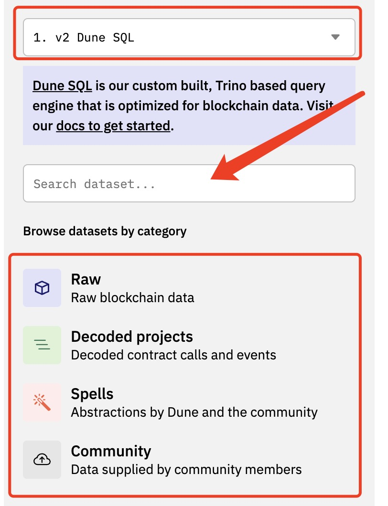
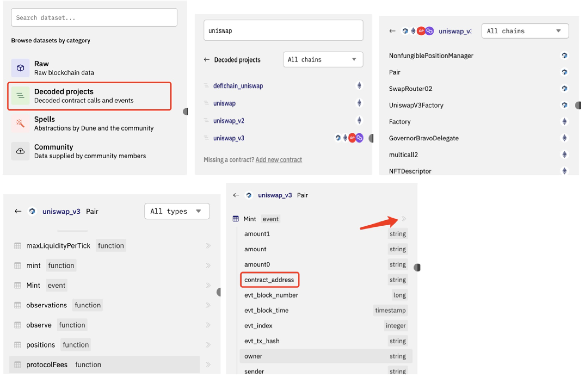

# 04 Понимание таблиц данных

Платформы данных, такие как Dune, декодируют и хранят данные блокчейна в базах данных. Аналитики данных пишут SQL-запросы для анализа данных из конкретных таблиц в зависимости от их аналитических потребностей. По мере появления все большего числа блокчейн-платформ и развертывания различных проектов на разных блокчейнах, для аналитиков крайне важно быстро находить соответствующие таблицы данных для анализа и понимать значение и назначение каждого поля в таблицах. Это важнейший навык, которым должен обладать каждый аналитик.

В настоящее время структура основных наборов данных, предоставляемых несколькими платформами данных, довольно похожа. Здесь мы сосредоточимся на объяснении структуры платформы Dune. Если вы предпочитаете использовать другие платформы данных, вы можете обратиться к соответствующей документации для получения подробностей. Поскольку Dune официально объявила о полном переходе на движок запросов Dune SQL к 2023 году, мы обновили все запросы в этом руководстве до версии Dune SQL.

## Представление таблиц данных Dune V2

На Dune существует несколько типов наборов данных:

- **Raw**: хранятся необработанные данные блокчейна, включая таблицы данных, такие как `blocks`, `transactions` и `traces`. Эти таблицы необработанных данных содержат наиболее оригинальные данные Onchain и могут быть использованы для гибкого анализа данных.
- **Decoded Projects**: хранятся декодированные вызовы и события, сделанные в смарт-контракты. Например, таблицы, относящиеся к Uniswap V3 и Opensea Seaport. Dune использует ABI смарт-контрактов и интерфейс стандартизированных смарт-контрактов токенов (ERC20, ERC721 и т. д.) для декодирования данных и сохранения данных каждого события или вызова метода отдельно в таблицу данных.
- **Spells**: spells, также называемые Abstractions в Dune V1, создаются и поддерживаются Dune и сообществом через репозиторий Spellbook GitHub и компилируются с использованием dbt. Эти таблицы данных обычно более удобны и эффективны в использовании.
- **Community**: эти данные предоставляются выбранными сторонними организациями, которые напрямую передают свои данные в Dune. В настоящее время существуют два набора данных сообщества, `flashbots` и `reservoir`.
- **User Generated Tables**: в настоящее время эта функция недоступна в Dune V2, пользователи могут загружать пользовательские таблицы данных только через репозиторий Spellbook GitHub.

На странице запросов мы можем выбрать или найти необходимый набор данных через боковую панель слева. Интерфейс этого раздела показан ниже:



Текстовое поле в середине изображения можно использовать для поиска соответствующих схем или таблиц данных. Например, ввод `erc721` отфильтрует все таблицы Spells и Decoded projects, имена которых содержат эту строку. Красная рамка над изображением используется для выбора используемого набора данных, "v2 Dune SQL", отображаемая в ней, — это то, что мы обычно называем «движком запросов Dune SQL». Dune полностью перейдет на движок запросов Dune SQL во второй половине 2023 года, поэтому пока всем нужно только быть знакомыми с синтаксисом Dune SQL.
Красная рамка внизу показывает несколько категорий наборов данных, в настоящее время поддерживаемых движком Dune V2. Щелчок по имени категории набора данных полужирным шрифтом перенесет вас на следующий уровень для просмотра различных схем данных и имен таблиц в этой категории. После этого вы также увидите раскрывающийся список с параметром по умолчанию «Все цепочки», который можно использовать для фильтрации схем данных и таблиц на указанном блокчейне. При переходе на уровень таблицы щелчок по имени таблицы расширит список полей в таблице. Щелчок по значку ">>" справа от имени таблицы вставит имя таблицы (в формате `schema_name.table_name`) в редактор запросов в текущую позицию курсора. При просмотре иерархическим способом вы также можете вводить ключевые слова для дальнейшего поиска и фильтрации на текущем уровне. Различные типы таблиц данных имеют разную глубину. Следующая картина показывает пример просмотра декодированных таблиц данных.



Okay, this is a comprehensive explanation of three key tables in the Dune ecosystem: `ethereum.transactions`, `ethereum.traces`, and `ethereum.logs`. Here's a breakdown of the key takeaways and how they fit together, structured for clarity and ease of use.  I'm also adding a summary table at the end.

**1. ethereum.transactions: The Core Transaction Record**

*   **Purpose:** This table stores the fundamental information about transactions on the Ethereum blockchain.  Think of it as the main record of what *happened*.
*   **Key Fields:**
    *   `block_time`, `block_number`: When the transaction was included in a block. Crucial for filtering and time-based analysis.
    *   `tx_hash`: Unique identifier for the transaction.
    *   `from`, `to`:  Addresses involved in the transaction.  `from` is the sender, `to` is the receiver.
    *   `value`: The amount of ETH transferred directly in the transaction.  *Important:* If a transaction involves a smart contract interacting with another contract, the value field may not represent the full transfer amount.
*   **Performance Considerations:**  This is a huge table. Always filter by `block_number` or `block_time` to improve query performance.
*   **Use Cases:**  Tracking ETH transfers, identifying common transaction patterns, and providing a baseline for further analysis.

**2. ethereum.traces: Transaction Execution Details**

*   **Purpose:**  `ethereum.traces` goes deeper, providing detailed information about *how* a transaction was executed.  It's critical for understanding complex interactions and native token transfers.
*   **Key Fields:**
    *   `block_time`, `block_number`, `tx_hash`, `success`: Same as `ethereum.transactions`, plus execution-related details.
    *   `value`: This is the *actual* amount of ETH transferred in scenarios involving smart contracts.  It can differ from the `value` field in `ethereum.transactions`.
    *   `type`:  Important for identifying contract creation. If `type = 'create'`, the `to` field represents the newly created contract address.
*   **Key Difference from `ethereum.transactions`:**  `ethereum.traces` is essential for tracking native token transfers (ETH, etc.) that are *not* directly represented in `ethereum.transactions` due to smart contract interactions.
*   **Performance:** Also large, so filtering is vital.
*   **Use Cases:** Calculating native token balances, identifying contract creation events (through `type = 'create'`), and analyzing gas usage.  The creation traces table (`ethereum.creation_traces`) is derived from this table and more efficient for identifying contracts.

**3. ethereum.logs: Raw Event Logs**

*   **Purpose:** Stores all event logs emitted by smart contracts. This is a "last resort" table, used when decoding isn't possible or when dealing with contracts that haven’s been decoded yet.
*   **Key Fields:**
    *   `block_time`, `block_number`, `tx_hash`, `contract_address`: Identifies the event.
    *   `topic1`, `topic2`, `topic3`, `topic4`:  Topic fields contain hashed event signatures and indexed parameters. `topic1` is the key – it's the event signature.  The others hold indexed event parameters.
    *   `data`: The raw, hexadecimal data containing *unindexed* event parameters.  Requires decoding.
*   **Important Considerations:**
    *   Decoding the `data` field is more complex and requires understanding the smart contract's event definitions.
    *   Topic fields are critical for filtering by event.
*   **Use Cases:** When specific events are needed but decoding isn’t available, or to retrieve raw event data for analysis.

**Relationship Between Tables**

*   `ethereum.transactions` provides the high-level transaction details.
*   `ethereum.traces` provides execution details and is crucial for native token transfers and contract creation.
*   `ethereum.logs` stores the raw, undecoded event logs emitted by smart contracts.

**Summary Table**

| Feature | `ethereum.transactions` | `ethereum.traces` | `ethereum.logs` |
|---|---|---|---|
| **Purpose** | Core Transaction Record | Transaction Execution Details | Raw Event Logs |
| **Value Field** | Direct ETH Transfer | Actual ETH Transfer (including smart contract interactions) | N/A |
| **Contract Creation** | N/A | `type = 'create'` | N/A |
| **Native Token Transfers** | May be incomplete | Accurate | N/A |
| **Decoding Required** | No | No (for contract creation) | Yes (for `data` field) |
| **Performance** | Filter by `block_number` or `block_time` | Filter by `block_number` or `block_time` | Filter by topic fields, `block_number` or `block_time`|
| **Use Cases** | Tracking Transfers, Basic Analysis | Token Balances, Contract Creation, Gas Usage | Retrieving Raw Event Data, Decoding Complex Events |


This comprehensive explanation, along with the summary table, should provide a strong foundation for utilizing these crucial Dune tables. Remember to always filter your queries to optimize performance!

## Декодированные проекты

Таблицы декодированных проектов составляют самую большую группу таблиц данных. Когда смарт-контракт отправляется в Dune для декодирования, Dune генерирует специальную таблицу для каждого вызова метода и события в контракте. В боковой панели редактора запросов Dune эти таблицы декодированных проектов отображаются иерархически:

```
название категории -> название проекта (пространство имен) -> название контракта -> название функции / название события

-- Пример
Декодированные проекты -> uniswap_v3 -> Factory -> PoolCreated
```

Соглашение об именовании таблиц декодированных проектов:

События: `projectname_blockchain.contractName_evt_eventName`

Вызовы функций: `projectname_blockchain.contractName_call_functionName`

Например, для события PoolCreated в Uniswap V3:
Название таблицы будет `uniswap_v3_ethereum.Factory_evt_PoolCreated`

Очень полезный метод — это запрос к таблице заклинаний `ethereum.contracts`, чтобы проверить, был ли декодирован контракт, который вы хотите. Эта таблица хранит записи о всех декодированных контрактах.

Если запрос возвращает результат, вы можете использовать описанные ранее методы, чтобы быстро просмотреть или найти таблицы декодированных таблиц контракта в боковой панели редактора.
Если результат не возвращается, это означает, что контракт еще не был декодирован. Вы можете отправить его в Dune для декодирования: [Отправить новый контракт](https://dune.com/contracts/new?__cf_chl_rt_tk=U.qtXIi0RjaP8DToW1_sJG9luDEv4_HiZ9JleGrNyNw-1690016370-0-gaNycGzNFvs)
Вы можете отправить любой действительный адрес контракта, при условии, что это декодируемый смарт-контракт (Dune может автоматически извлечь ABI или вы предоставите его).
Мы создали панель мониторинга, где вы можете непосредственно [проверить, декодирован ли контракт](https://dune.com/sixdegree/decoded-projects-contracts-check)
## Заклинания

Spellbook — это проект по преобразованию данных на платформе Dune, созданный сообществом. Заклинания можно использовать для создания продвинутых абстрактных таблиц для общих сценариев использования, таких как NFT-торговля. Spellbook автоматизирует создание и поддержку этих таблиц, с проверками качества данных.

Любой участник сообщества Dune может вносить вклад в Spellbook, отправляя PR на GitHub, что требует базовых знаний Git и GitHub. Если вы хотите внести свой вклад, ознакомьтесь с документацией Dune Spellbook для получения подробностей.

Сообщество Dune очень активно и создало множество полезных заклинаний. Многие из них широко используются в нашем ежедневном анализе данных. Здесь мы представим некоторые важные заклинания.

### Таблицы цен (prices.usd, prices.usd_latest)

Таблица `prices.usd` содержит исторические цены в долларах США за минуту для основных ERC20-токенов на каждом блокчейне. При агрегировании или сравнении нескольких токенов мы обычно связываем с таблицей цен, чтобы сначала преобразовать все в суммы в долларах США, прежде чем суммировать или сравнивать. Таблица информации о ценах в настоящее время предоставляет информацию о ценах на основные ERC20-токены для Ethereum, BNB, Solana и других цепей, точную до минуты. Чтобы получить средние цены за день или час, вы можете вычислить среднюю цену за день/час. Ниже приведены два примера запросов, демонстрирующие разные подходы для получения дневных цен для нескольких токенов:

- [получить среднюю цену за день](https://dune.com/queries/1507164)
- [получить последнюю запись о цене за минуту в день](https://dune.com/queries/1506944)

`price.usd_latest` предоставляет последнюю цену для соответствующего ERC20-токена.

### Таблица торгов DeFi (dex.trades, dex_aggregator.trades)

Таблица `dex.trades` предоставляет данные о транзакциях по основным DEX. Поскольку существует много DeFi-проектов, сообщество Dune постоянно расширяет источники данных. В настоящее время интегрированы DEX, такие как Uniswap, Sushiswap, Curve, Airswap, Clipper, Shibaswap, Swapr, Defiswap, DFX, Pancakeswap, Dodo и другие. Таблица `dex.trades` консолидирует данные по проектам. Каждый проект также имеет свою собственную специализированную таблицу заклинаний, например `uniswap.trades`, `curvefi_ethereum.trades` и т. д. Если вы анализируете один проект, его выделенная таблица заклинаний предпочтительнее.

Таблица `dex_aggregator.trades` содержит записи о транзакциях от агрегаторов DEX. Эти агрегаторы направляют транзакции на DEX для исполнения и организуют эти записи отдельно, чтобы избежать двойного учета с `dex.trades`. По состоянию на текущий момент в ней есть только данные для Cow Protocol.

### Таблицы токенов (tokens.erc20, tokens.nft)

Таблицы токенов в настоящее время в основном включают: `tokens.erc20` и `tokens.nft`.

Таблица `tokens.erc20` регистрирует информацию об определении, такую как адрес контракта, символ и десятичные дроби для основных ERC20-токенов.

Таблица `tokens.nft` регистрирует базовую информацию для коллекций NFT. Она зависит от PR сообщества для обновления, поэтому может иметь задержку или отсутствующие данные.

Поскольку блокчейн хранит суммы как необработанные целые числа без десятичных дробей, нам необходимо связать `tokens.erc20` с десятичными дробями для правильного преобразования значений.

### Таблицы ERC-токенов (erc20_ethereum.evt_Transfer, erc721_ethereum.evt_Transfer, и т.д.)

### Таблица NFT-торгов (nft_trades)

### Другие таблицы заклинаний

Чтобы узнать больше, вы можете ознакомиться с [документацией Dune Spellbook](https://spellbook-docs.dune.com/#!/overview).

## Общедоступные и пользовательские таблицы

Как упоминалось ранее, два основных общедоступных набора данных, которые в настоящее время находятся на Dune, это `flashbots` и `reservoir`. Документация Dune содержит введения к этим таблицам:

[Общедоступные таблицы Dune](https://dune.com/docs/data-tables/community/)
## О нас

`Sixdegree` – это профессиональная команда по анализу данных на блокчейне. Наша миссия – предоставлять пользователям точные графики, анализ и инсайты на основе данных на блокчейне. Мы стремимся популяризировать анализ данных на блокчейне. Благодаря созданию сообщества, написанию учебных пособий и другим инициативам мы обучаем аналитиков данных на блокчейне, выпускаем ценный аналитический контент, продвигаем сообщество для создания слоя данных блокчейна и развиваем таланты для широкого будущего приложений данных блокчейна. Добро пожаловать на площадку обмена опытом!

- Веб-сайт: [sixdegree.xyz](https://sixdegree.xyz)
- Электронная почта: [contact@sixdegree.xyz](mailto:contact@sixdegree.xyz)
- Twitter: [twitter.com/SixdegreeLab](https://twitter.com/SixdegreeLab)
- Dune: [dune.com/sixdegree](https://dune.com/sixdegree)
- Github: [https://github.com/SixdegreeLab](https://github.com/SixdegreeLab)