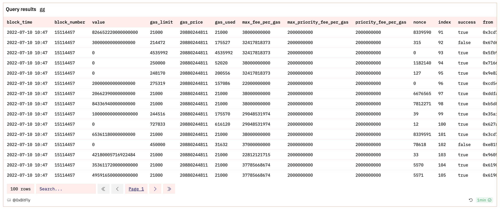

# 05 SQL Basics (I)

## Базовые понятия

### 1. Что такое хранилище данных?

Если говорить просто, то хранилище данных — это структурированное хранилище данных для статистических целей. Носителем хранения являются [**таблицы данных**]. Серия [**таблиц данных**], объединенных для одной или нескольких тем, называется хранилищем данных. Обратите внимание: данные здесь могут быть данными результатов (например, ежедневный объем торгов торговой пары на Uniswap с момента ее запуска). Это также могут быть данные процесса (каждая запись о транзакции торговой пары на Uniswap с момента запуска: кто инициировал ее, торговля A на B, время транзакции, tx_hash, сумма и т.д.).

**2. Что такое SQL?**

Предположим, вам нужны хрустящие шоколадные батончики Nestle, но вы не можете выйти прямо сейчас. Поэтому вы просите кого-нибудь сделать поручение: «Мне нужна коробка шоколадных батончиков, бренд Nestle». Порученец идет в супермаркет, покупает шоколад и доставляет его к вам домой.
Аналогично, SQL — это как фраза, которую вы произнесли, Dune Analytics — это порученец. Это позволяет вам общаться с хранилищем данных и извлекать из него данные. Самая базовая структура или синтаксис SQL имеет 3 компонента, почти все SQL будет содержать эти 3 части:

**select**: Какие поля извлекать?

**from**: Из какой таблицы извлекать?

**where**: Каковы критерии?

**3. Как выглядит таблица данных?**

Вы можете думать о таблице как об электронной таблице Excel, где каждый лист содержит разные данные. Возьмем `ethereum.transactions` (записи о транзакциях Ethereum) в качестве примера:

В таблицах есть некоторые часто используемые поля:

- **block_time**: Временная метка, когда транзакция была добыта
- **block_number**: Номер блока, где была добыта транзакция
- **value**: Сумма ETH, переданного (нужно разделить на power(10,18) для десятичной точности)
- **from**: Адрес кошелька, с которого был отправлен ETH
- **to**: Адрес кошелька, на который был отправлен ETH
- **hash**: Хэш транзакции этой транзакции
- **success**: Успешно ли выполнена транзакция
