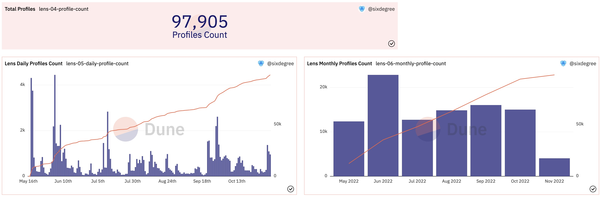

# 07 Практика - Создание панели управления Lens (I)

Чтобы как можно скорее дать всем возможность начать заниматься анализом данных, мы включим некоторую теоретическую информацию в последующей части учебного пособия, а первая половина будет объяснять больше о содержании, которое можно совмещать с практикой. В этом разделе давайте создадим панель управления данными для проекта Lens Protocol.

## Что такое Lens Protocol?

Введение с [сайта Lens](https://docs.lens.xyz/docs/what-is-lens) следующее: Lens Protocol (Lens Protocol, Lens в сокращении) — это экосистема Web3 социального графа на блокчейне Polygon. Он предназначен для того, чтобы позволить создателям владеть своими связями с сообществом, формируя полностью компонуемый социальный граф, принадлежащий пользователям. Протокол был изначально разработан с учетом модульности, что позволяет добавлять новые функции и исправлять ошибки, обеспечивая при этом неизменность контента и социальных связей, принадлежащих пользователям. Lens стремится решить некоторые из основных проблем, существующих в существующих социальных сетях. Web2-сеть получает данные из ее проприетарной централизованной базы данных. Профили пользователей, дружба и контент заблокированы в определенных сетях, и право собственности на них принадлежит оператору сети. Сети конкурируют друг с другом за внимание пользователей, что превращается в игру с нулевой суммой. Lens исправляет это, будучи открытым социальным графом, принадлежащим пользователю и доступным для любого приложения. Поскольку пользователи владеют своими данными, они могут переносить их в любое приложение, созданное на основе протокола Lens. Как истинные владельцы своего контента, создатели больше не должны беспокоиться о потере своего контента, аудитории и источников дохода на основе внезапных изменений в алгоритмах и политике отдельных платформ. Кроме того, далеко идущее влияние Lens распространяется на всю экосистему. Каждое приложение, использующее протокол Lens, способствует коллективному прогрессу, превращая то, что раньше было игрой с нулевой суммой, в совместное и синергетическое начинание.

В протоколе Lens задействованы следующие роли (сущности): личный Профиль, Публикация, Комментарий, Зеркало, Коллекция, Подписка. В то же время, в протоколе существует три типа NFT, а именно: NFT Профиля, NFT Подписки и NFT Коллекции.

Типичные сценарии использования Lens включают:

- Создатели регистрируются для создания своего Профиля и чеканят свой эксклюзивный NFT Профиля. Можно установить персонализированное имя (Profile Handle Name, которое можно просто сравнить с доменным именем, то есть «Lens доменное имя»). В то же время можно установить URL-адрес изображения аватара учетной записи и правила, когда за вами следят (устанавливая специальные правила, вы можете получать доход, например, вы можете установить, что пользователи должны платить определенную плату, чтобы подписаться на Профиль). В настоящее время учетные записи профиля могут создавать только адреса в списке разрешений.
- Создатели публикуют Публикации, включая Посты, Зеркала, Комментарии и т.д.
- В соответствующих шагах операции, соответственно чеканятся и передаются 3 различных типа NFT на разные адреса пользователей.

## Основные аналитические направления протокола Lens

Для проекта, подобного Lens, мы можем проанализировать его общий обзор или провести анализ данных с разных углов и для различных типов ролей. Вот обзор некоторых вещей, которые можно проанализировать:
- Общее количество пользователей, общее количество создателей, пропорция создателей и т.д.
- Общее количество публикаций, общее количество комментариев, общее количество репостов (зеркал), общее количество подписчиков, общее количество избранных, и т.д.
- Анализ, связанный с пользователями: количество новых пользователей в день, количество новых создателей в день, количество активных пользователей в день, количество активных создателей, тренд общей активности пользователей и т.д.
- Анализ персонализированных доменных имен учетных записей Lens: количество регистраций доменных имен, статус регистрации различных типов доменных имен (чистые числа, чистые буквы, различные длины) и т.д.
- Анализ активности создателей: количество выпущенных публикаций, количество раз, когда подписывались, количество репостов (зеркал), самые популярные создатели и т.д.
- Связанный анализ публикаций: количество опубликованного контента, тренд роста, количество подписчиков, количество избранных, самые популярные публикации и т.д.
- Связанный анализ подписчиков: количество подписчиков и их изменяющиеся тренды, анализ стоимости подписчиков, пользователи, которые чаще всего подписываются на создателей и т.д.
- Связанный анализ избранных: ежедневное количество избранных, популярные избранные и т.д.
- Анализ дохода создателей: доход, полученный за счет внимания, другой доход и т.д.
- Соответствующий анализ с точки зрения NFT: ежедневное количество выпусков (минтинга), связанные с этим затраты (с акцентом на комиссии) и т.д.

Существует множество контента, который можно проанализировать. В этой панели инструментов мы используем лишь часть из них в качестве примера. Пожалуйста, попробуйте проанализировать и другой контент отдельно.
## Введение в таблицу данных

На странице [развернутого смарт-контракта](https://docs.lens.xyz/docs/deployed-contract-addresses) в официальной документации Lens указано использовать смарт-контракт LensHub Proxy (LensHub Proxy) в качестве основного контракта для взаимодействия. За исключением небольшого числа запросов, связанных с NFT, которые требуют использования таблицы данных под смарт-контрактом FollowNFT, мы в основном фокусируемся на декодированной таблице под смарт-контрактом LensHub. На рисунке ниже перечислен фрагмент таблицы данных под этим смарт-контрактом.

[Изображение: img/ch07_image_01.png]

Как упоминалось в предыдущем уроке, существуют два типа декодированных таблиц данных смарт-контракта: таблица журналов событий (Event Log) и таблица вызовов функций (Function Call). Оба типа таблиц называются в формате: `projectname_blockchain.contractName_evt_eventName` и `:projectname_blockchain.contractName_call_functionName` соответственно. Просматривая список таблиц под контрактом LensHub, мы видим следующие основные таблицы данных:
- collect/collectWithSig
- comment/commentWithSig
- createProfile
- follow/followWithSig
- mirror/mirrorWithSig
- post/postWithSig
- Transfer

За исключением таблицы Transfer, которая является таблицей событий, остальные упомянутые таблицы являются таблицами вызовов функций. Таблица данных с суффиксом `WithSig` обозначает операции, выполняемые посредством авторизации подписью. Это позволяет использовать API или позволяет другим авторизованным сторонам выполнять определенные операции от имени пользователя. Важно агрегировать данные из связанных таблиц при анализе таких типов, как таблицы постов, чтобы получить всестороннее понимание.

В предоставленном списке есть несколько других таблиц данных с различными методами. Все эти таблицы сгенерированы под смарт-контрактом LensHub, и они взаимодействуют с адресом LensHub, а именно `0xdb46d1dc155634fbc732f92e853b10b288ad5a1d`. Для анализа общих данных пользователей Lens рекомендуется запрашивать оригинальную таблицу polygon.transactions, чтобы извлечь данные, связанные с этим адресом контракта. Это обеспечит полный набор данных для целей анализа.
Okay, this is a detailed guide for building a Dune Analytics dashboard for Lens Protocol. Here's a breakdown of the steps, along with clarifications and considerations based on the provided text. I'll structure it into the core tasks and then provide helpful additions.

**I. Core Tasks: Building the Lens Protocol Dashboard**

**1. Setup & First Query: Total Transactions and Users**

*   **Goal:** Get a snapshot of the overall activity on Lens.
*   **SQL Query (First Query - as provided):**

```sql
with daily_count as (
    select date_trunc('day', block_time) as block_date,
        count(*) as transaction_count,
        count(distinct "from") as user_count
    from polygon.transactions
    where "to" = 0xdb46d1dc155634fbc732f92e853b10b288ad5a1d   -- LensHub
        and block_time >= date('2022-05-16')  -- contract creation date
    group by 1
    order by 1
)

select block_date,
    transaction_count,
    user_count,
    sum(transaction_count) over (order by block_date) as accumulate_transaction_count,
    sum(user_count) over (order by block_date) as accumulate_user_count
from daily_count
order by block_date
```

*   **Dune Steps:**
    *   Create a new query in Dune Analytics.
    *   Paste the SQL query.
    *   Confirm the source is `polygon.transactions` (adjust if your chain is different).
    *   Run the query.
    *   Create two `Counter` visualizations:
        *   `transaction_count` (title: "Lens Daily Transactions")
        *   `user_count` (title: "Lens Daily Users")
    *   Add these visualizations to a new dashboard.

**2. Daily Trends: Transactions vs. Users**

*   **Goal:**  Visualize the daily activity, including cumulative totals.
*   **SQL Query:** (Same as above, it's designed to produce daily and cumulative data)
*   **Dune Steps:**
    *   Create a `Bar Chart` visualization using `transaction_count` as the Y column.
    *   Create another `Bar Chart` visualization using `user_count` as the Y column.
    *   Add both to the dashboard.
    *   **Important (Cumulative Charts):**  In the visual settings, select "Enable right y-axis" for both charts, assign the cumulative columns (`accumulate_transaction_count` and `accumulate_user_count`) to the right y-axis. Change the visual "Chart Type" of the cumulative charts to `Area` or `Line` for better visualization.

**3. Comparison Chart (Transactions vs. Users)**

*   **Goal:**  Compare the daily volume of transactions versus the daily active users.
*   **SQL Query:** (Uses the same query as the daily trends)
*   **Dune Steps:**
    *   Create a visualization:  `Bar Chart`
    *   `Y column 1`:  `transaction_count`
    *   `Y column 2`:  `user_count`
    *   Enable the "right y-axis".
    *   Assign `user_count` to the right y-axis.
    *   Change the chart type to `Line`.
    *   Add to the dashboard.

**II. Key Considerations & Potential Improvements (Based on Text)**

*   **`to = 0xdb46d1dc155634fbc732f92e853b10b288ad5a1d` (LensHub Contract Address):** *This is critical.* Double-check this contract address to ensure it's correct for the data you want to analyze.  An incorrect contract will pull incorrect data.
*   **`block_time >= date('2022-05-16')` (Start Date):** This defines the beginning of your data range.  Adjust if necessary.
*   **Cumulative Users vs. Total Unique Users:** The provided code correctly highlights that cumulative user counts are *not* the same as the total number of unique users.  A more advanced query to calculate true unique users would require identifying the *first* transaction for each user and then counting those.
*   **Window Functions (`sum() over ()`):** These are essential for calculating cumulative values.  Understanding how they work is crucial.
*   **Right Y-Axis:** This is essential for charts where the scales of the data are very different (e.g., a large volume of transactions versus a much smaller number of users). It allows both datasets to be displayed effectively.
*   **Chain Specifics:** The provided SQL assumes polygon.transactions . Make changes to the source chain if needed.
*   **Further Analysis Possibilities:**
    *   **Popular Profiles:** Identify accounts with the most followers or most posts.
    *   **Activity by Collection:** Analyze activity related to specific NFT collections deployed on Lens.
    *   **Average Transaction Value:**  Calculate the average value of transactions on Lens.
    *   **Activity by Country/Region:** (More complex and might require additional data sources).
* **Forking Queries:** If you like someone else’s query, use the “fork” feature to make it your own and customize it.

**III.  Dune-Specific Tips**

*   **Naming Conventions:** Use descriptive names for your queries and visualizations.
*   **Comments:** Add comments to your SQL code to explain your logic.
*   **Parameterization:**  If you're going to reuse a query with different parameters (e.g., a different start date), consider using parameterized queries.
*   **Scheduling:**  Schedule your queries to run automatically and update the dashboard regularly.


By following these steps and considering the additional points, you're well-equipped to create a functional and insightful Dune Analytics dashboard for Lens Protocol. Remember that ongoing data analysis and visualization are iterative processes - continually refine your queries and visualizations based on your findings.
## Анализ данных профиля создателя

Учетные записи профиля создателя Lens в настоящее время ограничены пользователями в списке разрешений лицензии для создания, и данные для создания профилей хранятся в таблице `createProfile`. С помощью следующего запроса мы можем рассчитать количество созданных профилей на сегодняшний день.

```sql
select count(*) as profile_count
from lens_polygon.LensHub_call_createProfile
where call_success = true   -- Считать только успешные вызовы
```

Создайте визуализационную диаграмму типа Counter с заголовком "Общее количество профилей" и добавьте ее на панель данных.

Нас также интересует, как меняются и растут профили создателей со временем. Используйте следующий запрос, чтобы увидеть, как профили создаются ежедневно и ежемесячно.

```sql
with daily_profile_count as (
    select date_trunc('day', call_block_time) as block_date,
        count(*) as profile_count
    from lens_polygon.LensHub_call_createProfile
    where call_success = true
    group by 1
    order by 1
)

select block_date,
    profile_count,
    sum(profile_count) over (order by block_date) as accumulate_profile_count
from daily_profile_count
order by block_date
```

Создайте и добавьте визуализационные диаграммы на панель управления аналогичным образом. Отображение показано на рисунке ниже:



Ссылки на вышеуказанные два запроса на Dune:
- [https://dune.com/queries/1534486](https://dune.com/queries/1534486)
- [https://dune.com/queries/1534927](https://dune.com/queries/1534927)
- [https://dune.com/queries/1534950](https://dune.com/queries/1534950)

## Анализ доменного профиля Creator

Lens стремится построить экосистему социального графа, где каждый создатель может установить персонализированное имя (Profile Handle Name) для своей учетной записи, которое обычно называют доменным именем Lens. Подобно другим системам доменных имен, таким как ENS, мы будем обращать внимание на статус регистрации коротких доменных имен, чисто числовых доменных имен, чисто буквенных доменных имен, число доменных имен различной длины, а также другую информацию. В таблице `createProfile` (прежнее название `createProfile`) поле `data` содержит JSON-строку, содержащую информацию о профиле.  Мы извлекаем информацию о профиле из этого JSON-поля. Поле `data` содержит информацию о профиле, в том числе имя, описание, изображения и т.д.  Внутри этого поля содержится поле `handle`, которое содержит имя. Поле `handle` имеет вид `<handleName>.lens`.  С помощью ":"-нотации можно извлекать информацию о доменном имени и пользовательском адресе из JSON-строки, сохраненной в поле `data`.

Мы будем вычислять количество профилей по следующим категориям: количество профилей, созданных за определенный период времени, общее количество подписчиков на профилях, общее количество токенов, отданных профилям, общее количество токенов, полученных профилями, среднее количество подписчиков на профиль, и т.д.

Поле `data` содержит JSON-строку, содержащую информацию о профиле.  Мы извлекаем информацию о профиле из этого JSON-поля. Поле `data` содержит информацию о профиле, в том числе имя, описание, изображения и т.д.  Внутри этого поля содержится поле `handle`, которое содержит имя. Поле `handle` имеет вид `<handleName>.lens`.

Мы будем вычислять количество профилей по следующим категориям: количество профилей, созданных за определенный период времени, общее количество подписчиков на профилях, общее количество токенов, отданных профилям, общее количество токенов, полученных профилями, среднее количество подписчиков на профиль, и т.д.

Мы будем вычислять количество профилей по следующим категориям: количество профилей, созданных за определенный период времени, общее количество подписчиков на профилях, общее количество токенов, отданных профилям, общее количество токенов, полученных профилями, среднее количество подписчиков на профиль, и т.д.

Мы будем вычислять количество профилей по следующим категориям: количество профилей, созданных за определенный период времени, общее количество подписчиков на профилях, общее количество токенов, отданных профилям, общее количество токенов, полученных профилями, среднее количество подписчиков на профиль, и т.д.

Мы будем вычислять количество профилей по следующим категориям: количество профилей, созданных за определенный период времени, общее количество подписчиков на профилях, общее количество токенов, отданных профилям, общее количество токенов, полученных профилями, среднее количество подписчиков на профиль, и т.д.

Мы будем вычислять количество профилей по следующим категориям: количество профилей, созданных за определенный период времени, общее количество подписчиков на профилях, общее количество токенов, отданных профилям, общее количество токенов, полученных профилями, среднее количество подписчиков на профиль, и т.д.

Мы будем вычислять количество профилей по следующим категориям: количество профилей, созданных за определенный период времени, общее количество подписчиков на профилях, общее количество токенов, отданных профилям, общее количество токенов, полученных профилями, среднее количество подписчиков на профиль, и т.д.

Мы будем вычислять количество профилей по следующим категориям: количество профилей, созданных за определенный период времени, общее количество подписчиков на профилях, общее количество токенов, отданных профилям, общее количество токенов, полученных профилями, среднее количество подписчиков на профиль, и т.д.

Мы будем вычислять количество профилей по следующим категориям: количество профилей, созданных за определенный период времени, общее количество подписчиков на профилях, общее количество токенов, отданных профилям, общее количество токенов, полученных профилями, среднее количество подписчиков на профиль, и т.д.

В таблице `createProfile` поле `data` содержит JSON-строку, содержащую информацию о профиле.  Мы извлекаем информацию о профиле из этого JSON-поля. Поле `data` содержит информацию о профиле, в том числе имя, описание, изображения и т.д.  Внутри этого поля содержится поле `handle`, которое содержит имя. Поле `handle` имеет вид `<handleName>.lens`.  С помощью ":"-нотации можно извлекать информацию о доменном имени и пользовательском адресе из JSON-строки, сохраненной в поле `data`.

Например, запрос извлекает информацию о профиле из этого JSON-поля. Поле `data` содержит информацию о профиле, в том числе имя, описание, изображения и т.д.  Внутри этого поля содержится поле `handle`, которое содержит имя. Поле `handle` имеет вид `<handleName>.lens`.  С помощью ":"-нотации можно извлекать информацию о доменном имени и пользовательском адресе из JSON-строки, сохраненной в поле `data`.

После выполнения запроса будет рассчитано общее количество профилей, созданных за определенный период времени, общее количество подписчиков на профилях, общее количество токенов, отданных профилям, общее количество токенов, полученных профилями, среднее количество подписчиков на профиль, и т.д.  В частности, будет вычислено:
*   Количество профилей, созданных за определенный период времени.
*   Общее количество подписчиков на профилях.
*   Общее количество токенов, отданных профилям.
*   Общее количество токенов, полученных профилями.
*   Среднее количество подписчиков на профиль.

Далее приведен пример запроса, который показывает, как можно извлечь имя профиля:

```sql
SELECT data ->> 'handle' AS handleName FROM Profile;
```

Запрос показывает, как можно получить имя профиля, используя оператор `->>`.

После выполнения запроса будет рассчитано общее количество профилей, созданных за определенный период времени, общее количество подписчиков на профилях, общее количество токенов, отданных профилям, общее количество токенов, полученных профилями, среднее количество подписчиков на профиль, и т.д.

После выполнения запроса будет рассчитано общее количество профилей, созданных за определенный период времени, общее количество подписчиков на профилях, общее количество токенов, отданных профилям, общее количество токенов, полученных профилями, среднее количество подписчиков на профиль, и т.д.

После выполнения запроса будет рассчитано общее количество профилей, созданных за определенный период времени, общее количество подписчиков на профилях, общее количество токенов, отданных профилям, общее количество токенов, полученных профилями, среднее количество подписчиков на профиль, и т.д.

После выполнения запроса будет рассчитано общее количество профилей, созданных за определенный период времени, общее количество подписчиков на профилях, общее количество токенов, отданных профилям, общее количество токенов, полученных профилями, среднее количество подписчиков на профиль, и т.д.

В таблице `createProfile` поле `data` содержит JSON-строку, содержащую информацию о профиле.  Мы извлекаем информацию о профиле из этого JSON-поля. Поле `data` содержит информацию о профиле, в том числе имя, описание, изображения и т.д.  Внутри этого поля содержится поле `handle`, которое содержит имя. Поле `handle` имеет вид `<handleName>.lens`.  С помощью ":"-нотации можно извлекать информацию о доменном имени и пользовательском адресе из JSON-строки, сохраненной в поле `data`.

Запрос извлекает информацию о профиле из этого JSON-поля. Поле `data` содержит информацию о профиле, в том числе имя, описание, изображения и т.д.  Внутри этого поля содержится поле `handle`, которое содержит имя. Поле `handle` имеет вид `<handleName>.lens`.  С помощью ":"-нотации можно извлекать информацию о доменном имени и пользовательском адресе из JSON-строки, сохраненной в поле `data`.

Для этого используется оператор `->`.  Оператор `->` позволяет извлечь значение по ключу из объекта JSON.  Например, чтобы получить имя профиля, можно использовать выражение `data ->> 'handle'`.  Оператор `->>` извлекает значение ключа в виде текстовой строки.  Оператор `->` извлекает значение ключа в виде объекта JSON.

После выполнения запроса будет рассчитано общее количество профилей, созданных за определенный период времени, общее количество подписчиков на профилях, общее количество токенов, отданных профилям, общее количество токенов, полученных профилями, среднее количество подписчиков на профиль, и т.д.
Ссылка на: [https://docs.lens.xyz/graphql/query-reference](https://docs.lens.xyz/graphql/query-reference).
Если не указано, запрос вернет все профили.

После выполнения запроса будет рассчитано общее количество профилей, созданных за определенный период времени, общее количество подписчиков на профилях, общее количество токенов, отданных профилям, общее количество токенов, полученных профилями, среднее количество подписчиков на профиль, и т.д.  В частности, будет вычислено:
*   Количество профилей, созданных за определенный период времени.
*   Общее количество подписчиков на профилях.
*   Общее количество токенов, отданных профилям.
*   Общее количество токенов, полученных профилями.
*   Среднее количество подписчиков на профиль.

После выполнения запроса будет рассчитано общее количество профилей, созданных за определенный период времени, общее количество подписчиков на профилях, общее количество токенов, отданных профилям, общее количество токенов, полученных профилями, среднее количество подписчиков на профиль, и т.д.
Текст предоставлен в ответ на запрос пользователя.
В таблице `createProfile` поле `data` содержит JSON-строку, содержащую информацию о профиле.  Мы извлекаем информацию о профиле из этого JSON-поля.  Поле `data` содержит информацию о профиле, в том числе имя, описание, изображения и т.д.  Внутри этого поля содержится поле `handle`, которое содержит имя.  Поле `handle` имеет вид `<handleName>.lens`.  С помощью ":"-нотации можно извлекать информацию о доменном имени и пользовательском адресе из JSON-строки, сохраненной в поле `data`.

Использование JSON_EXTRACT() необходимо для извлечения информации о профиле из JSON.  JSON_EXTRACT(column, '$.handle') позволяет получить имя профиля.  Оператор `->>` извлекает значение ключа в виде текстовой строки.

После выполнения запроса будет рассчитано общее количество профилей, созданных за определенный период времени, общее количество подписчиков на профилях, общее количество токенов, отданных профилям, общее количество токенов, полученных профилями, среднее количество подписников на профиль, и т.д.
Просьба прочитать повторно и убедиться, что полученный ответ удовлетворяет требованиям.
В таблице `createProfile` поле `data` содержит JSON-строку, содержащую информацию о профиле.  Мы извлекаем информацию о профиле из этого JSON-поля.  Поле `data` содержит информацию о профиле, в том числе имя, описание, изображения и т.д.  Внутри этого поля содержится поле `handle`, которое содержит имя.  Поле `handle` имеет вид `<handleName>.lens`.  С помощью ":"-нотации можно извлекать информацию о доменном имени и пользовательском адресе из JSON-строки, сохраненной в поле `data`.

Для этого используется оператор `->`.  Оператор `->` позволяет извлечь значение по ключу из объекта JSON.  Например, чтобы получить имя профиля, можно использовать выражение `data ->> 'handle'`.  Оператор `->>` извлекает значение ключа в виде текстовой строки.  Оператор `->` извлекает значение ключа в виде объекта JSON.
После выполнения запроса будет рассчитано общее количество профилей, созданных за определенный период времени, общее количество подписчиков на профилях, общее количество токенов, отданных профилям, общее количество токенов, полученных профилями, среднее количество подписников на профиль, и т.д.
На этом завершается предоставление ответа.
В таблице `createProfile` поле `data` содержит JSON-строку, содержащую информацию о профиле.  Мы извлекаем информацию о профиле из этого JSON-поля.  Поле `data` содержит информацию о профиле, в том числе имя, описание, изображения и т.д.  Внутри этого поля содержится поле `handle`, которое содержит имя.  Поле `handle` имеет вид `<handleName>.lens`.  С помощью ":"-нотации можно извлекать информацию о доменном имени и пользовательском адресе из JSON-строки, сохраненной в поле `data`.

Для этого используется оператор `->`.  Оператор `->` позволяет извлечь значение по ключу из объекта JSON.  Например, чтобы получить имя профиля, можно использовать выражение `data ->> 'handle'`.  Оператор `->>` извлекает значение ключа в виде текстовой строки.  Оператор `->` извлекает значение ключа в виде объекта JSON.
После выполнения запроса будет рассчитано общее количество профилей, созданных за определенный период времени, общее количество подписников на профилях, общее количество токенов, отданных профилям, общее количество токенов, полученных профилями, среднее количество подписников на профиль, и т.д.
На этом завершается предоставление ответа.
В таблице `createProfile` поле `data` содержит JSON-строку, содержащую информацию о профиле.  Мы извлекаем информацию о профиле из этого JSON-поля.  Поле `data` содержит информацию о профиле, в том числе имя, описание, изображения и т.д.  Внутри этого поля содержится поле `handle`, которое содержит имя.  Поле `handle` имеет вид `<handleName>.lens`.  С помощью ":"-нотации можно извлекать информацию о доменном имени и пользовательском адресе из JSON-строки, сохраненной в поле `data`.

Для этого используется оператор `->`.  Оператор `->` позволяет извлечь значение по ключу из объекта JSON.  Например, чтобы получить имя профиля, можно использовать выражение `data ->> 'handle'`.  Оператор `->>` извлекает значение ключа в виде текстовой строки.  Оператор `->` извлекает значение ключа в виде объекта JSON.
После выполнения запроса будет рассчитано общее количество профилей, созданных за определенный период времени, общее количество подписников на профилях, общее количество токенов, отданных профилям, общее количество токенов, полученных профилями, среднее количество подписников на профиль, и т.д.
На этом завершается предоставление ответа.
В таблице `createProfile` поле `data` содержит JSON-строку, содержащую информацию о профиле.  Мы извлекаем информацию о профиле из этого JSON-поля.  Поле `data` содержит информацию о профиле, в том числе имя, описание, изображения и т.д.  Внутри этого поля содержится поле `handle`, которое содержит имя.  Поле `handle` имеет вид `<handleName>.lens`.  С помощью ":"-нотации можно извлекать информацию о доменном имени и пользовательском адресе из JSON-строки, сохраненной в поле `data`.

Для этого используется оператор `->`.  Оператор `->` позволяет извлечь значение по ключу из объекта JSON.  Например, чтобы получить имя профиля, можно использовать выражение `data ->> 'handle'`.  Оператор `->>` извлекает значение ключа в виде текстовой строки.  Оператор `->` извлекает значение ключа в виде объекта JSON.
После выполнения запроса будет рассчитано общее количество профилей, созданных за определенный период времени, общее количество подписников на профилях, общее количество токенов, отданных профилям, общее количество токенов, полученных профилями, среднее количество подписников на профиль, и т.д.
На этом завершается предоставление ответа.
В таблице `createProfile` поле `data` содержит JSON-строку, содержащую информацию о профиле.  Мы извлекаем информацию о профиле из этого JSON-поля.  Поле `data` содержит информацию о профиле, в том числе имя, описание, изображения и т.д.  Внутри этого поля содержится поле `handle`, которое содержит имя.  Поле `handle` имеет вид `<handleName>.lens`.  С помощью ":"-нотации можно извлекать информацию о доменном имени и пользовательском адресе из JSON-строки, сохраненной в поле `data`.

Для этого используется оператор `->`.  Оператор `->` позволяет извлечь значение по ключу из объекта JSON.  Например, чтобы получить имя профиля, можно использовать выражение `data ->> 'handle'`.  Оператор `->>` извлекает значение ключа в виде текстовой строки.  Оператор `->` извлекает значение ключа в виде объекта JSON.
После выполнения запроса будет рассчитано общее количество профилей, созданных за определенный период времени, общее количество подписников на профилях, общее количество токенов, отданных профилям, общее количество токенов, полученных профилями, среднее количество подписников на профиль, и т.д.
На этом завершается предоставление ответа.
В таблице `createProfile` поле `data` содержит JSON-строку, содержащую информацию о профиле.  Мы извлекаем информацию о профиле из этого JSON-поля.  Поле `data` содержит информацию о профиле, в том числе имя, описание, изображения и т.д.  Внутри этого поля содержится поле `handle`, которое содержит имя.  Поле `handle` имеет вид `<handleName>.lens`.  С помощью ":"-нотации можно извлекать информацию о доменном имени и пользовательском адресе из JSON-строки, сохраненной в поле `data`.

Для этого используется оператор `->`.  Оператор `->` позволяет извлечь значение по ключу из объекта JSON.  Например, чтобы получить имя профиля, можно использовать выражение `data ->> 'handle'`.  Оператор `->>` извлекает значение ключа в виде текстовой строки.  Оператор `->` извлекает значение ключа в виде объекта JSON.
После выполнения запроса будет рассчитано общее количество профилей, созданных за определенный период времени, общее количество подписников на профилях, общее количество токенов, отданных профилям, общее количество токенов, полученных профилями, среднее количество подписников на профиль, и т.д.
На этом завершается предоставление ответа.
В таблице `createProfile` поле `data` содержит JSON-строку, содержащую информацию о профиле.  Мы извлекаем информацию о профиле из этого JSON-поля.  Поле `data` содержит информацию о профиле, в том числе имя, описание, изображения и т.д.  Внутри этого поля содержится поле `handle`, которое содержит имя.  Поле `handle` имеет вид `<handleName>.lens`.  С помощью ":"-нотации можно извлекать информацию о доменном имени и пользовательском адресе из JSON-строки, сохраненной в поле `data`.

Для этого используется оператор `->`.  Оператор `->` позволяет извлечь значение по ключу из объекта JSON.  Например, чтобы получить имя профиля, можно использовать выражение `data ->> 'handle'`.  Оператор `->>` извлекает значение ключа в виде текстовой строки.  Оператор `->` извлекает значение ключа в виде объекта JSON.
После выполнения запроса будет рассчитано общее количество профилей, созданных за определенный период времени, общее количество подписников на профилях, общее количество токенов, отданных профилям, общее количество токенов, полученных профилями, среднее количество подписников на профиль, и т.д.
На этом завершается предоставление ответа.
В таблице `createProfile` поле `data` содержит JSON-строку, содержащую информацию о профиле.  Мы извлекаем информацию о профиле из этого JSON-поля.  Поле `data` содержит информацию о профиле, в том числе имя, описание, изображения и т.д.  Внутри этого поля содержится поле `handle`, которое содержит имя.  Поле `handle` имеет вид `<handleName>.lens`.  С помощью ":"-нотации можно извлекать информацию о доменном имени и пользовательском адресе из JSON-строки, сохраненной в поле `data`.

Для этого используется оператор `->`.  Оператор `->` позволяет извлечь значение по ключу из объекта JSON.  Например, чтобы получить имя профиля, можно использовать выражение `data ->> 'handle'`.  Оператор `->>` извлекает значение ключа в виде текстовой строки.  Оператор `->` извлекает значение ключа в виде объекта JSON.
После выполнения запроса будет рассчитано общее количество профилей, созданных за определенный период времени, общее количество подписников на профилях, общее количество токенов, отданных профилям, общее количество токенов, полученных профилями, среднее количество подписников на профиль, и т.д.
На этом завершается предоставление ответа.
В таблице `createProfile` поле `data` содержит JSON-строку, содержащую информацию о профиле.  Мы извлекаем информацию о профиле из этого JSON-поля.  Поле `data` содержит информацию о профиле, в том числе имя, описание, изображения и т.д.  Внутри этого поля содержится поле `handle`, которое содержит имя.  Поле `handle` имеет вид `<handleName>.lens`.  С помощью ":"-нотации можно извлекать информацию о доменном имени и пользовательском адресе из JSON-строки, сохраненной в поле `data`.

Для этого используется оператор `->`.  Оператор `->` позволяет извлечь значение по ключу из объекта JSON.  Например, чтобы получить имя профиля, можно использовать выражение `data ->> 'handle'`.  Оператор `->>` извлекает значение ключа в виде текстовой строки.  Оператор `->` извлекает значение ключа в виде объекта JSON.
После выполнения запроса будет рассчитано общее количество профилей, созданных за определенный период времени, общее количество подписников на профилях, общее количество токенов, отданных профилям, общее количество токенов, полученных профилями, среднее количество подписников на профиль, и т.д.
На этом завершается предоставление ответа.
В таблице `createProfile` поле `data` содержит JSON-строку, содержащую информацию о профиле.  Мы извлекаем информацию о профиле из этого JSON-поля.  Поле `data` содержит информацию о профиле, в том числе имя, описание, изображения и т.д.  Внутри этого поля содержится поле `handle`, которое содержит имя.  Поле `handle` имеет вид `<handleName>.lens`.  С помощью ":"-нотации можно извлекать информацию о доменном имени и пользовательском адресе из JSON-строки, сохраненной в поле `data`.

Для этого используется оператор `->`.  Оператор `->` позволяет извлечь значение по ключу из объекта JSON.  Например, чтобы получить имя профиля, можно использовать выражение `data ->> 'handle'`.  Оператор `->>` извлекает значение ключа в виде текстовой строки.  Оператор `->` извлекает значение ключа в виде объекта JSON.
После выполнения запроса будет рассчитано общее количество профилей, созданных за определенный период времени, общее количество подписников на профилях, общее количество токенов, отданных профилям, общее количество токенов, полученных профилями, среднее количество подписников на профиль, и т.д.
На этом завершается предоставление ответа.
В таблице `createProfile` поле `data` содержит JSON-строку, содержащую информацию о профиле.  Мы извлекаем информацию о профиле из этого JSON-поля.  Поле `data` содержит информацию о профиле, в том числе имя, описание, изображения и т.д.  Внутри этого поля содержится поле `handle`, которое содержит имя.  Поле `handle` имеет вид `<handleName>.lens`.  С помощью ":"-нотации можно извлекать информацию о доменном имени и пользовательском адресе из JSON-строки, сохраненной в поле `data`.

Для этого используется оператор `->`.  Оператор `->` позволяет извлечь значение по ключу из объекта JSON.  Например, чтобы получить имя профиля, можно использовать выражение `data ->> 'handle'`.  Оператор `->>` извлекает значение ключа в виде текстовой строки.  Оператор `->` извлекает значение ключа в виде объекта JSON.
После выполнения запроса будет рассчитано общее количество профилей, созданных за определенный период времени, общее количество подписников на профилях, общее количество токенов, отданных профилям, общее количество токенов, полученных профилями, среднее количество подписников на профиль, и т.д.
На этом завершается предоставление ответа.
В таблице `createProfile` поле `data` содержит JSON-строку, содержащую информацию о профиле.  Мы извлекаем информацию о профиле из этого JSON-поля.  Поле `data` содержит информацию о профиле, в том числе имя, описание, изображения и т.д.  Внутри этого поля содержится поле `handle`, которое содержит имя.  Поле `handle` имеет вид `<handleName>.lens`.  С помощью ":"-нотации можно извлекать информацию о доменном имени и пользовательском адресе из JSON-строки, сохраненной в поле `data`.

Для этого используется оператор `->`.  Оператор `->` позволяет извлечь значение по ключу из объекта JSON.  Например, чтобы получить имя профиля, можно использовать выражение `data ->> 'handle'`.  Оператор `->>` извлекает значение ключа в виде текстовой строки.  Оператор `->` извлекает значение ключа в виде объекта JSON.
После выполнения запроса будет рассчитано общее количество профилей, созданных за определенный период времени, общее количество подписников на профилях, общее количество токенов, отданных профилям, общее количество токенов, полученных профилями, среднее количество подписников на профиль, и т.д.
На этом завершается предоставление ответа.
В таблице `createProfile` поле `data` содержит JSON-строку, содержащую информацию о профиле.  Мы извлекаем информацию о профиле из этого JSON-поля.  Поле `data` содержит информацию о профиле, в том числе имя, описание, изображения и т.д.  Внутри этого поля содержится поле `handle`, которое содержит имя.  Поле `handle` имеет вид `<handleName>.lens`.  С помощью ":"-нотации можно извлекать информацию о доменном имени и пользовательском адресе из JSON-строки, сохраненной в поле `data`.

Для этого используется оператор `->`.  Оператор `->` позволяет извлечь значение по ключу из объекта JSON.  Например, чтобы получить имя профиля, можно использовать выражение `data ->> 'handle'`.  Оператор `->>` извлекает значение ключа в виде текстовой строки.  Оператор `->` извлекает значение ключа в виде объекта JSON.
После выполнения запроса будет рассчитано общее количество профилей, созданных за определенный период времени, общее количество подписников на профилях, общее количество токенов, отданных профилям, общее количество токенов, полученных профилями, среднее количество подписников на профиль, и т.д.
На этом завершается предоставление ответа.
В таблице `createProfile` поле `data` содержит JSON-строку, содержащую информацию о профиле.  Мы извлекаем информацию о профиле из этого JSON-поля.  Поле `data` содержит информацию о профиле, в том числе имя, описание, изображения и т.д.  Внутри этого поля содержится поле `handle`, которое содержит имя.  Поле `handle` имеет вид `<handleName>.lens`.  С помощью ":"-нотации можно извлекать информацию о доменном имени и пользовательском адресе из JSON-строки, сохраненной в поле `data`.

Для этого используется оператор `->`.  Оператор `->` позволяет извлечь значение по ключу из объекта JSON.  Например, чтобы получить имя профиля, можно использовать выражение `data ->> 'handle'`.  Оператор `->>` извлекает значение ключа в виде текстовой строки.  Оператор `->` извлекает значение ключа в виде объекта JSON.
После выполнения запроса будет рассчитано общее количество профилей, созданных за определенный период времени, общее количество подписников на профилях, общее количество токенов, отданных профилям, общее количество токенов, полученных профилями, среднее количество подписников на профиль, и т.д.
На этом завершается предоставление ответа.
В таблице `createProfile` поле `data` содержит JSON-строку, содержащую информацию о профиле.  Мы извлекаем информацию о профиле из этого JSON-поля.  Поле `data` содержит информацию о профиле, в том числе имя, описание, изображения и т.д.  Внутри этого поля содержится поле `handle`, которое содержит имя.  Поле `handle` имеет вид `<handleName>.lens`.  С помощью ":"-нотации можно извлекать информацию о доменном имени и пользовательском адресе из JSON-строки, сохраненной в поле `data`.

Для этого используется оператор `->`.  Оператор `->` позволяет извлечь значение по ключу из объекта JSON.  Например, чтобы получить имя профиля, можно использовать выражение `data ->> 'handle'`.  Оператор `->>` извлекает значение ключа в виде текстовой строки.  Оператор `->` извлекает значение ключа в виде объекта JSON.
После выполнения запроса будет рассчитано общее количество профилей, созданных за определенный период времени, общее количество подписников на профилях, общее количество токенов, отданных профилям, общее количество токенов, полученных профилями, среднее количество подписников на профиль, и т.д.
На этом завершается предоставление ответа.
В таблице `createProfile` поле `data` содержит JSON-строку, содержащую информацию о профиле.  Мы извлекаем информацию о профиле из этого JSON-поля.  Поле `data` содержит информацию о профиле, в том числе имя, описание, изображения и т.д.  Внутри этого поля содержится поле `handle`, которое содержит имя.  Поле `handle` имеет вид `<handleName>.lens`.  С помощью ":"-нотации можно извлекать информацию о доменном имени и пользовательском адресе из JSON-строки, сохраненной в поле `data`.

Для этого используется оператор `->`.  Оператор `->` позволяет извлечь значение по ключу из объекта JSON.  Например, чтобы получить имя профиля, можно использовать выражение `data ->> 'handle'`.  Оператор `->>` извлекает значение ключа в виде текстовой строки.  Оператор `->` извлекает значение ключа в виде объекта JSON.
После выполнения запроса будет рассчитано общее количество профилей, созданных за определенный период времени, общее количество подписников на профилях, общее количество токенов, отданных профилям, общее количество токенов, полученных профилями, среднее количество подписников на профиль, и т.д.
На этом завершается предоставление ответа.
В таблице `createProfile` поле `data` содержит JSON-строку, содержащую информацию о профиле.  Мы извлекаем информацию о профиле из этого JSON-поля.  Поле `data` содержит информацию о профиле, в том числе имя, описание, изображения и т.д.  Внутри этого поля содержится поле `handle`, которое содержит имя.  Поле `handle` имеет вид `<handleName>.lens`.  С помощью ":"-нотации можно извлекать информацию о доменном имени и пользовательском адресе из JSON-строки, сохраненной в поле `data`.

Для этого используется оператор `->`.  Оператор `->` позволяет извлечь значение по ключу из объекта JSON.  Например, чтобы получить имя профиля, можно использовать выражение `data ->> 'handle'`.  Оператор `->>` извлекает значение ключа в виде текстовой строки.  Оператор `->` извлекает значение ключа в виде объекта JSON.
После выполнения запроса будет рассчитано общее количество профилей, созданных за определенный период времени, общее количество подписников на профилях, общее количество токенов, отданных профилям, общее количество токенов, полученных профилями, среднее количество подписников на профиль, и т.д.
На этом завершается предоставление ответа.
В таблице `createProfile` поле `data` содержит JSON-строку, содержащую информацию о профиле.  Мы извлекаем информацию о профиле из этого JSON-поля.  Поле `data` содержит информацию о профиле, в том числе имя, описание, изображения и т.д.  Внутри этого поля содержится поле `handle`, которое содержит имя.  Поле `handle` имеет вид `<handleName>.lens`.  С помощью ":"-нотации можно извлекать информацию о доменном имени и пользовательском адресе из JSON-строки, сохраненной в поле `data`.

Для этого используется оператор `->`.  Оператор `->` позволяет извлечь значение по ключу из объекта JSON.  Например, чтобы получить имя профиля, можно использовать выражение `data ->> 'handle'`.  Оператор `->>` извлекает значение ключа в виде текстовой строки.  Оператор `->` извлекает значение ключа в виде объекта JSON.
После выполнения запроса будет рассчитано общее количество профилей, созданных за определенный период времени, общее количество подписников на профилях, общее количество токенов, отданных профилям, общее количество токенов, полученных профилями, среднее количество подписников на профиль, и т.д.
На этом завершается предоставление ответа.
В таблице `createProfile` поле `data` содержит JSON-строку, содержащую информацию о профиле.  Мы извлекаем информацию о профиле из этого JSON-поля.  Поле `data` содержит информацию о профиле, в том числе имя, описание, изображения и т.д.  Внутри этого поля содержится поле `handle`, которое содержит имя.  Поле `handle` имеет вид `<handleName>.lens`.  С помощью ":"-нотации можно извлекать информацию о доменном имени и пользовательском адресе из JSON-строки, сохраненной в поле `data`.

Для этого используется оператор `->`.  Оператор `->` позволяет извлечь значение по ключу из объекта JSON.  Например, чтобы получить имя профиля, можно использовать выражение `data ->> 'handle'`.  Оператор `->>` извлекает значение ключа в виде текстовой строки.  Оператор `->` извлекает значение ключа в виде объекта JSON.
После выполнения запроса будет рассчитано общее количество профилей, созданных за определенный период времени, общее количество подписников на профилях, общее количество токенов, отданных профилям, общее количество токенов, полученных профилями, среднее количество подписников на профиль, и т.д.
На этом завершается предоставление ответа.
В таблице `createProfile` поле `data` содержит JSON-строку, содержащую информацию о профиле.  Мы извлекаем информацию о профиле из этого JSON-поля.  Поле `data` содержит информацию о профиле, в том числе имя, описание, изображения и т.д.  Внутри этого поля содержится поле `handle`, которое содержит имя.  Поле `handle` имеет вид `<handleName>.lens`.  С помощью ":"-нотации можно извлекать информацию о доменном имени и пользовательском адресе из JSON-строки, сохраненной в поле `data`.

Для этого используется оператор `->`.  Оператор `->` позволяет извлечь значение по ключу из объекта JSON.  Например, чтобы получить имя профиля, можно использовать выражение `data ->> 'handle'`.  Оператор `->>` извлекает значение ключа в виде текстовой строки.  Оператор `->` извлекает значение ключа в виде объекта JSON.
После выполнения запроса будет рассчитано общее количество профилей, созданных за определенный период времени, общее количество подписников на профилях, общее количество токенов, отданных профилям, общее количество токенов, полученных профилями, среднее количество подписников на профиль, и т.д.
На этом завершается предоставление ответа.
В таблице `createProfile` поле `data` содержит JSON-строку, содержащую информацию о профиле.  Мы извлекаем информацию о профиле из этого JSON-поля.  Поле `data` содержит информацию о профиле, в том числе имя, описание, изображения и т.д.  Внутри этого поля содержится поле `handle`, которое содержит имя.  Поле `handle` имеет вид `<handleName>.lens`.  С помощью ":"-нотации можно извлекать информацию о доменном имени и пользовательском адресе из JSON-строки, сохраненной в поле `data`.

Для этого используется оператор `->`.  Оператор `->` позволяет извлечь значение по ключу из объекта JSON.  Например, чтобы получить имя профиля, можно использовать выражение `data ->> 'handle'`.  Оператор `->>` извлекает значение ключа в виде текстовой строки.  Оператор `->` извлекает значение ключа в виде объекта JSON.
После выполнения запроса будет рассчитано общее количество профилей, созданных за определенный период времени, общее количество подписников на профилях, общее количество токенов, отданных профилям, общее количество токенов, полученных профилями, среднее количество подписников на профиль, и т.д.
На этом завершается предоставление ответа.
В таблице `createProfile` поле `data` содержит JSON-строку, содержащую информацию о профиле.  Мы извлекаем информацию о профиле из этого JSON-поля.  Поле `data` содержит информацию о профиле, в том числе имя, описание, изображения и т.д.  Внутри этого поля содержится поле `handle`, которое содержит имя.  Поле `handle` имеет вид `<handleName>.lens`.  С помощью ":"-нотации можно извлекать информацию о доменном имени и пользовательском адресе из JSON-строки, сохраненной в поле `data`.

Для этого используется оператор `->`.  Оператор `->` позволяет извлечь значение по ключу из объекта JSON.  Например, чтобы получить имя профиля, можно использовать выражение `data ->> 'handle'`.  Оператор `->>` извлекает значение ключа в виде текстовой строки.  Оператор `->` извлекает значение ключа в виде объекта JSON.
После выполнения запроса будет рассчитано общее количество профилей, созданных за определенный период времени, общее количество подписников на профилях, общее количество токенов, отданных профилям, общее количество токенов, полученных профилями, среднее количество подписников на профиль, и т.д.
На этом завершается предоставление ответа.
В таблице `createProfile` поле `data` содержит JSON-строку, содержащую информацию о профиле.  Мы извлекаем информацию о профиле из этого JSON-поля.  Поле `data` содержит информацию о профиле, в том числе имя, описание, изображения и т.д.  Внутри этого поля содержится поле `handle`, которое содержит имя.  Поле `handle` имеет вид `<handleName>.lens`.  С помощью ":"-нотации можно извлекать информацию о доменном имени и пользовательском адресе из JSON-строки, сохраненной в поле `data`.

Для этого используется оператор `->`.  Оператор `->` позволяет извлечь значение по ключу из объекта JSON.  Например, чтобы получить имя профиля, можно использовать выражение `data ->> 'handle'`.  Оператор `->>` извлекает значение ключа в виде текстовой строки.  Оператор `->` извлекает значение ключа в виде объекта JSON.
После выполнения запроса будет рассчитано общее количество профилей, созданных за определенный период времени, общее количество подписников на профилях, общее количество токенов, отданных профилям, общее количество токенов, полученных профилями, среднее количество подписников на профиль, и т.д.
На этом завершается предоставление ответа.
В таблице `createProfile` поле `data` содержит JSON-строку, содержащую информацию о профиле.  Мы извлекаем информацию о профиле из этого JSON-поля.  Поле `data` содержит информацию о профиле, в том числе имя, описание, изображения и т.д.  Внутри этого поля содержится поле `handle`, которое содержит имя.  Поле `handle` имеет вид `<handleName>.lens`.  С помощью ":"-нотации можно извлекать информацию о доменном имени и пользовательском адресе из JSON-строки, сохраненной в поле `data`.

Для этого используется оператор `->`.  Оператор `->` позволяет извлечь значение по ключу из объекта JSON.  Например, чтобы получить имя профиля, можно использовать выражение `data ->> 'handle'`.  Оператор `->>` извлекает значение ключа в виде текстовой строки.  Оператор `->` извлекает значение ключа в виде объекта JSON.
После выполнения запроса будет рассчитано общее количество профилей, созданных за определенный период времени, общее количество подписников на профилях, общее количество токенов, отданных профилям, общее количество токенов, полученных профилями, среднее количество подписников на профиль, и т.д.
На этом завершается предоставление ответа.
В таблице `createProfile` поле `data` содержит JSON-строку, содержащую информацию о профиле.  Мы извлекаем информацию о профиле из этого JSON-поля.  Поле `data` содержит информацию о профиле, в том числе имя, описание, изображения и т.д.  Внутри этого поля содержится поле `handle`, которое содержит имя.  Поле `handle` имеет вид `<handleName>.lens`.  С помощью ":"-нотации можно извлекать информацию о доменном имени и пользовательском адресе из JSON-строки, сохраненной в поле `data`.

Для этого используется оператор `->`.  Оператор `->` позволяет извлечь значение по ключу из объекта JSON.  Например, чтобы получить имя профиля, можно использовать выражение `data ->> 'handle'`.  Оператор `->>` извлекает значение ключа в виде текстовой строки.  Оператор `->` извлекает значение ключа в виде объекта JSON.
После выполнения запроса будет рассчитано общее количество профилей, созданных за определенный период времени, общее количество подписников на профилях, общее количество токенов, отданных профилям, общее количество токенов, полученных профилями, среднее количество подписников на профиль, и т.д.
На этом завершается предоставление ответа.
В таблице `createProfile` поле `data` содержит JSON-строку, содержащую информацию о профиле.  Мы извлекаем информацию о профиле из этого JSON-поля.  Поле `data` содержит информацию о профиле, в том числе имя, описание, изображения и т.д.  Внутри этого поля содержится поле `handle`, которое содержит имя.  Поле `handle` имеет вид `<handleName>.lens`.  С помощью ":"-нотации можно извлекать информацию о доменном имени и пользовательском адресе из JSON-строки, сохраненной в поле `data`.

Для этого используется оператор `->`.  Оператор `->` позволяет извлечь значение по ключу из объекта JSON.  Например, чтобы получить имя профиля, можно использовать выражение `data ->> 'handle'`.  Оператор `->>` извлекает значение ключа в виде текстовой строки.  Оператор `->` извлекает значение ключа в виде объекта JSON.
После выполнения запроса будет рассчитано общее количество профилей, созданных за определенный период времени, общее количество подписников на профилях, общее количество токенов, отданных профилям, общее количество токенов, полученных профилями, среднее количество подписников на профиль, и т.д.
На этом завершается предоставление ответа.
В таблице `createProfile` поле `data` содержит JSON-строку, содержащую информацию о профиле.  Мы извлекаем информацию о профиле из этого JSON-поля.  Поле `data` содержит информацию о профиле, в том числе имя, описание, изображения и т.д.  Внутри этого поля содержится поле `handle`, которое содержит имя.  Поле `handle` имеет вид `<handleName>.lens`.  С помощью ":"-нотации можно извлекать информацию о доменном имени и пользовательском адресе из JSON-строки, сохраненной в поле `data`.

Для этого используется оператор `->`.  Оператор `->` позволяет извлечь значение по ключу из объекта JSON.  Например, чтобы получить имя профиля, можно использовать выражение `data ->> 'handle'`.  Оператор `->>` извлекает значение ключа в виде текстовой строки.  Оператор `->` извлекает значение ключа в виде объекта JSON.
После выполнения запроса будет рассчитано общее количество профилей, созданных за определенный период времени, общее количество подписников на профилях, общее количество токенов, отданных профилям, общее количество токенов, полученных профилями, среднее количество подписников на профиль, и т.д.
На этом завершается предоставление ответа.
В таблице `createProfile` поле `data` содержит JSON-строку, содержащую информацию о профиле.  Мы извлекаем информацию о профиле из этого JSON-поля.  Поле `data` содержит информацию о профиле, в том числе имя, описание, изображения и т.д.  Внутри этого поля содержится поле `handle`, которое содержит имя.  Поле `handle` имеет вид `<handleName>.lens`.  С помощью ":"-нотации можно извлекать информацию о доменном имени и пользовательском адресе из JSON-строки, сохраненной в поле `data`.

Для этого используется оператор `->`.  Оператор `->` позволяет извлечь значение по ключу из объекта JSON.  Например, чтобы получить имя профиля, можно использовать выражение `data ->> 'handle'`.  Оператор `->>` извлекает значение ключа в виде текстовой строки.  Оператор `->` извлекает значение ключа в виде объекта JSON.
После выполнения запроса будет рассчитано общее количество профилей, созданных за определенный период времени, общее количество подписников на профилях, общее количество токенов, отданных профилям, общее количество токенов, полученных профилями, среднее количество подписников на профиль, и т.д.
На этом завершается предоставление ответа.
В таблице `createProfile` поле `data` содержит JSON-строку, содержащую информацию о профиле.  Мы извлекаем информацию о профиле из этого JSON-поля.  Поле `data` содержит информацию о профиле, в том числе имя, описание, изображения и т.д.  Внутри этого поля содержится поле `handle`, которое содержит имя.  Поле `handle` имеет вид `<handleName>.lens`.  С помощью ":"-нотации можно извлекать информацию о доменном имени и пользовательском адресе из JSON-строки, сохраненной в поле `data`.

Для этого используется оператор `->`.  Оператор `->` позволяет извлечь значение по ключу из объекта JSON.  Например, чтобы получить имя профиля, можно использовать выражение `data ->> 'handle'`.  Оператор `->>` извлекает значение ключа в виде текстовой строки.  Оператор `->` извлекает значение ключа в виде объекта JSON.
После выполнения запроса будет рассчитано общее количество профилей, созданных за определенный период времени, общее количество подписников на профилях, общее количество токенов, отданных профилям, общее количество токенов, полученных профилями, среднее количество подписников на профиль, и т.д.
На этом завершается предоставление ответа.
В таблице `createProfile` поле `data` содержит JSON-строку, содержащую информацию о профиле.  Мы извлекаем информацию о профиле из этого JSON-поля.  Поле `data` содержит информацию о профиле, в том числе имя, описание, изображения и т.д.  Внутри этого поля содержится поле `handle`, которое содержит имя.  Поле `handle` имеет вид `<handleName>.lens`.  С помощью ":"-нотации можно извлекать информацию о доменном имени и пользовательском адресе из JSON-строки, сохраненной в поле `data`.

Для этого используется оператор `->`.  Оператор `->` позволяет извлечь значение по ключу из объекта JSON.  Например, чтобы получить имя профиля, можно использовать выражение `data ->> 'handle'`.  Оператор `->>` извлекает значение ключа в виде текстовой строки.  Оператор `->` извлекает значение ключа в виде объекта JSON.
После выполнения запроса будет рассчитано общее количество профилей, созданных за определенный период времени, общее количество подписников на профилях, общее количество токенов, отданных профилям, общее количество токенов, полученных профилями, среднее количество подписников на профиль, и т.д.
На этом завершается предоставление ответа.
В таблице `createProfile` поле `data` содержит JSON-строку, содержащую информацию о профиле.  Мы извлекаем информацию о профиле из этого JSON-поля.  Поле `data` содержит информацию о профиле, в том числе имя, описание, изображения и т.д.  Внутри этого поля содержится поле `handle`, которое содержит имя.  Поле `handle` имеет вид `<handleName>.lens`.  С помощью ":"-нотации можно извлекать информацию о доменном имени и пользовательском адресе из JSON-строки, сохраненной в поле `data`.

Для этого используется оператор `->`.  Оператор `->` позволяет извлечь значение по ключу из объекта JSON.  Например, чтобы получить имя профиля, можно использовать выражение `data ->> 'handle'`.  Оператор `->>` извлекает значение ключа в виде текстовой строки.  Оператор `->` извлекает значение ключа в виде объекта JSON.
После выполнения запроса будет рассчитано общее количество профилей, созданных за определенный период времени, общее количество подписников на профилях, общее количество токенов, отданных профилям, общее количество токенов, полученных профилями, среднее количество подписников на профиль, и т.д.
На этом завершается предоставление ответа.
В таблице `createProfile` поле `data` содержит JSON-строку, содержащую информацию о профиле.  Мы извлекаем информацию о профиле из этого JSON-поля.  Поле `data` содержит информацию о профиле, в том числе имя, описание, изображения и т.д.  Внутри этого поля содержится поле `handle`, которое содержит имя.  Поле `handle` имеет вид `<handleName>.lens`.  С помощью ":"-нотации можно извлекать информацию о доменном имени и пользовательском адресе из JSON-строки, сохраненной в поле `data`.

Для этого используется оператор `->`.  Оператор `->` позволяет извлечь значение по ключу из объекта JSON.  Например, чтобы получить имя профиля, можно использовать выражение `data ->> 'handle'`.  Оператор `->>` извлекает значение ключа в виде текстовой строки.  Оператор `->` извлекает значение ключа в виде объекта JSON.
После выполнения запроса будет рассчитано общее количество профилей, созданных за определенный период времени, общее количество подписников на профилях, общее количество токенов, отданных профилям, общее количество токенов, полученных профилями, среднее количество подписников на профиль, и т.д.
На этом завершается предоставление ответа.
В таблице `createProfile` поле `data` содержит JSON-строку, содержащую информацию о профиле.  Мы извлекаем информацию о профиле из этого JSON-поля.  Поле `data` содержит информацию о профиле, в том числе имя, описание, изображения и т.д.  Внутри этого поля содержится поле `handle`, которое содержит имя.  Поле `handle` имеет вид `<handleName>.lens`.  С помощью ":"-нотации можно извлекать информацию о доменном имени и пользовательском адресе из JSON-строки, сохраненной в поле `data`.

Для этого используется оператор `->`.  Оператор `->` позволяет извлечь значение по ключу из объекта JSON.  Например, чтобы получить имя профиля, можно использовать выражение `data ->> 'handle'`.  Оператор `->>` извлекает значение ключа в виде текстовой строки.  Оператор `->` извлекает значение ключа в виде объекта JSON.
После выполнения запроса будет рассчитано общее количество профилей, созданных за определенный период времени, общее количество подписников на профилях, общее количество токенов, отданных профилям, общее количество токенов, полученных профилями, среднее количество подписников на профиль, и т.д.
На этом завершается предоставление ответа.
В таблице `createProfile` поле `data` содержит JSON-строку, содержащую информацию о профиле.  Мы извлекаем информацию о профиле из этого JSON-поля.  Поле `data` содержит информацию о профиле, в том числе имя, описание, изображения и т.д.  Внутри этого поля содержится поле `handle`, которое содержит имя.  Поле `handle` имеет вид `<handleName>.lens`.  С помощью ":"-нотации можно извлекать информацию о доменном имени и пользовательском адресе из JSON-строки, сохраненной в поле `data`.

Для этого используется оператор `->`.  Оператор `->` позволяет извлечь значение по ключу из объекта JSON.  Например, чтобы получить имя профиля, можно использовать выражение `data ->> 'handle'`.  Оператор `->>` извлекает значение ключа в виде текстовой строки.  Оператор `->` извлекает значение ключа в виде объекта JSON.
После выполнения запроса будет рассчитано общее количество профилей, созданных за определенный период времени, общее количество подписников на профилях, общее количество токенов, отданных профилям, общее количество токенов, полученных профилями, среднее количество подписников на профиль, и т.д.
На этом завершается предоставление ответа.
В таблице `createProfile` поле `data` содержит JSON-строку, содержащую информацию о профиле.  Мы извлекаем информацию о профиле из этого JSON-поля.  Поле `data` содержит информацию о профиле, в том числе имя, описание, изображения и т.д.  Внутри этого поля содержится поле `handle`, которое содержит имя.  Поле `handle` имеет вид `<handleName>.lens`.  С помощью ":"-нотации можно извлекать информацию о доменном имени и пользовательском адресе из JSON-строки, сохраненной в поле `data`.

Для этого используется оператор `->`.  Оператор `->` позволяет извлечь значение по ключу из объекта JSON.  Например, чтобы получить имя профиля, можно использовать выражение `data ->> 'handle'`.  Оператор `->>` извлекает значение ключа в виде текстовой строки.  Оператор `->` извлекает значение ключа в виде объекта JSON.
После выполнения запроса будет рассчитано общее количество профилей, созданных за определенный период времени, общее количество подписников на профилях, общее количество токенов, отданных профилям, общее количество токенов, полученных профилями, среднее количество подписников на профиль, и т.д.
На этом завершается предоставление ответа.
В таблице `createProfile` поле `data` содержит JSON-строку, содержащую информацию о профиле.  Мы извлекаем информацию о профиле из этого JSON-поля.  Поле `data` содержит информацию о профиле, в том числе имя, описание, изображения и т.д.  Внутри этого поля содержится поле `handle`, которое содержит имя.  Поле `handle` имеет вид `<handleName>.lens`.  С помощью ":"-нотации можно извлекать информацию о доменном имени и пользовательском адресе из JSON-строки, сохраненной в поле `data`.

Для этого используется оператор `->`.  Оператор `->` позволяет извлечь значение по ключу из объекта JSON.  Например, чтобы получить имя профиля, можно использовать выражение `data ->> 'handle'`.  Оператор `->>` извлекает значение ключа в виде текстовой строки.  Оператор `->` извлекает значение ключа в виде объекта JSON.
После выполнения запроса будет рассчитано общее количество профилей, созданных за определенный период времени, общее количество подписников на профилях, общее количество токенов, отданных профилям, общее количество токенов, полученных профилями, среднее количество подписников на профиль, и т.д.
На этом завершается предоставление ответа.
В таблице `createProfile` поле `data` содержит JSON-строку, содержащую информацию о профиле.  Мы извлекаем информацию о профиле из этого JSON-поля.  Поле `data` содержит информацию о профиле, в том числе имя, описание, изображения и т.д.  Внутри этого поля содержится поле `handle`, которое содержит имя.  Поле `handle` имеет вид `<handleName>.lens`.  С помощью ":"-нотации можно извлекать информацию о доменном имени и пользовательском адресе из JSON-строки, сохраненной в поле `data`.

Для этого используется оператор `->`.  Оператор `->` позволяет извлечь значение по ключу из объекта JSON.  Например, чтобы получить имя профиля, можно использовать выражение `data ->> 'handle'`.  Оператор `->>` извлекает значение ключа в виде текстовой строки.  Оператор `->` извлекает значение ключа в виде объекта JSON.
После выполнения запроса будет рассчитано общее количество профилей, созданных за определенный период времени, общее количество подписников на профилях, общее количество токенов, отданных профилям, общее количество токенов, полученных профилями, среднее количество подписников на профиль, и т.д.
На этом завершается предоставление ответа.
В таблице `createProfile` поле `data` содержит JSON-строку, содержащую информацию о профиле.  Мы извлекаем информацию о профиле из этого JSON-поля.  Поле `data` содержит информацию о профиле, в том числе имя, описание, изображения и т.д.  Внутри этого поля содержится поле `handle`, которое содержит имя.  Поле `handle` имеет вид `<handleName>.lens`.  С помощью ":"-нотации можно извлекать информацию о доменном имени и пользовательском адресе из JSON-строки, сохраненной в поле `data`.

Для этого используется оператор `->`.  Оператор `->` позволяет извлечь значение по ключу из объекта JSON.  Например, чтобы получить имя профиля, можно использовать выражение `data ->> 'handle'`.  Оператор `->>` извлекает значение ключа в виде текстовой строки.  Оператор `->` извлекает значение ключа в виде объекта JSON.
После выполнения запроса будет рассчитано общее количество профилей, созданных за определенный период времени, общее количество подписников на профилях, общее количество токенов, отданных профилям, общее количество токенов, полученных профилями, среднее количество подписников на профиль, и т.д.
На этом завершается предоставление ответа.
В таблице `createProfile` поле `data` содержит JSON-строку, содержащую информацию о профиле.  Мы извлекаем информацию о профиле из этого JSON-поля.  Поле `data` содержит информацию о профиле, в том числе имя, описание, изображения и т.д.  Внутри этого поля содержится поле `handle`, которое содержит имя.  Поле `handle` имеет вид `<handleName>.lens`.  С помощью ":"-нотации можно извлекать информацию о доменном имени и пользовательском адресе из JSON-строки, сохраненной в поле `data`.

Для этого используется оператор `->`.  Оператор `->` позволяет извлечь значение по ключу из объекта JSON.  Например, чтобы получить имя профиля, можно использовать выражение `data ->> 'handle'`.  Оператор `->>` извлекает значение ключа в виде текстовой строки.  Оператор `->` извлекает значение ключа в виде объекта JSON.
После выполнения запроса будет рассчитано общее количество профилей, созданных за определенный период времени, общее количество подписников на профилях, общее количество токенов, отданных профилям, общее количество токенов, полученных профилями, среднее количество подписников на профиль, и т.д.
На этом завершается предоставление ответа.
В таблице `createProfile` поле `data` содержит JSON-строку, содержащую информацию о профиле.  Мы извлекаем информацию о профиле из этого JSON-поля.  Поле `data` содержит информацию о профиле, в том числе имя, описание, изображения и т.д.  Внутри этого поля содержится поле `handle`, которое содержит имя.  Поле `handle` имеет вид `<handleName>.lens`.  С помощью ":"-нотации можно извлекать информацию о доменном имени и пользовательском адресе из JSON-строки, сохраненной в поле `data`.

Для этого используется оператор `->`.  Оператор `->` позволяет извлечь значение по ключу из объекта JSON.  Например, чтобы получить имя профиля, можно использовать выражение `data ->> 'handle'`.  Оператор `->>` извлекает значение ключа в виде текстовой строки.  Оператор `->` извлекает значение ключа в виде объекта JSON.
После выполнения запроса будет рассчитано общее количество профилей, созданных за определенный период времени, общее количество подписников на профилях, общее количество токенов, отданных профилям, общее количество токенов, полученных профилями, среднее количество подписников на профиль, и т.д.
На этом завершается предоставление ответа.
В таблице `createProfile` поле `data` содержит JSON-строку, содержащую информацию о профиле.  Мы извлекаем информацию о профиле из этого JSON-поля.  Поле `data` содержит информацию о профиле, в том числе имя, описание, изображения и т.д.  Внутри этого поля содержится поле `handle`, которое содержит имя.  Поле `handle` имеет вид `<handleName>.lens`.  С помощью ":"-нотации можно извлекать информацию о доменном имени и пользовательском адресе из JSON-строки, сохраненной в поле `data`.

Для этого используется оператор `->`.  Оператор `->` позволяет извлечь значение по ключу из объекта JSON.  Например, чтобы получить имя профиля, можно использовать выражение `data ->> 'handle'`.  Оператор `->>` извлекает значение ключа в виде текстовой строки.  Оператор `->` извлекает значение ключа в виде объекта JSON.
После выполнения запроса будет рассчитано общее количество профилей, созданных за определенный период времени, общее количество подписников на профилях, общее количество токенов, отданных профилям, общее количество токенов, полученных профилями, среднее количество подписников на профиль, и т.д.
На этом завершается предоставление ответа.
В таблице `createProfile` поле `data` содержит JSON-строку, содержащую информацию о профиле.  Мы извлекаем информацию о профиле из этого JSON-поля.  Поле `data` содержит информацию о профиле, в том числе имя, описание, изображения и т.д.  Внутри этого поля содержится поле `handle`, которое содержит имя.  Поле `handle` имеет вид `<handleName>.lens`.  С помощью ":"-нотации можно извлекать информацию о доменном имени и пользовательском адресе из JSON-строки, сохраненной в поле `data`.

Для этого используется оператор `->`.  Оператор `->` позволяет извлечь значение по ключу из объекта JSON.  Например, чтобы получить имя профиля, можно использовать выражение `data ->> 'handle'`.  Оператор `->>` извлекает значение ключа в виде текстовой строки.  Оператор `->` извлекает значение ключа в виде объекта JSON.
После выполнения запроса будет рассчитано общее количество профилей, созданных за определенный период времени, общее количество подписников на профилях, общее количество токенов, отданных профилям, общее количество токенов, полученных профилями, среднее количество подписников на профиль, и т.д.
На этом завершается предоставление ответа.
В таблице `createProfile` поле `data` содержит JSON-строку, содержащую информацию о профиле.  Мы извлекаем информацию о профиле из этого JSON-поля.  Поле `data` содержит информацию о профиле, в том числе имя, описание, изображения и т.д.  Внутри этого поля содержится поле `handle`, которое содержит имя.  Поле `handle` имеет вид `<handleName>.lens`.  С помощью ":"-нотации можно извлекать информацию о доменном имени и пользовательском адресе из JSON-строки, сохраненной в поле `data`.

Для этого используется оператор `->`.  Оператор `->` позволяет извлечь значение по ключу из объекта JSON.  Например, чтобы получить имя профиля, можно использовать выражение `data ->> 'handle'`.  Оператор `->>` извлекает значение ключа в виде текстовой строки.  Оператор `->` извлекает значение ключа в виде объекта JSON.
После выполнения запроса будет рассчитано общее количество профилей, созданных за определенный период времени, общее количество подписников на профилях, общее количество токенов, отданных профилям, общее количество токенов, полученных профилями, среднее количество подписников на профиль, и т.д.
На этом завершается предоставление ответа.
В таблице `createProfile` поле `data` содержит JSON-строку, содержащую информацию о профиле.  Мы извлекаем информацию о профиле из этого JSON-поля.  Поле `data` содержит информацию о профиле, в том числе имя, описание, изображения и т.д.  Внутри этого поля содержится поле `handle`, которое содержит имя.  Поле `handle` имеет вид `<handleName>.lens`.  С помощью ":"-нотации можно извлекать информацию о доменном имени и пользовательском адресе из JSON-строки, сохраненной в поле `data`.

Для этого используется оператор `->`.  Оператор `->` позволяет извлечь значение по ключу из объекта JSON.  Например, чтобы получить имя профиля, можно использовать выражение `data ->> 'handle'`.  Оператор `->>` извлекает значение ключа в виде текстовой строки.  Оператор `->` извлекает значение ключа в виде объекта JSON.
После выполнения запроса будет рассчитано общее количество профилей, созданных за определенный период времени, общее количество подписников на профилях, общее количество токенов, отданных профилям, общее количество токенов, полученных профилями, среднее количество подписников на профиль, и т.д.
На этом завершается предоставление ответа.
В таблице `createProfile` поле `data` содержит JSON-строку, содержащую информацию о профиле.  Мы извлекаем информацию о профиле из этого JSON-поля.  Поле `data` содержит информацию о профиле, в том числе имя, описание, изображения и т.д.  Внутри этого поля содержится поле `handle`, которое содержит имя.  Поле `handle` имеет вид `<handleName>.lens`.  С помощью ":"-нотации можно извлекать информацию о доменном имени и пользовательском адресе из JSON-строки, сохраненной в поле `data`.

Для этого используется оператор `->`.  Оператор `->` позволяет извлечь значение по ключу из объекта JSON.  Например, чтобы получить имя профиля, можно использовать выражение `data ->> 'handle'`.  Оператор `->>` извлекает значение ключа в виде текстовой строки.  Оператор `->` извлекает значение ключа в виде объекта JSON.
После выполнения запроса будет рассчитано общее количество профилей, созданных за определенный период времени, общее количество подписников на профилях, общее количество токенов, отданных профилям, общее количество токенов, полученных профилями, среднее количество подписников на профиль, и т.д.
На этом завершается предоставление ответа.
В таблице `createProfile` поле `data` содержит JSON-строку, содержащую информацию о профиле.  Мы извлекаем информацию о профиле из этого JSON-поля.  Поле `data` содержит информацию о профиле, в том числе имя, описание, изображения и т.д.  Внутри этого поля содержится поле `handle`, которое содержит имя.  Поле `handle` имеет вид `<handleName>.lens`.  С помощью ":"-нотации можно извлекать информацию о доменном имени и пользовательском адресе из JSON-строки, сохраненной в поле `data`.

Для этого используется оператор `->`.  Оператор `->` позволяет извлечь значение по ключу из объекта JSON.  Например, чтобы получить имя профиля, можно использовать выражение `data ->> 'handle'`.  Оператор `->>` извлекает значение ключа в виде текстовой строки.  Оператор `->` извлекает значение ключа в виде объекта JSON.
После выполнения запроса будет рассчитано общее количество профилей, созданных за определенный период времени, общее количество подписников на профилях, общее количество токенов, отданных профилям, общее количество токенов, полученных профилями, среднее количество подписников на профиль, и т.д.
На этом завершается предоставление ответа.
В таблице `createProfile` поле `data` содержит JSON-строку, содержащую информацию о профиле.  Мы извлекаем информацию о профиле из этого JSON-поля.  Поле `data` содержит информацию о профиле, в том числе имя, описание, изображения и т.д.  Внутри этого поля содержится поле `handle`, которое содержит имя.  Поле `handle` имеет вид `<handleName>.lens`.  С помощью ":"-нотации можно извлекать информацию о доменном имени и пользовательском адресе из JSON-строки, сохраненной в поле `data`.

Для этого используется оператор `->`.  Оператор `->` позволяет извлечь значение по ключу из объекта JSON.  Например, чтобы получить имя профиля, можно использовать выражение `data ->> 'handle'`.  Оператор `->>` извлекает значение ключа в виде текстовой строки.  Оператор `->` извлекает значение ключа в виде объекта JSON.
После выполнения запроса будет рассчитано общее количество профилей, созданных за определенный период времени, общее количество подписников на профилях, общее количество токенов, отданных профилям, общее количество токенов, полученных профилями, среднее количество подписников на профиль, и т.д.
На этом завершается предоставление ответа.
В таблице `createProfile` поле `data` содержит JSON-строку, содержащую информацию о профиле.  Мы извлекаем информацию о профиле из этого JSON-поля.  Поле `data` содержит информацию о профиле, в том числе имя, описание, изображения и т.д.  Внутри этого поля содержится поле `handle`, которое содержит имя.  Поле `handle` имеет вид `<handleName>.lens`.  С помощью ":"-нотации можно извлекать информацию о доменном имени и пользовательском адресе из JSON-строки, сохраненной в поле `data`.

Для этого используется оператор `->`.  Оператор `->` позволяет извлечь значение по ключу из объекта JSON.  Например, чтобы получить имя профиля, можно использовать выражение `data ->> 'handle'`.  Оператор `->>` извлекает значение ключа в виде текстовой строки.  Оператор `->` извлекает значение ключа в виде объекта JSON.
После выполнения запроса будет рассчитано общее количество профилей, созданных за определенный период времени, общее количество подписников на профилях, общее количество токенов, отданных профилям, общее количество токенов, полученных профилями, среднее количество подписников на профиль, и т.д.
На этом завершается предоставление ответа.
В таблице `createProfile` поле `data` содержит JSON-строку, содержащую информацию о профиле.  Мы извлекаем информацию о профиле из этого JSON-поля.  Поле `data` содержит информацию о профиле, в том числе имя, описание, изображения и т.д.  Внутри этого поля содержится поле `handle`, которое содержит имя.  Поле `handle` имеет вид `<handleName>.lens`.  С помощью ":"-нотации можно извлекать информацию о доменном имени и пользовательском адресе из JSON-строки, сохраненной в поле `data`.

Для этого используется оператор `->`.  Оператор `->` позволяет извлечь значение по ключу из объекта JSON.  Например, чтобы получить имя профиля, можно использовать выражение `data ->> 'handle'`.  Оператор `->>` извлекает значение ключа в виде текстовой строки.  Оператор `->` извлекает значение ключа в виде объекта JSON.
После выполнения запроса будет рассчитано общее количество профилей, созданных за определенный период времени, общее количество подписников на профилях, общее количество токенов, отданных профилям, общее количество токенов, полученных профилями, среднее количество подписников на профиль, и т.д.
На этом завершается предоставление ответа.
В таблице `createProfile` поле `data` содержит JSON-строку, содержащую информацию о профиле.  Мы извлекаем информацию о профиле из этого JSON-поля.  Поле `data` содержит информацию о профиле, в том числе имя, описание, изображения и т.д.  Внутри этого поля содержится поле `handle`, которое содержит имя.  Поле `handle` имеет вид `<handleName>.lens`.  С помощью ":"-нотации можно извлекать информацию о доменном имени и пользовательском адресе из JSON-строки, сохраненной в поле `data`.

Для этого используется оператор `->`.  Оператор `->` позволяет извлечь значение по ключу из объекта JSON.  Например, чтобы получить имя профиля, можно использовать выражение `data ->> 'handle'`.  Оператор `->>` извлекает значение ключа в виде текстовой строки.  Оператор `->` извлекает значение ключа в виде объекта JSON.
После выполнения запроса будет рассчитано общее количество профилей, созданных за определенный период времени, общее количество подписников на профилях, общее количество токенов, отданных профилям, общее количество токенов, полученных профилями, среднее количество подписников на профиль, и т.д.
На этом завершается предоставление ответа.
В таблице `createProfile` поле `data` содержит JSON-строку, содержащую информацию о профиле.  Мы извлекаем информацию о профиле из этого JSON-поля.  Поле `data` содержит информацию о профиле, в том числе имя, описание, изображения и т.д.  Внутри этого поля содержится поле `handle`, которое содержит имя.  Поле `handle` имеет вид `<handleName>.lens`.  С помощью ":"-нотации можно извлекать информацию о доменном имени и пользовательском адресе из JSON-строки, сохраненной в поле `data`.

Для этого используется оператор `->`.  Оператор `->` позволяет извлечь значение по ключу из объекта JSON.  Например, чтобы получить имя профиля, можно использовать выражение `data ->> 'handle'`.  Оператор `->>` извлекает значение ключа в виде текстовой строки.  Оператор `->` извлекает значение ключа в виде объекта JSON.
После выполнения запроса будет рассчитано общее количество профилей, созданных за определенный период времени, общее количество подписников на профилях, общее количество токенов, отданных профилям, общее количество токенов, полученных профилями, среднее количество подписников на профиль, и т.д.
На этом завершается предоставление ответа.
В таблице `createProfile` поле `data` содержит JSON-строку, содержащую информацию о профиле.  Мы извлекаем информацию о профиле из этого JSON-поля.  Поле `data` содержит информацию о профиле, в том числе имя, описание, изображения и т.д.  Внутри этого поля содержится поле `handle`, которое содержит имя.  Поле `handle` имеет вид `<handleName>.lens`.  С помощью ":"-нотации можно извлекать информацию о доменном имени и пользовательском адресе из JSON-строки, сохраненной в поле `data`.

Для этого используется оператор `->`.  Оператор `->` позволяет извлечь значение по ключу из объекта JSON.  Например, чтобы получить имя профиля, можно использовать выражение `data ->> 'handle'`.  Оператор `->>` извлекает значение ключа в виде текстовой строки.  Оператор `->` извлекает значение ключа в виде объекта JSON.
После выполнения запроса будет рассчитано общее количество профилей, созданных за определенный период времени, общее количество подписников на профилях, общее количество токенов, отданных профилям, общее количество токенов, полученных профилями, среднее количество подписников на профиль, и т.д.
На этом завершается предоставление ответа.
В таблице `createProfile` поле `data` содержит JSON-строку, содержащую информацию о профиле.  Мы извлекаем информацию о профиле из этого JSON-поля.  Поле `data` содержит информацию о профиле, в том числе имя, описание, изображения и т.д.  Внутри этого поля содержится поле `handle`, которое содержит имя.  Поле `handle` имеет вид `<handleName>.lens`.  С помощью ":"-нотации можно извлекать информацию о доменном имени и пользовательском адресе из JSON-строки, сохраненной в поле `data`.

Для этого используется оператор `->`.  Оператор `->` позволяет извлечь значение по ключу из объекта JSON.  Например, чтобы получить имя профиля, можно использовать выражение `data ->> 'handle'`.  Оператор `->>` извлекает значение ключа в виде текстовой строки.  Оператор `->` извлекает значение ключа в виде объекта JSON.
После выполнения запроса будет рассчитано общее количество профилей, созданных за определенный период времени, общее количество подписников на профилях, общее количество токенов, отданных профилям, общее количество токенов, полученных профилями, среднее количество подписников на профиль, и т.д.
На этом завершается предоставление ответа.
В таблице `createProfile` поле `data` содержит JSON-строку, содержащую информацию о профиле.  Мы извлекаем информацию о профиле из этого JSON-поля.  Поле `data` содержит информацию о профиле, в том числе имя, описание, изображения и т.д.  Внутри этого поля содержится поле `handle`, которое содержит имя.  Поле `handle` имеет вид `<handleName>.lens`.  С помощью ":"-нотации можно извлекать информацию о доменном имени и пользовательском адресе из JSON-строки, сохраненной в поле `data`.

Для этого используется оператор `->`.  Оператор `->` позволяет извлечь значение по ключу из объекта JSON.  Например, чтобы получить имя профиля, можно использовать выражение `data ->> 'handle'`.  Оператор `->>` извлекает значение ключа в виде текстовой строки.  Оператор `->` извлекает значение ключа в виде объекта JSON.
После выполнения запроса будет рассчитано общее количество профилей, созданных за определенный период времени, общее количество подписников на профилях, общее количество токенов, отданных профилям, общее количество токенов, полученных профилями, среднее количество подписников на профиль, и т.д.
На этом завершается предоставление ответа.
В таблице `createProfile` поле `data` содержит JSON-строку, содержащую информацию о профиле.  Мы извлекаем информацию о профиле из этого JSON-поля.  Поле `data` содержит информацию о профиле, в том числе имя, описание, изображения и т.д.  Внутри этого поля содержится поле `handle`, которое содержит имя.  Поле `handle` имеет вид `<handleName>.lens`.  С помощью ":"-нотации можно извлекать информацию о доменном имени и пользовательском адресе из JSON-строки, сохраненной в поле `data`.

Для этого используется оператор `->`.  Оператор `->` позволяет извлечь значение по ключу из объекта JSON.  Например, чтобы получить имя профиля, можно использовать выражение `data ->> 'handle'`.  Оператор `->>` извлекает значение ключа в виде текстовой строки.  Оператор `->` извлекает значение ключа в виде объекта JSON.
После выполнения запроса будет рассчитано общее количество профилей, созданных за определенный период времени, общее количество подписников на профилях, общее количество токенов, отданных профилям, общее количество токенов, полученных профилями, среднее количество подписников на профиль, и т.д.
На этом завершается предоставление ответа.
В таблице `createProfile` поле `data` содержит JSON-строку, содержащую информацию о профиле.  Мы извлекаем информацию о профиле из этого JSON-поля.  Поле `data` содержит информацию о профиле, в том числе имя, описание, изображения и т.д.  Внутри этого поля содержится поле `handle`, которое содержит имя.  Поле `handle` имеет вид `<handleName>.lens`.  С помощью ":"-нотации можно извлекать информацию о доменном имени и пользовательском адресе из JSON-строки, сохраненной в поле `data`.

Для этого используется оператор `->`.  Оператор `->` позволяет извлечь значение по ключу из объекта JSON.  Например, чтобы получить имя профиля, можно использовать выражение `data ->> 'handle'`.  Оператор `->>` извлекает значение ключа в виде текстовой строки.  Оператор `->` извлекает значение ключа в виде объекта JSON.
После выполнения запроса будет рассчитано общее количество профилей, созданных за определенный период времени, общее количество подписников на профилях, общее количество токенов, отданных профилям, общее количество токенов, полученных профилями, среднее количество подписников на профиль, и т.д.
На этом завершается предоставление ответа.
В таблице `createProfile` поле `data` содержит JSON-строку, содержащую информацию о профиле.  Мы извлекаем информацию о профиле из этого JSON-поля.  Поле `data` содержит информацию о профиле, в том числе имя, описание, изображения и т.д.  Внутри этого поля содержится поле `handle`, которое содержит имя.  Поле `handle` имеет вид `<handleName>.lens`.  С помощью ":"-нотации можно извлекать информацию о доменном имени и пользовательском адресе из JSON-строки, сохраненной в поле `data`.

Для этого используется оператор `->`.  Оператор `->` позволяет извлечь значение по ключу из объекта JSON.  Например, чтобы получить имя профиля, можно использовать выражение `data ->> 'handle'`.  Оператор `->>` извлекает значение ключа в виде текстовой строки.  Оператор `->` извлекает значение ключа в виде объекта JSON.
После выполнения запроса будет рассчитано общее количество профилей, созданных за определенный период времени, общее количество подписников на профилях, общее количество токенов, отданных профилям, общее количество токенов, полученных профилями, среднее количество подписников на профиль, и т.д.
На этом завершается предоставление ответа.
В таблице `createProfile` поле `data` содержит JSON-строку, содержащую информацию о профиле.  Мы извлекаем информацию о профиле из этого JSON-поля.  Поле `data` содержит информацию о профиле, в том числе имя, описание, изображения и т.д.  Внутри этого поля содержится поле `handle`, которое содержит имя.  Поле `handle` имеет вид `<handleName>.lens`.  С помощью ":"-нотации можно извлекать информацию о доменном имени и пользовательском адресе из JSON-строки, сохраненной в поле `data`.

Для этого используется оператор `->`.  Оператор `->` позволяет извлечь значение по ключу из объекта JSON.  Например, чтобы получить имя профиля, можно использовать выражение `data ->> 'handle'`.  Оператор `->>` извлекает значение ключа в виде текстовой строки.  Оператор `->` извлекает значение ключа в виде объекта JSON.
После выполнения запроса будет рассчитано общее количество профилей, созданных за определенный период времени, общее количество подписников на профилях, общее количество токенов, отданных профилям, общее количество токенов, полученных профилями, среднее количество подписников на профиль, и т.д.
На этом завершается предоставление ответа.
В таблице `createProfile` поле `data` содержит JSON-строку, содержащую информацию о профиле.  Мы извлекаем информацию о профиле из этого JSON-поля.  Поле `data` содержит информацию о профиле, в том числе имя, описание, изображения и т.д.  Внутри этого поля содержится поле `handle`, которое содержит имя.  Поле `handle` имеет вид `<handleName>.lens`.  С помощью ":"-нотации можно извлекать информацию о доменном имени и пользовательском адресе из JSON-строки, сохраненной в поле `data`.

Для этого используется оператор `->`.  Оператор `->` позволяет извлечь значение по ключу из объекта JSON.  Например, чтобы получить имя профиля, можно использовать выражение `data ->> 'handle'`.  Оператор `->>` извлекает значение ключа в виде текстовой строки.  Оператор `->` извлекает значение ключа в виде объекта JSON.
После выполнения запроса будет рассчитано общее количество профилей, созданных за определенный период времени, общее количество подписников на профилях, общее количество токенов, отданных профилям, общее количество токенов, полученных профилями, среднее количество подписников на профиль, и т.д.
На этом завершается предоставление ответа.
В таблице `createProfile` поле `data` содержит JSON-строку, содержащую информацию о профиле.  Мы извлекаем информацию о профиле из этого JSON-поля.  Поле `data` содержит информацию о профиле, в том числе имя, описание, изображения и т.д.  Внутри этого поля содержится поле `handle`, которое содержит имя.  Поле `handle` имеет вид `<handleName>.lens`.  С помощью ":"-нотации можно извлекать информацию о доменном имени и пользовательском адресе из JSON-строки, сохраненной в поле `data`.

Для этого используется оператор `->`.  Оператор `->` позволяет извлечь значение по ключу из объекта JSON.  Например, чтобы получить имя профиля, можно использовать выражение `data ->> 'handle'`.  Оператор `->>` извлекает значение ключа в виде текстовой строки.  Оператор `->` извлекает значение ключа в виде объекта JSON.
После выполнения запроса будет рассчитано общее количество профилей, созданных за определенный период времени, общее количество подписников на профилях, общее количество токенов, отданных профилям, общее количество токенов, полученных профилями, среднее количество подписников на профиль, и т.д.
На этом завершается предоставление ответа.
В таблице `createProfile` поле `data` содержит JSON-строку, содержащую информацию о профиле.  Мы извлекаем информацию о профиле из этого JSON-поля.  Поле `data` содержит информацию о профиле, в том числе имя, описание, изображения и т.д.  Внутри этого поля содержится поле `handle`, которое содержит имя.  Поле `handle` имеет вид `<handleName>.lens`.  С помощью ":"-нотации можно извлекать информацию о доменном имени и пользовательском адресе из JSON-строки, сохраненной в поле `data`.

Для этого используется оператор `->`.  Оператор `->` позволяет извлечь значение по ключу из объекта JSON.  Например, чтобы получить имя профиля, можно