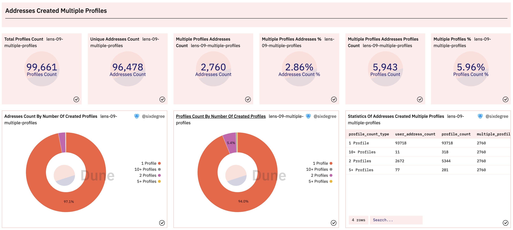
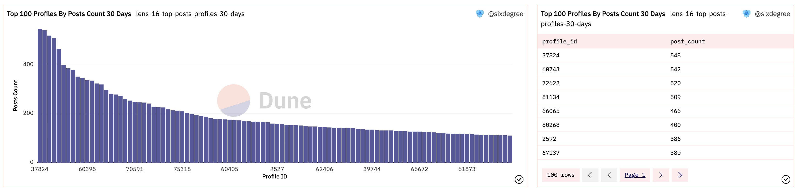
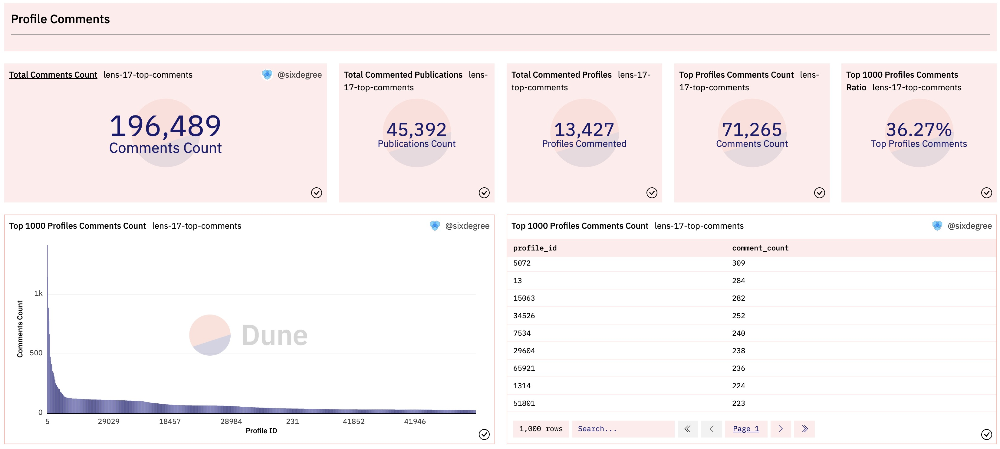
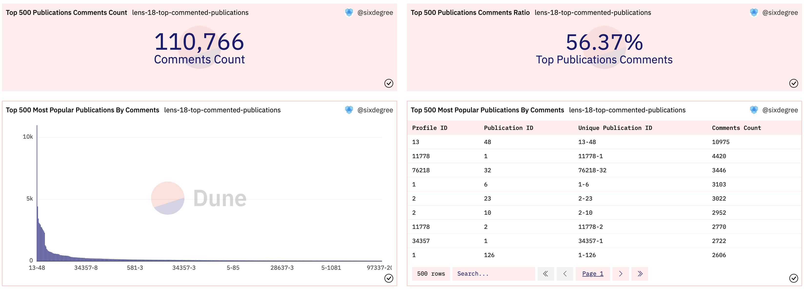
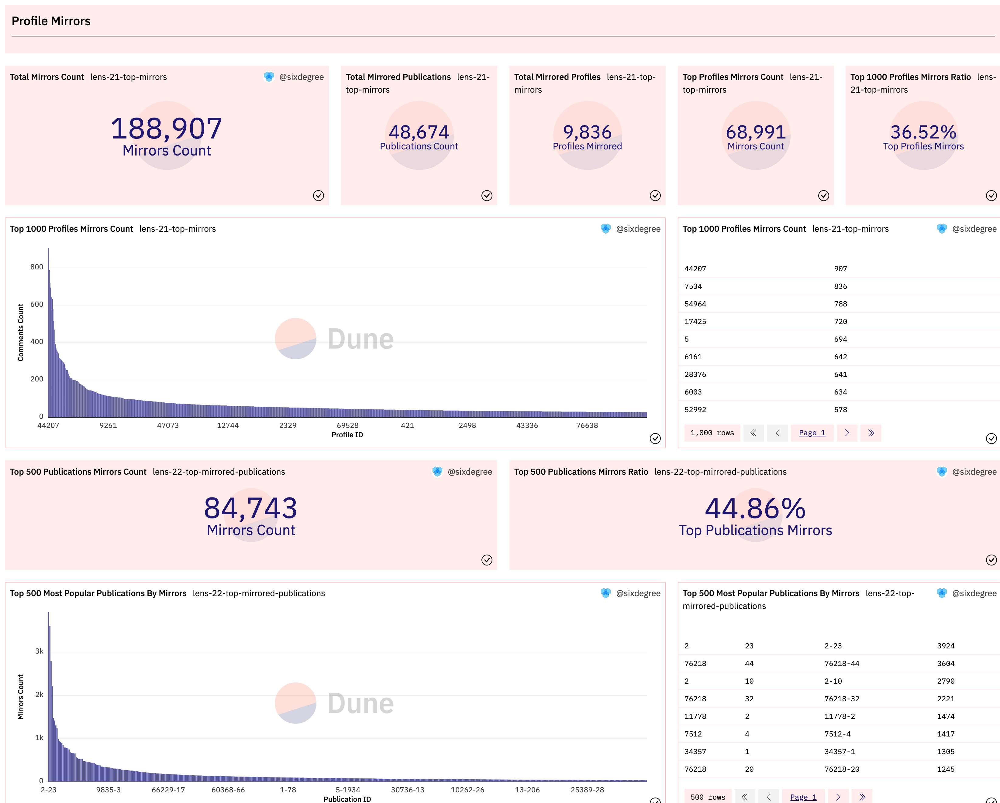
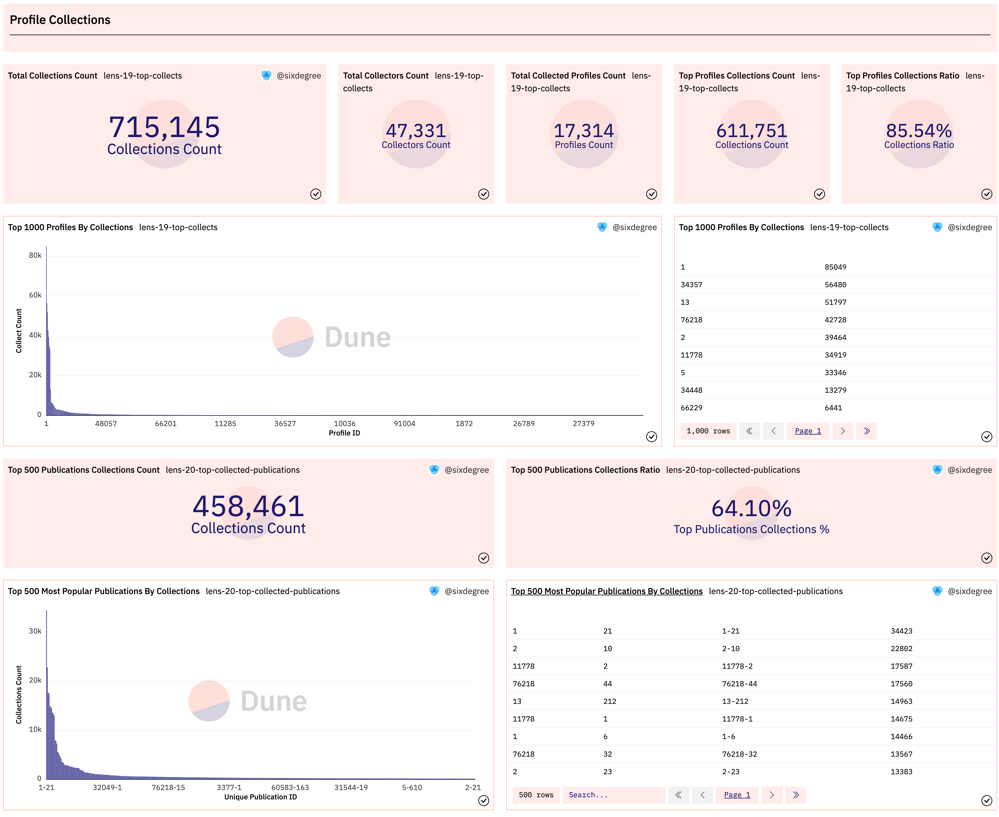

# 08 Практика – Создание панели управления Lens (II)

В первой части этого учебного пособия мы познакомили вас с протоколом Lens и создали предварительную панель управления для него, анализируя общее количество транзакций и общее количество пользователей, количество транзакций и количество уникальных пользователей в день, данные профиля создателя, анализ доменных имен Lens, поиск зарегистрированных доменных имен и другой связанный контент. Давайте добавим новые запросы и визуализации на эту панель управления. Мы проанализируем и добавим следующее содержимое: создание нескольких профилей с одного адреса, данные о подписке, данные о публикациях, данные о комментариях, данные о коллекциях, данные о зеркалировании, комплексное управление профилями и комплексное управление обычными адресами пользователей.

## Создание нескольких профилей с одного адреса

Протокол Lens позволяет создавать несколько профилей для одного адреса. Мы можем написать запрос для подсчета распределения данных адресов с несколькими созданными профилями. В следующем запросе мы сначала используем CTE profile_created для получения деталей всех созданных профилей, а затем используем multiple_profiles_addresses для подсчета количества профилей, созданных для каждого адреса. Наконец, мы используем оператор CASE для возврата агрегированной статистики, сортируя каждый адрес по количеству созданных профилей.

``` sql
with profile_created as (
    select json_value(vars, 'lax $.to') as user_address,
        json_value(vars, 'lax $.handle') as handle_name,
        replace(json_value(vars, 'lax $.handle'), '.lens', '') as short_name,
        call_block_time,
        output_0 as profile_id,
        call_tx_hash
    from lens_polygon.LensHub_call_createProfile
    where call_success = true    
),

multiple_profiles_addresses as (
    select user_address,
        count(profile_id) as profile_count
    from profile_created
    group by 1
    order by 2 desc
)

select (case when profile_count >= 10 then '10+ Profiles'
            when profile_count >= 3 then '5+ Profiles'
            when profile_count = 2 then '2 Profiles'
            else '1 Profile'
        end) as profile_count_type,
    count(user_address) as user_address_count,
    sum(profile_count) as profile_count
from multiple_profiles_addresses
group by 1
```

При выполнении этого вида статистики данных, мы обычно также нуждаемся в получении некоторых статистических значений типа Counter, таких как общее количество адресов, которые создали несколько профилей, сколько профилей создано этими адресами и доля этих профилей от общего количества созданных профилей и т.д. Вышеуказанный подзапрос CTE может быть использован при запросе этих данных, поэтому мы внесли небольшие изменения и добавили два дополнительных CTE для подсчета значений этих Counter типов. Добавьте визуальную диаграмму для этого запроса и добавьте ее на панель управления данными соответственно. Эффект отображения выглядит следующим образом:



Ссылка на референс для вышеуказанного запроса на Dune:
- [https://dune.com/queries/1562662](https://dune.com/queries/1562662)
- [https://dune.com/queries/1553030](https://dune.com/queries/1553030)
## Анализ активности пользователей Lens: статистика и графики

### Статистика по количеству публикаций активных профилей

Ежедневное количество новых публикаций пользователей Lens – важный показатель общего уровня активности. Мы пишем запрос для подсчета количества публикаций в день. CTE `post_data` в этом запросе точно такой же, как и раньше, поэтому мы опускаем ее детали в приведенном ниже коде. Поскольку мы также хотим подсчитать количество публикаций в день и вернуть накопленное количество публикаций, мы определяем CTE `post_daily_summary` в качестве промежуточного этапа для упрощения понимания SQL-кода. Соответствующий SQL-код выглядит следующим образом:

```sql
with post_data as (
    -- Получение данных о публикациях из таблиц LensHub_call_post и LensHub_call_postWithSig
),

post_daily_summary as (
    select date_trunc('day', call_block_time) as block_date,
        count(*) post_count,
        count(distinct profile_id) as profile_count
    from post_data
    group by 1
)

select block_date,
    post_count,
    profile_count,
    sum(post_count) over (order by block_date) as accumulate_post_count
from post_daily_summary
order by block_date
```

Отображение после визуализации результатов запроса и добавления их на информационную панель выглядит следующим образом:

[image_11.png](img/image_11.png)

Ссылка на этот запрос на Dune:
- [https://dune.com/queries/1555124](https://dune.com/queries/1555124)

### Топ-100 активных профилей по количеству публикаций за 30 дней

Аналогично, нас может интересовать статистика по профилям с наибольшим количеством публикаций за последний период. Для этого нам нужно просто добавить условия фильтрации по дате, чтобы фильтровать публикации за последние 30 дней в указанном выше CTE `post_data`, а затем выполнить сводную статистику по дате. SQL-код выглядит следующим образом:

```sql
with post_data as (
    select call_block_time,
        call_tx_hash,
        output_0 as post_id,
        json_value(vars, 'lax $.profileId') as profile_id, -- Извлечение элемента JSON строки
        json_value(vars, 'lax $.contentURI') as content_url,
        json_value(vars, 'lax $.collectModule') as collection_module,
        json_value(vars, 'lax $.referenceModule') as reference_module
    from lens_polygon.LensHub_call_post
    where call_success = true
        and call_block_time >= now() - interval '30' day
    
    union all
    
    select call_block_time,
        call_tx_hash,
        output_0 as post_id,
        json_value(vars, 'lax $.profileId') as profile_id, -- Извлечение элемента JSON строки
        json_value(vars, 'lax $.contentURI') as content_url,
        json_value(vars, 'lax $.collectModule') as collection_module,
        json_value(vars, 'lax $.referenceModule') as reference_module
    from lens_polygon.LensHub_call_postWithSig
    where call_success = true
        and call_block_time >= now() - interval '30' day
)

select profile_id,
    count(*) as post_count
from post_data
group by 1
order by 2 desc
limit 100
```

Мы можем добавить гистограмму для отображения количества публикаций 100 аккаунтов с наибольшим количеством публикаций за последние 30 дней и добавить таблицу для вывода подробностей. Отображение после добавления соответствующей диаграммы на информационную панель выглядит следующим образом:



Ссылка на этот запрос на Dune:
- [https://dune.com/queries/1559981](https://dune.com/queries/1559981)

## Анализ данных комментариев к профилям

### Анализ количества комментариев к наиболее популярным профилям

Данные о комментариях Lens похожи на данные о постах, которые хранятся в таблицах `LensHub_call_comment` и `LensHub_call_commentWithSig` в зависимости от источника данных. Основываясь на текущих функциях протокола Lens, пользователи должны были создать свой собственный Профиль, чтобы комментировать посты других создателей. В таблице данных о комментариях отслеживается идентификатор профиля комментатора. Одновременно количество постов каждого создателя увеличивается с 1. То есть посты от разных создателей могут иметь одинаковое число. Нам нужно сопоставить идентификатор профиля создателя с его идентификатором публикации, чтобы получить уникальный номер. SQL выглядит следующим образом:

``` sql
select call_block_time,
    call_tx_hash,
    output_0 as comment_id, -- comment id
    json_value(vars, 'lax $.profileId') as profile_id_from, -- Profile ID of the comment
    json_value(vars, 'lax $.contentURI') as content_url, -- comment content link
    json_value(vars, 'lax $.pubIdPointed') as publication_id_pointed, -- Commented Publication ID
    json_value(vars, 'lax $.profileIdPointed') as profile_id_pointed, -- Profile ID of Creator who were commented on
    json_value(vars, 'lax $.profileIdPointed') || '-' || json_value(vars, 'lax $.pubIdPointed') as unique_publication_id  -- combine to generate unique id
from lens_polygon.LensHub_call_comment
where call_success = true
limit 10
```

Мы также получаем общие данные о комментариях, определяя дополнительное CTE, чтобы график Counter мог быть выведен в том же запросе, и данные о 1000 аккаунтах с наибольшим количеством комментариев и данные о всех аккаунтах могли быть сопоставлены. После визуализации результатов запроса и добавления их на панель данных отображение выглядит следующим образом:



Ссылка на запрос выше на Dune:
- [https://dune.com/queries/1560028](https://dune.com/queries/1560028)

### Статистика наиболее часто комментируемых публикаций

Каждый комментарий предназначен для конкретного объекта (Публикация) (здесь автор полагает, что это должно быть Пост, пожалуйста, исправьте меня, если есть какое-либо недоразумение). Имеет определенную ценность анализ публикаций, которые были прокомментированы чаще всего. Мы пишем запрос для подсчета 500 наиболее часто комментируемых публикаций и сравниваем его со всеми данными о комментариях. SQL выглядит следующим образом:

``` sql
with comment_data as (
    -- get comment data from LensHub_call_comment and LensHub_call_commentWithSig tables
)

select profile_id_pointed,
    publication_id_pointed,
    unique_publication_id,
    count(*) as comment_count
from comment_data
group by 1, 2, 3
order by 4 desc
limit 500
```

Аналогично, мы добавляем дополнительное CTE для получения данных о всех комментариях и сравниваем данные о 500 наиболее часто комментируемых публикациях с глобальными данными. Добавляем соответствующий визуальный график на панель данных, эффект выглядит следующим образом:



Ссылка на запрос выше на Dune:
- [https://dune.com/queries/1560578](https://dune.com/queries/1560578)

## Анализ данных о зеркалировании профилей

Зеркалирование данных очень похоже на данные о комментариях, и пользователям сначала необходимо создать собственный профиль, чтобы зеркалировать публикации других людей. Мы записываем два запроса соответственно для подсчета 1000 данных учетных записей с наибольшим количеством операций зеркалирования и 500 данных о публикациях с наибольшим количеством операций зеркалирования. Сравните их с общими данными о зеркалировании. Эффект после добавления панели данных показан на следующей фигуре:



Ссылка на запрос на Dune:
- [https://dune.com/queries/1561229](https://dune.com/queries/1561229)
- [https://dune.com/queries/1561558](https://dune.com/queries/1561558)

## Анализ данных коллекций профилей

Данные коллекций линз также хранятся в двух таблицах `LensHub_call_collect` и `LensHub_call_collectWithSig` соответственно. В отличие от данных комментариев или зеркал, для добавления публикации в коллекцию не требуется, чтобы у коллекционера был собственный профиль Lens. То есть, любой адрес (пользователь) может добавлять публикации из других профилей в свою коллекцию. Поэтому нам необходимо отслеживать конкретную операцию добавления через адрес коллекционера. Особенность заключается в том, что данные адреса коллекционера не сохраняются в таблице `LensHub_call_collect`, но таблица `LensHub_call_collectWithSig` содержит эти данные. Нам нужно связать таблицу `LensHub_call_collect` с таблицей транзакций, чтобы получить адрес пользователя текущей операции добавления. Пример SQL приведен ниже:

```sql
select call_block_time,
    t."from" as collector,
    c.profileId as profile_id,
    c.pubId as publication_id,
    cast(c.profileId as varchar) || '-' || cast(c.pubId as varchar) as unique_publication_id,
    c.output_0 as collection_id
from lens_polygon.LensHub_call_collect c
inner join polygon.transactions t on c.call_tx_hash = t.hash -- соединение с таблицей транзакций для получения адреса пользователя
where call_block_time >= date('2022-05-18') -- фильтрация по дате развертывания контракта Lens для повышения скорости запроса
    and block_time >= date('2022-05-18')
    and c.call_success = true
limit 10
```

Поскольку записи в таблице транзакций довольно большие, время выполнения запроса значительно увеличится. Общее правило — стараться избегать операций соединения с необработанными таблицами данных (транзакции, логи, трассы) по возможности.

Остальные части SQL-анализа данных коллекций в основном такие же, как в предыдущем примере, поэтому я не буду их повторять. Аналогично, мы также проводим статистический анализ самых часто добавляемых в коллекцию публикаций. Эффект отображения после добавления соответствующих визуализаций к панели управления данными показан на следующей фигуре:



Ссылка на приведенный выше запрос на Dune:
- [https://dune.com/queries/1560847](https://dune.com/queries/1560847)
- [https://dune.com/queries/1561009](https://dune.com/queries/1561009)

## Анализ данных подписок

### Топ профилей по количеству подписчиков

Данные о подписках протокола Lens по-прежнему хранятся в двух таблицах: `LensHub_call_follow` и `LensHub_call_followWithSig` соответственно. Любой адрес (пользователь) может подписываться на другие профили. Подобно избранным, таблица `LensHub_call_follow` не сохраняет адреса подписчиков, поэтому нам также необходимо получить адреса пользователей, в настоящее время осуществляющих избранное, путем сопоставления с таблицей `transactions`. Кроме того, существует особая функция подписки, заключающаяся в том, что несколько профилей могут быть подписаны партиями одновременно в одной транзакции. В таблице `LensHub_call_follow` данные о подписанных профилях хранятся в поле типа массива `profileIds`, что относительно просто обрабатывать. В таблице `LensHub_call_followWithSig` это значение массива в строковом формате JSON. Пример поля `vars` выглядит следующим образом (некоторое содержимое опущено):

```json
{"follower":"0xdacc5a4f232406067da52662d62fc75165f21b23","profileIds":[21884,25271,39784],"datas":["0x","0x","0x"],"sig":"..."}
```

Используя функции JSON в Dune SQL, вы можете читать значения массива из строк JSON. Мы можем сначала использовать `json_extract()` для извлечения требуемого значения элемента из строки json, а затем использовать метод `cast()` для преобразования его в массив указанного типа. Пример кода выглядит следующим образом:

``` sql
select
json_query(vars, 'lax $.follower') AS follower, -- одно значение
json_query(vars, 'lax $.profileIds') AS profileIds, -- массив
from follow_data
group by 1
```

Используя метод `case` для категоризации подписчиков:
``` sql
select (case when follower_count >= 10000 then '10K+ Followers'
            when follower_count >= 1000 then '1K+ Followers'
            when follower_count >= 100 then '100+ Followers'
            when follower_count >= 50 then '50+ Followers'
            when follower_count >= 10 then '10+ Followers'
            when follower_count >= 5 then '5+ Followers'
            else '1 - 5 Followers'
        end) as follower_count_type,
        count(profile_id) as profile_count
    from profile_follower
    group by 1
```

Ссылка на запрос в Dune:
- [https://dune.com/queries/1554454](https://dune.com/queries/1554454)

### Распределение профилей по диапазону количества подписок

Мы видим, что почти все профили подписаны, и мы можем использовать запрос для анализа распределения внимания каждого профиля. Код SQL выглядит следующим образом:

Ссылка на запрос в Dune:
- [https://dune.com/queries/1554888](https://dune.com/queries/1554888)

### Статистика количества новых подписчиков в день

Количество новых подписчиков в день для пользователей Lens также является важным показателем для наблюдения за изменениями в общей активности. Мы пишем запрос для подсчета количества постов в день. CTE `follow_data` в этом запросе точно такой же, как и раньше. Метод обработки запроса также очень похож на статистику количества ежедневных постов, упомянутую выше, поэтому детали не будут подробно описаны здесь. Добавьте визуализационную диаграмму к результату запроса и добавьте ее на информационную панель, эффект отображения выглядит следующим образом:

Ссылка на запрос в Dune:
- [https://dune.com/queries/1555185](https://dune.com/queries/1555185)
