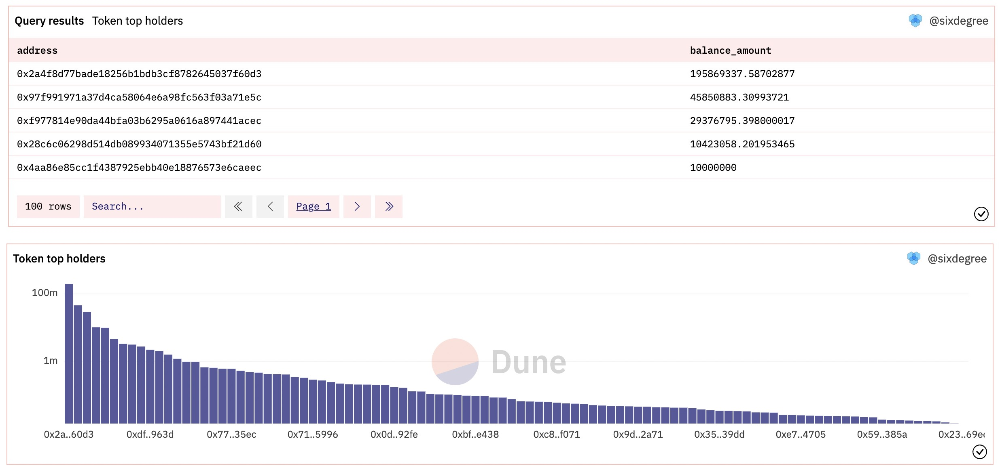
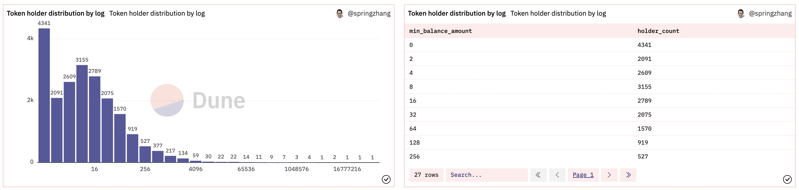

## 10 Полезных запросов (II): Держатели токенов, общая эмиссия, баланс аккаунта

В части 1 полезных запросов мы в основном объясняли различные способы запроса цены токенов ERC20. В этой части мы рассмотрим, как получить данные о держателях токенов, общую эмиссию и баланс аккаунта.

Для этого необходимо узнать адрес контракта токена, который вас интересует. Например, для FTT токен находится по адресу `0x50d1c9771902476076ecfc8b2a83ad6b9355a4c9`.

Сначала узнаем баланс аккаунта. Данные о балансе аккаунта могут быть получены с помощью SQL запроса, который объединяет все транзакции, связанные с токеном.

Затем мы получаем данные о держателях токенов. Это можно сделать, агрегируя информацию о балансе аккаунта для каждого адреса.

И, наконец, мы можем получить информацию об общей эмиссии токенов. Это делается путем суммирования всех балансов аккаунтов.

На практике это может быть сложной задачей, особенно для токенов с большим количеством держателей. Однако, используя правильные инструменты и методы, вы можете получить ценные данные о токенах ERC20.

Например, можно использовать CTE (Common Table Expression) для структурирования запроса и удобства дальнейшей обработки данных.

```sql
with transfer_detail as (
    select evt_block_time,
        evt_tx_hash,
        contract_address,
        "to" as address,
        cast(value as decimal(38, 0)) as amount
    from erc20_ethereum.evt_Transfer
    where contract_address = '0x50d1c9771902476076ecfc8b2a83ad6b9355a4c9'
    
    union all
    
    select evt_block_time,
        evt_tx_hash,
        contract_address,
        "from" as address,
        -1 * cast(value as decimal(38, 0)) as amount
    from erc20_ethereum.evt_Transfer
    where contract_address = '0x50d1c9771902476076ecfc8b2a83ad6b9355a4c9'
),

address_balance as (
    select address,
        sum(amount) as balance_amount
    from transfer_detail
    group by address
)

select count(*) as holder_count,
    sum(balance_amount / 1e18) as supply_amount
from address_balance
where balance_amount > 0
```

В данном запросе `1e18` - это эквивалент `power(10, 18)`.  Различные токены ERC20 могут иметь разные значения десятичных знаков, которые можно узнать из таблицы `tokens.erc20`.

При работе с большим количеством адресов, запрос может занимать продолжительное время. Данные о количестве держателей и общей эмиссии могут незначительно отличаться от данных, представленных на Etherscan, из-за разных критериев, используемых для определения минимального баланса.

Пример запроса: [https://dune.com/queries/1620179](https://dune.com/queries/1620179)
## Запрос адреса, удерживающего наибольшее количество токенов

В предыдущем запросе, который запрашивал количество держателей токенов и объем в обращении, мы агрегировали текущий баланс токенов каждого держателя по адресу. Следовательно, легко запросить адреса пользователей с наибольшим количеством токенов и их соответствующие активы. Вы можете либо Fork запроса для внесения изменений, либо скопировать код запроса и создать новый запрос. Поскольку мы запрашиваем для одного токена, мы можем заменить жестко заданный адрес токена параметром запроса `{{token_contract_address}}` и установить адрес контракта токена FTT выше как значение по умолчанию, что дает нам возможность запрашивать данные для любого токена. Следующий запрос возвращает 100 адресов, удерживающих наибольшее количество токенов:

``` sql
with transfer_detail as (
    select evt_block_time,
        evt_tx_hash,
        contract_address,
        "to" as address,
        cast(value as decimal(38, 0)) as amount
    from erc20_ethereum.evt_Transfer
    where contract_address = {{token_contract_address}}
    
    union all
    
    select evt_block_time,
        evt_tx_hash,
        contract_address,
        "from" as address,
        -1 * cast(value as decimal(38, 0)) as amount
    from erc20_ethereum.evt_Transfer
    where contract_address = {{token_contract_address}}
),

address_balance as (
    select address,
        sum(amount / 1e18) as balance_amount
    from transfer_detail
    group by address
)

select address,
    balance_amount
from address_balance
order by 2 desc
limit 100
```

Используя параметры адреса контракта токена FTT по умолчанию, вышеуказанный запрос возвращает 100 адресов, удерживающих наибольшее количество FTTS. Мы можем визуализировать столбчатую диаграмму, сравнивающую количество, удерживаемое топ-100 держателями. Поскольку разница в количестве очевидна, мы зарегистрируем данные Y-оси, выбрав опцию Логарифмического масштаба. Как показано ниже:



Пример запроса: [https://dune.com/queries/1620917](https://dune.com/queries/1620917)

## Запрос на распределение количества, находящегося у разных держателей токенов

Если нам нужно узнать распределение балансов по всем адресам, хранящим ERC20 токен, есть две альтернативы: одна использует эмпирическое правило для настройки партиций, что более грубо, может пропустить некоторые ключевые особенности, и недостаточно гибко для одновременного анализа многих различных токенов. Другой способ более точный, но и более сложный. Давайте представим их отдельно.

**Распределение по эмпирическому правилу:** Поскольку мы рассматриваем диапазоны денег (и аналогично для распределения количества), мы можем выбрать типичные диапазоны денег: более 10 000, от 1 000 до 10 000, от 500 до 1 000, от 100 до 500, от 10 до 100, от 1 до 10 и менее 1. Конечно, вы можете настроить это в соответствии с требованиями, исходя из общего выпуска анализируемого токена. Запрос выглядит следующим образом:

``` sql
with transfer_detail as (
    -- Аналогично предыдущему примеру
),

address_balance as (
    select address,
        sum(amount / 1e18) as balance_amount
    from transfer_detail
    group by address
)

select (case when balance_amount >= 10000 then '>= 10000'
            when balance_amount >= 1000 then '>= 1000'
            when balance_amount >= 500 then '>= 500'
            when balance_amount >= 100 then '>= 100'
            when balance_amount >= 10 then '>= 10'
            when balance_amount >= 1 then '>= 1'
            else '< 1.0'
        end) as amount_area_type,
        (case when balance_amount >= 10000 then 10000
            when balance_amount >= 1000 then 1000
            when balance_amount >= 500 then 500
            when balance_amount >= 100 then 100
            when balance_amount >= 10 then 10
            when balance_amount >= 1 then 1
            else 0
        end) as amount_area_id,
    count(*) as holder_count
from address_balance
group by amount_area_type
order by amount_area_type
```

Мы используем `floor(log2(sum(amount / 1e18)))` для логарифмирования баланса всех держателей и округления его вниз до целого числа. Он также рассчитывает нормальный баланс и использует `having balance_amount >= pow(10, -4)` для фильтрации аккаунтов с балансом менее 0,0001. В запросе, который выводит окончательный результат, мы используем оператор `CASE`, который рассматривает значение `log_balance_amount >= 0` как 0, указывая на то, что баланс аккаунта находится между 0 и 2. Для любого другого значения используется функция `pow()` для восстановления нормальной суммы денег. Таким образом, мы реализуем количество адресов в разных диапазонах сумм с помощью логарифмического разделения. Как показано ниже, мы можем визуализировать результаты запроса в виде гистограммы:



Пример запроса:
- Статистическое распределение по логарифмическому разделению: [https://dune.com/queries/1622137](https://dune.com/queries/1622137)
- Статистическое распределение в соответствии с методом равного разделения: [https://dune.com/queries/1300399](https://dune.com/queries/1300399)
    
## Запрос количества держателей токена ERC20 за дату

Для смарт-контрактов, которые уже были проанализированы, помимо запроса таблицы `evt_Transfer`, мы можем также напрямую запрашивать соответствующие таблицы Decode. Например, в отношении токена FTT, который мы запрашивали ранее, его контракт уже был декодирован. Перейдите на страницу редактора запросов Dune, нажмите "Decoded Projects", выполните поиск "ftt" и затем выберите "FTT_Token". Вы увидите таблицу типа `event` под названием "Transfer" в списке. Нажмите на символ двойной стрелки справа, чтобы вставить полное имя таблицы в окно редактора запросов, которое является `ftt_ethereum.FTT_Token_evt_Transfer`. Преимущество использования таблиц Decode заключается в том, что запросы считывают меньше данных и работают быстрее.

Предположим, наша цель — отслеживать количество держателей токенов FTT еженедельно, чтобы нам нужно было выяснить, сколько людей владеют остатками токенов FTT в течение каждой недели. Начнем с кода запроса, а затем с объяснением:

``` sql
with transfer_detail as (
    select evt_block_time,
        "to" as address,
        cast(value as decimal(38, 0)) as value,
        evt_tx_hash
    from ftt_ethereum.FTT_Token_evt_Transfer
    
    union all
    
    select evt_block_time,
        "from" as address,
        -1 * cast(value as decimal(38, 0)) as value,
        evt_tx_hash
    from ftt_ethereum.FTT_Token_evt_Transfer
),

holder_balance_weekly as (
    select date_trunc('week', evt_block_time) as block_date,
        address,
        sum(value/1e18) as balance_amount
    from transfer_detail
    group by 1, 2
),

holder_summary_weekly as (
    select 
		block_date,
		address,
		sum(balance_amount) over (partition by address order by block_date) as total_balance
	from holder_balance_weekly
),

min_max_date as (
	select
		min(block_date) as start_date,
		max(block_date) as end_date
	from holder_balance_weekly
),

date_series as (
    select 
		start_date + (n-1) * interval '7 days' as date
    from min_max_date,
         generate_series(1, 
                         (date_part('day', (select end_date from min_max_date)) - date_part('day', (select start_date from min_max_date))) + 1)
),

holder_balance_until_date as (
    select
		d.date,
		h.address,
		h.total_balance
	from date_series d
	inner join holder_summary_weekly h on h.block_date <= d.date
),

holder_count_summary as (
    select 
		date,
		count(distinct address) as holder_count
    from holder_balance_until_date
    where total_balance > 0
    group by date
)

select 
	date,
	holder_count,
	holder_count - lag(holder_count, 1, 0) as holder_count_change
from holder_count_summary
order by date;
```

Мы визуализируем результаты запроса в два графика и добавляем их на панель данных следующим образом:

[Изображение ch10_image_07.png]

Пример на Dune: [https://dune.com/queries/1625278](https://dune.com/queries/1625278)

## Запрос баланса счета для указанного адреса пользователя

Основываясь на примере предыдущего запроса, его можно легко изменить для запроса информации о балансе для конкретного адреса пользователя или набора адресов пользователей. Нам просто нужно добавить фильтр для фильтрации записей `address`, которые соответствуют критериям, поэтому в данном случае нет примера.