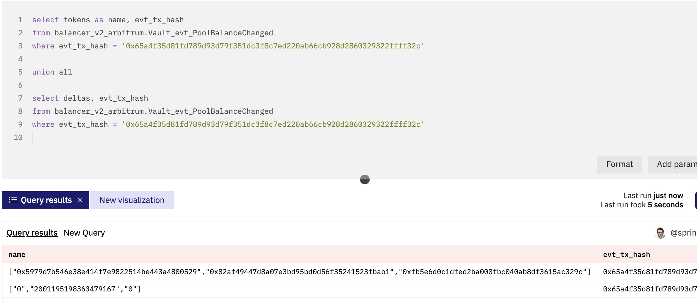
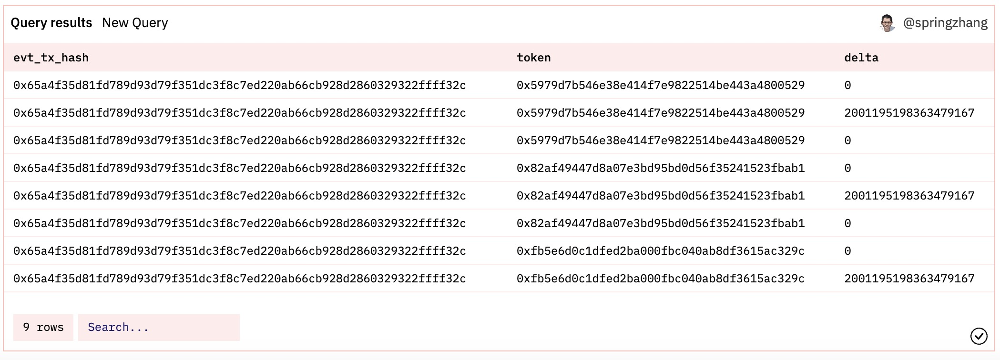
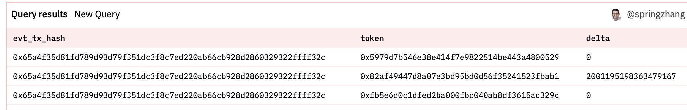

# 11 Полезные запросы (III): пользовательские данные, последовательность чисел, массив, JSON и т.д.

В первых двух частях общих запросов мы представили некоторые общие методы запросов, такие как запрос цены, держатель и баланс, удерживаемый токенами ERC20. В этом разделе мы рассмотрим некоторые другие распространенные запросы.

## Таблица пользовательских данных с использованием CTE

Dune V2 в настоящее время не поддерживает пользовательские таблицы и представления. Для некоторых данных из внешних источников или небольшого количества данных, созданных вручную, мы можем рассмотреть возможность использования CTE для создания пользовательского списка данных внутри запроса. Это позволяет поддерживать пользовательские таблицы CTE с тысячами строк всего лишь с несколькими полями и они будут успешно выполняться, пока не превысят максимальный размер запроса Dune. Существует два способа настройки таблиц CTE:

Пример первого синтаксиса:
``` sql
with raydium_lp_pairs(account_key, pair_name) as (
    values
    ('58oQChx4yWmvKdwLLZzBi4ChoCc2fqCUWBkwMihLYQo2', 'SOL/USDC'),
    ('7XawhbbxtsRcQA8KTkHT9f9nc6d69UwqCDh6U5EEbEmX', 'SOL/USDT'),
    ('AVs9TA4nWDzfPJE9gGVNJMVhcQy3V9PGazuz33BfG2RA', 'RAY/SOL'),
    ('6UmmUiYoBjSrhakAobJw8BvkmJtDVxaeBtbt7rxWo1mg', 'RAY/USDC'),
    ('DVa7Qmb5ct9RCpaU7UTpSaf3GVMYz17vNVU67XpdCRut', 'RAY/USDT'),
    ('GaqgfieVmnmY4ZsZHHA6L5RSVzCGL3sKx4UgHBaYNy8m', 'RAY/SRMSOL'),
    ('6a1CsrpeZubDjEJE9s1CMVheB6HWM5d7m1cj2jkhyXhj', 'STSOL/USDC'),
    ('43UHp4TuwQ7BYsaULN1qfpktmg7GWs9GpR8TDb8ovu9c', 'APEX4/USDC')
)

select * from raydium_lp_pairs
```

Пример второго синтаксиса:

``` sql
with token_plan as (
    select token_name, hook_amount from (
        values
        ('Token Type','BEP-20 on BNB Chain'),
        ('Total Token Supply','500,000,000 HOOK'),
        ('Private Sale Allocation','100,000,000 HOOK'),
        ('Private Sale Token Price','0.06 USD to 0.12 USD / HOOK'),
        ('Private Sale Amount Raised','~ 6,000,000 USD'),
        ('Binance Launchpad Sale Allocation','25,000,000 HOOK'),
        ('Binance Launchpad Sale Price','0.10 USD / HOOK'),
        ('Binance Launchpad Amount to be Raised','2,500,000 USD'),
        ('Initial Circ. Supply When Listed on Binance','50,000,000 HOOK (10.00%)')
    ) as tbl(token_name, hook_amount)
)

select * from token_plan
```

Конечно, с помощью второго синтаксиса вы можете опустить определение CTE и использовать запрос SELECT напрямую, если вам нужно вернуть только эту часть пользовательских данных.

Пример ссылки на вышеуказанный запрос:
- [https://dune.com/queries/781862](https://dune.com/queries/781862)
- [https://dune.com/queries/1650640](https://dune.com/queries/1650640)

В связи с упомянутыми выше ограничениями выполнение может не удаться, если строк слишком много. Вам придется дублировать один и тот же код CTE для каждого запроса, что относительно неудобно. Для больших объемов данных, многократно, для долгосрочного использования и т.д., вам все же следует рассмотреть возможность создания таблицы заклинаний путем отправки PR в Spellbook.

## Декодирование данных из логов

Ранее, при расчете цены токенов ERC20, мы видели пример расчета цены из логов. Давайте рассмотрим еще один пример, где нам нужно декодировать данные непосредственно из логов. Когда смарт-контракт не декодируется Dune, или таблица декодирования для соответствующего события не создана из-за неполных данных ABI, используемых при декодировании, нам может потребоваться декодировать данные запроса непосредственно из логов. В качестве примера возьмем протокол Lens, мы обнаружили, что в исходном коде смарт-контракта Lens ([Lens Core](https://github.com/lens-protocol/core)), почти каждая операция генерирует логи событий. Однако в Dune есть лишь несколько таблиц, связанных с событиями. Дальнейшее исследование выявило, что ABI, используемый при декодировании, не содержал определения этих событий. Хотя мы можем сгенерировать или попросить команду Lens предоставить полный ABI и отправить его в Dune для повторного анализа, основной момент здесь – это как извлечь данные из не декодированных логов.

В исходном коде смарт-контракта Lens мы видим определение события `FollowNFTTransferred`, [ссылка на код](https://github.com/lens-protocol/core/blob/main/contracts/libraries/Events.sol#L347). В коде также есть событие `Followed`, но декодирование усложняется аргументом массива, поэтому мы будем использовать предыдущее событие в качестве примера. Из названия события мы можем предположить, что при подписке пользователя на профиль Lens, будет создан и передан FollowNFT на адрес подписчика. Мы можем затем найти запись о транзакции, представляющую интерес. Давайте посмотрим на логи для следующей транзакции:[https://polygonscan.com/tx/0x30311c3eb32300c8e7e173c20a6d9c279c99d19334be8684038757e92545f8cf].  В браузере на странице журнала транзакций перейдите на вкладку "Logs", чтобы увидеть, что всего четыре лога событий. В некоторых случаях браузер блокчейна может отображать оригинальное название события. Просматриваемая нами транзакция Lens не показывает оригинальное название, поэтому как нам узнать, какой из них соответствует логу события `FollowNFTTransferred`? Здесь мы можем использовать сторонние инструменты для сравнения путем генерации хеша keccak256 определения события. [Keccak - 256](https://emn178.github.io/online-tools/keccak_256.html) эта страница может генерировать онлайн значение хеша Keccak - 256. Давайте очистим определение события `FollowNFTTransferred` в исходном коде до минифицированного режима (удалите имена параметров, удалите пробелы). Получаем `FollowNFTTransferred (uint256 uint256, address, адрес, uint256)`, затем вставляем его на страницу инструмента Keccak-256.

Пример ссылки на вышеуказанный запрос:
- [https://dune.com/queries/1652759](https://dune.com/queries/1652759)
- [Инструмент Keccak-256](https://emn178.github.io/online-tools/keccak_256.html)

## Использование последовательностей чисел для упрощения запросов

При изучении NFT проектов, мы можем захотеть проанализировать распределение цен всех транзакций для данного NFT проекта за определенный период времени (например, сколько транзакций было зафиксировано в каждом ценовом диапазоне). Мы обычно устанавливаем два параметра `min_price` и `max_price`, делим их разницу поровну на 20 ценовых диапазонов, и затем используем длинное выражение `CASE` для подсчета количества транзакций в каждом диапазоне. Представьте, если бы вам пришлось разделить это на 50 групп. Есть ли более простой способ? Ответ — да. Посмотрите на код: 

``` sql
with contract_transfer as (
    select * 
    from nft.trades
    where nft_contract_address = 0xe361f10965542ee57D39043C9c3972B77841F581
        and tx_to != 0x0000000000000000000000000000000
## Чтение данных из полей массива и структуры

Некоторые смарт-контракты генерируют логи событий, используя параметры массива, и таблица данных, генерируемая Dune после декодирования, также хранится в массивах. Таблицы необработанных транзакций блокчейна Solana широко используют массивы для хранения данных. Некоторые данные хранятся в структурах, или нам нужно к ним обращаться, когда мы хотим извлечь данные (пример смотрите ниже). Давайте рассмотрим, как получить доступ к данным, хранящимся в полях массива и полях структуры.

``` sql
select tokens, deltas, evt_tx_hash
from balancer_v2_arbitrum.Vault_evt_PoolBalanceChanged
where evt_tx_hash = 0x65a4f35d81fd789d93d79f351dc3f8c7ed220ab66cb928d2860329322ffff32c
```

Первые два поля, возвращенные предыдущим запросом, являются массивами (показаны на следующем изображении):



Мы можем использовать `cross join unnest(tokens) as tbl1(token)` для разделения поля массива `tokens` на несколько строк:
``` sql
select evt_tx_hash, deltas, token   -- Возвращает разделенное поле
from balancer_v2_arbitrum.Vault_evt_PoolBalanceChanged
cross join unnest(tokens) as tbl1(token)   -- Разделение на несколько строк и именование нового поля token
where evt_tx_hash = 0x65a4f35d81fd789d93d79f351dc3f8c7ed220ab66cb928d2860329322ffff32c
```

Мы также можем разделить поле `deltas`. Но поскольку каждый `cross join` добавляет разделенное значение к исходному набору результатов запроса, если мы выполняем операции над обоими полями одновременно, у нас будет неверный набор результатов, похожий на декартово произведение. Следующий скриншот показывает код запроса и полученный вывод:

``` sql
select evt_tx_hash, token, delta
from balancer_v2_arbitrum.Vault_evt_PoolBalanceChanged
cross join unnest(tokens) as tbl1(token)   -- Разделение на несколько строк и именование нового поля token
cross join unnest(deltas) as tbl2(delta)   -- Разделение на несколько строк и именование нового поля delta
where evt_tx_hash = 0x65a4f35d81fd789d93d79f351dc3f8c7ed220ab66cb928d2860329322ffff32c
```



Чтобы избежать дублирования, рекомендуется разделять несколько полей одновременно внутри одной функции `unnest()`, она вернет временную таблицу с несколькими соответствующими новыми полями.

``` sql
select evt_tx_hash, token, delta
from balancer_v2_arbitrum.Vault_evt_PoolBalanceChanged
cross join unnest(tokens, deltas) as tbl(token, delta)   -- Разделение на несколько строк и именование нового поля token snd delta
where evt_tx_hash = 0x65a4f35d81fd789d93d79f351dc3f8c7ed220ab66cb928d2860329322ffff32c
```

Результат показан на следующей фигуре: 



Пример ссылки на вышеуказанный запрос: 
- [https://dune.com/queries/1654079](https://dune.com/queries/1654079)

## Чтение данных строки JSON

В некоторых смарт-контрактах объекты, содержащие несколько значений, сериализуются в виде строк JSON в таблице разбора, такие как событие создания профиля Lens, который мы видели ранее. Мы можем использовать `:` для чтения переменных непосредственно из строки JSON. Например:

```sql
select  json_value(vars, 'lax $.to') as user_address, -- Чтение строки JSON адреса пользователя
     json_value(vars, 'lax $.handle') as handle_name, -- Чтение строки JSON ников пользователя
    call_block_time,
    output_0 as profile_id,
    call_tx_hash
from lens_polygon.LensHub_call_createProfile
where call_success = true   
limit 100
```

В качестве альтернативы используйте функцию `json_query()` или `json_extract()` для извлечения соответствующих данных. Функция `json_extract()` поддерживает преобразование типов, когда вам необходимо извлекать значения массива из строки JSON. Вот несколько примеров:
```sql
select
json_query(vars, 'lax $.follower') AS follower, -- одиночное значение
json_query(vars, 'lax $.profileIds') AS profileIds, -- все еще строка
from_hex(cast(json_extract(vars,'$.follower') as varchar)) as follower2, -- преобразование в varbinary
cast(json_extract(vars,'$.profileIds') as array(integer)) as profileIds2, -- преобразование в массив
vars
from lens_polygon.LensHub_call_followWithSig
where cardinality(output_0) > 1
limit 10
```

Пример ссылки на вышеуказанный запрос: 
- [https://dune.com/queries/1562662](https://dune.com/queries/1562662)
- [https://dune.com/queries/941978](https://dune.com/queries/941978)
- [https://dune.com/queries/1554454](https://dune.com/queries/1554454)

Dune SQL (Trino) Для получения подробной справки по функциям JSON, ознакомьтесь с: https://trino.io/docs/current/functions/json.html

## О нас

`Sixdegree` — это профессиональная команда по анализу данных на блокчейне. Наша миссия — предоставлять пользователям точные графики, аналитику и инсайты по данным на блокчейне. Мы стремимся популяризировать анализ данных на блокчейне. Благодаря созданию сообщества и написанию учебных пособий, среди прочих инициатив, мы обучаем аналитиков данных на блокчейне, выпускаем ценный аналитический контент, продвигаем сообщество для построения слоя данных для блокчейна и воспитываем таланты для широкого будущего блокчейн-данных приложений. Добро пожаловать на площадку обмена опытом в сообществе!

- Веб-сайт: [sixdegree.xyz](https://sixdegree.xyz)
- Электронная почта: [contact@sixdegree.xyz](mailto:contact@sixdegree.xyz)
- Twitter: [twitter.com/SixdegreeLab](https://twitter.com/SixdegreeLab)
- Dune: [dune.com/sixdegree](https://dune.com/sixdegree)
- Github: [https://github.com/SixdegreeLab](https://github.com/SixdegreeLab)