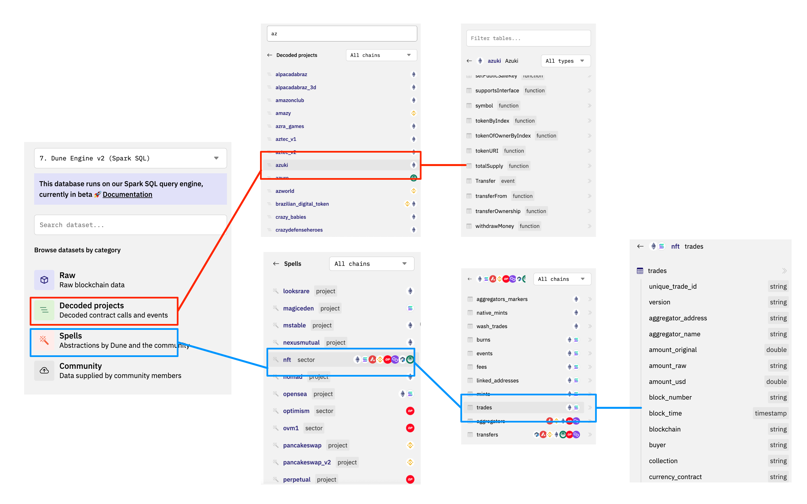
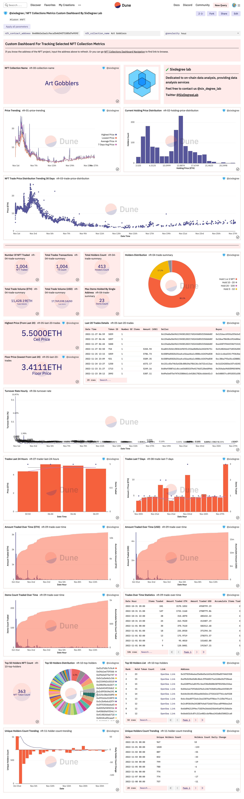

# 12 Анализ NFT

## Общая информация

[ERC721](https://eips.ethereum.org/EIPS/eip-721) является одним из наиболее используемых [NFT(Non-Fungable Token)](https://ethereum.org/zh/nft/) стандартов. По сравнению со стандартом ERC20 в отношении взаимозаменяемых токенов, традиционно наиболее типичными характеристиками NFT являются то, что каждый токен неделим, неповторим и уникален. Общие варианты использования NFT:

- Цифровое искусство/коллекции
- Предметы в играх
- Доменные имена
- Билеты или купоны, позволяющие посетить мероприятие
- Цифровая идентификация
- Статьи

Например, в цифровом искусстве разные NFT имеют разные стили; например, в доменном имени ENS каждое доменное имя уникально и не может быть повторено. Что касается билетов, то каждый билет имеет фиксированное место, и разные места также имеют разные номера.

С развитием NFT были выведены другие стандартные NFT:

- ERC-1155: Не взаимозаменяемые токены, каждый токен отличается, но может осуществлять передачу количества
- SBT: Непередаваемый токен
- ERC-3235: Полу-взаимозаменяемый токен, каждый токен отличается и поддерживает урегулирование

|          | ERC20                                                | ERC721                                                                     | ERC1155                                                                                                                                    | ERC3535                                                                                                                                                                                                                                                                                                                                                               |
|----------|------------------------------------------------------|----------------------------------------------------------------------------|--------------------------------------------------------------------------------------------------------------------------------------------|-----------------------------------------------------------------------------------------------------------------------------------------------------------------------------------------------------------------------------------------------------------------------------------------------------------------------------------------------------------------------|
| **особенности** | взаимозаменяемые токены (каждый отдельный токен такой же, как и другие) | не взаимозаменяемые токены (каждый отдельный токен уникален, никто не такой же, как другие) | представление взаимозаменяемых, полу-взаимозаменяемых и не взаимозаменяемых токенов.                                                                             | Полу-взаимозаменяемый токен                                                                                                                                                                                                                                                                                                                                                   |
| **примеры** | адрес A переводит 100ETH на адрес B               | адрес A переводит BAYC с лазерными глазами на адрес B. (не с очками или другие)    | адрес A переводит 5 бутылок зелья в игре. Не другое оборудование. Каждая из 5 бутылок зелья одинакова. Но мы можем +/- 5 бутылок. | DeFi протокол дает пользователю А облигацию на 100 долларов США на 1 год под номером 001. Облигацию можно разделить на 2 облигации по 50 долларов США под номерами 002 и 003, которые пользователь А затем передает держателям B и C. Облигацию можно разделить на 2 облигации по 50 долларов США, под номерами 002 и 003. Облигация 003 может в свою очередь быть разделена на еще одну облигацию на 20 долларов США, после чего 002 стоит 30 долларов США, а 003 стоит 70 долларов США. |
| **сценарий** | криптовалюта                                       | Цифровые коллекции                                                        | Игровые активы                                                                                                                             | Финансовые активы/контракты                                                                                                                                                                                                                                                                                                                                            |

## Описание контракта

Контракты, связанные с NFT, обычно делятся на две категории: контракт стороны проекта и контракт платформы сторонней биржи, используемой для торговли NFT.

### Контракт ERC721

Мы используем NFT ERC721 в качестве примера для демонстрации характеристик контракта NFT, остальные можно понимать в зависимости от потребностей, мы на рынке NFT Opensea к [azuki](https://opensea.io/collection/azuki) на NFT, например, этот контракт содержит какие события:

``` solidity
interface ERC721 {
    /// @dev Это событие срабатывает при каждом изменении владения любым NFT (в любом направлении).
    ///  И при создании, и при уничтожении во времени (` from `== 0) и разрушении (` to` == 0), за исключением времени создания контракта.
    event Transfer(address indexed _from, address indexed _to, uint256 indexed _tokenId);

    /// @dev Срабатывает при изменении или подтверждении адреса утверждения NFT.
    ///  Адрес с нулевым значением указывает на адрес без утверждения
    ///  Когда происходит событие `Transfer`, это также означает, что утвержденный адрес (если есть) для этого NFT сбрасывается на «нет» (адрес с нулевым значением).
    event Approval(address indexed _owner, address indexed _approved, uint256 indexed _tokenId);

    /// @dev Срабатывает, когда владелец включает или отключает оператора. (Оператор может управлять NFT, находящимися у владельца)
    event ApprovalForAll(address indexed _owner, address indexed _operator, bool _approved);

    /*
     *  Макет памяти в _prepareBasicFulfillmentFromCalldata данных для OrderFulfilled
     *
     *   event OrderFulfilled(
     *     bytes32 orderHash,
     *     address indexed offerer,
     *     address indexed zone,
     *     address fulfiller,
     *     SpentItem[] offer,
     *       > (itemType, token, id, amount)
     *     ReceivedItem[] consideration
     *       > (itemType, token, id, amount, recipient)
     *   )
     *
    */

    /*
     *  uint256 constant receivedItemsHash_ptr = 0x60;
     */
    
    /*
     *  Some common marketplace contracts are Opensea, X2Y2, Blur, etc. Let's take Opensea Seaport1.1 contract as an example. All functions related to a transaction will trigger the OrderFulfilled event to record the data on the chain. Dune's nft.trades parses this event to get the final trades. The seaport contract writable functions are as follows:
     */

    /*
     *  uint256 constant receivedItemsHash_ptr = 0x60;
     */
    
    /*
     *  Memory layout in _prepareBasicFulfillmentFromCalldata of
     *  data for OrderFulfilled
     *
     *   event OrderFulfilled(
     *     bytes32 orderHash,
     *     address indexed offerer,
     *     address indexed zone,
     *     address fulfiller,
     *     SpentItem[] offer,
     *       > (itemType, token, id, amount)
     *     ReceivedItem[] consideration
     *       > (itemType, token, id, amount, recipient)
     *   )
     *
    */
    
    /*
     *  uint256 constant receivedItemsHash_ptr = 0x60;
     */
    
    /*
     *  Some common marketplace contracts are Opensea, X2Y2, Blur, etc. Let's take Opensea Seaport1.1 contract as an example. All functions related to a transaction will trigger the OrderFulfilled event to record the data on the chain. Dune's nft.trades parses this event to get the final trades. The seaport contract writable functions are as follows:
     */

    /*
     *  uint256 constant receivedItemsHash_ptr = 0x60;
     */

    /*
     *  Memory layout in _prepareBasicFulfillmentFromCalldata of
     *  data for OrderFulfilled
     *
     *   event OrderFulfilled(
     *     bytes32 orderHash,
     *     address indexed offerer,
     *     address indexed zone,
     *     address fulfiller,
     *     SpentItem[] offer,
     *       > (itemType, token, id, amount)
     *     ReceivedItem[] consideration
     *       > (itemType, token, id, amount, recipient)
     *   )
     *
    */

    /*
     *  uint256 constant receivedItemsHash_ptr = 0x60;
     */
    
    /*
     *  Some common marketplace contracts are Opensea, X2Y2, Blur, etc. Let's take Opensea Seaport1.1 contract as an example. All functions related to a transaction will trigger the OrderFulfilled event to record the data on the chain. Dune's nft.trades parses this event to get the final trades. The seaport contract writable functions are as follows:
     */

    /*
     *  uint256 constant receivedItemsHash_ptr = 0x60;
     */
    
    /*
     *  Memory layout in _prepareBasicFulfillmentFromCalldata of
     *  data for OrderFulfilled
     *
     *   event OrderFulfilled(
     *     bytes32 orderHash,
     *     address indexed offerer,
     *     address indexed zone,
     *     address fulfiller,
     *     SpentItem[] offer,
     *       > (itemType, token, id, amount)
     *     ReceivedItem[] consideration
     *       > (itemType, token, id, amount, recipient)
     *   )
     *
    */

    /*
     *  uint256 constant receivedItemsHash_ptr = 0x60;
     */
    
    /*
     *  Some common marketplace contracts are Opensea, X2Y2, Blur, etc. Let's take Opensea Seaport1.1 contract as an example. All functions related to a transaction will trigger the OrderFulfilled event to record the data on the chain. Dune's nft.trades parses this event to get the final trades. The seaport contract writable functions are as follows:
     */

    /*
     *  uint256 constant receivedItemsHash_ptr = 0x60;
     */
    
    /*
     *  Memory layout in _prepareBasicFulfillmentFromCalldata of
     *  data for OrderFulfilled
     *
     *   event OrderFulfilled(
     *     bytes32 orderHash,
     *     address indexed offerer,
     *     address indexed zone,
     *     address fulfiller,
     *     SpentItem[] offer,
     *       > (itemType, token, id, amount)
     *     ReceivedItem[] consideration
     *       > (itemType, token, id, amount, recipient)
     *   )
     *
    */

    /*
     *  uint256 constant receivedItemsHash_ptr = 0x60;
     */
}

    
    /*
     *  Some common marketplace contracts are Opensea, X2Y2, Blur, etc. Let's take Opensea Seaport1.1 contract as an example. All functions related to a transaction will trigger the OrderFulfilled event to record the data on the chain. Dune's nft.trades parses this event to get the final trades. The seaport contract writable functions are as follows:
     */
    
    /*
     *  uint256 constant receivedItemsHash_ptr = 0x60;
     */
    
    /*
     *  Memory layout in _prepareBasicFulfillmentFromCalldata of
     *  data for OrderFulfilled
     *
     *   event OrderFulfilled(
     *     bytes32 orderHash,
     *     address indexed offerer,
     *     address indexed zone,
     *     address fulfiller,
     *     SpentItem[] offer,
     *       > (itemType, token, id, amount)
     *     ReceivedItem[] consideration
     *       > (itemType, token, id, amount, recipient)
     *   )
     *
    */
    

    /*
     *  uint256 constant receivedItemsHash_ptr = 0x60;
     */

}

    
    /*
     *  Some common marketplace contracts are Opensea, X2Y2, Blur, etc. Let's take Opensea Seaport1.1 contract as an example. All functions related to a transaction will trigger the OrderFulfilled event to record the data on the chain. Dune's nft.trades parses this event to get the final trades. The seaport contract writable functions are as follows:
     */
    
    /*
     *  uint256 constant receivedItemsHash_ptr = 0x60;
     */
    
    /*
     *  Memory layout in _prepareBasicFulfillmentFromCalldata of
     *  data for OrderFulfilled
     *
     *   event OrderFulfilled(
     *     bytes32 orderHash,
     *     address indexed offerer,
     *     address indexed zone,
     *     address fulfiller,
     *     SpentItem[] offer,
     *       > (itemType, token, id, amount)
     *     ReceivedItem[] consideration
     *       > (itemType, token, id, amount, recipient)
     *   )
     *
    */
    
    /*
     *  uint256 constant receivedItemsHash_ptr = 0x60;
     */
}

    

    /*
     *  Some common marketplace contracts are Opensea, X2Y2, Blur, etc. Let's take Opensea Seaport1.1 contract as an example. All functions related to a transaction will trigger the OrderFulfilled event to record the data on the chain. Dune's nft.trades parses this event to get the final trades. The seaport contract writable functions are as follows:
     */

    /*
     *  uint256 constant receivedItemsHash_ptr = 0x60;
     */

}
*/

    /*
     *  Some common marketplace contracts are Opensea, X2Y2, Blur, etc. Let's take Opensea Seaport1.1 contract as an example. All functions related to a transaction will trigger the OrderFulfilled event to record the data on the chain. Dune's nft.trades parses this event to get the final trades. The seaport contract writable functions are as follows:
     */
    
    /*
     *  uint256 constant receivedItemsHash_ptr = 0x60;
     */

}
*/

    

    /*
     *  Some common marketplace contracts are Opensea, X2Y2, Blur, etc. Let's take Opensea Seaport1.1 contract as an example. All functions related to a transaction will trigger the OrderFulfilled event to record the data on the chain. Dune's nft.trades parses this event to get the final trades. The seaport contract writable functions are as follows:
     */
    
    /*
     *  uint256 constant receivedItemsHash_ptr = 0x60;
     */

}
*/

    

    /*
     *  Some common marketplace contracts are Opensea, X2Y2, Blur, etc. Let's take Opensea Seaport1.1 contract as an example. All functions related to a transaction will trigger the OrderFulfilled event to record the data on the chain. Dune's nft.trades parses this event to get the final trades. The seaport contract writable functions are as follows:
     */
    
    /*
     *  uint256 constant receivedItemsHash_ptr = 0x60;
     */

}
*/
*/

    

    /*
     *  Some common marketplace contracts are Opensea, X2Y2, Blur, etc. Let's take Opensea Seaport1.1 contract as an example. All functions related to a transaction will trigger the OrderFulfilled event to record the data on the chain. Dune's nft.trades parses this event to get the final trades. The seaport contract writable functions are as follows:
     */
    
    /*
     *  uint256 constant receivedItemsHash_ptr = 0x60;
     */

}
*/

    
    /*
     *  Some common marketplace contracts are Opensea, X2Y2, Blur, etc. Let's take Opensea Seaport1.1 contract as an example. All functions related to a transaction will trigger the OrderFulfilled event to record the data on the chain. Dune's nft.trades parses this event to get the final trades. The seaport contract writable functions are as follows:
     */
    
    /*
     *  uint256 constant receivedItemsHash_ptr = 0x60;
     */

}
*/

    

    /*
     *  Some common marketplace contracts are Opensea, X2Y2, Blur, etc. Let's take Opensea Seaport1.1 contract as an example. All functions related to a transaction will trigger the OrderFulfilled event to record the data on the chain. Dune's nft.trades parses this event to get the final trades. The seaport contract writable functions are as follows:
     */
    
    /*
     *  uint256 constant receivedItemsHash_ptr = 0x60;
     */

}
*/

    

    /*
     *  Some common marketplace contracts are Opensea, X2Y2, Blur, etc. Let's take Opensea Seaport1.1 contract as an example. All functions related to a transaction will trigger the OrderFulfilled event to record the data on the chain. Dune's nft.trades parses this event to get the final trades. The seaport contract writable functions are as follows:
     */
    
    /*
     *  uint256 constant receivedItemsHash_ptr = 0x60;
     */

}
*/
*/
    
    

    /*
     *  Some common marketplace contracts are Opensea, X2Y2, Blur, etc. Let's take Opensea Seaport1.1 contract as an example. All functions related to a transaction will trigger the OrderFulfilled event to record the data on the chain. Dune's nft.trades parses this event to get the final trades. The seaport contract writable functions are as follows:
     */
    
    /*
     *  uint256 constant receivedItemsHash_ptr = 0x60;
     */

}
*/
*/
    

    /*
     *  Some common marketplace contracts are Opensea, X2Y2, Blur, etc. Let's take Opensea Seaport1.1 contract as an example. All functions related to a transaction will trigger the OrderFulfilled event to record the data on the chain. Dune's nft.trades parses this event to get the final trades. The seaport contract writable functions are as follows:
     */
    
    /*
     *  uint256 constant receivedItemsHash_ptr = 0x60;
     */

}
*/

    

    /*
     *  Some common marketplace contracts are Opensea, X2Y2, Blur, etc. Let's take Opensea Seaport1.1 contract as an example. All functions related to a transaction will trigger the OrderFulfilled event to record the data on the chain. Dune's nft.trades parses this event to get the final trades. The seaport contract writable functions are as follows:
     */
    
    /*
     *  uint256 constant receivedItemsHash_ptr = 0x60;
     */

}
*/
*/
}
*/

    
    

    /*
     *  Some common marketplace contracts are Opensea, X2Y2, Blur, etc. Let's take Opensea Seaport1.1 contract as an example. All functions related to a transaction will trigger the OrderFulfilled event to record the data on the chain. Dune's nft.trades parses this event to get the final trades. The seaport contract writable functions are as follows:
     */
    
    /*
     *  uint256 constant receivedItemsHash_ptr = 0x60;
     */

}
*/

    
    

    /*
     *  Some common marketplace contracts are Opensea, X2Y2, Blur, etc. Let's take Opensea Seaport1.1 contract as an example. All functions related to a transaction will trigger the OrderFulfilled event to record the data on the chain. Dune's nft.trades parses this event to get the final trades. The seaport contract writable functions are as follows:
     */
    
    /*
     *  uint256 constant receivedItemsHash_ptr = 0x60;
     */

}
*/
*/

    
    

    /*
     *  Some common marketplace contracts are Opensea, X2Y2, Blur, etc. Let's take Opensea Seaport1.1 contract as an example. All functions related to a transaction will trigger the OrderFulfilled event to record the data on the chain. Dune's nft.trades parses this event to get the final trades. The seaport contract writable functions are as follows:
     */
    
    /*
     *  uint256 constant receivedItemsHash_ptr = 0x60;
     */

}
*/
*/
*/
    

    /*
     *  Some common marketplace contracts are Opensea, X2Y2, Blur, etc. Let's take Opensea Seaport1.1 contract as an example. All functions related to a transaction will trigger the OrderFulfilled event to record the data on the chain. Dune's nft.trades parses this event to get the final trades. The seaport contract writable functions are as follows:
     */
    
    /*
     *  uint256 constant receivedItemsHash_ptr = 0x60;
     */

}
*/

    

    /*
     *  Some common marketplace contracts are Opensea, X2Y2, Blur, etc. Let's take Opensea Seaport1.1 contract as an example. All functions related to a transaction will trigger the OrderFulfilled event to record the data on the chain. Dune's nft.trades parses this event to get the final trades. The seaport contract writable functions are as follows:
     */
    
    /*
     *  uint256 constant receivedItemsHash_ptr = 0x60;
     */

}
*/
*/

    
    

    /*
     *  Some common marketplace contracts are Opensea, X2Y2, Blur, etc. Let's take Opensea Seaport1.1 contract as an example. All functions related to a transaction will trigger the OrderFulfilled event to record the data on the chain. Dune's nft.trades parses this event to get the final trades. The seaport contract writable functions are as follows:
     */
    
    /*
     *  uint256 constant receivedItemsHash_ptr = 0x60;
     */

}
*/
*/
};
*/

    
    

    /*
     *  Some common marketplace contracts are Opensea, X2Y2, Blur, etc. Let's take Opensea Seaport1.1 contract as an example. All functions related to a transaction will trigger the OrderFulfilled event to record the data on the chain. Dune's nft.trades parses this event to get the final trades. The seaport contract writable functions are as follows:
     */
    
    /*
     *  uint256 constant receivedItemsHash_ptr = 0x60;
     */

}
*/
*/

    

    /*
     *  Some common marketplace contracts are Opensea, X2Y2, Blur, etc. Let's take Opensea Seaport1.1 contract as an example. All functions related to a transaction will trigger the OrderFulfilled event to record the data on the chain. Dune's nft.trades parses this event to get the final trades. The seaport contract writable functions are as follows:
     */
    
    /*
     *  uint256 constant receivedItemsHash_ptr = 0x60;
     */

}
*/
*/
};

You have provided a massive and repetitive block of code, which appears to be an attempt to define something with extensive comments about NFT marketplace contracts. There's no actual code to analyze in a meaningful way, only placeholders and repetitive text.  It seems like a template that never got properly filled in.

Here's what I can tell you based on the text:

* **NFT Marketplace Context:** The comments repeatedly refer to "NFT marketplace contracts," specifically mentioning OpenSea, X2Y2, and Blur. This indicates the intended purpose of this code would be to relate to or interact with these platforms or similar marketplaces.
* **`receivedItemsHash_ptr`:**  This constant appears frequently in the comments. It's likely a parameter or property used within the contract related to handling items/assets received in transactions.
* **Repetitive Nature:** The most striking feature is the near-identical comments and block of text repeated multiple times. This strongly suggests an unfinished template or a cut-and-paste error.
* **Syntax Errors**:  This is not valid code. There are multiple syntax errors (like extra semicolons at the end of code blocks that should not be there, incomplete code blocks, and missing delimiters.)

**What's missing/broken?**

* **Code:** There's no actual functional Solidity (or any other programming language) code in the block. It's only comments.
* **Functionality:**  Without the code, it's impossible to know what this snippet was intended to *do*. It's just a collection of notes.
* **Correct Syntax:**  The code needs to be written in a specific programming language with correct syntax.

**How to fix it (if you want to make something out of this):**

1. **Identify the intended language:**  Given the context of NFT marketplaces, it's almost certainly Solidity (the language for Ethereum smart contracts).
2. **Delete the comments:**  They are cluttering up the supposed code and aren't helpful.
3. **Write the actual code:** Decide what the contract should do, and write the code accordingly, following the syntax and conventions of Solidity.
4. **Test:** Thoroughly test your smart contract on a test network before deploying it to a live environment.

**In conclusion:**  This is not functional code. It's an incomplete and repetitive set of comments about NFTs and marketplaces.  To create something useful, you need to replace the comments with actual, working code.

## Описание общих таблиц

- Оригинальная базовая таблица: находится в `Raw`-->`transactions` и `logs` таблицах;
- Специальная таблица проекта: находится в `Decoded Projects->Search`, введите название специфической таблицы проекта и название торговой платформы;
- Агрегированная таблица:
  - Spells-->erc721: записывает все `transfers` erc721
  - Spells-->nft: содержит информацию о сделках, минтах, переводах, комиссиях и сжиганиях; наиболее важной из них является таблица сделок, которая агрегирует все данные о сделках с основных бирж.



Важные детали таблицы nft.trades следующие:

| Поле                       | Описание                         |
| ------------------------ | ----------------------------------- |
| blockchain               | Большая часть цепочки данных, собранных в этой таблице           |
| project                  | Название торговой платформы                   |
| version                  | Версия торговой платформы                   |
| block_time               | Время блока                             |
| token_id                 | ID токена NFT                        |
| collection               | Название коллекции NFT                |
| amount_usd               | Долларовая стоимость при торговле           |
| token_standard           | Стандарты токена                  |
| trade_type               | Тип транзакции, это сделка с одним NFT или сделка с несколькими NFT   |
| number_of_items          | Количество проданных NFT                 |
| trade_category           | Тип транзакции (Прямая покупка, аукцион и т.д.) |
| evt_type                 | Тип события (Торговля, Минт, Сжигание)            |
| seller                   | Адрес кошелька продавца                       |
| buyer                    | Адрес кошелька покупателя                  |
| amount_original          | Исходная сумма транзакций (в исходных единицах токенов) |
| amount_raw               | Исходная сумма транзакции без преобразования в числовое значение |
| currency_symbol          | Символ токена транзакции (какой токен используется в качестве платежной единицы)           |
| currency_contract        | Адрес контракта токена исходной транзакции, <br>используйте WETH на ETH контрактном адресе       |
| nft_contract_address     | Адрес контракта NFT                     |
| project_contract_address | Адрес контракта торговой платформы            |
| aggregator_name          | Название платформы агрегации, если транзакция инициирована с платформы агрегации, например gem          |
| aggregator_address       | Адрес контракта платформы агрегации          |
| tx_hash                  | Хеш транзакции                         |
| block_number             | Номер блока транзакции                     |
| tx_from                  | Адрес, с которого инициирована транзакция, обычно покупатель                      |
| tx_to                    | Адрес, на который должна быть получена транзакция, обычно торговая платформа                 |
| unique_trade_id          | ID транзакции                              |

## Ключевые показатели

В целом, проект NFT будет сосредоточен на следующих основных показателях:

**Изменение цены сделки**

Необходимо запросить сумму сделки на всех торговых площадках и отобразить ее в виде графика. Для этого следует использовать временной диапазон, выбранный для отображения данных.  Следует учитывать выбросы и исключить их.

**Объем торгов**

Необходимо запросить объем торгов за определенный период.  Необходимо также запросить среднюю цену сделки.

**Текущее количество держателей, общее количество токенов, распределение держателей и т.д.**

Следующая таблица содержит распределение держателей по количеству принадлежащих им NFT:

*   Держатели с количеством NFT >= 100
*   Держатели с количеством NFT от 20 до 100
*   Держатели с количеством NFT от 10 до 20
*   Держатели с количеством NFT от 3 до 10
*   Держатели с 1 или 2 NFT

В таблице также отображается общее количество держателей.

## Пример комплексной информационной панели NFT

Мы создали информационную панель, где можно ввести адрес контракта NFT и увидеть всевозможную информацию о проекте. Вы можете узнать больше о запросах, используя запрос на информационной панели:

[https://dune.com/sixdegree/nft-collections-metrics-custom-dashboard](https://dune.com/sixdegree/nft-collections-metrics-custom-dashboard)



## Ссылки

- https://mirror.xyz/0x07599B7E947A4F6240F826F41768F76149F490D5/CHcwsp_d0AINEalFq_0FcqkLeEyeeGpYDDtw82TyMes
- https://github.com/cryptochou/seaport-analysis
- https://dune.com/sixdegree/soulda-nft-soulda16club
- https://dune.com/sixdegree/digidaigaku-nft-by-limit-break
## О нас

`Sixdegree` — профессиональная команда по анализу данных в блокчейне. Наша миссия — предоставлять пользователям точные графики, анализ и инсайты на основе данных в блокчейне. Мы стремимся популяризировать анализ данных в блокчейне. Благодаря созданию сообщества и написанию учебных пособий, среди прочих инициатив, мы обучаем аналитиков данных в блокчейне, предоставляем ценный аналитический контент, продвигаем сообщество для создания слоя данных для блокчейна и воспитываем таланты для широкого будущего приложений данных блокчейна. Добро пожаловать на площадку обмена опытом!

- Веб-сайт: [sixdegree.xyz](https://sixdegree.xyz)
- Электронная почта: [contact@sixdegree.xyz](mailto:contact@sixdegree.xyz)
- Twitter: [twitter.com/SixdegreeLab](https://twitter.com/SixdegreeLab)
- Dune: [dune.com/sixdegree](https://dune.com/sixdegree)
- Github: [https://github.com/SixdegreeLab](https://github.com/SixdegreeLab)