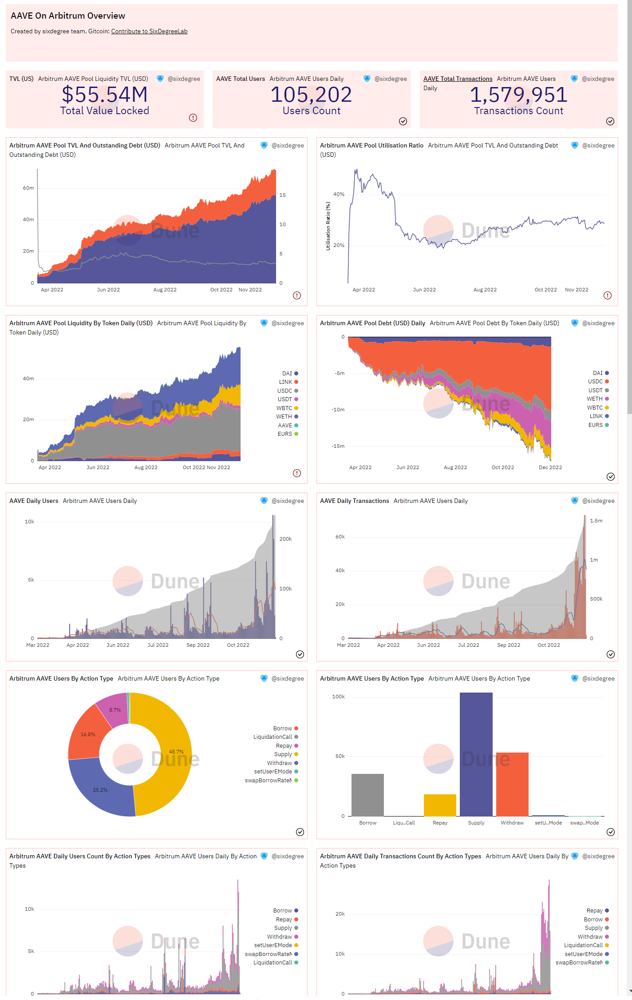
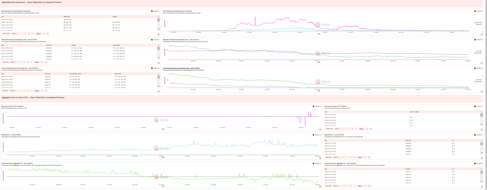

## 13. Анализ кредитования

## Базовые знания

Децентрализованные финансы (DeFi) — это инновация в области финансов на основе блокчейна. Благодаря композируемости и интероперабельности различных протоколов родились так называемые «кирпичики DeFi». В июне 2020 года кредитный протокол DeFi Compound начал майнинг ликвидности, что не только положило начало «DeFi Summer», но и привлекло новые силы, новые идеи и новых пользователей на трек кредитования DeFi, сделав кредитный бизнес одним из трех столпов DeFi.

## Базовые знания

Децентрализованные финансы (DeFi) — это инновация в области финансов на основе блокчейна. Благодаря композируемости и интероперабельности различных протоколов родились так называемые «кирпичики DeFi». В июне 2020 года кредитный протокол DeFi Compound начал майнинг ликвидности, что не только положило начало «DeFi Summer», но и привлекло новые силы, новые идеи и новых пользователей на трек кредитования DeFi, сделав кредитный бизнес одним из трех столпов DeFi.

## Основные принципы работы

Большинство кредитных протоколов используют перестраховку, чтобы избежать риска возникновения плохих долгов.
Но это действительно так? Недавний инцидент с тем, как Эйзенберг сделал короткую позицию по CRV через заем у AAVE V2, привел к возникновению примерно 1,7 миллиона долларов плохих долгов. Основная причина, скорее всего, в том, что позиция этого «кита» была слишком большой, и на рынке не было достаточной ликвидности для ликвидаторов, чтобы выкупить ее.

## Описание процесса

В DEX ликвидность торговой пары ETH/CRV с наибольшей ликвидностью в Uniswap V3 составляла всего 1,76 миллиона долларов, в том числе 1,48 миллиона CRV. Поэтому на рынке не было достаточной ликвидности для ликвидаторов, чтобы выкупить ее и завершить ликвидацию. После каждой ликвидации оставшиеся средства добавляются в залог, что приводит к росту цены ликвидации оставшегося долга. Однако во время процесса ликвидации цена CRV продолжала расти, что в конечном итоге привело к возникновению плохих долгов в Aave.

## В заключение

В настоящее время большинство кредитных протоколов используют перестраховку, и решение о том, проводить ли ликвидацию и в каком объеме, контролируется показателем здоровья при колебаниях цен. Мы обсудили только самый простой и базовый кредитный бизнес. На самом деле, каждый протокол имеет свои особенности. Например, Compound использует децентрализованную модель «peer-to-peer» и модель использования пула ликвидности, которая позволяет использовать средства в пуле с высокой эффективностью; AAVE первым предложил флэш-займы, когда заем + операция + возврат завершаются в одном блоке, и атомарность определяет, что эта транзакция либо полностью успешна, либо полностью провалена; AAVE V3 даже предлагает функцию потока активов между цепочками; а платформы кредитования Euler, Kashi и Rari лучше отвечают потребностям долгосрочных активов за счет безразрешенных пулов кредитования.

Okay, this is a comprehensive outline for analyzing Aave V3 on Arbitrum. You've covered the key areas: TVL, Outstanding Loans, Capital Efficiency, asset composition, user behavior, and basic indicators.  Your use of Dune Analytics queries is a great starting point, and the explanations are clear.  Let's break down this information further and add some extra considerations, potential enhancements, and practical steps.

**1. TVL (Total Value Locked):**

*   **Your Approach:** Excellent use of `daily_liquidity_change`.  This approach gives you a daily snapshot of liquidity.
*   **Enhancements:**
    *   **Gas Costs:** Consider the impact of gas costs on user activity. High gas costs can depress liquidity.  Factor that into your TVL analysis.  You could try to incorporate a gas-adjusted TVL metric, though that's complex.
    *   **Real-Time Monitoring:**  Set up real-time alerts for significant TVL changes.  This helps detect potential issues or opportunities quickly.
    *   **Comparison:**  Compare Aave V3's TVL on Arbitrum to:
        *   Aave V3 on other chains (Ethereum, Polygon, Avalanche) - Provides context and identifies relative performance.
        *   TVL of competing lending protocols on Arbitrum (e.g., Radiant Capital, Camelot) -  Shows Aave’s competitive position.
    *   **Decomposition:**  Break down TVL by asset. Which assets contribute most to TVL?  This helps understand user preferences and potential risks (e.g., concentration of a single asset).
*   **Data Sources:** Dune Analytics (your starting point), Covalent, The Graph.

**2. Outstanding Loans:**

*   **Your Approach:** Using the `borrow` and `repay` events. Accurate but a bit involved.
*   **Enhancements:**
    *   **Net Loan Growth:** Calculate the *growth* in outstanding loans (borrowed - repaid). This is a more informative metric than just the total.
    *   **Loan Distribution by Asset:** Similar to TVL, understand which assets are most frequently borrowed.
    *   **Collateralization Ratio:** Calculate the average collateralization ratio of outstanding loans.  This is a critical metric for risk assessment.  (Loan Amount / Collateral Value).  A lower ratio means higher risk.
    *   **Borrowing APR:** Track the borrowing APRs for different assets. Changes in APRs can influence borrowing demand.
*   **Risk Assessment:** Monitor the ratio of outstanding loans to total collateral. A high ratio indicates a system with higher risk and potential for liquidations.

**3. Capital Efficiency (Utilization Ratio):**

*   **Your Approach:** Correct definition – percentage of deposited assets that are borrowed.
*   **Enhancements:**
    *   **Historical Context:**  Compare current utilization to historical highs and lows. What drove those changes?
    *   **Segmented Utilization:** Analyze utilization *per asset*.  Some assets might be more highly utilized than others.  This can reveal insights into demand and risk.
    *   **Leverage Level:**  Correlate utilization with the average leverage taken by users.  Higher utilization often accompanies higher leverage, which increases risk.
    *   **Impact of Incentives:**  Assess how incentives (e.g., yield farming rewards) affect utilization.
    *   **Dynamic Analysis:** Analyze when the utilization rate is low, and compare with its previous periods.

**4. Detailed Categories (Asset Composition & User Behavior):**

*   **Asset Composition:**  Excellent to see the breakdown (WETH, USDC, WBTC).
*   **User Behavior:** Analyze new depositors vs. returning users, borrowing patterns, liquidation events (frequency, asset involved). Track the *number* of users, not just TVL.
*   **Liquidation Analysis:** Monitor liquidation events. This can point to issues with asset volatility, insufficient collateral, or problems with the liquidation process itself.

**5. Basic Indicators:**

*   **Number of Users:** Distinguish between unique addresses and active users. A large number of unique addresses does not necessarily mean high usage.
*   **Number of Transactions:** Track the average transaction size.
*   **Daily Change:** Critical for understanding trends and reacting to market conditions.
*   **User Retention:** Monitor how long users stay engaged with the protocol. This helps assess long-term sustainability.

**General Considerations & Enhancements:**

*   **Risk Management:** *Always* incorporate risk management into your analysis.  Focus on potential liquidation risks, collateralization ratios, and asset concentration.
*   **Economic Incentives:** Understand how the Aave token (AAVE) and any staking rewards affect the protocol's economics.
*   **Competition:** Continuously monitor competing protocols.
*   **External Factors:**  Consider broader market trends (crypto prices, DeFi adoption) that influence Aave’s performance.
*   **Data Visualization:** Use dashboards (e.g., Grafana, Tableau) to visualize your data. This makes it easier to identify trends and communicate insights.
*   **Automation:** Automate data collection and analysis as much as possible. This frees up your time for more strategic tasks.
*   **Documentation:** Thoroughly document your methodology and assumptions. This ensures reproducibility and allows others to build upon your work.

To help me tailor my advice further, can you tell me:

*   What's the main purpose of this analysis? (e.g., investment decision, research project, protocol monitoring?)
*   What are you already using to collect and visualize data?
*   Are you focusing on any particular aspects (e.g., risk management, investment opportunities)?
## Панель управления кредитованием

1. Комплексная панель управления для AAVE V3 на Arbitrum. 

https://dune.com/sixdegree/aave-on-arbitrum-overview

2. И панель управления, сравнивающая три классических протокола кредитования на Ethereum: Maker, AAVE и Compound. Однако, эта панель управления устарела, использует движок Dune V1. Dune вскоре выведет V1 из эксплуатации и будет использовать только V2 в будущем, поэтому вы можете ссылаться на нее при изучении.

https://dune.com/datanut/Compound-Maker-and-Aave-Deposits-Loans-LTV

