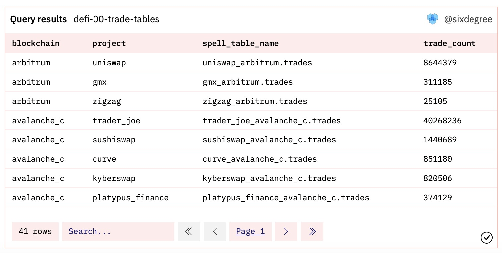

# 14 Анализ DeFi

DeFi относится к децентрализованным финансам, которое должно быть самой активной областью в текущем блокчейне. Когда мы обмениваем один токен ERC20 на другой, мы можем использовать DeFi для облегчения обмена. DEX - это децентрализованная биржа. Uniswap, PancakeSwap, CurveFi и другие являются популярными DEX. В этом уроке мы рассмотрим методы анализа DeFi-проектов, используя данные блокчейна Ethereum в качестве примера.

Панель управления для этого урока, пожалуйста, обратитесь к [Учебнику по анализу DeFi](https://dune.com/sixdegree/defi-analysis-tutorial)<a id="jump_8"></a>.

## DeFi Спеллы

Учитывая важность DeFi в области криптовалют, сообщество Dune создало богатый набор Спеллов для нее. Спеллы, названные `dex.trades`, собирают данные об обменах почти с 30 различных DEX, таких как Uniswap, PancakeSwap, Trader Joe, Velodrome, SushiSwap и т.д. Изучив [определение](https://github.com/duneanalytics/spellbook/blob/main/models/dex/dex_trades.sql)<a id="jump_8"></a> таблицы `dex.trades`, мы можем видеть, что ее данные получены из других Спеллов, таких как `uniswap.trades`, `sushiswap.trades`, `curvefi.trades` и так далее. Если вы анализируете данные для конкретной DEX, рекомендуется в первую очередь использовать Спеллы, специфичные для торговли, для лучшей производительности выполнения запросов. Аналогично, для DeFi-проектов, таких как Uniswap, которые выпустили несколько версий смарт-контрактов (включая обновление версий контрактов в том же блокчейне или развертывание контрактов на разных блокчейнах), таблица `uniswap.trades` также агрегируется из других Спеллов. Если вас интересует только анализ данных из конкретной версии или цепи, вы можете использовать соответствующие Спеллы. Например, если вы анализируете данные об обменах Uniswap V3 на Ethereum, вы можете напрямую использовать таблицу `uniswap_v3_ethereum.trades`. Если вы анализируете данные об обменах CurveFi в цепи Optimism, вы можете использовать Спеллы `curvefi.trades`.

``` sql
select blockchain, 
    project, 
    project || '_' || blockchain || '.trades' as spell_table_name,
    count(*) as trade_count
from dex.trades
group by 1, 2, 3
order by 1 asc, 4 desc
```

Этот запрос перечисляет проекты, соответствующие им блокчейны и имена соответствующих Спеллов в текущей таблице `dex.trades`. В настоящее время связанные Спеллы для агрегации данных в `dex.trades` показаны на следующем изображении:



Ссылка на запрос:

[https://dune.com/queries/17500008](https://dune.com/queries/17500008)<a id="jump_8"></a>

Мы можем использовать `spell_table_name` в качестве имени таблицы для доступа к Спеллам данных о торгах для соответствующего проекта. Например:

``` sql
select * from 
kyberswap_avalanche_c.trades
limit 1
```