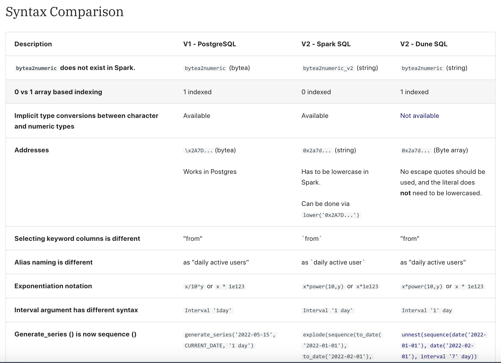
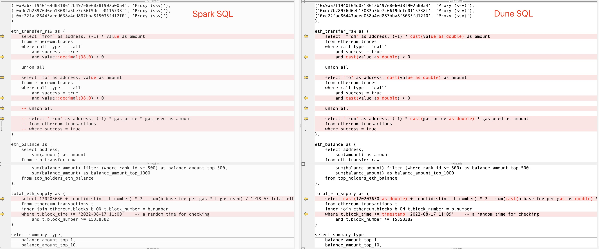

# 2. Введение в DuneSQL

Dune официально запустила свой собственный разработанный движок запросов, Dune SQL, на базе Trino ([https://trino.io/](https://trino.io/)<a id="jump_8"></a>). Эта статья знакомит с некоторыми распространенными синтаксическими конструкциями, соображениями и деталями Dune SQL.

Примечание: как Dune объявила о полном переходе на движок запросов Dune SQL со второй половины 2023 года, этот учебник обновляет все оригинальные запросы до версии Dune SQL.

## Обзор синтаксиса Dune SQL

В синтаксисе Dune SQL следует отметить несколько ключевых моментов:

* Dune SQL использует двойные кавычки для заключения имен полей или имен таблиц, содержащих специальные символы или являющихся ключевыми словами, такие как `"from"` или `"to"`.
* Типом строки в Dune SQL является `varchar`, а распространенными числовыми типами являются `double` и `decimal(38, 0)`.
* Dune SQL не поддерживает неявные преобразования типов. Например, в Dune SQL вы не можете напрямую сравнить `'2022-10-01'` с `block_time`; вам необходимо использовать функции, такие как `date('2022-10-01')`, чтобы явно преобразовать его в дату перед сравнением. Вы не можете напрямую конкатенировать числовые типы и строки; вам необходимо использовать `cast(number_value as varchar)` для преобразования их в строки перед конкатенацией.

Документация Dune предоставляет подробную таблицу сравнения синтаксиса. Вы можете обратиться к [Сравнению синтаксиса](https://dune.com/docs/query/syntax-differences#syntax-comparison)<a id="jump_8"></a> для получения дополнительной информации. Ниже приведено частичное сравнение различий:



Okay, let's analyze the provided text and extract the relevant information on how to adapt your query to use `double` or `decimal` data types, specifically for converting hexadecimal representations of values into usable numeric values within Dune SQL.

**Key Takeaways Regarding Data Type Conversion and Numeric Values in Dune SQL**

1. **`bytearray_to_uint256()` Function:** This is the primary function to use when you need to convert a hexadecimal string (starting with "0x") representing a large unsigned integer into a numeric value suitable for calculations or comparisons.

   ```sql
   select bytearray_to_uint256('0x0000000000000000000000000000000
## Миграция запросов из Spark SQL в Dune SQL - Пример

Это простой процесс для миграции запросов, написанных в существующем движке Spark SQL, в Dune SQL. Вы можете напрямую получить доступ к интерфейсу редактирования запроса и переключиться на "1. v2 Dune SQL" из выпадающего меню слева набора данных. Затем внесите необходимые изменения в содержимое запроса, как описано в предыдущих разделах этой статьи. Вот пример:

Версия Spark SQL: [https://dune.com/queries/1773896](https://dune.com/queries/1773896)<a id="jump_8"></a>
Версия Dune SQL: [https://dune.com/queries/1000162](https://dune.com/queries/1000162)<a id="jump_8"></a>

Вот сравнение изменений во время миграции:



## Другие возможности

Dune SQL также имеет потенциально расширенную функцию, которая позволяет выполнять запросы на основе сохраненного запроса (Query of Query). Эта функция предлагает множество возможностей для упрощения логики запросов и оптимизации использования кеша. Например, можно сохранить базовую часть сложного запроса как отдельный запрос, а затем выполнять дальнейшую агрегацию и анализ на его основе. Однако эта функция может быть нестабильной в некоторых случаях. Тем не менее, вы можете попробовать ее.

``` sql
-- original query: https://dune.com/queries/1752041
select * from query_1752041
where user_status = 'Retained'
```

``` sql
-- original query: https://dune.com/queries/1752041
select * from query_1752041
where user_status = 'Churned'
```
## Ссылки для справки

1. [Различия в синтаксисе и операторах](https://dune.com/docs/query/syntax-differences/#syntax-and-operator-differences)<a id="jump_8"></a>
2. [Функции и операторы Trino](https://trino.io/docs/current/functions.html)<a id="jump_8"></a>

## О нас

`Sixdegree` – это профессиональная команда по анализу данных на блокчейне. Наша миссия – предоставлять пользователям точные графики, аналитику и инсайты на основе данных на блокчейне. Мы стремимся популяризировать анализ данных на блокчейне. Благодаря созданию сообщества, написанию учебных пособий и другим инициативам мы обучаем аналитиков данных на блокчейне, предоставляем ценный аналитический контент, продвигаем сообщество для создания слоя данных для блокчейна и воспитываем таланты для широкого будущего приложений данных для блокчейна. Добро пожаловать на площадку обмена опытом!

- Веб-сайт: [sixdegree.xyz](https://sixdegree.xyz)
- Электронная почта: [contact@sixdegree.xyz](mailto:contact@sixdegree.xyz)
- Twitter: [twitter.com/SixdegreeLab](https://twitter.com/SixdegreeLab)
- Dune: [dune.com/sixdegree](https://dune.com/sixdegree)
- Github: [https://github.com/SixdegreeLab](https://github.com/SixdegreeLab)
