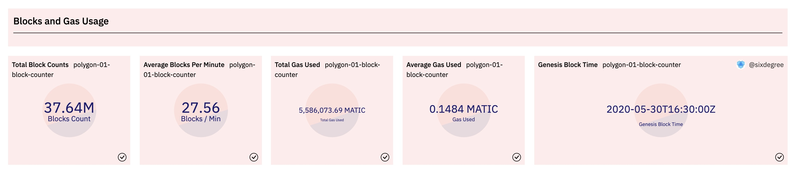
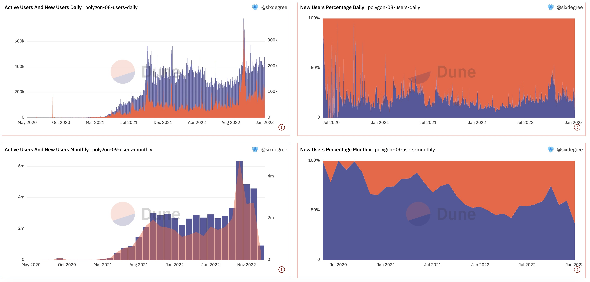

# 16 Анализ блокчейна — Polygon

Платформа Dune стремительно развивается и в настоящее время поддерживает 10 основных блокчейнов, включая Layer 1 публичные сети, такие как Ethereum, BNB, Polygon, Fantom, и Layer 2 блокчейны, такие как Arbitrum и Optimism, предназначенные для расширения Ethereum. В этом уроке мы рассмотрим, как начать анализ обзора блокчейна, взяв в качестве примера блокчейн Polygon.

Девиз Polygon — «Принести Ethereum Всем». Polygon считает, что каждый может использовать Web3. Это децентрализованная платформа масштабирования Ethereum, которая позволяет разработчикам создавать масштабируемые и удобные для пользователя DApps с низкими комиссиями за транзакции, не жертвуя безопасностью.

Панель управления для этого урока: [Обзор сети Polygon](https://dune.com/sixdegree/polygOnchain-overview)<a id="jump_8"></a>

## Содержание анализа обзора блокчейна

Наша цель — всесторонне проанализировать всю сеть Polygon, чтобы понять ее текущий статус развития. Анализ включает в себя:

* **Анализ блоков**: общее количество блоков, количество блоков, добытых в минуту, общее потребление газа, среднее потребление газа, дневная (ежемесячная) тенденция количества генерируемых блоков и т. д.
* **Анализ транзакций и пользователей**: общий объем транзакций, общее количество пользователей, количество транзакций на блок, сравнение успешных и неудачных транзакций, дневная (ежемесячная) тенденция количества транзакций, дневная (ежемесячная) тенденция активных пользователей, дневная (ежемесячная) тенденция новых пользователей, сравнение новых и активных пользователей и т. д.
* **Анализ нативного токена MATIC**: общий объем циркуляции, анализ держателей, крупнейшие держатели, тенденция цены и т. д.
* **Анализ смарт-контрактов**: общее количество развернутых смарт-контрактов, дневная (ежемесячная) тенденция развертывания новых контрактов, сравнение объема транзакций для самых популярных смарт-контрактов и анализ тенденций разработки.

## Анализ количества блоков и потребления газа

### Общее количество блоков и потребление газа

Чтобы понять общее количество блоков и потребление газа в сети Polygon, мы можем написать простой SQL-запрос для получения следующей информации: общее количество блоков, метка времени генезис-блока, среднее количество новых блоков в минуту, общее потребление газа и среднее потребление газа на блок.

``` sql
select count(*) / 1e6 as blocks_count,
   min(time) as min_block_time,
   count(*) / ((to_unixtime(Now()) - to_unixtime(min(time))) / 60) as avg_block_per_minute,
   sum(gas_used * coalesce(base_fee_per_gas, 1)) / 1e18 as total_gas_used,
   avg(gas_used * coalesce(base_fee_per_gas, 1)) / 1e18 as average_gas_used
from polygon.blocks
```

Объяснение SQL:

1. Используя `to_unixtime()`, мы можем преобразовать дату и время в значения Unix Timestamp, что позволяет нам рассчитывать количество секунд между двумя датами и временем. Затем мы можем использовать это для расчета среднего количества новых блоков в минуту. Соответствующая функция — `from_unixtime()`.
2. `gas_used` представляет собой количество потребленного газа, а `base_fee_per_gas` — цена за единицу газа. Умножение их друг на друга дает стоимость газа. Нативный токен Polygon, MATIC, имеет 18 десятичных знаков, поэтому деление на 1e18 дает нам окончательную сумму MATIC.

Результаты этого запроса можно добавить в виде визуализаций типа Counter и включить в панель управления. Отображение выглядит следующим образом:



Ссылка на запрос:[https://dune.com/queries/1835390](https://dune.com/queries/1835390)<a id="jump_8"></a>

### Ежедневная (ежемесячная) тенденция генерации новых блоков и потребление газа

Мы можем агрегировать по дате, чтобы рассчитать ежедневное количество сгенерированных блоков и соответствующее потребление газа. Чтобы отслеживать изменение, мы сначала определяем CTE для выполнения ежедневной статистики данных. Затем, основываясь на этом CTE, мы используем функцию окна, такую как avg`(blocks_count) over (order by rows between 6 preceding and current row)` для расчета 7-дневного скользящего среднего. SQL выглядит следующим образом:

``` sql
with block_daily as (
    select date_trunc('day', time) as block_date,
        count(*) as blocks_count,
        sum(gas_used * coalesce(base_fee_per_gas, 1)) / 1e18 as gas_used
    from polygon.blocks
    group by 1
)

select block_date,
    blocks_count,
    gas_used,
    avg(blocks_count) over (order by block_date rows between 6 preceding and current row) as ma_7_days_blocks_count,
    avg(blocks_count) over (order by block_date rows between 29 preceding and current row) as ma_30_days_blocks_count,
    avg(gas_used) over (order by block_date rows between 6 preceding and current row) as ma_7_days_gas_used
from block_daily
order by block_date
```

Добавьте два Bar Chart для запроса, отображающие "Ежедневное количество блоков, 7-дневное скользящее среднее и 30-дневное скользящее среднее количество блоков" и "Ежедневное потребление газа и 7-дневное скользящее среднее". Добавьте их на панель управления.

Создайте Fork приведенного выше запроса и немного измените его для расчета ежемесячной статистики. Также измените скользящее среднее, чтобы учесть период в 12 месяцев. Это даст нам ежемесячную тенденцию генерации новых блоков.

Визуализации этого запроса будут выглядеть следующим образом:


Ссылки на запросы:
* [https://dune.com/queries/1835421](https://dune.com/queries/1835421)<a id="jump_8"></a>
* [ttps://dune.com/queries/1835445](ttps://dune.com/queries/1835445)<a id="jump_8"></a>

## Анализ транзакций и пользователей
### Общий объем транзакций и количество пользователей

Нам нужно рассчитать общее количество транзакций и общее количество уникальных адресов пользователей. CTE может быть определен для объединения адресов отправителей `from` и адресов получателей `to` с помощью UNION ALL, а затем подсчитать различные адреса. Важно отметить, что в этом анализе мы не исключаем адреса контрактов. Если вы хотите исключить адреса контрактов, вы можете добавить подзапрос для исключения этих адресов, найденных в таблице `polygon.creation_traces`. Учитывая большой объем данных, мы представим значения в миллионах (M). Добавьте визуализацию диаграммы Counter для каждой метрики и включите их в панель управления.

```sql
with transactions_detail as (
    select block_time,
        hash,
        "from" as address
    from polygon.transactions

    union all

    select block_time,
        hash,
        "to" as address
    from polygon.transactions
)

select count(distinct hash) / 1e6 as transactions_count,
    count(distinct address) / 1e6 as users_count
from transactions_detail
```

Ссылка на запрос:
* [https://dune.com/queries/1836022](https://dune.com/queries/1836022)<a id="jump_8"></a>

### Анализ ежедневных (ежемесячных) транзакций и активных пользователей

Аналогично, группируя данные по дате, мы можем генерировать отчеты об общем объеме ежедневных транзакций и количестве активных пользователей. Обобщая данные на ежемесячной основе, мы можем получить ежемесячные сведения. Ниже приведен SQL-запрос для ежедневной агрегации:

```sql
with transactions_detail as (
    select block_time,
        hash,
        "from" as address
    from polygon.transactions

    union all

    select block_time,
        hash,
        "to" as address
    from polygon.transactions
)

select date_trunc('day', block_time) as block_date,
    count(distinct hash) as transactions_count,
    count(distinct address) as users_count
from transactions_detail
group by 1
order by 1
```

Добавьте гистограмму для как для ежедневных, так и для ежемесячных данных о транзакциях, отображающую количество транзакций и количество активных пользователей. Вы можете использовать вторичную ось Y для количества активных пользователей и выбрать либо диаграмму Линии, либо диаграмму Площади. Полученная визуализация на панели управления будет следующей:



Ссылка на запрос:
* [https://dune.com/queries/1836744](https://dune.com/queries/1836744)<a id="jump_8"></a>
* [ttps://dune.com/queries/1836854](https://dune.com/queries/1836854)<a id="jump_8"></a>

### Анализ статистики пользователей
Для этих двух запросов мы можем добавить следующие визуализации:

1. Гистограмма: отображает ежедневное (или ежемесячное) количество активных и новых пользователей. Поскольку доля новых пользователей относительно невелика, установите ее для использования вторичной оси Y.
2. Диаграмма Площади: сравнивает долю новых и существующих пользователей.

Добавление этих визуализаций на панель управления приведет к следующему отображению:


Ссылка на запрос:
* [https://dune.com/queries/1836744](https://dune.com/queries/1836744)<a id="jump_8"></a>
* [ttps://dune.com/queries/1836854](https://dune.com/queries/1836854)<a id="jump_8"></a>