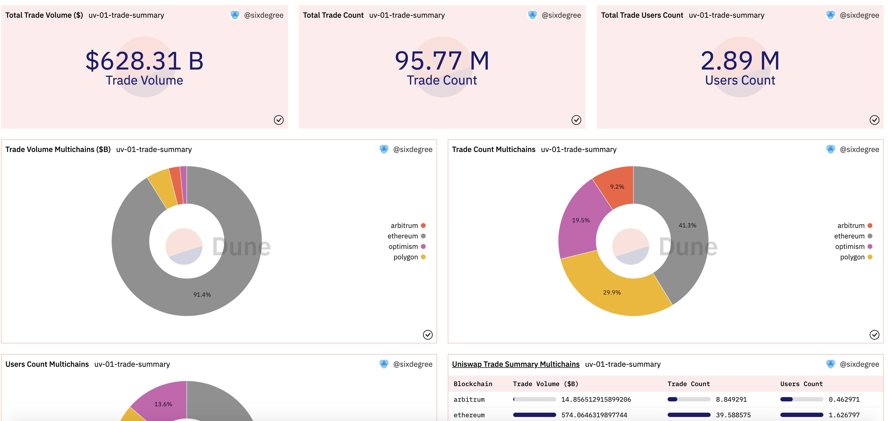
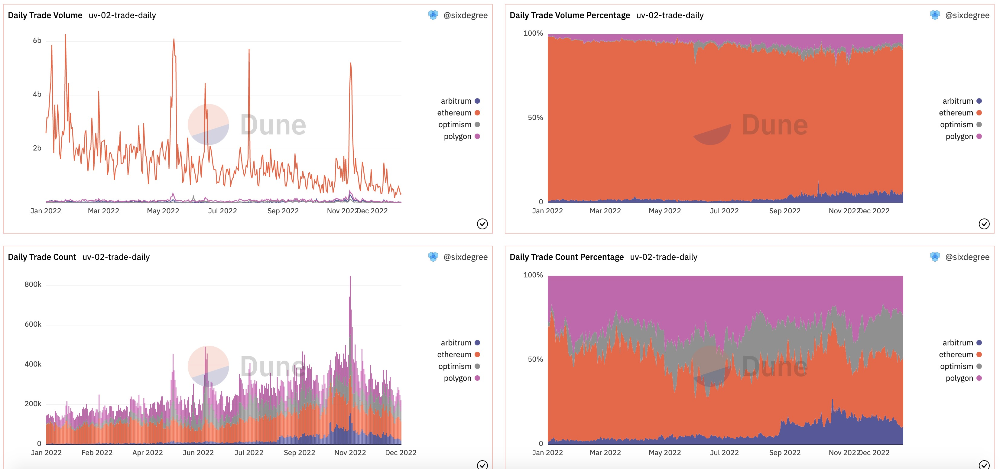
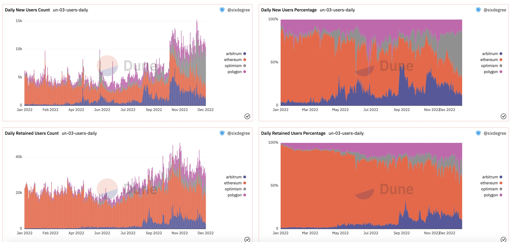
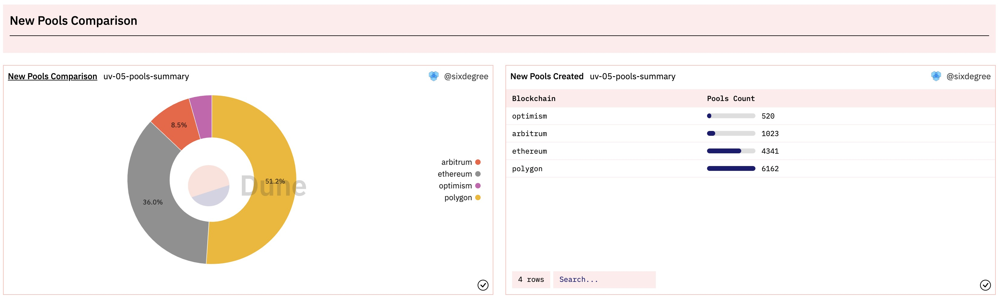

# 18 Анализ Uniswap на нескольких цепочках

Uniswap является одной из ведущих децентрализованных бирж (DEX) в DeFi-пространстве. Умный контракт Uniswap был изначально развернут в блокчейне Ethereum в 2018 году. С тех пор он распространился на другие цепочки, такие как Arbitrum, Optimism, Polygon и Celo в 2021 и 2022 годах. Он продолжает набирать обороты с новым предложением о развертывании на Binance Smart Chain (BNB). В этой статье мы рассмотрим, как анализировать производительность Uniswap на нескольких цепочках в 2022 году. Обратите внимание, что цепочка Celo не включена в этот анализ, поскольку она в настоящее время не поддерживается Dune.

Панель мониторинга для этого учебного пособия: [Производительность Uniswap V3 в 2022 на нескольких цепочках](https://dune.com/sixdegree/uniswap-v3-performance-in-2022-multi-chains)<a id="jump_8"></a>

Все запросы в этом учебном пособии выполняются с помощью Dune SQL.

Интересно, что во время завершения этого учебного пособия Uniswap Foundation запустила новый раунд программы вознаграждений, посвященной анализу производительности Uniswap на нескольких цепочках 25 января 2023 года. Этот учебник надеется предоставить некоторые идеи и представления; участники могут дополнительно расширить эти запросы для участия в программе вознаграждений. Желаем вам удачи в получении щедрых наград. Вы можете найти больше информации о программе Unigrants и [Вознаграждение #21 - Uniswap на нескольких цепочках](https://unigrants.notion.site/Bounty-21-Uniswap-Multichain-b1edc714fe1949779530e920701fd617)<a id="jump_8"></a> здесь.

## Ключевое содержание анализа данных на нескольких цепочках

Как указано в описании активности "Вознаграждение #21 - Uniswap на нескольких цепочках", при анализе DeFi-приложений, таких как Uniswap, наиболее распространенные метрики, которые нам необходимо анализировать, включают объем торгов, стоимость торгов, пользовательскую базу и Общий объем заблокированных средств (TVL). Uniswap развертывает смарт-контракты для многочисленных пулов ликвидности, которые облегчают торговые пары различных токенов. Поставщики ликвидности (LP) вносят средства в эти пулы, чтобы получать вознаграждения за комиссии за транзакции, а другие пользователи могут обменивать свои токены, используя эти пулы ликвидности. Следовательно, более углубленный анализ также может включать метрики, связанные с пулом ликвидности и LP.

В этом учебном пособии мы сосредоточимся в первую очередь на следующих темах:

* Обзор общей торговой активности (количество сделок, объем торгов, количество пользователей, TVL)
* Ежедневное сравнение данных о торговле
* Ежедневное сравнение новых пользователей
* Годовое сравнение создаваемых новых пулов ликвидности
* Ежедневное сравнение новых пулов ликвидности
* Сравнение TVL
* Ежедневный TVL
* Пулы ликвидности с самым высоким TVL

Сообщество Dune создало всесторонний набор данных о торговле под названием "uniswap.trades", который агрегирует данные о транзакциях из смарт-контрактов, связанных с Uniswap, на упомянутых четырех блокчейнах. Большинство наших запросов могут напрямую использовать эту таблицу. Однако в настоящее время нет набора данных о пулах ликвидности, поэтому нам потребуется писать запросы для агрегирования данных из разных блокчейнов для сравнительного анализа.

Важно отметить, что в этом учебном пособии мы в первую очередь фокусируемся на данных за 2022 год. Поэтому в связанных запросах есть условия фильтрации по дате. Если вы хотите проанализировать все исторические данные, просто удалите эти условия.

## Обзор общей торговой активности

Мы можем написать запрос непосредственно к "uniswap.trades" для суммирования общего объема торгов, количества сделок и количества уникальных адресов пользователей.

```sql
select blockchain,
    sum(amount_usd) as trade_amount,
    count(*) as transaction_count,
    count(distinct taker) as user_count
from uniswap.trades
where block_time >= date('2022-01-01')
    and block_time < date('2023-01-01')
group by 1
```

Учитывая, что результирующие данные могут быть довольно большими, мы можем поместить вышеуказанный запрос в CTE (Common Table Expression). При выводе данных из CTE мы можем преобразовать числа в миллионы или миллиарды единиц и удобно агрегировать данные из нескольких цепочек вместе.

Мы добавим 3 графики-счетчика для общего объема торгов, количества сделок и количества пользователей. Кроме того, мы добавим 3 круговых графика для отображения процента объема торгов, количества сделок и количества пользователей для каждой цепочки.  Кроме того, мы включим табличный график для представления подробных чисел. Все эти графики будут добавлены на панель управления, что приведет к следующему отображению:



Ссылка на запрос:
* [https://dune.com/queries/1859214](https://dune.com/queries/1859214)<a id="jump_8"></a>

## Сравнительный анализ ежедневных транзакций

Аналогично, используя таблицу `uniswap.trades magical`, мы можем написать SQL-запрос для расчета ежедневных данных о транзакциях. SQL-запрос выглядит следующим образом:

``` sql
with transaction_summary as (
    select date_trunc('day', block_time) as block_date,
        blockchain,
        sum(amount_usd) as trade_amount,
        count(*) as transaction_count,
        count(distinct taker) as user_count
    from uniswap.trades
    where block_time >= date('2022-01-01')
        and block_time < date('2023-01-01')
    group by 1, 2
)

select block_date,
    blockchain,
    trade_amount,
    transaction_count,
    user_count,
    sum(trade_amount) over (partition by blockchain order by block_date) as accumulate_trade_amount,
    sum(transaction_count) over (partition by blockchain order by block_date) as accumulate_transaction_count,
    sum(user_count) over (partition by blockchain order by block_date) as accumulate_user_count
from transaction_summary
order by 1, 2
```

Здесь мы суммируем все данные о транзакциях за 2022 год на основе даты и блокчейнов. Мы также выводим кумулятивные данные на основе даты. Важно отметить, что кумулятивный подсчет пользователей в этой агрегации не является точным представлением "кумулятивного уникального числа пользователей", поскольку один и тот же пользователь может совершать транзакции в разные даты. Мы объясним, как рассчитать уникальное число пользователей, в последующих запросах.

Поскольку наша цель состоит в том, чтобы анализировать производительность данных на разных цепочках, мы можем сосредоточиться как на конкретных значениях, так и на их пропорциях. Пропорциональный анализ позволяет визуально наблюдать за тенденциями различных цепочек с течением времени. При этом мы генерируем следующие графики: Линейный график для ежедневного объема транзакций, Столбчатая диаграмма для количества ежедневных транзакций/ежедневного уникального числа пользователей, График площади для кумулятивного объема транзакций, а также количества транзакций/уникального числа пользователей и еще один график площади для отображения процентного вклада каждого ежедневного объема транзакций. Получившиеся графики при добавлении на панель управления будут выглядеть следующим образом:



Ссылка на запрос:
* [https://dune.com/queries/1928680](https://dune.com/queries/1928680)<a id="jump_8"></a>

## Ежедневный анализ новых пользователей

Чтобы проанализировать ежедневных новых пользователей и сделать сравнения, нам сначала нужно рассчитать дату первой транзакции для каждого адреса пользователя. Затем мы можем рассчитать количество новых пользователей для каждого дня на основе их дат первой транзакции. В следующем запросе мы используем CTE под названием `user_initial_trade` для расчета даты первой транзакции для каждого адреса пользователя (`taker`) без каких-либо условий фильтрации по дате. Затем, в CTE `new_users_summary`, мы рассчитываем количество новых пользователей для каждого дня в 2022 году. Дополнительно, мы суммируем ежедневных активных пользователей в CTE `active_users_summary`. В окончательном выводе мы вычитаем количество новых пользователей из количества ежедневных активных пользователей, чтобы получить количество удерживаемых пользователей в день. Это позволяет нам создавать визуализации, сравнивающие пропорции новых и удерживаемых пользователей.

``` sql
with user_initial_trade as (
    select blockchain,
        taker,
        min(block_time) as block_time
    from uniswap.trades
    group by 1, 2
),

new_users_summary as (
    select date_trunc('day', block_time) as block_date,
        blockchain,
        count(*) as new_user_count
    from user_initial_trade
    where block_time >= date('2022-01-01')
        and block_time < date('2023-01-01')
    group by 1, 2
),

active_users_summary as (
    select date_trunc('day', block_time) as block_date,
        blockchain,
        count(distinct taker) as active_user_count
    from uniswap.trades
    where block_time >= date('2022-01-01')
        and block_time < date('2023-01-01')
    group by 1, 2
)

select a.block_date,
    a.blockchain,
    a.active_user_count,
    n.new_user_count,
    coalesce(a.active_user_count, 0) - coalesce(n.new_user_count, 0) as retain_user_count,
    sum(new_user_count) over (partition by n.blockchain order by n.block_date) as accumulate_new_user_count
from active_users_summary a
inner join new_users_summary n on a.block_date = n.block_date and a.blockchain = n.blockchain
order by 1, 2
```

Чтобы создать различные визуализации для этих запросов, отображающие ежедневное количество и пропорцию новых пользователей, ежедневное количество и пропорцию удерживаемых пользователей, ежедневное кумулятивное количество новых пользователей и пропорцию новых пользователей для каждой цепи в 2022 году, мы можем создать следующие графики:



Ссылка на запрос:
* [https://dune.com/queries/1928825](https://dune.com/queries/1928825)<a id="jump_8"></a>

В запросах, упомянутых выше, включено сравнение ежедневных новых пользователей и ежедневных удерживаемых пользователей, а также их соответствующие пропорции. Однако, поскольку результаты уже сгруппированы по цепочке, невозможно отобразить как ежедневное количество новых пользователей, так и ежедневное количество удерживаемых пользователей на одном графике. В этом случае мы можем использовать Query of Query в Dune SQL для создания нового запроса с использованием предыдущих запросов в качестве источника данных. Выбрав определенную цепочку из результатов запроса, мы можем отобразить несколько показателей на одном графике, поскольку нам больше не нужно группировать по цепочке.

``` sql
select block_date,
    active_user_count,
    new_user_count,
    retain_user_count
from query_1928825 -- This points to all returned data from query https://dune.com/queries/1928825
where blockchain = 'your_blockchain_name'
```

Ссылка на запрос:
* [https://dune.com/queries/1929142](https://dune.com/queries/1929142)<a id="jump_8"></a>
## Сравнительный анализ годовых новых пулов ликвидности

Текущие Spells в Dune не предоставляют данные о пулах ликвидности, поэтому мы можем написать собственные запросы для агрегирования данных. Мы приветствуем всех, кто готов предоставить PR в репозиторий Spellbook на GitHub Dune, чтобы сгенерировать соответствующие Spells. Используя событие PoolCreated для парсинга данных, мы соберем данные с четырех блокчейнов вместе. Поскольку Uniswap V2 развернут только на цепи Ethereum, он не включен в объем нашего анализа.

```sql
with pool_created_detail as (
    select 'ethereum' as blockchain,
        evt_block_time,
        evt_tx_hash,
        pool,
        token0,
        token1
    from uniswap_v3_ethereum.Factory_evt_PoolCreated

    union all
    
    select 'arbitrum' as blockchain,
        evt_block_time,
        evt_tx_hash,
        pool,
        token0,
        token1
    from uniswap_v3_arbitrum.UniswapV3Factory_evt_PoolCreated

    union all
    
    select 'optimism' as blockchain,
        evt_block_time,
        evt_tx_hash,
        pool,
        token0,
        token1
    from uniswap_v3_optimism.Factory_evt_PoolCreated

    union all
    
    select 'polygon' as blockchain,
        evt_block_time,
        evt_tx_hash,
        pool,
        token0,
        token1
    from uniswap_v3_polygon.factory_polygon_evt_PoolCreated
)

select blockchain,
    count(distinct pool) as pool_count
from pool_created_detail
where evt_block_time >= date('2022-01-01')
    and evt_block_time < date('2023-01-01')
group by 1
```

Мы можем создать круговую диаграмму для сравнения количества и доли недавно созданных пулов ликвидности на каждом блокчейне в 2022 году. Дополнительно мы можем создать таблицу для отображения подробных данных. После добавления этих диаграмм на панель управления отображение будет выглядеть следующим образом:



Ссылка на запрос:
* [https://dune.com/queries/1929177](https://dune.com/queries/1929177)<a id="jump_8"></a>