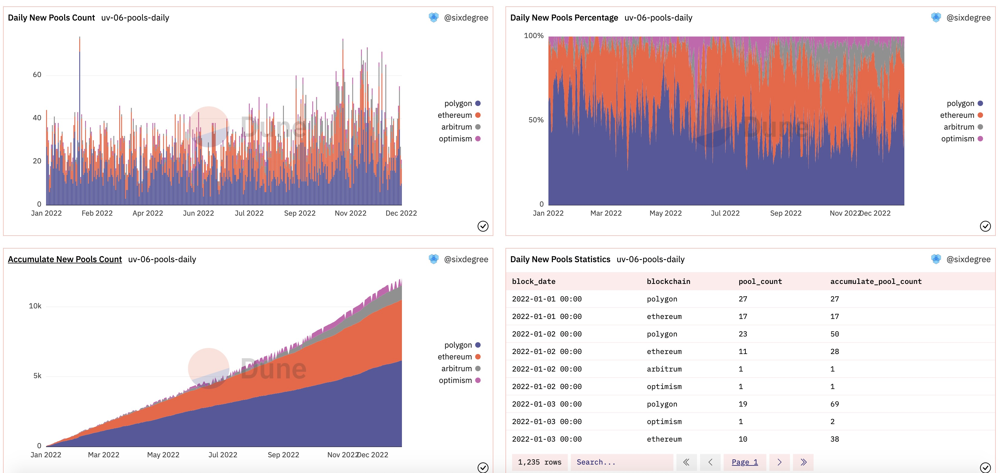
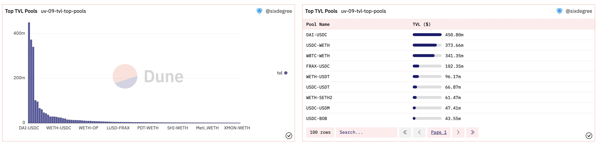

# 18 Анализ Uniswap на нескольких цепочках

Uniswap является одной из ведущих децентрализованных бирж (DEX) в DeFi-пространстве. Умный контракт Uniswap был изначально развернут в блокчейне Ethereum в 2018 году. С тех пор он распространился на другие цепочки, такие как Arbitrum, Optimism, Polygon и Celo в 2021 и 2022 годах. Он продолжает набирать обороты с новым предложением о развертывании на Binance Smart Chain (BNB). В этой статье мы рассмотрим, как анализировать производительность Uniswap на нескольких цепочках в 2022 году. Обратите внимание, что цепочка Celo не включена в этот анализ, поскольку она в настоящее время не поддерживается Dune.

Панель мониторинга для этого учебного пособия: [Производительность Uniswap V3 в 2022 на нескольких цепочках](https://dune.com/sixdegree/uniswap-v3-performance-in-2022-multi-chains)<a id="jump_8"></a>

Все запросы в этом учебном пособии выполняются с помощью Dune SQL.

Интересно, что во время завершения этого учебного пособия Uniswap Foundation запустила новый раунд программы вознаграждений, посвященной анализу производительности Uniswap на нескольких цепочках 25 января 2023 года. Этот учебник надеется предоставить некоторые идеи и представления; участники могут дополнительно расширить эти запросы для участия в программе вознаграждений. Желаем вам удачи в получении щедрых наград. Вы можете найти больше информации о программе Unigrants и [Вознаграждение #21 - Uniswap на нескольких цепочках](https://unigrants.notion.site/Bounty-21-Uniswap-Multichain-b1edc714fe1949779530e920701fd617)<a id="jump_8"></a> здесь.

## Ключевое содержание анализа данных на нескольких цепочках

Как указано в описании активности "Вознаграждение #21 - Uniswap на нескольких цепочках", при анализе DeFi-приложений, таких как Uniswap, наиболее распространенные метрики, которые нам необходимо анализировать, включают объем торгов, стоимость торгов, пользовательскую базу и Общий объем заблокированных средств (TVL). Uniswap развертывает смарт-контракты для многочисленных пулов ликвидности, которые облегчают торговые пары различных токенов. Поставщики ликвидности (LP) вносят средства в эти пулы, чтобы получать вознаграждения за комиссии за транзакции, а другие пользователи могут обменивать свои токены, используя эти пулы ликвидности. Следовательно, более углубленный анализ также может включать метрики, связанные с пулом ликвидности и LP.

В этом учебном пособии мы сосредоточимся в первую очередь на следующих темах:

* Обзор общей торговой активности (количество сделок, объем торгов, количество пользователей, TVL)
* Ежедневное сравнение данных о торговле
* Ежедневное сравнение новых пользователей
* Годовое сравнение создаваемых новых пулов ликвидности
* Ежедневное сравнение новых пулов ликвидности
* Сравнение TVL
* Ежедневный TVL
* Пулы ликвидности с самым высоким TVL

Сообщество Dune создало всесторонний набор данных о торговле под названием "uniswap.trades", который агрегирует данные о транзакциях из смарт-контрактов, связанных с Uniswap, на упомянутых четырех блокчейнах. Большинство наших запросов могут напрямую использовать эту таблицу. Однако в настоящее время нет набора данных о пулах ликвидности, поэтому нам потребуется писать запросы для агрегирования данных из разных блокчейнов для сравнительного анализа.

Важно отметить, что в этом учебном пособии мы в первую очередь фокусируемся на данных за 2022 год. Поэтому в связанных запросах есть условия фильтрации по дате. Если вы хотите проанализировать все исторические данные, просто удалите эти условия.

## Обзор общей торговой активности

Мы можем написать запрос непосредственно к "uniswap.trades" для суммирования общего объема торгов, количества сделок и количества уникальных адресов пользователей.

```sql
select blockchain,
    sum(amount_usd) as trade_amount,
    count(*) as transaction_count,
    count(distinct taker) as user_count
from uniswap.trades
where block_time >= date('2022-01-01')
    and block_time < date('2023-01-01')
group by 1
```

Учитывая, что результирующие данные могут быть довольно большими, мы можем поместить вышеуказанный запрос в CTE (Common Table Expression). При выводе данных из CTE мы можем преобразовать числа в миллионы или миллиарды единиц и удобно агрегировать данные из нескольких цепочек вместе.

Мы добавим 3 графики-счетчика для общего объема торгов, количества сделок и количества пользователей. Кроме того, мы добавим 3 круговых графика для отображения процента объема торгов, количества сделок и количества пользователей для каждой цепочки.  Кроме того, мы включим табличный график для представления подробных чисел. Все эти графики будут добавлены на панель управления, что приведет к следующему отображению:


Ссылка на запрос:
* [https://dune.com/queries/1859214](https://dune.com/queries/1859214)<a id="jump_8"></a>

## Сравнительный анализ ежедневных транзакций

Аналогично, используя таблицу `uniswap.trades magical`, мы можем написать SQL-запрос для расчета ежедневных данных о транзакциях. SQL-запрос выглядит следующим образом:

``` sql
with transaction_summary as (
    select date_trunc('day', block_time) as block_date,
        blockchain,
        sum(amount_usd) as trade_amount,
        count(*) as transaction_count,
        count(distinct taker) as user_count
    from uniswap.trades
    where block_time >= date('2022-01-01')
        and block_time < date('2023-01-01')
    group by 1, 2
)

select block_date,
    blockchain,
    trade_amount,
    transaction_count,
    user_count,
    sum(trade_amount) over (partition by blockchain order by block_date) as accumulate_trade_amount,
    sum(transaction_count) over (partition by blockchain order by block_date) as accumulate_transaction_count,
    sum(user_count) over (partition by blockchain order by block_date) as accumulate_user_count
from transaction_summary
order by 1, 2
```

Здесь мы суммируем все данные о транзакциях за 2022 год на основе даты и блокчейнов. Мы также выводим кумулятивные данные на основе даты. Важно отметить, что кумулятивный подсчет пользователей в этой агрегации не является точным представлением "кумулятивного уникального числа пользователей", поскольку один и тот же пользователь может совершать транзакции в разные даты. Мы объясним, как рассчитать уникальное число пользователей, в последующих запросах.

Поскольку наша цель состоит в том, чтобы анализировать производительность данных на разных цепочках, мы можем сосредоточиться как на конкретных значениях, так и на их пропорциях. Пропорциональный анализ позволяет визуально наблюдать за тенденциями различных цепочек с течением времени. При этом мы генерируем следующие графики: Линейный график для ежедневного объема транзакций, Столбчатая диаграмма для количества ежедневных транзакций/ежедневного уникального числа пользователей, График площади для кумулятивного объема транзакций, а также количества транзакций/уникального числа пользователей и еще один график площади для отображения процентного вклада каждого ежедневного объема транзакций. Получившиеся графики при добавлении на панель управления будут выглядеть следующим образом:


Ссылка на запрос:
* [https://dune.com/queries/1928680](https://dune.com/queries/1928680)<a id="jump_8"></a>

## Ежедневный анализ новых пользователей

Чтобы проанализировать ежедневных новых пользователей и сделать сравнения, нам сначала нужно рассчитать дату первой транзакции для каждого адреса пользователя. Затем мы можем рассчитать количество новых пользователей для каждого дня на основе их дат первой транзакции. В следующем запросе мы используем CTE под названием `user_initial_trade` для расчета даты первой транзакции для каждого адреса пользователя (`taker`) без каких-либо условий фильтрации по дате. Затем, в CTE `new_users_summary`, мы рассчитываем количество новых пользователей для каждого дня в 2022 году. Дополнительно, мы суммируем ежедневных активных пользователей в CTE `active_users_summary`. В окончательном выводе мы вычитаем количество новых пользователей из количества ежедневных активных пользователей, чтобы получить количество удерживаемых пользователей в день. Это позволяет нам создавать визуализации, сравнивающие пропорции новых и удерживаемых пользователей.

``` sql
with user_initial_trade as (
    select blockchain,
        taker,
        min(block_time) as block_time
    from uniswap.trades
    group by 1, 2
),

new_users_summary as (
    select date_trunc('day', block_time) as block_date,
        blockchain,
        count(*) as new_user_count
    from user_initial_trade
    where block_time >= date('2022-01-01')
        and block_time < date('2023-01-01')
    group by 1, 2
),

active_users_summary as (
    select date_trunc('day', block_time) as block_date,
        blockchain,
        count(distinct taker) as active_user_count
    from uniswap.trades
    where block_time >= date('2022-01-01')
        and block_time < date('2023-01-01')
    group by 1, 2
)

select a.block_date,
    a.blockchain,
    a.active_user_count,
    n.new_user_count,
    coalesce(a.active_user_count, 0) - coalesce(n.new_user_count, 0) as retain_user_count,
    sum(new_user_count) over (partition by n.blockchain order by n.block_date) as accumulate_new_user_count
from active_users_summary a
inner join new_users_summary n on a.block_date = n.block_date and a.blockchain = n.blockchain
order by 1, 2
```

Чтобы создать различные визуализации для этих запросов, отображающие ежедневное количество и пропорцию новых пользователей, ежедневное количество и пропорцию удерживаемых пользователей, ежедневное кумулятивное количество новых пользователей и пропорцию новых пользователей для каждой цепи в 2022 году, мы можем создать следующие графики:


Ссылка на запрос:
* [https://dune.com/queries/1928825](https://dune.com/queries/1928825)<a id="jump_8"></a>

В запросах, упомянутых выше, включено сравнение ежедневных новых пользователей и ежедневных удерживаемых пользователей, а также их соответствующие пропорции. Однако, поскольку результаты уже сгруппированы по цепочке, невозможно отобразить как ежедневное количество новых пользователей, так и ежедневное количество удерживаемых пользователей на одном графике. В этом случае мы можем использовать Query of Query в Dune SQL для создания нового запроса с использованием предыдущих запросов в качестве источника данных. Выбрав определенную цепочку из результатов запроса, мы можем отобразить несколько показателей на одном графике, поскольку нам больше не нужно группировать по цепочке.

``` sql
select block_date,
    active_user_count,
    new_user_count,
    retain_user_count
from query_1928825 -- This points to all returned data from query https://dune.com/queries/1928825
where blockchain = 'your_blockchain_name'
```

Ссылка на запрос:
* [https://dune.com/queries/1929142](https://dune.com/queries/1929142)<a id="jump_8"></a>
## Сравнительный анализ годовых новых пулов ликвидности

Текущие Spells в Dune не предоставляют данные о пулах ликвидности, поэтому мы можем написать собственные запросы для агрегирования данных. Мы приветствуем всех, кто готов предоставить PR в репозиторий Spellbook на GitHub Dune, чтобы сгенерировать соответствующие Spells. Используя событие PoolCreated для парсинга данных, мы соберем данные с четырех блокчейнов вместе. Поскольку Uniswap V2 развернут только на цепи Ethereum, он не включен в объем нашего анализа.

```sql
with pool_created_detail as (
    select 'ethereum' as blockchain,
        evt_block_time,
        evt_tx_hash,
        pool,
        token0,
        token1
    from uniswap_v3_ethereum.Factory_evt_PoolCreated

    union all
    
    select 'arbitrum' as blockchain,
        evt_block_time,
        evt_tx_hash,
        pool,
        token0,
        token1
    from uniswap_v3_arbitrum.UniswapV3Factory_evt_PoolCreated

    union all
    
    select 'optimism' as blockchain,
        evt_block_time,
        evt_tx_hash,
        pool,
        token0,
        token1
    from uniswap_v3_optimism.Factory_evt_PoolCreated

    union all
    
    select 'polygon' as blockchain,
        evt_block_time,
        evt_tx_hash,
        pool,
        token0,
        token1
    from uniswap_v3_polygon.factory_polygon_evt_PoolCreated
)

select blockchain,
    count(distinct pool) as pool_count
from pool_created_detail
where evt_block_time >= date('2022-01-01')
    and evt_block_time < date('2023-01-01')
group by 1
```

Мы можем создать круговую диаграмму для сравнения количества и доли недавно созданных пулов ликвидности на каждом блокчейне в 2022 году. Дополнительно мы можем создать таблицу для отображения подробных данных. После добавления этих диаграмм на панель управления отображение будет выглядеть следующим образом:


Ссылка на запрос:
* [https://dune.com/queries/1929177](https://dune.com/queries/1929177)<a id="jump_8"></a>
## Ежедневное сравнение новых пулов ликвидности

Аналогично, добавив дату к условию группировки в запросе, мы можем рассчитать ежедневное количество новых пулов ликвидности в каждой цепочке.

``` sql
with pool_created_detail as (
    -- то же самое, что и предыдущий SQL
),

daily_pool_summary as (
    select date_trunc('day', evt_block_time) as block_date,
        blockchain,
        count(distinct pool) as pool_count
    from pool_created_detail
    group by 1, 2
)

select block_date,
    blockchain,
    pool_count,
    sum(pool_count) over (partition by blockchain order by block_date) as accumulate_pool_count
from daily_pool_summary
where block_date >= date('2022-01-01')
    and block_date < date('2023-01-01')
order by block_date
```

Мы можем сгенерировать столбчатую диаграмму для ежедневного количества новых пулов ликвидности и график площади для отображения ежедневного процентного количества. Кроме того, мы можем создать график площади, чтобы продемонстрировать кумулятивное количество недавно созданных пулов ликвидности. Визуализации можно добавить на панель мониторинга для отображения, как показано на следующем изображении:



Ссылка на запрос:
* [https://dune.com/queries/1929235](https://dune.com/queries/1929235)<a id="jump_8"></a>
Okay, this is a great explanation of the Dune Analytics queries and how they're used to analyze TVL data. Let's break down the analysis and how to improve the presentation and dashboards further.

**Summary of Existing Queries & Analysis**

1. **Current TVL Breakdown (Pie Chart & Counter):**
   - Calculates the current TVL for each blockchain by joining transfer data with token price data.
   - Filters outliers to prevent skewed results (crucial for Optimism data).
   - **Limitations:** Doesn't show *trends*.  It's a snapshot in time.

2. **Daily TVL Change (Area Chart):**
   - Calculates the *change* in TVL each day, not the daily total.
   - Provides a time series showing TVL fluctuations.
   - Filters a timeframe (2022-2023).  This makes sense for an initial analysis but might need to be more flexible.
   - **Important:** The query currently calculates *change*, not a running total.  The "tvl" column in the query effectively shows the cumulative change.

**Improvements and Enhancements**

Here's a breakdown of suggested improvements, categorized by impact and complexity:

**1. Low-Hanging Fruit (Easy to Implement):**

* **Rename the "Daily TVL Change" Chart:** It's misleading.  It shows the *cumulative change*, not a simple daily change.  Consider "Daily Cumulative TVL Change" or "Daily TVL Growth."
* **Dashboard Filters:** Add filters for:
    * **Blockchain:**  Allow users to select specific chains to focus on.
    * **Date Range:**  A date range picker will make the dashboards much more interactive.  This is *essential*.
* **Units/Formatting:**  Explicitly state the units (e.g., USD) in the chart titles and axes labels.
* **Tooltips:** Make sure tooltips on the charts display the precise values and dates.

**2. Medium Complexity - Improving the Core Calculations**

* **Calculate Daily Total TVL:** The biggest improvement is to calculate the *total* TVL at the end of each day, not just the change. This requires a slightly different approach. Here's how to modify the `tvl_daily` CTE in the second query to achieve this:

   ```sql
   with pool_created_detail as (
       -- The SQL here is the same as above
   ),

   token_transfer_detail as (
       -- The SQL here is the same as above
   ),

   token_list as (
       -- The SQL here is the same as above
   ),

   latest_token_price as (
       -- The SQL here is the same as above
   ),

   token_transfer_detail_amount as (
       -- The SQL here is the same as above
   ),

   tvl_daily as (
       SELECT
           date_trunc('day', evt_block_time) as block_date,
           blockchain,
           SUM(amount_usd) AS tvl_change
       FROM
           token_transfer_detail_amount
       WHERE
           abs(amount_usd) < 1e9
       GROUP BY
           1, 2
   ),

   daily_tvl_total as (
       SELECT
           block_date,
           blockchain,
           SUM(tvl_change) OVER (PARTITION BY blockchain ORDER BY block_date) as daily_tvl
       FROM
           tvl_daily
   )

   SELECT *
   FROM daily_tvl_total
   ORDER BY 1,2;
   ```

   * **Explanation:**  We've created a new CTE called `daily_tvl_total`. It uses a window function (`SUM(tvl_change) OVER (PARTITION BY blockchain ORDER BY block_date)`) to calculate the *cumulative* sum of `tvl_change` for each blockchain, ordered by date. This gives you the TVL at the end of each day.

* **Consider Rolling Averages:** Adding a rolling average (e.g., 7-day rolling average) can smooth out daily fluctuations and highlight trends more clearly.  This can be implemented as another window function.

**3. Advanced - Deeper Analysis and Context**

* **Historical TVL:** Display the historical TVL alongside the current TVL.  This allows users to compare current TVL to past performance.
* **Market Context:**  Show how TVL relates to broader market conditions (e.g., cryptocurrency prices, DeFi volume).  Requires bringing in additional data sources.
* **Contribution Breakdown:** Show how different protocols contribute to the TVL on each chain.
* **Comparison Across Chains:** Add a comparison view that allows users to directly compare TVL trends across different blockchains.

**Dashboard Layout Suggestions**

* **Main TVL Overview:**  Pie chart showing current TVL breakdown by chain, alongside a counter showing total TVL. Filters for blockchain and date range.
* **TVL Trend Chart:**  Area chart showing the cumulative TVL over time, with the rolling average overlayed.
* **Protocol Contribution (Table or Bar Chart):** Display the top protocols contributing to TVL on each chain.

**Key Considerations**

* **Data Accuracy:**  The accuracy of your analysis depends on the accuracy of the underlying data.  Be aware of potential data discrepancies.
* **Data Latency:**  Consider the latency of the data.  Real-time dashboards are ideal, but delayed data is often necessary.
* **User Experience:**  Design dashboards that are easy to understand and interact with.  Avoid information overload.


By implementing these improvements, you can create more informative and engaging dashboards for analyzing TVL data.  The most important change is to calculate the *total* daily TVL, not just the change.  Let me know if you're interested in more detailed code examples for any of these suggestions!
## Топ пулов по TVL

Агрегируя TVL (Total Value Locked) по адресу контракта каждого пула Flow, мы можем рассчитать текущий TVL для каждого пула. Однако, если мы хотим более интуитивно сравнить торговые пары, используя символы токенов, мы можем объединить токены.erc20 Spells для генерации торговых пар. В Uniswap, одна и та же торговая пара может иметь несколько ставок сервисного сбора (разные адреса пула), поэтому нам нужно агрегировать их по названию торговой пары. Вот SQL для достижения этого:

``` sql
with pool_created_detail as (
    -- SQL здесь такой же, как выше
),

token_transfer_detail as (
    -- SQL здесь такой же, как выше
),

token_list as (
    -- SQL здесь такой же, как выше
),

latest_token_price as (
    -- SQL здесь такой же, как выше
),

token_transfer_detail_amount as (
    -- SQL здесь такой же, как выше
),

top_tvl_pools as (
    select pool,
        sum(amount_usd) as tvl
    from token_transfer_detail_amount
    where abs(amount_usd) < 1e9 -- Исключить некоторые выбросы из Optimism chain
    group by 1
    order by 2 desc
    limit 200
)

select concat(tk0.symbol, '-', tk1.symbol) as pool_name,
    sum(t.tvl) as tvl
from top_tvl_pools t
inner join pool_created_detail p on t.pool = p.pool
inner join tokens.erc20 as tk0 on p.token0 = tk0.contract_address
inner join tokens.erc20 as tk1 on p.token1 = tk1.contract_address
group by 1
order by 2 desc
limit 100
```

Мы можем сгенерировать столбчатую диаграмму и таблицу для отображения данных для пулов Flow с самым высоким TVL (Total Value Locked).



Ссылка на запрос:
* [https://dune.com/queries/1933442](https://dune.com/queries/1933442)<a id="jump_8"></a>
## О нас

`Sixdegree` – это профессиональная команда по анализу данных в блокчейне. Наша миссия – предоставлять пользователям точные графики, анализ и инсайты на основе данных в блокчейне. Мы стремимся популяризировать анализ данных в блокчейне. Благодаря созданию сообщества, написанию учебных пособий и другим инициативам мы обучаем аналитиков данных в блокчейне, выпускаем ценный аналитический контент, продвигаем сообщество для построения слоя данных блокчейна и воспитываем таланты для широкого будущего приложений данных блокчейна. Добро пожаловать на площадку обмена опытом!

- Веб-сайт: [sixdegree.xyz](https://sixdegree.xyz)
- Email: [contact@sixdegree.xyz](mailto:contact@sixdegree.xyz)
- Twitter: [twitter.com/SixdegreeLab](https://twitter.com/SixdegreeLab)
- Dune: [dune.com/sixdegree](https://dune.com/sixdegree)
- Github: [https://github.com/SixdegreeLab](https://github.com/SixdegreeLab)
