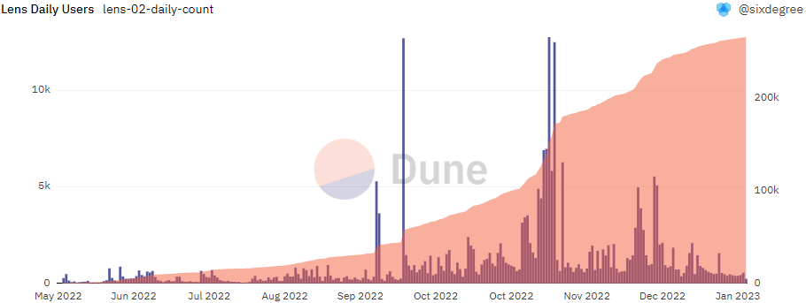
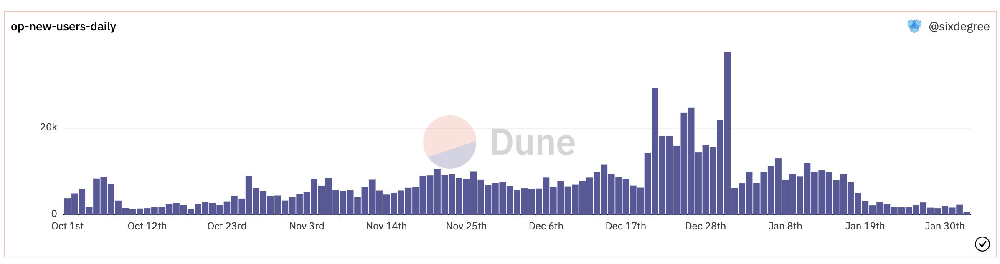

# 19 Полезных Метрик

## Общие сведения

В предыдущих уроках мы много узнали о таблицах данных и операторах SQL. Точное и эффективное извлечение и расчет необходимых данных являются важным навыком для квалифицированного аналитика. В то же время понимание и интерпретация этих показателей данных не менее важны. Только глубокое понимание показателей данных может обеспечить надежную поддержку для нашего принятия решений.

Прежде чем углубиться в конкретные показатели, давайте сначала рассмотрим, зачем нам нужны данные. Простыми словами, показатели — это числовые значения, которые отражают определенные явления, такие как полная цена конкретного NFT или ежедневные активные сделки на DEX. Показатели напрямую отражают состояние изучаемых нами объектов и предоставляют данные для соответствующих решений. Используя наши знания таблиц данных и запросов SQL, мы можем создавать, вызывать и анализировать эти показатели, что делает наши усилия по анализу более эффективными. Без показателей информация, которую мы получаем, будет хаотичной, а получаемые выводы будут ограничены.

В контексте блокчейна, хотя некоторые показатели похожи на те, что используются на финансовых рынках, есть и уникальные показатели, специфичные для пространства блокчейна, такие как Bitcoin Dominance и All Exchanges Inflow Mean-MA7. В этом уроке мы начнем с изучения нескольких распространенных показателей и методов их расчета:

- Общий заблокированный объем (TVL)
- В обращении предложение
- Рыночная капитализация
- Ежедневные/Ежемесячные активные пользователи (DAU/MAU)
- Ежедневные/Ежемесячные новые пользователи
Okay, this is a really detailed explanation of how to calculate TVL (Total Value Locked) on Dune Analytics. Let's break down the key takeaways and how it all fits together.

**1. What is TVL and Why Calculate It?**

*   **Definition:** TVL represents the total value of assets deposited within a DeFi protocol. It's a key metric for assessing the size and importance of a protocol. Higher TVL generally indicates greater user trust and adoption.
*   **Importance:** It's a crucial indicator of a DeFi protocol's health and traction.

**2. Overall Approach & Key Steps**

The overall process for calculating TVL involves these steps:

1.  **Identify Protocols and Assets:**  Determine the protocols you want to analyze and the assets locked within them.
2.  **Extract Transaction Data:**  Gather data about asset movements into and out of the protocol's smart contracts. This is done primarily using the `evt_Transfer` table (and potentially other event logs depending on the protocol).
3.  **Determine Asset Prices:**  Figure out the current USD value of the assets locked.  This can be tricky if a token is new and doesn't have readily available price data, requiring trade data to infer a price.
4.  **Calculate Hourly/Daily Balance Changes:**  Track how the amount of each asset locked in the protocol changes over time.
5.  **Summarize and Display Results:** Aggregate the balance changes to get a time series of TVL.

**3. Detailed Explanation of the Dune Queries**

Let's break down the key parts of the provided queries:

*   **`token_pairs`**: This CTE (Common Table Expression) gets a list of all token pairs used by the protocol. This is the base for tracking asset movements.
*   **`evt_Transfer` & Transaction Details**: This query uses the `evt_Transfer` table to extract details about every transfer of tokens to and from the protocol's smart contracts. It filters and aggregates this data to determine how much of each token is deposited and withdrawn.
*   **`token_price`**: This CTE fetches the current USD price of each token. When the price isn't readily available, it uses trade data to derive the price. This is a crucial step and shows the challenges in retrieving accurate pricing information.
*   **`date_series`**: Generates a series of dates/times. This creates a time-based framework for tracking TVL changes. It starts from a specific date (e.g., April 1, 2023) and iterates through hourly intervals. This time series is used to ensure that TVL is tracked over time.
*   **`pool_balance_change`**: This calculates the *change* in balance of each token for each hour. It sums the `amount_usd` (which is the USD value of the token transferred) to determine how much was added or removed from the pool during that hour.
*   **`pool_balance_summary`**: This CTE is *critical*. It calculates the *cumulative* balance of each token over time.
    *   `SUM(amount) OVER (PARTITION BY symbol ORDER BY block_date)`: This uses a window function to calculate the sum of `amount` (the balance changes) for each token, ordered by `block_date`. This creates a running total of the token's balance.
    *   `LEAD(block_date, 1, current_date) OVER (PARTITION BY symbol ORDER BY block_date)`:  This gets the date of the *next* balance recording for each token.  This is used for joining later.  `current_date` acts as a default if there's no next date.
*   **Final `SELECT` Statement**:
    *   It joins the `date_series` with the `pool_balance_summary` to create a comprehensive time series. The join condition `p.block_date <= d.block_date AND d.block_date < p.next_date` is key, ensuring that you're accurately mapping TVL values to each point in time.  The `< p.next_date` condition is important. It makes sure we're pulling from the previous time period if there's no change *during* the current time period.

**4.  Key Concepts & Considerations**

*   **Query of Queries:** Dune Analytics allows you to reference other queries within your own. This is exemplified by the reference to `query_2337808`.
*   **Window Functions (e.g., `SUM() OVER()`):** These are essential for calculating running totals and cumulative values over time.
*   **`LEAD()` Function:** Very useful for finding the next available data point, vital for time series analysis.
*   **Data Accuracy:** Pricing data is often the biggest challenge. Relying on trade data can introduce inaccuracies, especially for less liquid tokens.
*   **Gas Fees/Transaction Costs:** The provided queries don't directly account for gas fees.  While these fees are relatively small, they are a factor to consider in more precise calculations.
*   **Complexity of DeFi Protocols:** TVL calculation becomes much more complex for protocols with multiple pools, staking mechanisms, and derivatives.

**5.  Example Scenario and Interpretation**

Let's say you're analyzing the TVL of a DEX (Decentralized Exchange).

1.  The queries gather data on every token swap and deposit.
2.  The hourly balance changes show that 1000 ETH were added to the ETH pool, and 500 ETH were withdrawn. The net change is +500 ETH.
3.  The cumulative balance calculations add the +500 ETH change to the running total, giving you a picture of how much ETH is locked in the pool at any given time.

**In summary, this explanation breaks down a highly technical process for calculating TVL on Dune Analytics. Understanding these concepts and queries is valuable for anyone looking to deeply analyze and monitor DeFi protocols.**


I hope this comprehensive explanation is helpful! Do you have any further questions or would like me to elaborate on any specific part?
## Циркулирующее предложение

Циркулирующее предложение представляет собой текущее количество криптовалюты, обращающейся на рынке и находящейся у держателей. Оно отличается от общего предложения (Total Supply), которое включает все выпущенные токены, даже те, которые заблокированы и не могут быть проданы. Поскольку эти заблокированные токены обычно не влияют на цену, циркулирующее предложение является более распространенной метрикой для количества токенов. Метод расчета циркулирующего предложения может различаться в зависимости от криптовалюты. Например, для токенов с линейными графиками выпуска их предложение увеличивается со временем. Токены с дефляционными механизмами сжигания могут потребовать вычета из циркулирующего предложения. Давайте возьмем Bitcoin в качестве примера и рассчитаем его текущее циркулирующее предложение.

Циркулирующее предложение Bitcoin можно рассчитать на основе количества блоков и графика вознаграждения за блок:

``` sql
SELECT SUM(50/POWER(2, ROUND(height/210000))) AS Supply                      
FROM bitcoin.blocks
```
## Рыночная капитализация

Третья метрика, которую мы изучим сегодня, — это рыночная капитализация. Вы, вероятно, знакомы с этой метрикой. На фондовом рынке рыночная капитализация относится к общей стоимости всех находящихся в обращении акций компании на определенный момент времени, которая рассчитывается путем умножения общего количества акций на цену акции. Аналогично, в сфере блокчейна она рассчитывается путем умножения циркулирующего предложения криптовалюты на ее текущую цену. Следовательно, ключ к расчету рыночной капитализации — это получение метрики, которую мы только что изучили — циркулирующее предложение. Как только у нас есть циркулирующее предложение, мы можем умножить его на текущую цену криптовалюты, чтобы получить ее рыночную капитализацию.

Продолжим использовать Bitcoin в качестве примера. Основываясь на ранее рассчитанном циркулирующем предложении, мы можем теперь умножить его на текущую цену Bitcoin, чтобы получить его рыночную капитализацию:

``` sql
SELECT SUM(50/POWER(2, ROUND(height/210000))) AS Supply, 
       SUM(50/POWER(2, ROUND(height/210000)) * p.price) / POWER(10, 9) AS "Market Cap"
FROM bitcoin.blocks
INNER JOIN (
    SELECT price FROM prices.usd_latest
    WHERE symbol='BTC'
        AND contract_address IS NULL
) p ON TRUE
```

Доминирование Bitcoin, о котором мы упоминали ранее, рассчитывается как рыночная капитализация Bitcoin, деленная на сумму рыночных капитализаций всех криптовалют.
## Ежедневные/Ежемесячные Активные Пользователи (DAU/MAU)

Следующая метрика, которую мы изучим, — это Ежедневные/Ежемесячные Активные Пользователи (DAU/MAU). По сравнению с абсолютными объемами торгов, количество активных пользователей лучше отражает популярность протокола. Крупные транзакции от небольшого числа пользователей могут завысить объемы торгов, в то время как количество активных пользователей предоставляет более объективное описание популярности протокола. Расчет относительно прост; нам просто нужно посчитать количество адресов кошельков, которые взаимодействовали с определенным контрактом, а затем рассчитать частоту на день или на месяц.

Возьмем в качестве примера недавний популярный протокол Lens:

```sql
WITH daily_count AS (
    SELECT DATE_TRUNC('day', block_time) AS block_date,
        COUNT(*) AS transaction_count,
        COUNT(DISTINCT "from") AS user_count
    FROM polygon.transactions
    WHERE "to" = 0xdb46d1dc155634fbc732f92e853b10b288ad5a1d   -- LensHub
        AND block_time >= DATE('2022-05-16')  -- дата создания контракта
    GROUP BY 1
    ORDER BY 1
)

SELECT block_date,
    transaction_count,
    user_count,
    SUM(transaction_count) OVER (ORDER BY block_date) AS accumulate_transaction_count,
    SUM(user_count) OVER (ORDER BY block_date) AS accumulate_user_count
FROM daily_count
ORDER BY block_date
```

Мы используем функцию `DISTINCT` чтобы убедиться, что каждый пользователь считается только один раз в день. Помимо расчета количества ежедневных активных пользователей, мы также используем функцию `SUM` `OVER` для расчета совокупного количества пользователей. Если вы хотите рассчитать ежемесячных активных пользователей (MAU), вы можете изменить запрос, используя `DATE_TRUNC('month', block_time)` для группировки счетов по месяцам.



## Ежедневные / Ежемесячные новые пользователи

Помимо отслеживания данных об активных пользователях, количество ежедневных/ежемесячных новых пользователей также является очень распространенной аналитической метрикой. Обычно для получения точных данных о новых пользователях необходимо сначала рассчитать дату и время первой транзакции для каждого адреса пользователя или дату и время первой полученной/отправленной записи о переводе. Затем можно посчитать количество новых пользователей в день или в месяц на основе этой информации. Здесь мы будем использовать запрос для расчета количества ежедневных новых пользователей в сети Optimism в качестве примера.

``` sql
with optimism_new_users as (
    SELECT "from" as address,
        min(block_time) as start_time
    FROM optimism.transactions
    GROUP BY 1
)

SELECT date_trunc('day', start_time) as block_date,
    count(n.address) as new_users_count
FROM optimism_new_users n
WHERE start_time >= date('2022-10-01')
GROUP BY 1
```



Вот практический пример, который объединяет количество новых пользователей со статистикой данных пользователей конкретного NFT-проекта: [Пример](https://dune.com/queries/1334302).
## О нас

`Sixdegree` - это профессиональная команда по анализу данных на блокчейне. Наша миссия – предоставлять пользователям точные графики, аналитику и инсайты на основе данных на блокчейне. Мы стремимся популяризировать анализ данных на блокчейне. Благодаря созданию сообщества и написанию учебных пособий, а также другим инициативам, мы обучаем аналитиков данных на блокчейне, публикуем ценный аналитический контент, продвигаем сообщество для создания слоя данных для блокчейна и готовим кадры для широкого будущего блокчейн-данных. Добро пожаловать на площадку обмена опытом!

- Веб-сайт: [sixdegree.xyz](https://sixdegree.xyz)
- Электронная почта: [contact@sixdegree.xyz](mailto:contact@sixdegree.xyz)
- Twitter: [twitter.com/SixdegreeLab](https://twitter.com/SixdegreeLab)
- Dune: [dune.com/sixdegree](https://dune.com/sixdegree)
- Github: [https://github.com/SixdegreeLab](https://github.com/SixdegreeLab)
