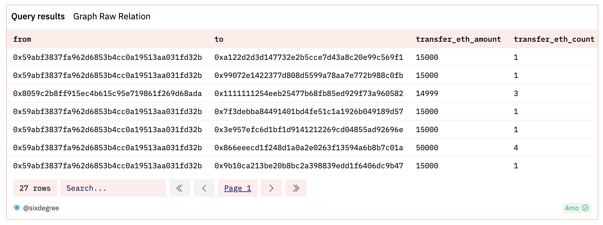
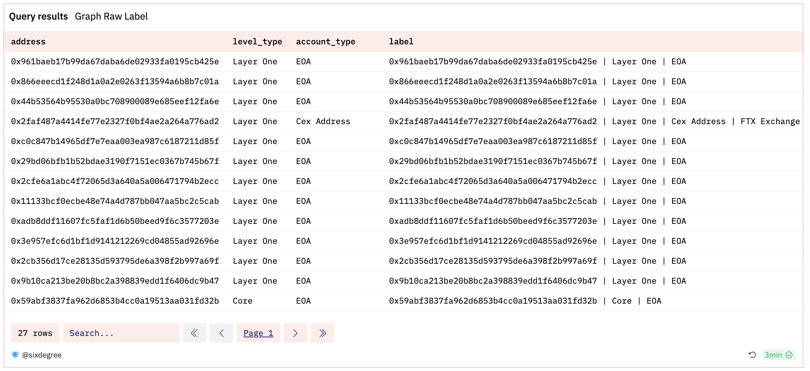

# 20 Анализ сетевой структуры блокчейна

## Предисловие

Все публичные блокчейны по сути являются большими сетями. Анализ данных Onchain, скорее всего, включает в себя сетевой анализ. Существующие визуализации на популярных платформах данных, таких как Dune, испытывают трудности с описанием взаимосвязей между узлами в блокчейнах.

Давайте использовать спорный адрес "хакера" FTX (0x59ABf3837Fa962d6853b4Cc0a19513AA031fd32b) в качестве примера для проведения сетевого анализа (мы не будем обсуждать, является ли это хакером или правительством Панамы). Мы рассмотрим, куда пошел ETH с этого адреса (мы изучим 2-шаговые связи, исходящие от этого адреса).

Инструменты, использованные в процессе:

- Dune: получение необработанных данных между адресами и выполнение первоначальной обработки
- Python
  - Networkx: пакет python для создания, манипулирования и изучения сложных сетей. Позволяет хранить сети в стандартных и нестандартных форматах данных, генерировать различные случайные и классические сети, анализировать структуру сети, строить модели сети, разрабатывать новые сетевые алгоритмы, рисовать сети и т. д.
    - Более подробно: [https://networkx.org/](https://networkx.org/)
  - Plotly: отличный пакет для визуализации, может генерировать интерактивные HTML-файлы. Имеет сопутствующий фронтенд-фреймворк под названием DASH, который очень удобен для аналитиков данных без продвинутых инженерных навыков.
    - Более подробно: [https://plotly.com/](https://plotly.com/)
  - Pandas: наиболее часто используемый пакет Python для работы с данными, предоставляет множество функций и методов для обеспечения быстрой и удобной обработки данных.
    - Более подробно: [https://pandas.pydata.org/](https://pandas.pydata.org/)
- Etherscan API: расчет ETH Balance на Dune слишком трудоемкий, требующий извлечения всех данных каждый раз. Мы можем просто получить Balance из Etherscan API.

## Обзор

Процесс можно в целом разделить на следующие этапы:

- Получение необработанных данных из Dune
- Обработка взаимосвязей между узлами и обработка различных атрибутивных данных, необходимых для построения сетевого графа (pos, label, color, size и т.д.) с помощью Networkx
- Визуализация сетевого графа с помощью Plotly
## Подробный процесс

#### I. Получение необработанных данных из Dune (SQL часть)

SQL довольно сложен, поэтому я не буду вдаваться в детали, поэтому, если интересно, ознакомьтесь с URL для получения подробностей:

- Получение данных с взаимосвязями между всеми соответствующими адресами с помощью SQL: [https://dune.com/queries/1753177](https://dune.com/queries/1753177)

  - from: отправитель транзакции
  - to: получатель транзакции
  - transfer_eth_balance: общий баланс ETH, переданный между двумя
  - transfer_eth_count: общее количество ETH-переводов между двумя учетными записями



- Получение списка всех адресов и связанных с ними меток с помощью SQL: [https://dune.com/queries/2430347](https://dune.com/queries/2430347)

  - address: все адреса, участвующие в этом сетевом анализе
  - level_type: уровень в сети для всех участвующих адресов (Core, Layer One, Layer Two)
  - account_type: является обычной EOA, биржей или смарт-контрактом
  - label: полезная агрегированная информация для адреса в метку для последующей визуализации в python



#### II. Чтение локальных файлов в DataFrames с использованием pandas и дополнение столбцом Balance из API Etherscan

- Загрузка данных Dune локально (либо через API Dune, либо копированием-вставкой) и чтение в pandas из локальных файлов

``` python
    
## Измените путь к своему локальному файлу
df_target_label = pd.read_csv(u'ВАШ ПУТЬ К ФАЙЛУ/graph_raw_label.csv')
df_target_relation = pd.read_csv(u'ВАШ ПУТЬ К ФАЙЛУ/graph_relation.csv')
