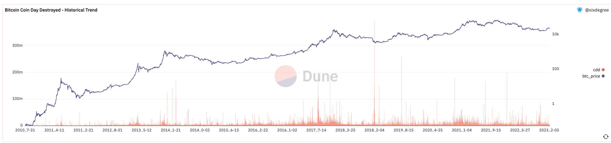

# 21 Анализ Биткойна
## Введение в CDD BTC

### Объяснение индикатора

CDD расшифровывается как Coin Day Destroyed (Уничтоженные Денежные Дни). Это улучшенная версия Объема Транзакций, улучшение направлено на учет времени при оценке ончейн-активности (Переводов). Для токенов, которые находились в статусе HODL (Держись за Жизнь) в течение длительного времени (не переводились на другие кошельки), их движениям присваивается больший вес.

Здесь мы представляем новую концепцию, называемую Coin Day (Денежный День). `Coin Day = Количество Токенов * Количество дней, в течение которых Токен находится в статусе HODL`.

Все BTC ончейн ежедневно накапливает Coin Days. Если часть BTC перемещается (из Кошелька A в Кошелек B), накопленные Coin Days для этой части будут уничтожены, что и называется Coin Day Destroyed.

### Основная логика

Все индикаторы разработаны для лучшего отображения условий, которые мы хотим отразить. В случае этого индикатора он направлен на отражение поведения долгосрочных держателей. С этой точки зрения его можно рассматривать как индикатор типа Smart Money. Люди склонны думать, что долгосрочные держатели являются ранними участниками BTC, и, следовательно, у них лучше и более опытное понимание BTC и рынка. Если их токены (долгосрочный HODL) перемещаются, вполне вероятно, что некоторые изменения на рынке подтолкнули их к действию (во многих случаях это означает перевод на биржу или продажу через OTC, но существуют и другие сценарии, поэтому это нельзя обобщать).

Если вы часто используете Glassnode, вы обнаружите, что многие индикаторы на Glassnode разработаны на основе вышеуказанной логики, что можно считать одной из самых важных базовых логик в текущем анализе ончейн-данных BTC.

### Механизм UTXO

Здесь нам необходимо представить базовые знания о BTC: механизм UTXO. Понимание его поможет вам понять, как использовать несколько таблиц о BTC на Dune для выполнения вышеуказанных вычислений.

UTXO расшифровывается как Unspent Transaction Output (Неиспользованный Выход Транзакции). В текущем механизме работы BTC на самом деле нет понятия Balance (Баланс). Баланс каждого кошелька получается путем суммирования BTC сумм, содержащихся во всех UTXO, принадлежащих кошельку.

Вот ссылка на статью, которая достаточно хорошо это объясняет: https://www.liaoxuefeng.com/wiki/1207298049439968/1207298275932480
