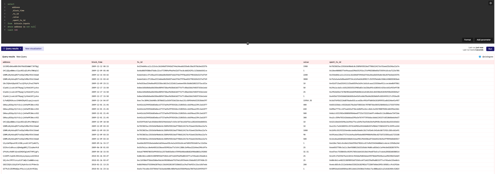
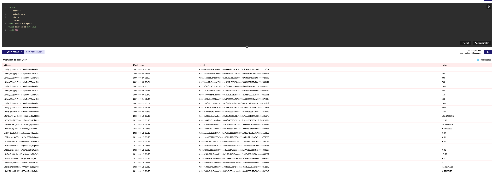

# 21 Анализ Биткойна
## Введение в CDD BTC

### Объяснение индикатора

CDD расшифровывается как Coin Day Destroyed (Уничтоженные Денежные Дни). Это улучшенная версия Объема Транзакций, улучшение направлено на учет времени при оценке ончейн-активности (Переводов). Для токенов, которые находились в статусе HODL (Держись за Жизнь) в течение длительного времени (не переводились на другие кошельки), их движениям присваивается больший вес.

Здесь мы представляем новую концепцию, называемую Coin Day (Денежный День). `Coin Day = Количество Токенов * Количество дней, в течение которых Токен находится в статусе HODL`.

Все BTC ончейн ежедневно накапливает Coin Days. Если часть BTC перемещается (из Кошелька A в Кошелек B), накопленные Coin Days для этой части будут уничтожены, что и называется Coin Day Destroyed.

### Основная логика

Все индикаторы разработаны для лучшего отображения условий, которые мы хотим отразить. В случае этого индикатора он направлен на отражение поведения долгосрочных держателей. С этой точки зрения его можно рассматривать как индикатор типа Smart Money. Люди склонны думать, что долгосрочные держатели являются ранними участниками BTC, и, следовательно, у них лучше и более опытное понимание BTC и рынка. Если их токены (долгосрочный HODL) перемещаются, вполне вероятно, что некоторые изменения на рынке подтолкнули их к действию (во многих случаях это означает перевод на биржу или продажу через OTC, но существуют и другие сценарии, поэтому это нельзя обобщать).

Если вы часто используете Glassnode, вы обнаружите, что многие индикаторы на Glassnode разработаны на основе вышеуказанной логики, что можно считать одной из самых важных базовых логик в текущем анализе ончейн-данных BTC.

### Механизм UTXO

Здесь нам необходимо представить базовые знания о BTC: механизм UTXO. Понимание его поможет вам понять, как использовать несколько таблиц о BTC на Dune для выполнения вышеуказанных вычислений.

UTXO расшифровывается как Unspent Transaction Output (Неиспользованный Выход Транзакции). В текущем механизме работы BTC на самом деле нет понятия Balance (Баланс). Баланс каждого кошелька получается путем суммирования BTC сумм, содержащихся во всех UTXO, принадлежащих кошельку.

Вот ссылка на статью, которая достаточно хорошо это объясняет: https://www.liaoxuefeng.com/wiki/1207298049439968/1207298275932480

## Связанные таблицы в Dune

Если вы примерно понимаете концепции Input, Output и UTXO, вам будет легко понять две таблицы, которые нам нужно использовать на Dune. Вот краткое объяснение таблиц и полей, которые нам нужно использовать.

### bitcoin.inputs

- Описание: содержит все данные, относящиеся к Input, то есть для каждого адреса, каждая трата/перевод BTC.
- Ключевые поля
  - `address`: адрес кошелька
  - `block_time`: время, когда произошла эта транзакция перевода
  - `tx_id`: Tx ID этой транзакции перевода
  - `value`: сумма BTC, включенная в эту транзакцию перевода
  - `spent_tx_id`: output, сгенерировавший этот Input (Какой входящий платеж использовался для этой траты)
    
       

### bitcoin.outputs

- Описание: содержит все данные, относящиеся к Output, то есть для каждого адреса, каждая запись о входящем BTC.
- Ключевые поля
  - `address`: адрес кошелька
  - `block_time`: время, когда произошла эта входящая транзакция
  - `tx_id`: Tx id этой входящей транзакции
  - `value`: сумма BTC, включенная в эту входящую транзакцию
  

## Проектирование и реализация информационных панелей

### Как спроектировать информационную панель
#### Общий подход

Проектирование информационной панели зависит от ее конечной цели. Главная цель информационной панели или данных – содействие принятию решений. Наше мнение заключается в том, что данные помогают принимать решения, отвечая на следующие два вопроса. Только если эти два вопроса могут быть эффективно отвечены, ее можно считать квалифицированной информационной панелью.

`[a].` Что такое XXX? Каковы его характеристики?

Это включает в себя использование ряда показателей для отражения основных характеристик и текущего статуса чего-либо (например, ежедневный объем пользователей, количество транзакций и количество новых контрактов для Ethereum и т. д.).

`[b].` В чем причина изменения некоторых важных показателей, отражающих характеристики XXX?

Когда показатели в `[a]` меняются, мы анализируем причину изменения, или, другими словами, ищем причину колебания данных.

#### Анализ колебаний

`[a]` относительно легко понять, поэтому мы не будем вдаваться в детали. Качество проектирования системы показателей зависит от вашего понимания рассматриваемого объекта. Каждая отрасль или каждое подполе в каждой отрасли на самом деле отличаются.

Мы можем обсудить анализ колебаний. На мой взгляд, анализ колебаний – это декомпозиция. В общем, колебание показателя можно разложить с двух точек зрения. Возьмем, к примеру, ежедневное сжигание ETH. Предположим, что уничтожение ETH увеличилось за один день на 30%, как мы это проанализируем?

**1. Процесс формирования объекта**

`Ежедневное сжигание ETH = Общая комиссия за газ, потребленная сегодня * Коэффициент сжигания`

- `Общая комиссия за газ, потребленная сегодня = Средняя комиссия за газ, потребленная за транзакцию сегодня * Количество транзакций сегодня`
  - `Количество транзакций сегодня = Количество активных пользователей Ethereum сегодня * Среднее количество транзакций, выпущенных активными пользователями Ethereum сегодня`
    - `Количество активных пользователей Ethereum сегодня = Общее количество пользователей Ethereum * Коэффициент активности сегодня`
- `Коэффициент сжигания: Зависит от EIP1559 или наличия новых предложений`    

[Изображение img/ch21_funnel_info.png]    

**2. Характеристики самого объекта**

- Время: различать по часам, чтобы увидеть, в который из 24 часов произошло увеличение потребления комиссии за газ, или было ли это общее увеличение по всем часам.
- Пространство: если удастся получить IP-адрес каждого инициирующего кошелька, можно увидеть, увеличилось ли потребление комиссии за газ в определенной стране значительно (невозможно на практике).
- Другие характеристики: Различать транзакции, направленные на депозиты на биржи, и обычные транзакции. Это позволит определить, какая часть CDD предназначена для продажи.
- Попытайтесь разложить по типу кошелька. Мы можем попытаться рассчитать вероятность падения цены после крупного колебания CDD для каждого кошелька, а затем определить Smart Money. Таким образом, CDD разбивается на Smart Money CDD и Normal CDD.
- Другие характеристики: Различать транзакции, направленные на депозиты на биржи, и обычные транзакции. Это позволит определить, какая часть CDD предназначена для продажи.

- Попытайтесь разложить по типу кошелька. Мы можем попытаться рассчитать вероятность падения цены после крупного колебания CDD для каждого кошелька, а затем определить Smart Money. Таким образом, CDD разбивается на Smart Money CDD и Normal CDD.

- Другие характеристики: Различать транзакции, направленные на депозиты на биржи, и обычные транзакции. Это позволит определить, какая часть CDD предназначена для продажи.

- Попытайтесь разложить по типу кошелька. Мы можем попытаться рассчитать вероятность падения цены после крупного колебания CDD для каждого кошелька, а затем определить Smart Money. Таким образом, CDD разбивается на Smart Money CDD и Normal CDD.

- Другие характеристики: Различать транзакции, направленные на депозиты на биржи, и обычные транзакции. Это позволит определить, какая часть CDD предназначена для продажи.

- Попытайтесь разложить по типу кошелька. Мы можем попытаться рассчитать вероятность падения цены после крупного колебания CDD для каждого кошелька, а затем определить Smart Money. Таким образом, CDD разбивается на Smart Money CDD и Normal CDD.

- Другие характеристики: Различать транзакции, направленные на депозиты на биржи, и обычные транзакции. Это позволит определить, какая часть CDD предназначена для продажи.

- Попытайтесь разложить по типу кошелька. Мы можем попытаться рассчитать вероятность падения цены после крупного колебания CDD для каждого кошелька, а затем определить Smart Money. Таким образом, CDD разбивается на Smart Money CDD и Normal CDD.

- Другие характеристики: Различать транзакции, направленные на депозиты на биржи, и обычные транзакции. Это позволит определить, какая часть CDD предназначена для продажи.

- Попытайтесь разложить по типу кошелька. Мы можем попытаться рассчитать вероятность падения цены после крупного колебания CDD для каждого кошелька, а затем определить Smart Money. Таким образом, CDD разбивается на Smart Money CDD и Normal CDD.

- Другие характеристики: Различать транзакции, направленные на депозиты на биржи, и обычные транзакции. Это позволит определить, какая часть CDD предназначена для продажи.

- Попытайтесь разложить по типу кошелька. Мы можем попытаться рассчитать вероятность падения цены после крупного колебания CDD для каждого кошелька, а затем определить Smart Money. Таким образом, CDD разбивается на Smart Money CDD и Normal CDD.

- Другие характеристики: Различать транзакции, направленные на депозиты на биржи, и обычные транзакции. Это позволит определить, какая часть CDD предназначена для продажи.

- Попытайтесь разложить по типу кошелька. Мы можем попытаться рассчитать вероятность падения цены после крупного колебания CDD для каждого кошелька, а затем определить Smart Money. Таким образом, CDD разбивается на Smart Money CDD и Normal CDD.

- Другие характеристики: Различать транзакции, направленные на депозиты на биржи, и обычные транзакции. Это позволит определить, какая часть CDD предназначена для продажи.

- Попытайтесь разложить по типу кошелька. Мы можем попытаться рассчитать вероятность падения цены после крупного колебания CDD для каждого кошелька, а затем определить Smart Money. Таким образом, CDD разбивается на Smart Money CDD и Normal CDD.

- Другие характеристики: Различать транзакции, направленные на депозиты на биржи, и обычные транзакции. Это позволит определить, какая часть CDD предназначена для продажи.

- Попытайтесь разложить по типу кошелька. Мы можем попытаться рассчитать вероятность падения цены после крупного колебания CDD для каждого кошелька, а затем определить Smart Money. Таким образом, CDD разбивается на Smart Money CDD и Normal CDD.

- Другие характеристики: Различать транзакции, направленные на депозиты на биржи, и обычные транзакции. Это позволит определить, какая часть CDD предназначена для продажи.

- Попытайтесь разложить по типу кошелька. Мы можем попытаться рассчитать вероятность падения цены после крупного колебания CDD для каждого кошелька, а затем определить Smart Money. Таким образом, CDD разбивается на Smart Money CDD и Normal CDD.

- Другие характеристики: Различать транзакции, направленные на депозиты на биржи, и обычные транзакции. Это позволит определить, какая часть CDD предназначена для продажи.

- Попытайтесь разложить по типу кошелька. Мы можем попытаться рассчитать вероятность падения цены после крупного колебания CDD для каждого кошелька, а затем определить Smart Money. Таким образом, CDD разбивается на Smart Money CDD и Normal CDD.

- Другие характеристики: Различать транзакции, направленные на депозиты на биржи, и обычные транзакции. Это позволит определить, какая часть CDD предназначена для продажи.

- Попытайтесь разложить по типу кошелька. Мы можем попытаться рассчитать вероятность падения цены после крупного колебания CDD для каждого кошелька, а затем определить Smart Money. Таким образом, CDD разбивается на Smart Money CDD и Normal CDD.

- Другие характеристики: Различать транзакции, направленные на депозиты на биржи, и обычные транзакции. Это позволит определить, какая часть CDD предназначена для продажи.

- Попытайтесь разложить по типу кошелька. Мы можем попытаться рассчитать вероятность падения цены после крупного колебания CDD для каждого кошелька, а затем определить Smart Money. Таким образом, CDD разбивается на Smart Money CDD и Normal CDD.

- Другие характеристики: Различать транзакции, направленные на депозиты на биржи, и обычные транзакции. Это позволит определить, какая часть CDD предназначена для продажи.

- Попытайтесь разложить по типу кошелька. Мы можем попытаться рассчитать вероятность падения цены после крупного колебания CDD для каждого кошелька, а затем определить Smart Money. Таким образом, CDD разбивается на Smart Money CDD и Normal CDD.

- Другие характеристики: Различать транзакции, направленные на депозиты на биржи, и обычные транзакции. Это позволит определить, какая часть CDD предназначена для продажи.

- Попытайтесь разложить по типу кошелька. Мы можем попытаться рассчитать вероятность падения цены после крупного колебания CDD для каждого кошелька, а затем определить Smart Money. Таким образом, CDD разбивается на Smart Money CDD и Normal CDD.

- Другие характеристики: Различать транзакции, направленные на депозиты на биржи, и обычные транзакции. Это позволит определить, какая часть CDD предназначена для продажи.

- Попытайтесь разложить по типу кошелька. Мы можем попытаться рассчитать вероятность падения цены после крупного колебания CDD для каждого кошелька, а затем определить Smart Money. Таким образом, CDD разбивается на Smart Money CDD и Normal CDD.

- Другие характеристики: Различать транзакции, направленные на депозиты на биржи, и обычные транзакции. Это позволит определить, какая часть CDD предназначена для продажи.

- Попытайтесь разложить по типу кошелька. Мы можем попытаться рассчитать вероятность падения цены после крупного колебания CDD для каждого кошелька, а затем определить Smart Money. Таким образом, CDD разбивается на Smart Money CDD и Normal CDD.

- Другие характеристики: Различать транзакции, направленные на депозиты на биржи, и обычные транзакции. Это позволит определить, какая часть CDD предназначена для продажи.

- Попытайтесь разложить по типу кошелька. Мы можем попытаться рассчитать вероятность падения цены после крупного колебания CDD для каждого кошелька, а затем определить Smart Money. Таким образом, CDD разбивается на Smart Money CDD и Normal CDD.

- Другие характеристики: Различать транзакции, направленные на депозиты на биржи, и обычные транзакции. Это позволит определить, какая часть CDD предназначена для продажи.

- Попытайтесь разложить по типу кошелька. Мы можем попытаться рассчитать вероятность падения цены после крупного колебания CDD для каждого кошелька, а затем определить Smart Money. Таким образом, CDD разбивается на Smart Money CDD и Normal CDD.

- Другие характеристики: Различать транзакции, направленные на депозиты на биржи, и обычные транзакции. Это позволит определить, какая часть CDD предназначена для продажи.

- Попытайтесь разложить по типу кошелька. Мы можем попытаться рассчитать вероятность падения цены после крупного колебания CDD для каждого кошелька, а затем определить Smart Money. Таким образом, CDD разбивается на Smart Money CDD и Normal CDD.

- Другие характеристики: Различать транзакции, направленные на депозиты на биржи, и обычные транзакции. Это позволит определить, какая часть CDD предназначена для продажи.

- Попытайтесь разложить по типу кошелька. Мы можем попытаться рассчитать вероятность падения цены после крупного колебания CDD для каждого кошелька, а затем определить Smart Money. Таким образом, CDD разбивается на Smart Money CDD и Normal CDD.

- Другие характеристики: Различать транзакции, направленные на депозиты на биржи, и обычные транзакции. Это позволит определить, какая часть CDD предназначена для продажи.

- Попытайтесь разложить по типу кошелька. Мы можем попытаться рассчитать вероятность падения цены после крупного колебания CDD для каждого кошелька, а затем определить Smart Money. Таким образом, CDD разбивается на Smart Money CDD и Normal CDD.

- Другие характеристики: Различать транзакции, направленные на депозиты на биржи, и обычные транзакции. Это позволит определить, какая часть CDD предназначена для продажи.

- Попытайтесь разложить по типу кошелька. Мы можем попытаться рассчитать вероятность падения цены после крупного колебания CDD для каждого кошелька, а затем определить Smart Money. Таким образом, CDD разбивается на Smart Money CDD и Normal CDD.

- Другие характеристики: Различать транзакции, направленные на депозиты на биржи, и обычные транзакции. Это позволит определить, какая часть CDD предназначена для продажи.

- Попытайтесь разложить по типу кошелька. Мы можем попытаться рассчитать вероятность падения цены после крупного колебания CDD для каждого кошелька, а затем определить Smart Money. Таким образом, CDD разбивается на Smart Money CDD и Normal CDD.

- Другие характеристики: Различать транзакции, направленные на депозиты на биржи, и обычные транзакции. Это позволит определить, какая часть CDD предназначена для продажи.

- Попытайтесь разложить по типу кошелька. Мы можем попытаться рассчитать вероятность падения цены после крупного колебания CDD для каждого кошелька, а затем определить Smart Money. Таким образом, CDD разбивается на Smart Money CDD и Normal CDD.

- Другие характеристики: Различать транзакции, направленные на депозиты на биржи, и обычные транзакции. Это позволит определить, какая часть CDD предназначена для продажи.

- Попытайтесь разложить по типу кошелька. Мы можем попытаться рассчитать вероятность падения цены после крупного колебания CDD для каждого кошелька, а затем определить Smart Money. Таким образом, CDD разбивается на Smart Money CDD и Normal CDD.

- Другие характеристики: Различать транзакции, направленные на депозиты на биржи, и обычные транзакции. Это позволит определить, какая часть CDD предназначена для продажи.

- Попытайтесь разложить по типу кошелька. Мы можем попытаться рассчитать вероятность падения цены после крупного колебания CDD для каждого кошелька, а затем определить Smart Money. Таким образом, CDD разбивается на Smart Money CDD и Normal CDD.

- Другие характеристики: Различать транзакции, направленные на депозиты на биржи, и обычные транзакции. Это позволит определить, какая часть CDD предназначена для продажи.

- Попытайтесь разложить по типу кошелька. Мы можем попытаться рассчитать вероятность падения цены после крупного колебания CDD для каждого кошелька, а затем определить Smart Money. Таким образом, CDD разбивается на Smart Money CDD и Normal CDD.

- Другие характеристики: Различать транзакции, направленные на депозиты на биржи, и обычные транзакции. Это позволит определить, какая часть CDD предназначена для продажи.

- Попытайтесь разложить по типу кошелька. Мы можем попытаться рассчитать вероятность падения цены после крупного колебания CDD для каждого кошелька, а затем определить Smart Money. Таким образом, CDD разбивается на Smart Money CDD и Normal CDD.

- Другие характеристики: Различать транзакции, направленные на депозиты на биржи, и обычные транзакции. Это позволит определить, какая часть CDD предназначена для продажи.

- Попытайтесь разложить по типу кошелька. Мы можем попытаться рассчитать вероятность падения цены после крупного колебания CDD для каждого кошелька, а затем определить Smart Money. Таким образом, CDD разбивается на Smart Money CDD и Normal CDD.

- Другие характеристики: Различать транзакции, направленные на депозиты на биржи, и обычные транзакции. Это позволит определить, какая часть CDD предназначена для продажи.

- Попытайтесь разложить по типу кошелька. Мы можем попытаться рассчитать вероятность падения цены после крупного колебания CDD для каждого кошелька, а затем определить Smart Money. Таким образом, CDD разбивается на Smart Money CDD и Normal CDD.

- Другие характеристики: Различать транзакции, направленные на депозиты на биржи, и обычные транзакции. Это позволит определить, какая часть CDD предназначена для продажи.

- Попытайтесь разложить по типу кошелька. Мы можем попытаться рассчитать вероятность падения цены после крупного колебания CDD для каждого кошелька, а затем определить Smart Money. Таким образом, CDD разбивается на Smart Money CDD и Normal CDD.

- Другие характеристики: Различать транзакции, направленные на депозиты на биржи, и обычные транзакции. Это позволит определить, какая часть CDD предназначена для продажи.

- Попытайтесь разложить по типу кошелька. Мы можем попытаться рассчитать вероятность падения цены после крупного колебания CDD для каждого кошелька, а затем определить Smart Money. Таким образом, CDD разбивается на Smart Money CDD и Normal CDD.

- Другие характеристики: Различать транзакции, направленные на депозиты на биржи, и обычные транзакции. Это позволит определить, какая часть CDD предназначена для продажи.

- Попытайтесь разложить по типу кошелька. Мы можем попытаться рассчитать вероятность падения цены после крупного колебания CDD для каждого кошелька, а затем определить Smart Money. Таким образом, CDD разбивается на Smart Money CDD и Normal CDD.

- Другие характеристики: Различать транзакции, направленные на депозиты на биржи, и обычные транзакции. Это позволит определить, какая часть CDD предназначена для продажи.

- Попытайтесь разложить по типу кошелька. Мы можем попытаться рассчитать вероятность падения цены после крупного колебания CDD для каждого кошелька, а затем определить Smart Money. Таким образом, CDD разбивается на Smart Money CDD и Normal CDD.

- Другие характеристики: Различать транзакции, направленные на депозиты на биржи, и обычные транзакции. Это позволит определить, какая часть CDD предназначена для продажи.

- Попытайтесь разложить по типу кошелька. Мы можем попытаться рассчитать вероятность падения цены после крупного колебания CDD для каждого кошелька, а затем определить Smart Money. Таким образом, CDD разбивается на Smart Money CDD и Normal CDD.

- Другие характеристики: Различать транзакции, направленные на депозиты на биржи, и обычные транзакции. Это позволит определить, какая часть CDD предназначена для продажи.

- Попытайтесь разложить по типу кошелька. Мы можем попытаться рассчитать вероятность падения цены после крупного колебания CDD для каждого кошелька, а затем определить Smart Money. Таким образом, CDD разбивается на Smart Money CDD и Normal CDD.

- Другие характеристики: Различать транзакции, направленные на депозиты на биржи, и обычные транзакции. Это позволит определить, какая часть CDD предназначена для продажи.

- Попытайтесь разложить по типу кошелька. Мы можем попытаться рассчитать вероятность падения цены после крупного колебания CDD для каждого кошелька, а затем определить Smart Money. Таким образом, CDD разбивается на Smart Money CDD и Normal CDD.

- Другие характеристики: Различать транзакции, направленные на депозиты на биржи, и обычные транзакции. Это позволит определить, какая часть CDD предназначена для продажи.

- Попытайтесь разложить по типу кошелька. Мы можем попытаться рассчитать вероятность падения цены после крупного колебания CDD для каждого кошелька, а затем определить Smart Money. Таким образом, CDD разбивается на Smart Money CDD и Normal CDD.

- Другие характеристики: Различать транзакции, направленные на депозиты на биржи, и обычные транзакции. Это позволит определить, какая часть CDD предназначена для продажи.

- Попытайтесь разложить по типу кошелька. Мы можем попытаться рассчитать вероятность падения цены после крупного колебания CDD для каждого кошелька, а затем определить Smart Money. Таким образом, CDD разбивается на Smart Money CDD и Normal CDD.

- Другие характеристики: Различать транзакции, направленные на депозиты на биржи, и обычные транзакции. Это позволит определить, какая часть CDD предназначена для продажи.

- Попытайтесь разложить по типу кошелька. Мы можем попытаться рассчитать вероятность падения цены после крупного колебания CDD для каждого кошелька, а затем определить Smart Money. Таким образом, CDD разбивается на Smart Money CDD и Normal CDD.

- Другие характеристики: Различать транзакции, направленные на депозиты на биржи, и обычные транзакции. Это позволит определить, какая часть CDD предназначена для продажи.

- Попытайтесь разложить по типу кошелька. Мы можем попытаться рассчитать вероятность падения цены после крупного колебания CDD для каждого кошелька, а затем определить Smart Money. Таким образом, CDD разбивается на Smart Money CDD и Normal CDD.

- Другие характеристики: Различать транзакции, направленные на депозиты на биржи, и обычные транзакции. Это позволит определить, какая часть CDD предназначена для продажи.

- Попытайтесь разложить по типу кошелька. Мы можем попытаться рассчитать вероятность падения цены после крупного колебания CDD для каждого кошелька, а затем определить Smart Money. Таким образом, CDD разбивается на Smart Money CDD и Normal CDD.

- Другие характеристики: Различать транзакции, направленные на депозиты на биржи, и обычные транзакции. Это позволит определить, какая часть CDD предназначена для продажи.

- Попытайтесь разложить по типу кошелька. Мы можем попытаться рассчитать вероятность падения цены после крупного колебания CDD для каждого кошелька, а затем определить Smart Money. Таким образом, CDD разбивается на Smart Money CDD и Normal CDD.

- Другие характеристики: Различать транзакции, направленные на депозиты на биржи, и обычные транзакции. Это позволит определить, какая часть CDD предназначена для продажи.

- Попытайтесь разложить по типу кошелька. Мы можем попытаться рассчитать вероятность падения цены после крупного колебания CDD для каждого кошелька, а затем определить Smart Money. Таким образом, CDD разбивается на Smart Money CDD и Normal CDD.

- Другие характеристики: Различать транзакции, направленные на депозиты на биржи, и обычные транзакции. Это позволит определить, какая часть CDD предназначена для продажи.

- Попытайтесь разложить по типу кошелька. Мы можем попытаться рассчитать вероятность падения цены после крупного колебания CDD для каждого кошелька, а затем определить Smart Money. Таким образом, CDD разбивается на Smart Money CDD и Normal CDD.

- Другие характеристики: Различать транзакции, направленные на депозиты на биржи, и обычные транзакции. Это позволит определить, какая часть CDD предназначена для продажи.

- Попытайтесь разложить по типу кошелька. Мы можем попытаться рассчитать вероятность падения цены после крупного колебания CDD для каждого кошелька, а затем определить Smart Money. Таким образом, CDD разбивается на Smart Money CDD и Normal CDD.

- Другие характеристики: Различать транзакции, направленные на депозиты на биржи, и обычные транзакции. Это позволит определить, какая часть CDD предназначена для продажи.

- Попытайтесь разложить по типу кошелька. Мы можем попытаться рассчитать вероятность падения цены после крупного колебания CDD для каждого кошелька, а затем определить Smart Money. Таким образом, CDD разбивается на Smart Money CDD и Normal CDD.

- Другие характеристики: Различать транзакции, направленные на депозиты на биржи, и обычные транзакции. Это позволит определить, какая часть CDD предназначена для продажи.

- Попытайтесь разложить по типу кошелька. Мы можем попытаться рассчитать вероятность падения цены после крупного колебания CDD для каждого кошелька, а затем определить Smart Money. Таким образом, CDD разбивается на Smart Money CDD и Normal CDD.

- Другие характеристики: Различать транзакции, направленные на депозиты на биржи, и обычные транзакции. Это позволит определить, какая часть CDD предназначена для продажи.

- Попытайтесь разложить по типу кошелька. Мы можем попытаться рассчитать вероятность падения цены после крупного колебания CDD для каждого кошелька, а затем определить Smart Money. Таким образом, CDD разбивается на Smart Money CDD и Normal CDD.

- Другие характеристики: Различать транзакции, направленные на депозиты на биржи, и обычные транзакции. Это позволит определить, какая часть CDD предназначена для продажи.

- Попытайтесь разложить по типу кошелька. Мы можем попытаться рассчитать вероятность падения цены после крупного колебания CDD для каждого кошелька, а затем определить Smart Money. Таким образом, CDD разбивается на Smart Money CDD и Normal CDD.

- Другие характеристики: Различать транзакции, направленные на депозиты на биржи, и обычные транзакции. Это позволит определить, какая часть CDD предназначена для продажи.

- Попытайтесь разложить по типу кошелька. Мы можем попытаться рассчитать вероятность падения цены после крупного колебания CDD для каждого кошелька, а затем определить Smart Money. Таким образом, CDD разбивается на Smart Money CDD и Normal CDD.

- Другие характеристики: Различать транзакции, направленные на депозиты на биржи, и обычные транзакции. Это позволит определить, какая часть CDD предназначена для продажи.

- Попытайтесь разложить по типу кошелька. Мы можем попытаться рассчитать вероятность падения цены после крупного колебания CDD для каждого кошелька, а затем определить Smart Money. Таким образом, CDD разбивается на Smart Money CDD и Normal CDD.

- Другие характеристики: Различать транзакции, направленные на депозиты на биржи, и обычные транзакции. Это позволит определить, какая часть CDD предназначена для продажи.

- Попытайтесь разложить по типу кошелька. Мы можем попытаться рассчитать вероятность падения цены после крупного колебания CDD для каждого кошелька, а затем определить Smart Money. Таким образом, CDD разбивается на Smart Money CDD и Normal CDD.

- Другие характеристики: Различать транзакции, направленные на депозиты на биржи, и обычные транзакции. Это позволит определить, какая часть CDD предназначена для продажи.

- Попытайтесь разложить по типу кошелька. Мы можем попытаться рассчитать вероятность падения цены после крупного колебания CDD для каждого кошелька, а затем определить Smart Money. Таким образом, CDD разбивается на Smart Money CDD и Normal CDD.

- Другие характеристики: Различать транзакции, направленные на депозиты на биржи, и обычные транзакции. Это позволит определить, какая часть CDD предназначена для продажи.

- Попытайтесь разложить по типу кошелька. Мы можем попытаться рассчитать вероятность падения цены после крупного колебания CDD для каждого кошелька, а затем определить Smart Money. Таким образом, CDD разбивается на Smart Money CDD и Normal CDD.

- Другие характеристики: Различать транзакции, направленные на депозиты на биржи, и обычные транзакции. Это позволит определить, какая часть CDD предназначена для продажи.

- Попытайтесь разложить по типу кошелька. Мы можем попытаться рассчитать вероятность падения цены после крупного колебания CDD для каждого кошелька, а затем определить Smart Money. Таким образом, CDD разбивается на Smart Money CDD и Normal CDD.

- Другие характеристики: Различать транзакции, направленные на депозиты на биржи, и обычные транзакции. Это позволит определить, какая часть CDD предназначена для продажи.

- Попытайтесь разложить по типу кошелька. Мы можем попытаться рассчитать вероятность падения цены после крупного колебания CDD для каждого кошелька, а затем определить Smart Money. Таким образом, CDD разбивается на Smart Money CDD и Normal CDD.

- Другие характеристики: Различать транзакции, направленные на депозиты на биржи, и обычные транзакции. Это позволит определить, какая часть CDD предназначена для продажи.

- Попытайтесь разложить по типу кошелька. Мы можем попытаться рассчитать вероятность падения цены после крупного колебания CDD для каждого кошелька, а затем определить Smart Money. Таким образом, CDD разбивается на Smart Money CDD и Normal CDD.

- Другие характеристики: Различать транзакции, направленные на депозиты на биржи, и обычные транзакции. Это позволит определить, какая часть CDD предназначена для продажи.

- Попытайтесь разложить по типу кошелька. Мы можем попытаться рассчитать вероятность падения цены после крупного колебания CDD для каждого кошелька, а затем определить Smart Money. Таким образом, CDD разбивается на Smart Money CDD и Normal CDD.

- Другие характеристики: Различать транзакции, направленные на депозиты на биржи, и обычные транзакции. Это позволит определить, какая часть CDD предназначена для продажи.

- Попытайтесь разложить по типу кошелька. Мы можем попытаться рассчитать вероятность падения цены после крупного колебания CDD для каждого кошелька, а затем определить Smart Money. Таким образом, CDD разбивается на Smart Money CDD и Normal CDD.

- Другие характеристики: Различать транзакции, направленные на депозиты на биржи, и обычные транзакции. Это позволит определить, какая часть CDD предназначена для продажи.

- Попытайтесь разложить по типу кошелька. Мы можем попытаться рассчитать вероятность падения цены после крупного колебания CDD для каждого кошелька, а затем определить Smart Money. Таким образом, CDD разбивается на Smart Money CDD и Normal CDD.

- Другие характеристики: Различать транзакции, направленные на депозиты на биржи, и обычные транзакции. Это позволит определить, какая часть CDD предназначена для продажи.

- Попытайтесь разложить по типу кошелька. Мы можем попытаться рассчитать вероятность падения цены после крупного колебания CDD для каждого кошелька, а затем определить Smart Money. Таким образом, CDD разбивается на Smart Money CDD и Normal CDD.

- Другие характеристики: Различать транзакции, направленные на депозиты на биржи, и обычные транзакции. Это позволит определить, какая часть CDD предназначена для продажи.

- Попытайтесь разложить по типу кошелька. Мы можем попытаться рассчитать вероятность падения цены после крупного колебания CDD для каждого кошелька, а затем определить Smart Money. Таким образом, CDD разбивается на Smart Money CDD и Normal CDD.

- Другие характеристики: Различать транзакции, направленные на депозиты на биржи, и обычные транзакции. Это позволит определить, какая часть CDD предназначена для продажи.

- Попытайтесь разложить по типу кошелька. Мы можем попытаться рассчитать вероятность падения цены после крупного колебания CDD для каждого кошелька, а затем определить Smart Money. Таким образом, CDD разбивается на Smart Money CDD и Normal CDD.

- Другие характеристики: Различать транзакции, направленные на депозиты на биржи, и обычные транзакции. Это позволит определить, какая часть CDD предназначена для продажи.

- Попытайтесь разложить по типу кошелька. Мы можем попытаться рассчитать вероятность падения цены после крупного колебания CDD для каждого кошелька, а затем определить Smart Money. Таким образом, CDD разбивается на Smart Money CDD и Normal CDD.

- Другие характеристики: Различать транзакции, направленные на депозиты на биржи, и обычные транзакции. Это позволит определить, какая часть CDD предназначена для продажи.

- Попытайтесь разложить по типу кошелька. Мы можем попытаться рассчитать вероятность падения цены после крупного колебания CDD для каждого кошелька, а затем определить Smart Money. Таким образом, CDD разбивается на Smart Money CDD и Normal CDD.

- Другие характеристики: Различать транзакции, направленные на депозиты на биржи, и обычные транзакции. Это позволит определить, какая часть CDD предназначена для продажи.

- Попытайтесь разложить по типу кошелька. Мы можем попытаться рассчитать вероятность падения цены после крупного колебания CDD для каждого кошелька, а затем определить Smart Money. Таким образом, CDD разбивается на Smart Money CDD и Normal CDD.

- Другие характеристики: Различать транзакции, направленные на депозиты на биржи, и обычные транзакции. Это позволит определить, какая часть CDD предназначена для продажи.

- Попытайтесь разложить по типу кошелька. Мы можем попытаться рассчитать вероятность падения цены после крупного колебания CDD для каждого кошелька, а затем определить Smart Money. Таким образом, CDD разбивается на Smart Money CDD и Normal CDD.

- Другие характеристики: Различать транзакции, направленные на депозиты на биржи, и обычные транзакции. Это позволит определить, какая часть CDD предназначена для продажи.

- Попытайтесь разложить по типу кошелька. Мы можем попытаться рассчитать вероятность падения цены после крупного колебания CDD для каждого кошелька, а затем определить Smart Money. Таким образом, CDD разбивается на Smart Money CDD и Normal CDD.

- Другие характеристики: Различать транзакции, направленные на депозиты на биржи, и обычные транзакции. Это позволит определить, какая часть CDD предназначена для продажи.

- Попытайтесь разложить по типу кошелька. Мы можем попытаться рассчитать вероятность падения цены после крупного колебания CDD для каждого кошелька, а затем определить Smart Money. Таким образом, CDD разбивается на Smart Money CDD и Normal CDD.

- Другие характеристики: Различать транзакции, направленные на депозиты на биржи, и обычные транзакции. Это позволит определить, какая часть CDD предназначена для продажи.

- Попытайтесь разложить по типу кошелька. Мы можем попытаться рассчитать вероятность падения цены после крупного колебания CDD для каждого кошелька, а затем определить Smart Money. Таким образом, CDD разбивается на Smart Money CDD и Normal CDD.

- Другие характеристики: Различать транзакции, направленные на депозиты на биржи, и обычные транзакции. Это позволит определить, какая часть CDD предназначена для продажи.

- Попытайтесь разложить по типу кошелька. Мы можем попытаться рассчитать вероятность падения цены после крупного колебания CDD для каждого кошелька, а затем определить Smart Money. Таким образом, CDD разбивается на Smart Money CDD и Normal CDD.

- Другие характеристики: Различать транзакции, направленные на депозиты на биржи, и обычные транзакции. Это позволит определить, какая часть CDD предназначена для продажи.

- Попытайтесь разложить по типу кошелька. Мы можем попытаться рассчитать вероятность падения цены после крупного колебания CDD для каждого кошелька, а затем определить Smart Money. Таким образом, CDD разбивается на Smart Money CDD и Normal CDD.

- Другие характеристики: Различать транзакции, направленные на депозиты на биржи, и обычные транзакции. Это позволит определить, какая часть CDD предназначена для продажи.

- Попытайтесь разложить по типу кошелька. Мы можем попытаться рассчитать вероятность падения цены после крупного колебания CDD для каждого кошелька, а затем определить Smart Money. Таким образом, CDD разбивается на Smart Money CDD и Normal CDD.

- Другие характеристики: Различать транзакции, направленные на депозиты на биржи, и обычные транзакции. Это позволит определить, какая часть CDD предназначена для продажи.

- Попытайтесь разложить по типу кошелька. Мы можем попытаться рассчитать вероятность падения цены после крупного колебания CDD для каждого кошелька, а затем определить Smart Money. Таким образом, CDD разбивается на Smart Money CDD и Normal CDD.

- Другие характеристики: Различать транзакции, направленные на депозиты на биржи, и обычные транзакции. Это позволит определить, какая часть CDD предназначена для продажи.

- Попытайтесь разложить по типу кошелька. Мы можем попытаться рассчитать вероятность падения цены после крупного колебания CDD для каждого кошелька, а затем определить Smart Money. Таким образом, CDD разбивается на Smart Money CDD и Normal CDD.

- Другие характеристики: Различать транзакции, направленные на депозиты на биржи, и обычные транзакции. Это позволит определить, какая часть CDD предназначена для продажи.

- Попытайтесь разложить по типу кошелька. Мы можем попытаться рассчитать вероятность падения цены после крупного колебания CDD для каждого кошелька, а затем определить Smart Money. Таким образом, CDD разбивается на Smart Money CDD и Normal CDD.

- Другие характеристики: Различать транзакции, направленные на депозиты на биржи, и обычные транзакции. Это позволит определить, какая часть CDD предназначена для продажи.

- Попытайтесь разложить по типу кошелька. Мы можем попытаться рассчитать вероятность падения цены после крупного колебания CDD для каждого кошелька, а затем определить Smart Money. Таким образом, CDD разбивается на Smart Money CDD и Normal CDD.

- Другие характеристики: Различать транзакции, направленные на депозиты на биржи, и обычные транзакции. Это позволит определить, какая часть CDD предназначена для продажи.

- Попытайтесь разложить по типу кошелька. Мы можем попытаться рассчитать вероятность падения цены после крупного колебания CDD для каждого кошелька, а затем определить Smart Money. Таким образом, CDD разбивается на Smart Money CDD и Normal CDD.

- Другие характеристики: Различать транзакции, направленные на депозиты на биржи, и обычные транзакции. Это позволит определить, какая часть CDD предназначена для продажи.

- Попытайтесь разложить по типу кошелька. Мы можем попытаться рассчитать вероятность падения цены после крупного колебания CDD для каждого кошелька, а затем определить Smart Money. Таким образом, CDD разбивается на Smart Money CDD и Normal CDD.

- Другие характеристики: Различать транзакции, направленные на депозиты на биржи, и обычные транзакции. Это позволит определить, какая часть CDD предназначена для продажи.

- Попытайтесь разложить по типу кошелька. Мы можем попытаться рассчитать вероятность падения цены после крупного колебания CDD для каждого кошелька, а затем определить Smart Money. Таким образом, CDD разбивается на Smart Money CDD и Normal CDD.

- Другие характеристики: Различать транзакции, направленные на депозиты на биржи, и обычные транзакции. Это позволит определить, какая часть CDD предназначена для продажи.

- Попытайтесь разложить по типу кошелька. Мы можем попытаться рассчитать вероятность падения цены после крупного колебания CDD для каждого кошелька, а затем определить Smart Money. Таким образом, CDD разбивается на Smart Money CDD и Normal CDD.

- Другие характеристики: Различать транзакции, направленные на депозиты на биржи, и обычные транзакции. Это позволит определить, какая часть CDD предназначена для продажи.

- Попытайтесь разложить по типу кошелька. Мы можем попытаться рассчитать вероятность падения цены после крупного колебания CDD для каждого кошелька, а затем определить Smart Money. Таким образом, CDD разбивается на Smart Money CDD и Normal CDD.

- Другие характеристики: Различать транзакции, направленные на депозиты на биржи, и обычные транзакции. Это позволит определить, какая часть CDD предназначена для продажи.

- Попытайтесь разложить по типу кошелька. Мы можем попытаться рассчитать вероятность падения цены после крупного колебания CDD для каждого кошелька, а затем определить Smart Money. Таким образом, CDD разбивается на Smart Money CDD и Normal CDD.

- Другие характеристики: Различать транзакции, направленные на депозиты на биржи, и обычные транзакции. Это позволит определить, какая часть CDD предназначена для продажи.

- Попытайтесь разложить по типу кошелька. Мы можем попытаться рассчитать вероятность падения цены после крупного колебания CDD для каждого кошелька, а затем определить Smart Money. Таким образом, CDD разбивается на Smart Money CDD и Normal CDD.

- Другие характеристики: Различать транзакции, направленные на депозиты на биржи, и обычные транзакции. Это позволит определить, какая часть CDD предназначена для продажи.

- Попытайтесь разложить по типу кошелька. Мы можем попытаться рассчитать вероятность падения цены после крупного колебания CDD для каждого кошелька, а затем определить Smart Money. Таким образом, CDD разбивается на Smart Money CDD и Normal CDD.

- Другие характеристики: Различать транзакции, направленные на депозиты на биржи, и обычные транзакции. Это позволит определить, какая часть CDD предназначена для продажи.

- Попытайтесь разложить по типу кошелька. Мы можем попытаться рассчитать вероятность падения цены после крупного колебания CDD для каждого кошелька, а затем определить Smart Money. Таким образом, CDD разбивается на Smart Money CDD и Normal CDD.

- Другие характеристики: Различать транзакции, направленные на депозиты на биржи, и обычные транзакции. Это позволит определить, какая часть CDD предназначена для продажи.

- Попытайтесь разложить по типу кошелька. Мы можем попытаться рассчитать вероятность падения цены после крупного колебания CDD для каждого кошелька, а затем определить Smart Money. Таким образом, CDD разбивается на Smart Money CDD и Normal CDD.

- Другие характеристики: Различать транзакции, направленные на депозиты на биржи, и обычные транзакции. Это позволит определить, какая часть CDD предназначена для продажи.

- Попытайтесь разложить по типу кошелька. Мы можем попытаться рассчитать вероятность падения цены после крупного колебания CDD для каждого кошелька, а затем определить Smart Money. Таким образом, CDD разбивается на Smart Money CDD и Normal CDD.

- Другие характеристики: Различать транзакции, направленные на депозиты на биржи, и обычные транзакции. Это позволит определить, какая часть CDD предназначена для продажи.

- Попытайтесь разложить по типу кошелька. Мы можем попытаться рассчитать вероятность падения цены после крупного колебания CDD для каждого кошелька, а затем определить Smart Money. Таким образом, CDD разбивается на Smart Money CDD и Normal CDD.

- Другие характеристики: Различать транзакции, направленные на депозиты на биржи, и обычные транзакции. Это позволит определить, какая часть CDD предназначена для продажи.

- Попытайтесь разложить по типу кошелька. Мы можем попытаться рассчитать вероятность падения цены после крупного колебания CDD для каждого кошелька, а затем определить Smart Money. Таким образом, CDD разбивается на Smart Money CDD и Normal CDD.

- Другие характеристики: Различать транзакции, направленные на депозиты на биржи, и обычные транзакции. Это позволит определить, какая часть CDD предназначена для продажи.

- Попытайтесь разложить по типу кошелька. Мы можем попытаться рассчитать вероятность падения цены после крупного колебания CDD для каждого кошелька, а затем определить Smart Money. Таким образом, CDD разбивается на Smart Money CDD и Normal CDD.

- Другие характеристики: Различать транзакции, направленные на депозиты на биржи, и обычные транзакции. Это позволит определить, какая часть CDD предназначена для продажи.

- Попытайтесь разложить по типу кошелька. Мы можем попытаться рассчитать вероятность падения цены после крупного колебания CDD для каждого кошелька, а затем определить Smart Money. Таким образом, CDD разбивается на Smart Money CDD и Normal CDD.

- Другие характеристики: Различать транзакции, направленные на депозиты на биржи, и обычные транзакции. Это позволит определить, какая часть CDD предназначена для продажи.

- Попытайтесь разложить по типу кошелька. Мы можем попытаться рассчитать вероятность падения цены после крупного колебания CDD для каждого кошелька, а затем определить Smart Money. Таким образом, CDD разбивается на Smart Money CDD и Normal CDD.

- Другие характеристики: Различать транзакции, направленные на депозиты на биржи, и обычные транзакции. Это позволит определить, какая часть CDD предназначена для продажи.

- Попытайтесь разложить по типу кошелька. Мы можем попытаться рассчитать вероятность падения цены после крупного колебания CDD для каждого кошелька, а затем определить Smart Money. Таким образом, CDD разбивается на Smart Money CDD и Normal CDD.

- Другие характеристики: Различать транзакции, направленные на депозиты на биржи, и обычные транзакции. Это позволит определить, какая часть CDD предназначена для продажи.

- Попытайтесь разложить по типу кошелька. Мы можем попытаться рассчитать вероятность падения цены после крупного колебания CDD для каждого кошелька, а затем определить Smart Money. Таким образом, CDD разбивается на Smart Money CDD и Normal CDD.

- Другие характеристики: Различать транзакции, направленные на депозиты на биржи, и обычные транзакции. Это позволит определить, какая часть CDD предназначена для продажи.

- Попытайтесь разложить по типу кошелька. Мы можем попытаться рассчитать вероятность падения цены после крупного колебания CDD для каждого кошелька, а затем определить Smart Money. Таким образом, CDD разбивается на Smart Money CDD и Normal CDD.

- Другие характеристики: Различать транзакции, направленные на депозиты на биржи, и обычные транзакции. Это позволит определить, какая часть CDD предназначена для продажи.

- Попытайтесь разложить по типу кошелька. Мы можем попытаться рассчитать вероятность падения цены после крупного колебания CDD для каждого кошелька, а затем определить Smart Money. Таким образом, CDD разбивается на Smart Money CDD и Normal CDD.

- Другие характеристики: Различать транзакции, направленные на депозиты на биржи, и обычные транзакции. Это позволит определить, какая часть CDD предназначена для продажи.

- Попытайтесь разложить по типу кошелька. Мы можем попытаться рассчитать вероятность падения цены после крупного колебания CDD для каждого кошелька, а затем определить Smart Money. Таким образом, CDD разбивается на Smart Money CDD и Normal CDD.

- Другие характеристики: Различать транзакции, направленные на депозиты на биржи, и обычные транзакции. Это позволит определить, какая часть CDD предназначена для продажи.

- Попытайтесь разложить по типу кошелька. Мы можем попытаться рассчитать вероятность падения цены после крупного колебания CDD для каждого кошелька, а затем определить Smart Money. Таким образом, CDD разбивается на Smart Money CDD и Normal CDD.

- Другие характеристики: Различать транзакции, направленные на депозиты на биржи, и обычные транзакции. Это позволит определить, какая часть CDD предназначена для продажи.

- Попытайтесь разложить по типу кошелька. Мы можем попытаться рассчитать вероятность падения цены после крупного колебания CDD для каждого кошелька, а затем определить Smart Money. Таким образом, CDD разбивается на Smart Money CDD и Normal CDD.

- Другие характеристики: Различать транзакции, направленные на депозиты на биржи, и обычные транзакции. Это позволит определить, какая часть CDD предназначена для продажи.

- Попытайтесь разложить по типу кошелька. Мы можем попытаться рассчитать вероятность падения цены после крупного колебания CDD для каждого кошелька, а затем определить Smart Money. Таким образом, CDD разбивается на Smart Money CDD и Normal CDD.

- Другие характеристики: Различать транзакции, направленные на депозиты на биржи, и обычные транзакции. Это позволит определить, какая часть CDD предназначена для продажи.

- Попытайтесь разложить по типу кошелька. Мы можем попытаться рассчитать вероятность падения цены после крупного колебания CDD для каждого кошелька, а затем определить Smart Money. Таким образом, CDD разбивается на Smart Money CDD и Normal CDD.

- Другие характеристики: Различать транзакции, направленные на депозиты на биржи, и обычные транзакции. Это позволит определить, какая часть CDD предназначена для продажи.

- Попытайтесь разложить по типу кошелька. Мы можем попытаться рассчитать вероятность падения цены после крупного колебания CDD для каждого кошелька, а затем определить Smart Money. Таким образом, CDD разбивается на Smart Money CDD и Normal CDD.

- Другие характеристики: Различать транзакции, направленные на депозиты на биржи, и обычные транзакции. Это позволит определить, какая часть CDD предназначена для продажи.

- Попытайтесь разложить по типу кошелька. Мы можем попытаться рассчитать вероятность падения цены после крупного колебания CDD для каждого кошелька, а затем определить Smart Money. Таким образом, CDD разбивается на Smart Money CDD и Normal CDD.

- Другие характеристики: Различать транзакции, направленные на депозиты на биржи, и обычные транзакции. Это позволит определить, какая часть CDD предназначена для продажи.

- Попытайтесь разложить по типу кошелька. Мы можем попытаться рассчитать вероятность падения цены после крупного колебания CDD для каждого кошелька, а затем определить Smart Money. Таким образом, CDD разбивается на Smart Money CDD и Normal CDD.

- Другие характеристики: Различать транзакции, направленные на депозиты на биржи, и обычные транзакции. Это позволит определить, какая часть CDD предназначена для продажи.

- Попытайтесь разложить по типу кошелька. Мы можем попытаться рассчитать вероятность падения цены после крупного колебания CDD для каждого кошелька, а затем определить Smart Money. Таким образом, CDD разбивается на Smart Money CDD и Normal CDD.

- Другие характеристики: Различать транзакции, направленные на депозиты на биржи, и обычные транзакции. Это позволит определить, какая часть CDD предназначена для продажи.

- Попытайтесь разложить по типу кошелька. Мы можем попытаться рассчитать вероятность падения цены после крупного колебания CDD для каждого кошелька, а затем определить Smart Money. Таким образом, CDD разбивается на Smart Money CDD и Normal CDD.

- Другие характеристики: Различать транзакции, направленные на депозиты на биржи, и обычные транзакции. Это позволит определить, какая часть CDD предназначена для продажи.

- Попытайтесь разложить по типу кошелька. Мы можем попытаться рассчитать вероятность падения цены после крупного колебания CDD для каждого кошелька, а затем определить Smart Money. Таким образом, CDD разбивается на Smart Money CDD и Normal CDD.

- Другие характеристики: Различать транзакции, направленные на депозиты на биржи, и обычные транзакции. Это позволит определить, какая часть CDD предназначена для продажи.

- Попытайтесь разложить по типу кошелька. Мы можем попытаться рассчитать вероятность падения цены после крупного колебания CDD для каждого кошелька, а затем определить Smart Money. Таким образом, CDD разбивается на Smart Money CDD и Normal CDD.

- Другие характеристики: Различать транзакции, направленные на депозиты на биржи, и обычные транзакции. Это позволит определить, какая часть CDD предназначена для продажи.

- Попытайтесь разложить по типу кошелька. Мы можем попытаться рассчитать вероятность падения цены после крупного колебания CDD для каждого кошелька, а затем определить Smart Money. Таким образом, CDD разбивается на Smart Money CDD и Normal CDD.

- Другие характеристики: Различать транзакции, направленные на депозиты на биржи, и обычные транзакции. Это позволит определить, какая часть CDD предназначена для продажи.

- Попытайтесь разложить по типу кошелька. Мы можем попытаться рассчитать вероятность падения цены после крупного колебания CDD для каждого кошелька, а затем определить Smart Money. Таким образом, CDD разбивается на Smart Money CDD и Normal CDD.

- Другие характеристики: Различать транзакции, направленные на депозиты на биржи, и обычные транзакции. Это позволит определить, какая часть CDD предназначена для продажи.

- Попытайтесь разложить по типу кошелька. Мы можем попытаться рассчитать вероятность падения цены после крупного колебания CDD для каждого кошелька, а затем определить Smart Money. Таким образом, CDD разбивается на Smart Money CDD и Normal CDD.

- Другие характеристики: Различать транзакции, направленные на депозиты на биржи, и обычные транзакции. Это позволит определить, какая часть CDD предназначена для продажи.

- Попытайтесь разложить по типу кошелька. Мы можем попытаться рассчитать вероятность падения цены после крупного колебания CDD для каждого кошелька, а затем определить Smart Money. Таким образом, CDD разбивается на Smart Money CDD и Normal CDD.

- Другие характеристики: Различать транзакции, направленные на депозиты на биржи, и обычные транзакции. Это позволит определить, какая часть CDD предназначена для продажи.

- Попытайтесь разложить по типу кошелька. Мы можем попытаться рассчитать вероятность падения цены после крупного колебания CDD для каждого кошелька, а затем определить Smart Money. Таким образом, CDD разбивается на Smart Money CDD и Normal CDD.

- Другие характеристики: Различать транзакции, направленные на депозиты на биржи, и обычные транзакции. Это позволит определить, какая часть CDD предназначена для продажи.

- Попытайтесь разложить по типу кошелька. Мы можем попытаться рассчитать вероятность падения цены после крупного колебания CDD для каждого кошелька, а затем определить Smart Money. Таким образом, CDD разбивается на Smart Money CDD и Normal CDD.

- Другие характеристики: Различать транзакции, направленные на депозиты на биржи, и обычные транзакции. Это позволит определить, какая часть CDD предназначена для продажи.

- Попытайтесь разложить по типу кошелька. Мы можем попытаться рассчитать вероятность падения цены после крупного колебания CDD для каждого кошелька, а затем определить Smart Money. Таким образом, CDD разбивается на Smart Money CDD и Normal CDD.

- Другие характеристики: Различать транзакции, направленные на депозиты на биржи, и обычные транзакции. Это позволит определить, какая часть CDD предназначена для продажи.

- Попытайтесь разложить по типу кошелька. Мы можем попытаться рассчитать вероятность падения цены после крупного колебания CDD для каждого кошелька, а затем определить Smart Money. Таким образом, CDD разбивается на Smart Money CDD и Normal CDD.

- Другие характеристики: Различать транзакции, направленные на депозиты на биржи, и обычные транзакции. Это позволит определить, какая часть CDD предназначена для продажи.

- Попытайтесь разложить по типу кошелька. Мы можем попытаться рассчитать вероятность падения цены после крупного колебания CDD для каждого кошелька, а затем определить Smart Money. Таким образом, CDD разбивается на Smart Money CDD и Normal CDD.

- Другие характеристики: Различать транзакции, направленные на депозиты на биржи, и обычные транзакции. Это позволит определить, какая часть CDD предназначена для продажи.

- Попытайтесь разложить по типу кошелька. Мы можем попытаться рассчитать вероятность падения цены после крупного колебания CDD для каждого кошелька, а затем определить Smart Money. Таким образом, CDD разбивается на Smart Money CDD и Normal CDD.

- Другие характеристики: Различать транзакции, направленные на депозиты на биржи, и обычные транзакции. Это позволит определить, какая часть CDD предназначена для продажи.

- Попытайтесь разложить по типу кошелька. Мы можем попытаться рассчитать вероятность падения цены после крупного колебания CDD для каждого кошелька, а затем определить Smart Money. Таким образом, CDD разбивается на Smart Money CDD и Normal CDD.

- Другие характеристики: Различать транзакции, направленные на депозиты на биржи, и обычные транзакции. Это позволит определить, какая часть CDD предназначена для продажи.

- Попытайтесь разложить по типу кошелька. Мы можем попытаться рассчитать вероятность падения цены после крупного колебания CDD для каждого кошелька, а затем определить Smart Money. Таким образом, CDD разбивается на Smart Money CDD и Normal CDD.

- Другие характеристики: Различать транзакции, направленные на депозиты на биржи, и обычные транзакции. Это позволит определить, какая часть CDD предназначена для продажи.

- Попытайтесь разложить по типу кошелька. Мы можем попытаться рассчитать вероятность падения цены после крупного колебания CDD для каждого кошелька, а затем определить Smart Money. Таким образом, CDD разбивается на Smart Money CDD и Normal CDD.

- Другие характеристики: Различать транзакции, направленные на депозиты на биржи, и обычные транзакции. Это позволит определить, какая часть CDD предназначена для продажи.

- Попытайтесь разложить по типу кошелька. Мы можем попытаться рассчитать вероятность падения цены после крупного колебания CDD для каждого кошелька, а затем определить Smart Money. Таким образом, CDD разбивается на Smart Money CDD и Normal CDD.

- Другие характеристики: Различать транзакции, направленные на депозиты на биржи, и обычные транзакции. Это позволит определить, какая часть CDD предназначена для продажи.

- Попытайтесь разложить по типу кошелька. Мы можем попытаться рассчитать вероятность падения цены после крупного колебания CDD для каждого кошелька, а затем определить Smart Money. Таким образом, CDD разбивается на Smart Money CDD и Normal CDD.

- Другие характеристики: Различать транзакции, направленные на депозиты на биржи, и обычные транзакции. Это позволит определить, какая часть CDD предназначена для продажи.

- Попытайтесь разложить по типу кошелька. Мы можем попытаться рассчитать вероятность падения цены после крупного колебания CDD для каждого кошелька, а затем определить Smart Money. Таким образом, CDD разбивается на Smart Money CDD и Normal CDD.

- Другие характеристики: Различать транзакции, направленные на депозиты на биржи, и обычные транзакции. Это позволит определить, какая часть CDD предназначена для продажи.

- Попытайтесь разложить по типу кошелька. Мы можем попытаться рассчитать вероятность падения цены после крупного колебания CDD для каждого кошелька, а затем определить Smart Money. Таким образом, CDD разбивается на Smart Money CDD и Normal CDD.

- Другие характеристики: Различать транзакции, направленные на депозиты на биржи, и обычные транзакции. Это позволит определить, какая часть CDD предназначена для продажи.

- Попытайтесь разложить по типу кошелька. Мы можем попытаться рассчитать вероятность падения цены после крупного колебания CDD для каждого кошелька, а затем определить Smart Money. Таким образом, CDD разбивается на Smart Money CDD и Normal CDD.

- Другие характеристики: Различать транзакции, направленные на депозиты на биржи, и обычные транзакции. Это позволит определить, какая часть CDD предназначена для продажи.

- Попытайтесь разложить по типу кошелька. Мы можем попытаться рассчитать вероятность падения цены после крупного колебания CDD для каждого кошелька, а затем определить Smart Money. Таким образом, CDD разбивается на Smart Money CDD и Normal CDD.

- Другие характеристики: Различать транзакции, направленные на депозиты на биржи, и обычные транзакции. Это позволит определить, какая часть CDD предназначена для продажи.

- Попытайтесь разложить по типу кошелька. Мы можем попытаться рассчитать вероятность падения цены после крупного колебания CDD для каждого кошелька, а затем определить Smart Money. Таким образом, CDD разбивается на Smart Money CDD и Normal CDD.

- Другие характеристики: Различать транзакции, направленные на депозиты на биржи, и обычные транзакции. Это позволит определить, какая часть CDD предназначена для продажи.

- Попытайтесь разложить по типу кошелька. Мы можем попытаться рассчитать вероятность падения цены после крупного колебания CDD для каждого кошелька, а затем определить Smart Money. Таким образом, CDD разбивается на Smart Money CDD и Normal CDD.

- Другие характеристики: Различать транзакции, направленные на депозиты на биржи, и обычные транзакции. Это позволит определить, какая часть CDD предназначена для продажи.

- Попытайтесь разложить по типу кошелька. Мы можем попытаться рассчитать вероятность падения цены после крупного колебания CDD для каждого кошелька, а затем определить Smart Money. Таким образом, CDD разбивается на Smart Money CDD и Normal CDD.

- Другие характеристики: Различать транзакции, направленные на депозиты на биржи, и обычные транзакции. Это позволит определить, какая часть CDD предназначена для продажи.

- Попытайтесь разложить по типу кошелька. Мы можем попытаться рассчитать вероятность падения цены после крупного колебания CDD для каждого кошелька, а затем определить Smart Money. Таким образом, CDD разбивается на Smart Money CDD и Normal CDD.

- Другие характеристики: Различать транзакции, направленные на депозиты на биржи, и обычные транзакции. Это позволит определить, какая часть CDD предназначена для продажи.

- Попытайтесь разложить по типу кошелька. Мы можем попытаться рассчитать вероятность падения цены после крупного колебания CDD для каждого кошелька, а затем определить Smart Money. Таким образом, CDD разбивается на Smart Money CDD и Normal CDD.

- Другие характеристики: Различать транзакции, направленные на депозиты на биржи, и обычные транзакции. Это позволит определить, какая часть CDD предназначена для продажи.

- Попытайтесь разложить по типу кошелька. Мы можем попытаться рассчитать вероятность падения цены после крупного колебания CDD для каждого кошелька, а затем определить Smart Money. Таким образом, CDD разбивается на Smart Money CDD и Normal CDD.

- Другие характеристики: Различать транзакции, направленные на депозиты на биржи, и обычные транзакции. Это позволит определить, какая часть CDD предназначена для продажи.

- Попытайтесь разложить по типу кошелька. Мы можем попытаться рассчитать вероятность падения цены после крупного колебания CDD для каждого кошелька, а затем определить Smart Money. Таким образом, CDD разбивается на Smart Money CDD и Normal CDD.

- Другие характеристики: Различать транзакции, направленные на депозиты на биржи, и обычные транзакции. Это позволит определить, какая часть CDD предназначена для продажи.

- Попытайтесь разложить по типу кошелька. Мы можем попытаться рассчитать вероятность падения цены после крупного колебания CDD для каждого кошелька, а затем определить Smart Money. Таким образом, CDD разбивается на Smart Money CDD и Normal CDD.

- Другие характеристики: Различать транзакции, направленные на депозиты на биржи, и обычные транзакции. Это позволит определить, какая часть CDD предназначена для продажи.

- Попытайтесь разложить по типу кошелька. Мы можем попытаться рассчитать вероятность падения цены после крупного колебания CDD для каждого кошелька, а затем определить Smart Money. Таким образом, CDD разбивается на Smart Money CDD и Normal CDD.

- Другие характеристики: Различать транзакции, направленные на депозиты на биржи, и обычные транзакции. Это позволит определить, какая часть CDD предназначена для продажи.

- Попытайтесь разложить по типу кошелька. Мы можем попытаться рассчитать вероятность падения цены после крупного колебания CDD для каждого кошелька, а затем определить Smart Money. Таким образом, CDD разбивается на Smart Money CDD и Normal CDD.

- Другие характеристики: Различать транзакции, направленные на депозиты на биржи, и обычные транзакции. Это позволит определить, какая часть CDD предназначена для продажи.

- Попытайтесь разложить по типу кошелька. Мы можем попытаться рассчитать вероятность падения цены после крупного колебания CDD для каждого кошелька, а затем определить Smart Money. Таким образом, CDD разбивается на Smart Money CDD и Normal CDD.

- Другие характеристики: Различать транзакции, направленные на депозиты на биржи, и обычные транзакции. Это позволит определить, какая часть CDD предназначена для продажи.

- Попытайтесь разложить по типу кошелька. Мы можем попытаться рассчитать вероятность падения цены после крупного колебания CDD для каждого кошелька, а затем определить Smart Money. Таким образом, CDD разбивается на Smart Money CDD и Normal CDD.

- Другие характеристики: Различать транзакции, направленные на депозиты на биржи, и обычные транзакции. Это позволит определить, какая часть CDD предназначена для продажи.

- Попытайтесь разложить по типу кошелька. Мы можем попытаться рассчитать вероятность падения цены после крупного колебания CDD для каждого кошелька, а затем определить Smart Money. Таким образом, CDD разбивается на Smart Money CDD и Normal CDD.

- Другие характеристики: Различать транзакции, направленные на депозиты на биржи, и обычные транзакции. Это позволит определить, какая часть CDD предназначена для продажи.

- Попытайтесь разложить по типу кошелька. Мы можем попытаться рассчитать вероятность падения цены после крупного колебания CDD для каждого кошелька, а затем определить Smart Money. Таким образом, CDD разбивается на Smart Money CDD и Normal CDD.

- Другие характеристики: Различать транзакции, направленные на депозиты на биржи, и обычные транзакции. Это позволит определить, какая часть CDD предназначена для продажи.

- Попытайтесь разложить по типу кошелька. Мы можем попытаться рассчитать вероятность падения цены после крупного колебания CDD для каждого кошелька, а затем определить Smart Money. Таким образом, CDD разбивается на Smart Money CDD и Normal CDD.

- Другие характеристики: Различать транзакции, направленные на депозиты на биржи, и обычные транзакции. Это позволит определить, какая часть CDD предназначена для продажи.

- Попытайтесь разложить по типу кошелька. Мы можем попытаться рассчитать вероятность падения цены после крупного колебания CDD для каждого кошелька, а затем определить Smart Money. Таким образом, CDD разбивается на Smart Money CDD и Normal CDD.

- Другие характеристики: Различать транзакции, направленные на депозиты на биржи, и обычные транзакции. Это позволит определить, какая часть CDD предназначена для продажи.

- Попытайтесь разложить по типу кошелька. Мы можем попытаться рассчитать вероятность падения цены после крупного колебания CDD для каждого кошелька, а затем определить Smart Money. Таким образом, CDD разбивается на Smart Money CDD и Normal CDD.

- Другие характеристики: Различать транзакции, направленные на депозиты на биржи, и обычные транзакции. Это позволит определить, какая часть CDD предназначена для продажи.

- Попытайтесь разложить по типу кошелька. Мы можем попытаться рассчитать вероятность падения цены после крупного колебания CDD для каждого кошелька, а затем определить Smart Money. Таким образом, CDD разбивается на Smart Money CDD и Normal CDD.

- Другие характеристики: Различать транзакции, направленные на депозиты на биржи, и обычные транзакции. Это позволит определить, какая часть CDD предназначена для продажи.

- Попытайтесь разложить по типу кошелька. Мы можем попытаться рассчитать вероятность падения цены после крупного колебания CDD для каждого кошелька, а затем определить Smart Money. Таким образом, CDD разбивается на Smart Money CDD и Normal CDD.

- Другие характеристики: Различать транзакции, направленные на депозиты на биржи, и обычные транзакции. Это позволит определить, какая часть CDD предназначена для продажи.

- Попытайтесь разложить по типу кошелька. Мы можем попытаться рассчитать вероятность падения цены после крупного колебания CDD для каждого кошелька, а затем определить Smart Money. Таким образом, CDD разбивается на Smart Money CDD и Normal CDD.

- Другие характеристики: Различать транзакции, направленные на депозиты на биржи, и обычные транзакции. Это позволит определить, какая часть CDD предназначена для продажи.

- Попытайтесь разложить по типу кошелька. Мы можем попытаться рассчитать вероятность падения цены после крупного колебания CDD для каждого кошелька, а затем определить Smart Money. Таким образом, CDD разбивается на Smart Money CDD и Normal CDD.

- Другие характеристики: Различать транзакции, направленные на депозиты на биржи, и обычные транзакции. Это позволит определить, какая часть CDD предназначена для продажи.

- Попытайтесь разложить по типу кошелька. Мы можем попытаться рассчитать вероятность падения цены после крупного колебания CDD для каждого кошелька, а затем определить Smart Money. Таким образом, CDD разбивается на Smart Money CDD и Normal CDD.

- Другие характеристики: Различать транзакции, направленные на депозиты на биржи, и обычные транзакции. Это позволит определить, какая часть CDD предназначена для продажи.

- Попытайтесь разложить по типу кошелька. Мы можем попытаться рассчитать вероятность падения цены после крупного колебания CDD для каждого кошелька, а затем определить Smart Money. Таким образом, CDD разбивается на Smart Money CDD и Normal CDD.

- Другие характеристики: Различать транзакции, направленные на депозиты на биржи, и обычные транзакции. Это позволит определить, какая часть CDD предназначена для продажи.

- Попытайтесь разложить по типу кошелька. Мы можем попытаться рассчитать вероятность падения цены после крупного колебания CDD для каждого кошелька, а затем определить Smart Money. Таким образом, CDD разбивается на Smart Money CDD и Normal CDD.

- Другие характеристики: Различать транзакции, направленные на депозиты на биржи, и обычные транзакции. Это позволит определить, какая часть CDD предназначена для продажи.

- Попытайтесь разложить по типу кошелька. Мы можем попытаться рассчитать вероятность падения цены после крупного колебания CDD для каждого кошелька, а затем определить Smart Money. Таким образом, CDD разбивается на Smart Money CDD и Normal CDD.

- Другие характеристики: Различать транзакции, направленные на депозиты на биржи, и обычные транзакции. Это позволит определить, какая часть CDD предназначена для продажи.

- Попытайтесь разложить по типу кошелька. Мы можем попытаться рассчитать вероятность падения цены после крупного колебания CDD для каждого кошелька, а затем определить Smart Money. Таким образом, CDD разбивается на Smart Money CDD и Normal CDD.

- Другие характеристики: Различать транзакции, направленные на депозиты на биржи, и обычные транзакции. Это позволит определить, какая часть CDD предназначена для продажи.

- Попытайтесь разложить по типу кошелька. Мы можем попытаться рассчитать вероятность падения цены после крупного колебания CDD для каждого кошелька, а затем определить Smart Money. Таким образом, CDD разбивается на Smart Money CDD и Normal CDD.

- Другие характеристики: Различать транзакции, направленные на депозиты на биржи, и обычные транзакции. Это позволит определить, какая часть CDD предназначена для продажи.

- Попытайтесь разложить по типу кошелька. Мы можем попытаться рассчитать вероятность падения цены после крупного колебания CDD для каждого кошелька, а затем определить Smart Money. Таким образом, CDD разбивается на Smart Money CDD и Normal CDD.

- Другие характеристики: Различать транзакции, направленные на депозиты на биржи, и обычные транзакции. Это позволит определить, какая часть CDD предназначена для продажи.

- Попытайтесь разложить по типу кошелька. Мы можем попытаться рассчитать вероятность падения цены после крупного колебания CDD для каждого кошелька, а затем определить Smart Money. Таким образом, CDD разбивается на Smart Money CDD и Normal CDD.

- Другие характеристики: Различать транзакции, направленные на депозиты на биржи, и обычные транзакции. Это позволит определить, какая часть CDD предназначена для продажи.

- Попытайтесь разложить по типу кошелька. Мы можем попытаться рассчитать вероятность падения цены после крупного колебания CDD для каждого кошелька, а затем определить Smart Money. Таким образом, CDD разбивается на Smart Money CDD и Normal CDD.

- Другие характеристики: Различать транзакции, направленные на депозиты на биржи, и обычные транзакции. Это позволит определить, какая часть CDD предназначена для продажи.

- Попытайтесь разложить по типу кошелька. Мы можем попытаться рассчитать вероятность падения цены после крупного колебания CDD для каждого кошелька, а затем определить Smart Money. Таким образом, CDD разбивается на Smart Money CDD и Normal CDD.

- Другие характеристики: Различать транзакции, направленные на депозиты на биржи, и обычные транзакции. Это позволит определить, какая часть CDD предназначена для продажи.

- Попытайтесь разложить по типу кошелька. Мы можем попытаться рассчитать вероятность падения цены после крупного колебания CDD для каждого кошелька, а затем определить Smart Money. Таким образом, CDD разбивается на Smart Money CDD и Normal CDD.

- Другие характеристики: Различать транзакции, направленные на депозиты на биржи, и обычные транзакции. Это позволит определить, какая часть CDD предназначена для продажи.

- Попытайтесь разложить по типу кошелька. Мы можем попытаться рассчитать вероятность падения цены после крупного колебания CDD для каждого кошелька, а затем определить Smart Money. Таким образом, CDD разбивается на Smart Money CDD и Normal CDD.

- Другие характеристики: Различать транзакции, направленные на депозиты на биржи, и обычные транзакции. Это позволит определить, какая часть CDD предназначена для продажи.

- Попытайтесь разложить по типу кошелька. Мы можем попытаться рассчитать вероятность падения цены после крупного колебания CDD для каждого кошелька, а затем определить Smart Money. Таким образом, CDD разбивается на Smart Money CDD и Normal CDD.

- Другие характеристики: Различать транзакции, направленные на депозиты на биржи, и обычные транзакции. Это позволит определить, какая часть CDD предназначена для продажи.

- Попытайтесь разложить по типу кошелька. Мы можем попытаться рассчитать вероятность падения цены после крупного колебания CDD для каждого кошелька, а затем определить Smart Money. Таким образом, CDD разбивается на Smart Money CDD и Normal CDD.

- Другие характеристики: Различать транзакции, направленные на депозиты на биржи, и обычные транзакции. Это позволит определить, какая часть CDD предназначена для продажи.

- Попытайтесь разложить по типу кошелька. Мы можем попытаться рассчитать вероятность падения цены после крупного колебания CDD для каждого кошелька, а затем определить Smart Money. Таким образом, CDD разбивается на Smart Money CDD и Normal CDD.

- Другие характеристики: Различать транзакции, направленные на депозиты на биржи, и обычные транзакции. Это позволит определить, какая часть CDD предназначена для продажи.

- Попытайтесь разложить по типу кошелька. Мы можем попытаться рассчитать вероятность падения цены после крупного колебания CDD для каждого кошелька, а затем определить Smart Money. Таким образом, CDD разбивается на Smart Money CDD и Normal CDD.

- Другие характеристики: Различать транзакции, направленные на депозиты на биржи, и обычные транзакции. Это позволит определить, какая часть CDD предназначена для продажи.

- Попытайтесь разложить по типу кошелька. Мы можем попытаться рассчитать вероятность падения цены после крупного колебания CDD для каждого кошелька, а затем определить Smart Money. Таким образом, CDD разбивается на Smart Money CDD и Normal CDD.

- Другие характеристики: Различать транзакции, направленные на депозиты на биржи, и обычные транзакции. Это позволит определить, какая часть CDD предназначена для продажи.

- Попытайтесь разложить по типу кошелька. Мы можем попытаться рассчитать вероятность падения цены после крупного колебания CDD для каждого кошелька, а затем определить Smart Money. Таким образом, CDD разбивается на Smart Money CDD и Normal CDD.

- Другие характеристики: Различать транзакции, направленные на депозиты на биржи, и обычные транзакции. Это позволит определить, какая часть CDD предназначена для продажи.

- Попытайтесь разложить по типу кошелька. Мы можем попытаться рассчитать вероятность падения цены после крупного колебания CDD для каждого кошелька, а затем определить Smart Money. Таким образом, CDD разбивается на Smart Money CDD и Normal CDD.

- Другие характеристики: Различать транзакции, направленные на депозиты на биржи, и обычные транзакции. Это позволит определить, какая часть CDD предназначена для продажи.

- Попытайтесь разложить по типу кошелька. Мы можем попытаться рассчитать вероятность падения цены после крупного колебания CDD для каждого кошелька, а затем определить Smart Money. Таким образом, CDD разбивается на Smart Money CDD и Normal CDD.

- Другие характеристики: Различать транзакции, направленные на депозиты на биржи, и обычные транзакции. Это позволит определить, какая часть CDD предназначена для продажи.

- Попытайтесь разложить по типу кошелька. Мы можем попытаться рассчитать вероятность падения цены после крупного колебания CDD для каждого кошелька, а затем определить Smart Money. Таким образом, CDD разбивается на Smart Money CDD и Normal CDD.

- Другие характеристики: Различать транзакции, направленные на депозиты на биржи, и обычные транзакции. Это позволит определить, какая часть CDD предназначена для продажи.

- Попытайтесь разложить по типу кошелька. Мы можем попытаться рассчитать вероятность падения цены после крупного колебания CDD для каждого кошелька, а затем определить Smart Money. Таким образом, CDD разбивается на Smart Money CDD и Normal CDD.

- Другие характеристики: Различать транзакции, направленные на депозиты на биржи, и обычные транзакции. Это позволит определить, какая часть CDD предназначена для продажи.

- Попытайтесь разложить по типу кошелька. Мы можем попытаться рассчитать вероятность падения цены после крупного колебания CDD для каждого кошелька, а затем определить Smart Money. Таким образом, CDD разбивается на Smart Money CDD и Normal CDD.

- Другие характеристики: Различать транзакции, направленные на депозиты на биржи, и обычные транзакции. Это позволит определить, какая часть CDD предназначена для продажи.

- Попытайтесь разложить по типу кошелька. Мы можем попытаться рассчитать вероятность падения цены после крупного колебания CDD для каждого кошелька, а затем определить Smart Money. Таким образом, CDD разбивается на Smart Money CDD и Normal CDD.

- Другие характеристики: Различать транзакции, направленные на депозиты на биржи, и обычные транзакции. Это позволит определить, какая часть CDD предназначена для продажи.

- Попытайтесь разложить по типу кошелька. Мы можем попытаться рассчитать вероятность падения цены после крупного колебания CDD для каждого кошелька, а затем определить Smart Money. Таким образом, CDD разбивается на Smart Money CDD и Normal CDD.

- Другие характеристики: Различать транзакции, направленные на депозиты на биржи, и обычные транзакции. Это позволит определить, какая часть CDD предназначена для продажи.

- Попытайтесь разложить по типу кошелька. Мы можем попытаться рассчитать вероятность падения цены после крупного колебания CDD для каждого кошелька, а затем определить Smart Money. Таким образом, CDD разбивается на Smart Money CDD и Normal CDD.

- Другие характеристики: Различать транзакции, направленные на депозиты на биржи, и обычные транзакции. Это позволит определить, какая часть CDD предназначена для продажи.

- Попытайтесь разложить по типу кошелька. Мы можем попытаться рассчитать вероятность падения цены после крупного колебания CDD для каждого кошелька, а затем определить Smart Money. Таким образом, CDD разбивается на Smart Money CDD и Normal CDD.

- Другие характеристики: Различать транзакции, направленные на депозиты на биржи, и обычные транзакции. Это позволит определить, какая часть CDD предназначена для продажи.

- Попытайтесь разложить по типу кошелька. Мы можем попытаться рассчитать вероятность падения цены после крупного колебания CDD для каждого кошелька, а затем определить Smart Money. Таким образом, CDD разбивается на Smart Money CDD и Normal CDD.

- Другие характеристики: Различать транзакции, направленные на депозиты на биржи, и обычные транзакции. Это позволит определить, какая часть CDD предназначена для продажи.

- Попытайтесь разложить по типу кошелька. Мы можем попытаться рассчитать вероятность падения цены после крупного колебания CDD для каждого кошелька, а затем определить Smart Money. Таким образом, CDD разбивается на Smart Money CDD и Normal CDD.

- Другие характеристики: Различать транзакции, направленные на депозиты на биржи, и обычные транзакции. Это позволит определить, какая часть CDD предназначена для продажи.

- Попытайтесь разложить по типу кошелька. Мы можем попытаться рассчитать вероятность падения цены после крупного колебания CDD для каждого кошелька, а затем определить Smart Money. Таким образом, CDD разбивается на Smart Money CDD и Normal CDD.

- Другие характеристики: Различать транзакции, направленные на депозиты на биржи, и обычные транзакции. Это позволит определить, какая часть CDD предназначена для продажи.

- Попытайтесь разложить по типу кошелька. Мы можем попытаться рассчитать вероятность падения цены после крупного колебания CDD для каждого кошелька, а затем определить Smart Money. Таким образом, CDD разбивается на Smart Money CDD и Normal CDD.

- Другие характеристики: Различать транзакции, направленные на депозиты на биржи, и обычные транзакции. Это позволит определить, какая часть CDD предназначена для продажи.

- Попытайтесь разложить по типу кошелька. Мы можем попытаться рассчитать вероятность падения цены после крупного колебания CDD для каждого кошелька, а затем определить Smart Money. Таким образом, CDD разбивается на Smart Money CDD и Normal CDD.

- Другие характеристики: Различать транзакции, направленные на депозиты на биржи, и обычные транзакции. Это позволит определить, какая часть CDD предназначена для продажи.

- Попытайтесь разложить по типу кошелька. Мы можем попытаться рассчитать вероятность падения цены после крупного колебания CDD для каждого кошелька, а затем определить Smart Money. Таким образом, CDD разбивается на Smart Money CDD и Normal CDD.

- Другие характеристики: Различать транзакции, направленные на депозиты на биржи, и обычные транзакции. Это позволит определить, какая часть CDD предназначена для продажи.

- Попытайтесь разложить по типу кошелька. Мы можем попытаться рассчитать вероятность падения цены после крупного колебания CDD для каждого кошелька, а затем определить Smart Money. Таким образом, CDD разбивается на Smart Money CDD и Normal CDD.

- Другие характеристики: Различать транзакции, направленные на депозиты на биржи, и обычные транзакции. Это позволит определить, какая часть CDD предназначена для продажи.

- Попытайтесь разложить по типу кошелька. Мы можем попытаться рассчитать вероятность падения цены после крупного колебания CDD для каждого кошелька, а затем определить Smart Money. Таким образом, CDD разбивается на Smart Money CDD и Normal CDD.

- Другие характеристики: Различать транзакции, направленные на депозиты на биржи, и обычные транзакции. Это позволит определить, какая часть CDD предназначена для продажи.

- Попытайтесь разложить по типу кошелька. Мы можем попытаться рассчитать вероятность падения цены после крупного колебания CDD для каждого кошелька, а затем определить Smart Money. Таким образом, CDD разбивается на Smart Money CDD и Normal CDD.

- Другие характеристики: Различать транзакции, направленные на депозиты на биржи, и обычные транзакции. Это позволит определить, какая часть CDD предназначена для продажи.

- Попытайтесь разложить по типу кошелька. Мы можем попытаться рассчитать вероятность падения цены после крупного колебания CDD для каждого кошелька, а затем определить Smart Money. Таким образом, CDD разбивается на Smart Money CDD и Normal CDD.

- Другие характеристики: Различать транзакции, направленные на депозиты на биржи, и обычные транзакции. Это позволит определить, какая часть CDD предназначена для продажи.

- Попытайтесь разложить по типу кошелька. Мы можем попытаться рассчитать вероятность падения цены после крупного колебания CDD для каждого кошелька, а затем определить Smart Money. Таким образом, CDD разбивается на Smart Money CDD и Normal CDD.

- Другие характеристики: Различать транзакции, направленные на депозиты на биржи, и обычные транзакции. Это позволит определить, какая часть CDD предназначена для продажи.

- Попытайтесь разложить по типу кошелька. Мы можем попытаться рассчитать вероятность падения цены после крупного колебания CDD для каждого кошелька, а затем определить Smart Money. Таким образом, CDD разбивается на Smart Money CDD и Normal CDD.

- Другие характеристики: Различать транзакции, направленные на депозиты на биржи, и обычные транзакции. Это позволит определить, какая часть CDD предназначена для продажи.

- Попытайтесь разложить по типу кошелька. Мы можем попытаться рассчитать вероятность падения цены после крупного колебания CDD для каждого кошелька, а затем определить Smart Money. Таким образом, CDD разбивается на Smart Money CDD и Normal CDD.

- Другие характеристики: Различать транзакции, направленные на депозиты на биржи, и обычные транзакции. Это позволит определить, какая часть CDD предназначена для продажи.

- Попытайтесь разложить по типу кошелька. Мы можем попытаться рассчитать вероятность падения цены после крупного колебания CDD для каждого кошелька, а затем определить Smart Money. Таким образом, CDD разбивается на Smart Money CDD и Normal CDD.

- Другие характеристики: Различать транзакции, направленные на депозиты на биржи, и обычные транзакции. Это позволит определить, какая часть CDD предназначена для продажи.

- Попытайтесь разложить по типу кошелька. Мы можем попытаться рассчитать вероятность падения цены после крупного колебания CDD для каждого кошелька, а затем определить Smart Money. Таким образом, CDD разбивается на Smart Money CDD и Normal CDD.

- Другие характеристики: Различать транзакции, направленные на депозиты на биржи, и обычные транзакции. Это позволит определить, какая часть CDD предназначена для продажи.

- Попытайтесь разложить по типу кошелька. Мы можем попытаться рассчитать вероятность падения цены после крупного колеба
## О нас

`Sixdegree` - это профессиональная команда по анализу данных на блокчейне. Наша миссия — предоставлять пользователям точные графики данных на блокчейне, анализ и инсайты. Мы стремимся популяризировать анализ данных на блокчейне. Благодаря созданию сообщества, написанию учебных пособий и другим инициативам, мы обучаем аналитиков данных на блокчейне, создаем ценный аналитический контент, продвигаем сообщество для создания слоя данных блокчейна и воспитываем таланты для широкого будущего приложений данных блокчейна. Добро пожаловать на площадку обмена опытом в сообществе!

- Веб-сайт: [sixdegree.xyz](https://sixdegree.xyz)
- Электронная почта: [contact@sixdegree.xyz](mailto:contact@sixdegree.xyz)
- Twitter: [twitter.com/SixdegreeLab](https://twitter.com/SixdegreeLab)
- Dune: [dune.com/sixdegree](https://dune.com/sixdegree)
- Github: [https://github.com/SixdegreeLab](https://github.com/SixdegreeLab)
