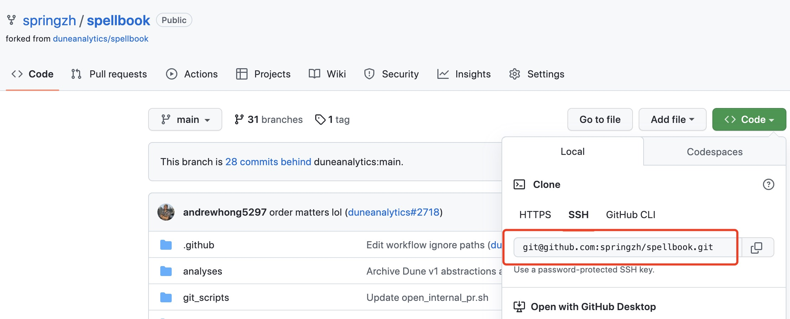
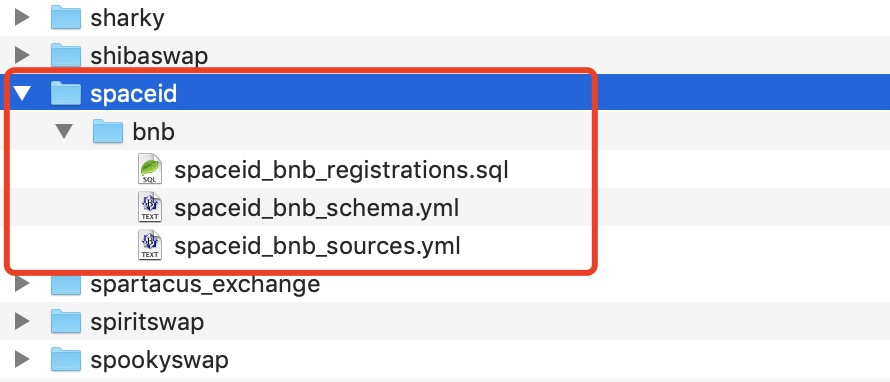

# 22 Как создать книгу заклинаний

Книга заклинаний — это слой преобразования данных, созданный совместно сообществом Dune. Заклинания — это расширенные абстрактные представления или таблицы, созданные совместными усилиями команды Dune и пользователей сообщества.

Создавая заклинания, все пользователи сообщества Dune могут гораздо легче выполнять анализ данных. Создание заклинаний имеет много преимуществ. Представьте:

- У вас есть несколько запросов, содержащих одни и те же подзапросы или CTE
- Несколько запросов используют очень длинные статические списки данных
- Один из ваших запросов был скопирован или откопирован несколько раз
- Ваш запрос содержит очень сложную логику, которая может быть использована в другом месте

Если один из вышеперечисленных сценариев применим, мы можем преобразовать этот запрос в заклинание, создав представление. Это может упростить логику SQL-запросов, повысить согласованность и поддерживаемость, а также прояснить показатели данных.

Проект Spellbook с открытым исходным кодом, поддерживаемый Dune, может автоматически создавать и поддерживать эти заклинания. Любой в сообществе может внести заклинания в проект Spellbook. Этот учебник пытается написать простое заклинание, чтобы помочь всем легко начать.

## Основные шаги для создания заклинания

В самых простых терминах, заклинание — это по сути оператор `SELECT` запроса. Но конкретный процесс создания заклинания на самом деле включает в себя несколько аспектов и нескольких шагов, которым необходимо следовать шаг за шагом в соответствии с документацией, чтобы успешно создать заклинание.

Основные шаги для создания заклинания включают в себя:

- **Определите объект данных**: исходя из приведенных выше примеров сценариев, в сочетании с конкретными проблемами и потребностями, с которыми вы сталкиваетесь при написании запросов, определите объект данных, который необходимо обработать для создания и генерации заклинания, и определите режим (схему) для выходного заклинания.
- **Настройте источники данных**: источник данных относится к исходным таблицам данных и проанализированным таблицам данных, от которых зависит заклинание. Их необходимо определить в YAML-файле. Каждый источник данных должен быть определен только один раз в заклинании.
- **Напишите тесты**: прежде чем писать заклинание, рассмотрите желаемые результаты запроса и напишите соответствующие тесты на основе этих результатов. Конечно, если наше заклинание является всего лишь представлением агрегированных данных, тест можно добавить после написания заклинания.
- **Напишите заклинание**: используйте файл `.sql` с определенным специальным форматом (шаблон JINJA) для создания каждого заклинания, которое необходимо создать, с помощью оператора `SELECT`. Скомпилируйте и протестируйте заклинание.
- **Отправьте PR**: после написания заклинания, успешной его локальной компиляции и ручного тестирования, создайте новый PR (Pull Request) на GitHub и дождитесь рассмотрения и слияния техническим персоналом Dune. После успешного слияния мы сможем найти только что созданное заклинание в редакторе запросов.

Dune предоставляет более подробные инструкции в своей онлайн-документации: [Руководство по заклинаниям](https://dune.com/docs/zh/spellbook/getting-started/)

## Подготовка к созданию магической таблицы

Перед тем, как приступить к созданию магической таблицы, вам необходимо выполнить некоторые важные подготовительные работы, включая ознакомление с базовым использованием инструмента dbt, изучение основных операций с GitHub (у вас должна быть учетная запись GitHub) и настройка вашей локальной рабочей среды. Подробные требования и инструкции по настройке среды можно найти здесь:

[Подготовьте предварительные требования и настройте Spellbook dbt](https://dune.com/docs/spellbook/1-do-some-prerequisites%20and-set-up-Spellbook-dbt/)

Для получения дополнительной информации о DBT:

[Что такое dbt?](https://docs.getdbt.com/docs/introduction)

Мы предполагаем, что вы уже настроили необходимое программное обеспечение, следуя инструкциям в ссылках выше, и скопировали репозиторий Dune Spellbook (https://github.com/duneanalytics/spellbook) в свою учетную запись GitHub. Ниже кратко описаны следующие шаги. Я использую локально операционную систему Mac, поэтому приведенные здесь примеры относятся к среде Mac. Если вы используете среду Windows и столкнулись с какими-либо проблемами в процессе, пожалуйста, задавайте вопросы в группе.

Используйте команду `git clone` для клонирования скопированного репозитория на ваш локальный компьютер. Создайте новую рабочую директорию на вашем локальном компьютере. Перейдите в эту директорию и используйте следующую команду для клонирования (скопируйте адрес из страницы скопированного репозитория на GitHub, как показано на изображении ниже):

```
git clone git@github.com:springzh/spellbook.git
```



После клонирования репозитория вы получите новую поддиректорию с именем `spellbook`. Перейдите в эту директорию:

```
cd spellbook
```

После завершения клонирования вы увидите новую поддиректорию `spellbook` в вашей рабочей директории. Перейдите в эту поддиректорию:

```
cd spellbook
```

Если вы ранее не выполняли `pipenv install` для создания локальной среды pipenv, вам необходимо выполнить установку:

```
pipenv install
```

Если вышеуказанная команда выдает ошибку, попробуйте следующее:

```
sudo -H pip install -U pipenv
```

Если команда возвращает следующую ошибку:

```
pipenv install возвращает предупреждение LANG, предупреждение Python 3.9 не найден
```

Попробуйте установить заново, указав версию Python:

```
pipenv install --python 3.9.13
```

Вы можете использовать эту команду, чтобы проверить установленную версию Python на вашем локальном компьютере:

```
python3 -version
```

После установки среды pipenv вы можете ее активировать:

```
pipenv shell
```

Далее выполните команду `dbt init` для инициализации dbt. Эта команда проведет вас через интерактивную настройку dbt. Подробные инструкции можно найти в ссылке, указанной в разделе "Подготовьте предварительные требования и настройте Spellbook dbt."

```
dbt init
```

После того, как мы закончим написание магической таблицы или внесем какие-либо изменения в связанные файлы, мы используем `dbt compile` для компиляции всего проекта dbt и регенерации SQL для магической таблицы.

Чтобы избежать путаницы, давайте снова перечислим основные шаги:

**Шаги первоначальной инициализации и выполнения:**

```
# Установите среду pipenv
pipenv install

# Активируйте среду pipenv
pipenv shell

# Инициализируйте dbt
dbt init

# Добавьте или измените файлы

# Скомпилируйте dbt
dbt compile
```

**Последующие ежедневные шаги выполнения после инициализации:**

```
# Активируйте среду pipenv
pipenv shell

# Добавьте или измените файлы

# Скомпилируйте dbt
dbt compile
```

При написании и отладке новой магической таблицы вам, возможно, потребуется несколько раз корректировать и изменять связанные файлы. В этом случае вы можете выполнить `dbt compile` несколько раз. Если возникнут какие-либо ошибки компиляции, внесите необходимые изменения на основе сообщений об ошибках. После успешной компиляции скопируйте сгенерированные операторы SQL в Dune для фактического тестирования запросов, чтобы убедиться, что SQL работает правильно и дает ожидаемые результаты.

## Волшебная таблица для создания в этом уроке

Цель этого урока – дать возможность каждому быстро научиться создавать волшебную таблицу, используя простой пример. Ранее, когда Space ID на BNB chain запустил регистрацию доменов, я создал информационную панель данных Space ID ([SpaceID - BNB Domain](https://dune.com/sixdegree/bnb-domain-spaceid)). В то время у Space ID было только ограниченное разрешение на Mint, и пользователи предоставляли много обратной связи, а также предлагали улучшения касательно правил Mint. В ответ на эту обратную связь команда SpaceID постоянно улучшала и обновляла свои смарт-контракты. В течение нескольких дней контракт для регистрации доменов прошел пять основных версий, от V3 до V7. Это привело к проблеме, когда, чтобы консолидировать все зарегистрированные данные доменов Space ID, приходилось запрашивать данные отдельно из таблиц логов событий различных версий контракта и вручную объединять их с помощью операций "Union All". Если вы посмотрите на исходный код запросов к моей информационной панели данных, вы обнаружите, что большинство из них имеют длинное CTE (Common Table Expression) для агрегирования и объединения событий регистрации доменов из разных версий контракта. Например: https://dune.com/queries/1239514/2124307. Чтобы поддерживать ее в актуальном состоянии, мне приходилось вносить многочисленные изменения в эти запросы по одному, включая включение данных из новых версий контракта. Фактически, проект Space ID теперь имеет версии контракта для регистрации доменов V8 и V9, которые не включены в мою панель, что делает ее устаревшей. Если другие пользователи форкнули мои запросы и внесли корректировки, к сожалению, их запросы также устарели.

[Изображение: img/ch22_image_01.jpg]

В таком случае, если мы создадим волшебную таблицу для событий регистрации доменов (фактически представление), все запросы можно будет писать непосредственно на основе этой волшебной таблицы. Когда будет выпущена новая версия смарт-контракта, нам нужно будет только изменить и обновить определение волшебной таблицы и отправить PR (Pull Request) на проверку. Как только PR будет одобрен и объединен, данные в волшебной таблице будут автоматически обновлены. Все запросы, использующие эту волшебную таблицу, не потребуют никаких изменений. В отличие от этого, без волшебной таблицы, мои запросы, а также запросы, сгенерированные другими пользователями, которые форкнули мои запросы, должны быть изменены по одному. Из этого мы можем видеть преимущества создания волшебной таблицы.

Итак, что мы собираемся сделать здесь, так это создать волшебную таблицу, которая включает в себя всю информацию о регистрации доменов Space ID на блокчейне `bnb` проекта `spaceid`.
## Создание структуры каталогов и файлов

Как только мы определили, какую магическую таблицу мы хотим создать, мы можем приступить к работе над ней. При использовании Git — хорошей практикой является всегда разрабатывать в отдельной ветке. Я рекомендую всем придерживаться этого подхода. Давайте создадим новую рабочую ветку под названием `add_bnb_spaceid` в локальном клонированном репозитории заклинательной книги:

```
git checkout -b add_bnb_spaceid
```

Теперь мы автоматически переключены на новую рабочую ветку Git `add_bnb_spaceid`. Мы можем начать создавать структуру каталогов и файлы, необходимые для магической таблицы.

Для магических таблиц на основе проектов они хранятся в каталоге `/spellbook/models` с использованием формата `[название_проекта]/[название_блокчейна]. Все имена должны быть в нижнем регистре, а слова должны быть разделены подчеркиваниями. Например: `/spellbook/models/[название_проекта]/[название_блокчейна]`. В данном случае название нашего проекта — `spaceid`, а название блокчейна — `bnb`, поэтому полная структура каталогов для нашей магической таблицы: `/spellbook/models/spaceid/bnb/`.

Пожалуйста, перейдите в каталог `models` и создайте подкаталог под названием `spaceid` внутри него. Затем перейдите внутрь этого вновь созданного каталога и создайте еще один подкаталог под названием `bnb`.

Файлы магической таблицы должны быть названы следующим образом:

- Для файлов схемы: `[название_проекта]_[название_блокчейна]_schema.yml
- Для файлов исходных данных зависимостей: `[название_проекта]_[название_блокчейна]_sources.yml
- Для SQL файла магической таблицы: `[название_проекта]_[название_блокчейна]_[название_заклинания].sql

Здесь `название_заклинания` - это имя магической таблицы, которую мы хотим создать. Мы будем использовать `registrations` в качестве имени.

Итак, нам нужно создать следующие три соответствующих файла (оставьте содержимое файла пустым на данный момент; мы объясним каждый из них позже) в каталоге `spaceid/bnb/`:

- spaceid_bnb_schema.yml
- spaceid_bnb_sources.yml
- spaceid_bnb_registrations.sql

Текущая структура каталогов и файлов должна выглядеть следующим образом:



Ссылка на документ: [Настройте структуру ваших файлов для SQL, схемы и исходных файлов](https://dune.com/docs/zh/spellbook/how-to-cast-a-spell/3-set-up-your-file-structure-for-SQL-schema-and-source-files/)

## Определение файла источника зависимостей

Здесь нам нужно использовать только семь различных версий контракта `RegistrarController`, которые были развернуты проектом SpaceID на данный момент. Эти таблицы находятся в схеме `spaceid_bnb`. Определение нашего файла источника зависимостей `spaceid_bnb_sources.yml` выглядит следующим образом:

```
version: 2

sources:
  - name: spaceid_bnb
    description: "bnb декодированные таблицы, связанные с контрактом SpaceId"
    freshness: # период актуальности по умолчанию
      warn_after: { count: 12, period: hour }
      error_after: { count: 24, period: hour }
    tables:
      - name: BNBRegistrarControllerV3_evt_NameRegistered
        loaded_at_field: evt_block_time
      - name: BNBRegistrarControllerV4_evt_NameRegistered
        loaded_at_field: evt_block_time
      - name: BNBRegistrarControllerV5_evt_NameRegistered
        loaded_at_field: evt_block_time
      - name: BNBRegistrarControllerV6_evt_NameRegistered
        loaded_at_field: evt_block_time
      - name: BNBRegistrarControllerV7_evt_NameRegistered
        loaded_at_field: evt_block_time
      - name: BNBRegistrarControllerV8_evt_NameRegistered
        loaded_at_field: evt_block_time
      - name: BNBRegistrarControllerV9_evt_NameRegistered
        loaded_at_field: evt_block_time
```

В определенном файле источника зависимостей:

1. `version` всегда устанавливается в `2`.
2. `name` указывает схему (Имя схемы) таблиц данных источника зависимостей. Мы можем создать новый запрос в Dune, найти соответствующую таблицу и добавить имя таблицы в редактор запросов. Часть слева от символа `.` является именем схемы таблицы. Например, имя схемы таблицы `spaceid_bnb.BNBRegistrarControllerV3_evt_NameRegistered` - `spaceid_bnb`.
3. `freshness` используется для проверки и обеспечения автоматического обновления данных в магической таблице. Если данные не обновлены успешно в течение указанного времени, при использовании магической таблицы будет выдано предупреждение или ошибка (я лично пока не сталкивался с такой ошибкой, поэтому она может отправляться только персоналу, обслуживающему модуль магической таблицы). Использование настроек по умолчанию приемлемо. Эта настройка применяется ко всем таблицам источников данных, перечисленным под `tables`. Конечно, вы также можете добавить эту настройку к отдельным таблицам.
4. `tables` перечисляет таблицы источников данных, которые нам нужно использовать. Все эти таблицы должны принадлежать схеме, указанной выше. Если есть таблицы, принадлежащие к другим схемам, нам потребуется добавить отдельное определение с той же структурой в том же файле. Вы можете обратиться к определениям существующих файлов схем магической таблицы.

- `name` устанавливает имя таблицы. Не включайте здесь имя схемы.
- `loaded_at_field` указывает поле типа timestamp, используемое для проверки времени загрузки последних нескольких строк данных. Это необходимо для обеспечения регулярного обновления данных в магической таблице, в сочетании с настройкой `freshness`.

Справочные документы:

- [Определите и определите источники](https://dune.com/docs/zh/spellbook/how-to-cast-a-spell/4-identify-and-define-sources/)
- [Источники данных](https://dune.com/docs/zh/spellbook/data-sources/)

## Определение файла схемы

Файл схемы `spaceid_bnb_schema.yml` предоставляет информацию, такую как имя, поля и описание магической таблицы, которая будет создана, а также соответствующую информацию о конфигурации.

```yml
version: 2

models:
  - name: spaceid_bnb_registrations
    meta:
      blockchain: bnb
      project: spaceid
      contributors: [springzh]
    config:
      tags: ['bnb','spaceid','name','registrations']
    description: >
       SpaceID V3, V4, V5, V6, V7, V8 & V9 Name Registered on BNB
    columns:
      - &version
        name: version
        description: "Версия контракта"
      - &block_time
        name: block_time
        description: "UTC время блока события"
      - &name
        name: name
        description: "Имя Space ID"
        tests:
          - unique
      - &label
        name: label
        description: "Метка Space ID"
      - &owner
        name: owner
        description:  "Владелец Space ID"
      - &cost
        name: cost
        description:  "Стоимость, потраченная на регистрацию Space ID"
      - &expires
        name: expires
        description:  "Дата и время истечения срока действия имени в формате Unix timestamp"
      - &contract_address
        name: contract_address
        description:  "Адрес контракта, который вызывался для регистрации Space ID"
      - &tx_hash
        name: tx_hash
        description:  "Хэш транзакции"
      - &block_number
        name: block_number
        description: "Номер блока, в котором была выполнена транзакция"
      - &evt_index
        name: evt_index
        description: "Индекс события"
```

Поскольку структура таблиц событий `NameRegistered` для разных версий SpaceID одинакова, наша работа относительно проста. Мы можем использовать структуру одной из таблиц в качестве справочного материала для определения нашего файла схемы. Чтобы отличить источник регистрации доменов, мы добавляем поле `version` для хранения информации о версии смарт-контракта, например, 'v3', 'v4' и т. д.

Поскольку доменные имена уникальны, мы добавляем определение теста на уникальность к полю `name`. Во время компиляции будет сгенерирован связанный тест SQL для обеспечения отсутствия повторяющихся значений в данных магической таблицы.

Синтаксис `&field_name` определяет имена полей. Первое вхождение имени поля в файле должно иметь префикс "&". Позже в том же файле определения полей других таблиц могут использовать `*field_name` для ссылки на определенное поле, что делает код более лаконичным.
## Написание SQL-запроса для магической табличной вьюхи

Теперь мы переходим к самой критичной части создания магической таблицы — написанию SQL. Откройте файл `spaceid_bnb_registrations.sql` и вставьте следующее содержимое (с некоторыми опущенными частями):

``` sql
{{
    config(
        alias='registrations'
        ,materialized = 'incremental'
        ,file_format = 'delta'
        ,incremental_strategy = 'merge'
        ,unique_key = ['name']
        ,post_hook='{{ expose_spells(\'["bnb"]\',
                                    "project",
                                    "spaceid",
                                    \'["springzh"]\') }}'
    )
}}

SELECT 'v3'                    as version,
       evt_block_time          as block_time,
       name,
       label,
       owner,
       cast(cost as double)    as cost,
       cast(expires as bigint) as expires,
       contract_address,
       evt_tx_hash             as tx_hash,
       evt_block_number        as block_number,
       evt_index
FROM {{source('spaceid_bnb', 'BNBRegistrarControllerV3_evt_NameRegistered')}}

WHERE evt_block_time >= date_trunc("day", now() - interval '1 week')


UNION ALL

-- Omitted V4 - V8 parts

UNION ALL

-- There are some records in v9 table that are duplicated with those in the v5 table. So we join to exclude them
SELECT 'v9'                       as version,
       v9.evt_block_time          as block_time,
       v9.name,
       v9.label,
       v9.owner,
       cast(v9.cost as double)    as cost,
       cast(v9.expires as bigint) as expires,
       v9.contract_address,
       v9.evt_tx_hash             as tx_hash,
       v9.evt_block_number        as block_number,
       v9.evt_index
FROM {{source('spaceid_bnb', 'BNBRegistrarControllerV9_evt_NameRegistered')}} v9
LEFT JOIN {{source('spaceid_bnb', 'BNBRegistrarControllerV3_evt_NameRegistered')}} v5 ON v9.name = v5.name
WHERE v9.evt_block_time > v5.evt_block_time

```

Пояснения:

*   `alias='registrations'` - определяет имя магической таблицы вьюхи.
*   `materialized = 'incremental'` - указывает, что таблица должна обновляться инкрементально.
*   `file_format = 'delta'` - указывает формат файла для инкрементальных обновлений.
*   `incremental_strategy = 'merge'` - определяет стратегию слияния для инкрементальных обновлений.
*   `unique_key = ['name']` - определяет уникальный ключ для инкрементальных обновлений.
*   `post_hook='{{ expose_spells(\'["bnb"]\', "project", "spaceid", \'["springzh"]\') }}'` - задает хук для публикации магической таблицы.
*   `` - определяет, какие части запроса будут выполняться при инкрементальном обновлении.
*   `WHERE evt_block_time >= date_trunc("day", now() - interval '1 week')` - фильтрует данные для инкрементального обновления, выбирая только данные за последнюю неделю.

С добавленными конфигурациями для инкрементального обновления и условиями, когда в режиме инкрементального обновления (т.е. ``), будут запрашиваться только данные за последнюю неделю. Запрошенные новые данные будут объединены с физическим файлом, содержащим данные вьюхи. `incremental_strategy = 'merge'` обеспечит игнорирование существующих записей в процессе этого слияния.

Дополнительные пояснения:

*   `dbt compile` - используется для компиляции SQL-запроса.
*   PR - pull request
*   `v9.name = v5.name` - условие соединения для исключения дублирующихся записей.
*   `WHERE v9.evt_block_time > v5.evt_block_time` - фильтр, выбирающий записи, которые не встречались ранее.

Документация:

*   [Написание SQL-запроса для магической таблицы](https://dune.com/docs/zh/spellbook/how-to-cast-a-spell/6-write-your-spell-as-SELECT-statement/)
*   [Настройка стратегии материализации](https://dune.com/docs/zh/spellbook/how-to-cast-a-spell/6-write-your-spell-as-SELECT-statement/)

## Добавление новой модели в файл dbt_project.yml

Далее необходимо изменить файл `dbt_project.yml`, расположенный в корне репозитория `spellbook`, чтобы включить нашу магическую таблицу.

```
    spaceid:
      +schema: spaceid
      bnb:
        +schema: spaceid_bnb
```

Здесь мы указываем имя проекта и имя его схемы, а также имя блокчейна и имя схемы под этим блокчейном. С этой иерархической структурой мы можем обрабатывать создание магических таблиц для каждого проекта, развернутого на разных блокчейнах, и далее объединять магические таблицы для одного и того же проекта на нескольких блокчейнах в магическую таблицу на уровне проекта. Для конкретных примеров можно обратиться к магическим таблицам, связанным с проектами, такими как opensea или uniswap.

Вы можете снова использовать `dbt compile`, чтобы убедиться, что компиляция прошла успешно.

Ссылка на документы:

- [Настройка псевдонима и стратегии материализации](https://dune.com/docs/zh/spellbook/how-to-cast-a-spell/7-configure-alias-and-materialization-strategy/)
- [Определение моделей в dbt](https://dune.com/docs/zh/spellbook/defining-models-in-dbt/)